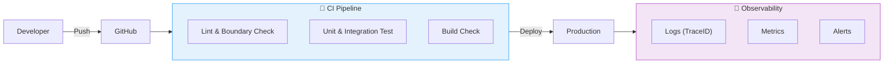
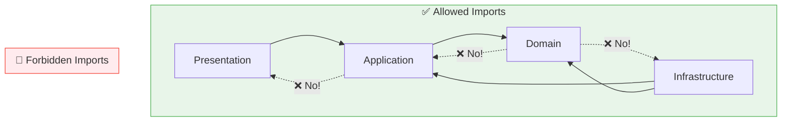

# 第20章：運用＆成長（壊れない仕組みづくり）🌱🏗️🤖

ここまで作ったレイヤード、育てていくと「いつの間にか崩れる」ことが一番こわいです…😱
なので第20章は **“人の気合い”じゃなくて “仕組み” で守る** がテーマだよ〜🛡️✨

---

## 0) この章でゴールにしたいこと🎯💖


* 依存ルール（外→内）が **自動で破られない** ようにする🚧
* 変更が増えても **壊れ方がすぐ分かる** ようにする（ログ/トレース/エラー監視）🔎
* チームでも1人でも回る **CI（自動チェック）** を作る🤖✅
* 大きくなっても迷子にならない **分割の育て方** を身につける🧩
* リリースや更新が怖くなくなる **成長の型** を持つ📦🚀



---

## 1) まずは「2026の土台」だけ最新に押さえよ🧱✨

運用って、結局 “基盤の更新” が効いてくるの…！🛠️

### Node.js：LTSを使うのが安心🍀

Node.js のリリース状況は「24 が Active LTS」になってる（2026-01-12時点）よ〜。([Node.js][1])
さらに 2026-01-13 に 20/22/24/25 系のセキュリティリリースも出てるから、**定期アップデート前提**が超大事！🔐([Node.js][2])

### TypeScript：5.9が現行の安定ライン、6.0/7.0が近い🧠✨

現時点の安定版としては TypeScript 5.9 のリリースノートが公開されてるよ。([typescriptlang.org][3])
そして Microsoft は「6.0 は最後の JS 実装、7.0 はネイティブ移行」という進捗を出してる（2025-12）。([Microsoft for Developers][4])
👉 つまり今は **5.9ベースで守りを固めて、次の波に備える** のが現実的だよ〜🌊✨

### ESLint：v9 で “Flat Config” が主流📏✨

ESLint 9 では Flat Config への移行が進んでるよ。([ROXX開発者ブログ][5])
（「設定がつらい…🥺」ってなりやすいけど、ここを越えると運用がラクになる！）

### pnpm：10系が現行🍱✨

pnpm は 10 系が “supported” になってる（2026-01-11 更新）。([endoflife.date][6])

---

## 2) 依存ルールを “自動で守る” 🚧🤖（ここが最重要！）

### A) ESLint でレイヤー境界を守る（eslint-plugin-boundaries）🧱✅

ESLint Plugin Boundaries は「アーキテクチャ境界を ESLint で強制する」ためのプラグインだよ。([GitHub][7])
ディレクトリの “役割” を定義して、禁止 import を機械で止める感じ🛑✨

例：レイヤー（presentation/application/domain/infrastructure）を守るイメージ（ESLint 9 Flat Config 風）

```ts
// eslint.config.mts（イメージ）
// ※実プロジェクトではパスやルールを自分の構成に合わせてね🙏
import boundaries from "eslint-plugin-boundaries";

export default [
  {
    plugins: { boundaries },
    settings: {
      "boundaries/elements": [
        { type: "presentation", pattern: "src/presentation/**" },
        { type: "application",  pattern: "src/application/**" },
        { type: "domain",       pattern: "src/domain/**" },
        { type: "infrastructure", pattern: "src/infrastructure/**" },
      ],
    },
    rules: {
      // ざっくり：外→内はOK、内→外はNG を作る
      "boundaries/element-types": ["error", {
        default: "disallow",
        rules: [
          { from: "presentation", allow: ["application"] },
          { from: "application",  allow: ["domain"] },
          { from: "domain",       allow: [] },
          // infrastructure は「内側の型（port等）を実装する」ので内側参照は許可しがち
          { from: "infrastructure", allow: ["application", "domain"] },
        ],
      }],
    },
  },
];
```

「これ、目視でレビューするのムリ〜😵‍💫」をやめられるのが最高。
実際に eslint-plugin-boundaries で import ルールを機械チェックして負荷が下がった例もあるよ。([Zenn][8])



---

### B) “依存グラフ” でさらに強く守る（dependency-cruiser）🕸️🚨

ESLint だけだと「設定しづらいルール」も出てくるのね。
dependency-cruiser は **依存関係を解析して、違反を検出** できるやつ！🧨
ルールを CI に入れて “レイヤー崩壊” を止める使い方が定番だよ。([developer.mamezou-tech.com][9])

ざっくり例（イメージ）

```js
// .dependency-cruiser.cjs（イメージ）
module.exports = {
  forbidden: [
    {
      name: "domain-must-not-import-outer",
      severity: "error",
      from: { path: "^src/domain" },
      to:   { path: "^src/(presentation|infrastructure)" }
    },
    {
      name: "application-must-not-import-infrastructure",
      severity: "error",
      from: { path: "^src/application" },
      to:   { path: "^src/infrastructure" }
    }
  ]
};
```

---

### C) モノレポなら Nx の境界ルールも強い🧩🏰

Nx には「プロジェクト間の境界」を ESLint で守る仕組みがあるよ。([Nx][10])
将来 “機能ごとにパッケージ分割” するとき、めっちゃ効く〜！💪✨

---

## 3) CI で “壊れてない” を毎回チェックする🤖✅（最小の型）

CI はね、「未来の自分を救う装置」だよ…🥹💖
最低でもこの4つは回したい！

* 型チェック（tsc）🧠
* lint（境界チェック含む）🚧
* テスト（Vitest など）🧪([vitest.dev][11])
* 依存ルール（dependency-cruiser）🕸️

GitHub Actions で Node を使うなら setup-node が定番！([GitHub Docs][12])

例：CI（イメージ）

```yml
# .github/workflows/ci.yml（イメージ）
name: CI

on:
  pull_request:
  push:
    branches: [ main ]

jobs:
  test:
    runs-on: ubuntu-latest

    steps:
      - uses: actions/checkout@v4

      - name: Use Node
        uses: actions/setup-node@v4
        with:
          node-version: 24
          cache: "pnpm"

      - name: Setup pnpm
        uses: pnpm/action-setup@v4
        with:
          version: 10

      - name: Install
        run: pnpm install --frozen-lockfile

      - name: Typecheck
        run: pnpm run typecheck

      - name: Lint
        run: pnpm run lint

      - name: Dependency rules
        run: pnpm run depcheck

      - name: Test
        run: pnpm run test
```

📌 setup-node は pnpm/yarn のキャッシュ例も案内してるよ。([GitHub][13])
📌 pnpm は 10 系が現行サポート。([endoflife.date][6])

---

## 4) 観測（ログ/相関ID/トレース）を “最小セット” で入れる📈🪵✨

運用でありがちな事故👇

* 「本番だけ壊れた！でも再現できない！😇」
* 「どのリクエストが原因？ログがバラバラ！😵‍💫」

だから **相関ID（Correlation）** が超大事💖

### A) OpenTelemetry の “Context Propagation” を知る🔗✨

OpenTelemetry は「トレースやログを関連づける」ために Context Propagation を使うよ。([OpenTelemetry][14])
ログにも TraceID/SpanID を入れて “辿れる” ようにできるのが強い！([OpenTelemetry][14])

### B) Node なら自動計装（auto-instrumentations-node）から始めやすい🚀

OpenTelemetry の Node Getting Started にも、Node SDK と自動計装パッケージの導入が載ってるよ。([OpenTelemetry][15])
npm にも「Node アプリを自動計装してテレメトリ取れる」って説明がある。([npm][16])

例：最小の計装（イメージ）

```ts
// src/infrastructure/observability/instrumentation.ts（イメージ）
import { NodeSDK } from "@opentelemetry/sdk-node";
import { getNodeAutoInstrumentations } from "@opentelemetry/auto-instrumentations-node";

const sdk = new NodeSDK({
  instrumentations: [getNodeAutoInstrumentations()],
});

export async function startTelemetry() {
  await sdk.start();
}
```

👉 これをアプリ起動時に1回だけ呼ぶ感じ！✨
（本格的には exporter 設定とか入れるけど、最初は “相関できる土台” が勝ち🏆）

---

## 5) “成長しても迷子にならない” 分割の育て方🧩🌱

レイヤードを続けてると、次に来る悩みがこれ👇
「機能が増えたら、どこに置くの〜！？😵‍💫」

おすすめは **“機能（feature）で分ける” → その中でレイヤー** だよ💡
たとえば：

* src/features/todo/presentation
* src/features/todo/application
* src/features/todo/domain
* src/features/todo/infrastructure

このときに boundary ルール（eslint-plugin-boundaries）がめっちゃ効く！🧱✨
「同じ feature 内だけ見える」とかも作れるよ〜。([Zenn][8])

---

## 6) リリース運用：変更を “説明できる形” にする📦📝✨

小さくてもこれだけで世界が変わるよ…！

* 何が変わったか（changelog）📝
* バージョンをどう上げるか（SemVer）🔢
* “いつ誰が何を出す” を自動化する🤖

pnpm と Changesets の組み合わせは「変更宣言→バージョン更新→公開」の流れが整理されてて便利。([pnpm][17])

---

## 7) AI 活用：運用の “型” をテンプレ化しよ🤖💖

### A) PR レビュー観点テンプレ（そのまま使ってOK）✅✨

* レイヤー違反（import 方向）してない？🚧
* Presentation にルール（業務判断）が入ってない？🎛️
* Domain の不変条件、崩してない？🔒
* エラーの握りつぶししてない？⚠️
* ログは「何が起きたか」追える？（相関ID/TraceID）🪵
* テストは「壊れやすい所」にある？🧪
* 依存追加したなら、理由が書いてある？📦

👉 これを Copilot/Codex に渡して
「このPRをこの観点でレビューして。危ないところにコメント案も作って」
ってやると超はかどるよ〜🤖✨

### B) 違反検出のお願い文（AIに投げる用）🧠🔎

* 「この差分で、レイヤードの依存ルールを破ってそうな import を列挙して」
* 「Presentation に入り込んだドメイン判断を指摘して、移動先（Application/Domain）も提案して」
* 「ログに入れるべきフィールド（相関ID、ユーザー操作、重要イベント）を提案して」

---

## 8) ミニ演習🧩✅（この章のキモを体に入れる）

### 演習1：運用チェックリストを “自分のアプリ版” にする📝💖

次をコピって、あなたの題材に合わせて増やしてね✨

* [ ] lint が落ちたら PR は通らない
* [ ] 境界ルール（boundaries / dependency-cruiser）が CI にある
* [ ] 例外は握りつぶさず、ログ or 監視に乗る
* [ ] 重要操作（作成/更新/削除/決済…）は必ずログ
* [ ] 相関できるIDがある（TraceID/RequestID）
* [ ] テストは Domain / Application を中心に
* [ ] 依存追加時は理由を書いてから入れる

### 演習2：CI に “境界チェック” を1個入れる🤖🚧

* eslint-plugin-boundaries か dependency-cruiser のどっちかでOK
* PR でわざと違反 import を作って、ちゃんと落ちるのを確認✅

---

## まとめ🌸✨（ここだけ覚えてたら勝ち！）

* レイヤードは「守る仕組み」を入れた瞬間に **本当に強くなる**🏰
* 境界（import 方向）は **ESLint / dependency-cruiser / Nx** で自動化🚧([GitHub][7])
* 観測は “最小セット” でも価値がデカい（相関できるだけで世界変わる）🔗📈([OpenTelemetry][14])
* 2026 は TS 5.9 を軸にしつつ、6.0/7.0 の波に備えて “strict＆自動化” を先に固めるのが良い🌊✨([Microsoft for Developers][4])

---

次やるなら、あなたの題材（ToDo/読書ログ/支出メモ…）に合わせて
「境界ルールの具体パス」と「CIコマンド名（pnpm scripts）」まで固定した **そのまま動くテンプレ一式** を第20章の付録として作れるよ〜📦💖

[1]: https://nodejs.org/en/about/previous-releases?utm_source=chatgpt.com "Node.js Releases"
[2]: https://nodejs.org/en/blog/vulnerability/december-2025-security-releases?utm_source=chatgpt.com "Tuesday, January 13, 2026 Security Releases"
[3]: https://www.typescriptlang.org/docs/handbook/release-notes/typescript-5-9.html?utm_source=chatgpt.com "Documentation - TypeScript 5.9"
[4]: https://devblogs.microsoft.com/typescript/progress-on-typescript-7-december-2025/?utm_source=chatgpt.com "Progress on TypeScript 7 - December 2025"
[5]: https://techblog.roxx.co.jp/entry/2025/09/22/151407?utm_source=chatgpt.com "ESLint 9へのアップデートとFlat Config移行ログ"
[6]: https://endoflife.date/pnpm?utm_source=chatgpt.com "pnpm"
[7]: https://github.com/javierbrea/eslint-plugin-boundaries?utm_source=chatgpt.com "javierbrea/eslint-plugin-boundaries"
[8]: https://zenn.dev/kikagaku/articles/eslint-package-by-feature?utm_source=chatgpt.com "package by feature なファイルの依存関係をルールで守る ..."
[9]: https://developer.mamezou-tech.com/en/blogs/2024/04/17/chatgpt-dependen-cycruiser/?utm_source=chatgpt.com "How to Efficiently Create Custom Rules for dependency ..."
[10]: https://nx.dev/docs/technologies/eslint/eslint-plugin/guides/enforce-module-boundaries?utm_source=chatgpt.com "Enforce Module Boundaries ESLint Rule"
[11]: https://vitest.dev/?utm_source=chatgpt.com "Vitest | Next Generation testing framework"
[12]: https://docs.github.com/ja/actions/tutorials/build-and-test-code/nodejs?utm_source=chatgpt.com "Node.js のビルドとテスト - GitHub Actions"
[13]: https://github.com/actions/setup-node?utm_source=chatgpt.com "actions/setup-node"
[14]: https://opentelemetry.io/docs/concepts/context-propagation/?utm_source=chatgpt.com "Context propagation"
[15]: https://opentelemetry.io/docs/languages/js/getting-started/nodejs/?utm_source=chatgpt.com "Node.js"
[16]: https://www.npmjs.com/package/%40opentelemetry/auto-instrumentations-node?utm_source=chatgpt.com "@opentelemetry/auto-instrumentations-node"
[17]: https://pnpm.io/using-changesets?utm_source=chatgpt.com "Using Changesets with pnpm"
