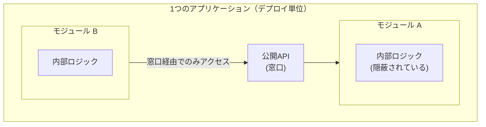
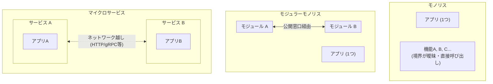
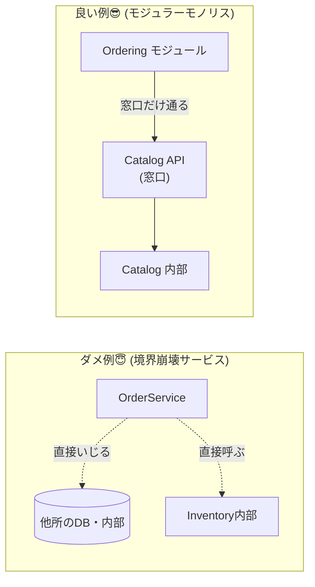

# 第01章：はじめに：モジュラーモノリスって何？🏠✨

## 今日のゴール🎯

* 「モジュラーモノリス」を**一言で説明**できるようになる😊
* 「モノリス / モジュラーモノリス / マイクロサービス」の違いを**パッと比較**できるようになる👀
* 「変更が怖い😵」の正体（なぜ怖い？）を言語化できるようになる🗣️✨

---

## 1) モジュラーモノリスの一言定義🧩


**“デプロイは1つのアプリのまま”**なんだけど、**中身はモジュール（小さなまとまり）にきれいに区切って**、
モジュール同士は **決められた窓口（公開API）だけで会話**するようにした設計だよ🏠🪟✨
（「同じアプリ内で、ちゃんと“境界”を作る」のがポイント！）

似た言い方だと、

* 1つのアプリとして動く ✅
* でも内部は「小さなアプリが集まってる」みたいに区切る ✅
* 境界を越えるときはルールがある ✅
  …って感じだね😊 ([milanjovanovic.tech][1])



---

## 2) 3兄弟を整理しよ：モノリス / モジュラーモノリス / マイクロサービス🧠✨

### まず「モノリス」って悪口じゃないよ😇

モノリスは「**コアの動きが1つのプロセスで完結**していて、**だいたい1つの単位でデプロイ**する」形のことだよ📦
ちゃんと設計されてれば、モノリスでも十分強い💪✨ ([Microsoft Learn][2])

### 「マイクロサービス」は？

マイクロサービスは「**小さく独立したサービスの集合**」で、各サービスが**1つの業務能力（境界）**を持って、別々に動いたりデプロイできる考え方だよ🚚📦📦 ([Microsoft Learn][3])

---

### ざっくり比較表📋✨

| マイクロサービス      | 複数     | ネットワーク越し               | チーム分割・独立スケールに強い | 分散システムのコスト増💸   |



「え、最初からマイクロサービスでよくない？」って思うかもだけど、**最初はモノリス（ちゃんとしたモノリス）から**が良いケースが多い、って意見も有名だよ📌 ([martinfowler.com][4])

---

## 3) よくある悩み：変更が怖い😵 の正体

「変更が怖い」って、だいたいこれ👇

* どこが影響範囲かわからない🕵️‍♀️
* “ついで修正”が連鎖して止まらない🧶
* ある機能を直したら別の機能が壊れる💥
* 「誰が何を責任持つの？」が曖昧で、コードが混ざる🍲
* リリースが儀式化して、みんなビビる😱

モジュラーモノリスが狙うのはここ！
**「影響範囲を小さく」「会話ルートを限定」「責任の境界をはっきり」**させて、変更を怖くなくするんだよ😎✨

---

## 4) まずダメ例😇 → 良い例😎（“境界が溶ける”ってこういうこと）

### ダメ例😇：全部まぜまぜサービス🍲💥

* 1つのクラスが、注文も、在庫も、支払いも、メールも…全部やる
* しかも他の機能も直接触り放題
  → どこを直してもどこかが壊れる “怖いアプリ” になりがち😵

#### イメージ（超ざっくり）

```csharp
public class OrderService
{
    public void PlaceOrder(int productId, int userId)
    {
        // 注文ロジック
        // 在庫も直接いじる
        // 支払いも直接呼ぶ
        // メール送信もここ
        // DBもここで直接SQL...
    }
}
```

### 良い例😎：モジュールごとに“部屋”を作って、窓口で会話🪟✨

* 「注文は注文の部屋（Ordering）」
* 「商品は商品（Catalog）」
* Ordering が Catalog の中身を勝手に触るのは禁止🙅‍♀️
* 触りたいなら **Catalogの“窓口”**（公開API）だけ通す

これだけで、影響範囲が読みやすくなるよ👀✨
（※次章以降で、**この“禁止”をコードで強制する方法**までやるよ🧩）



---

## 5) 手を動かす（C#）⌨️✨：超ミニ「2モジュールっぽい形」を作る

ここでは“雰囲気”をつかむ用に、**Catalog**と**Ordering**の2つを用意するね🛒🧾
（まだ厳密な強制はしないよ。強制は後の章でやる！👌）

### フォルダ（または名前空間）イメージ📁

```text
App/
  Modules/
    Catalog/
      CatalogApi.cs
      Internal/
        ProductStore.cs
    Ordering/
      OrderingApi.cs
      Internal/
        OrderStore.cs
```

### Catalog（商品側）🛒✨

```csharp
namespace App.Modules.Catalog;

// ✅ 他モジュールが触っていい“窓口”
public sealed class CatalogApi
{
    private readonly Internal.ProductStore _store = new();

    public bool IsSellable(int productId)
        => _store.Exists(productId) && !_store.IsDiscontinued(productId);
}

namespace App.Modules.Catalog.Internal;

// ❌ 外から触られたくない中身（“部屋の奥”）
internal sealed class ProductStore
{
    private readonly HashSet<int> _products = new() { 1, 2, 3 };
    private readonly HashSet<int> _discontinued = new() { 3 };

    public bool Exists(int productId) => _products.Contains(productId);
    public bool IsDiscontinued(int productId) => _discontinued.Contains(productId);
}
```

### Ordering（注文側）🧾✨

```csharp
namespace App.Modules.Ordering;

using App.Modules.Catalog;

public sealed class OrderingApi
{
    private readonly CatalogApi _catalog;
    private readonly Internal.OrderStore _orders = new();

    public OrderingApi(CatalogApi catalog)
        => _catalog = catalog;

    public string PlaceOrder(int productId, int userId)
    {
        // ✅ Catalogの“窓口”だけ使う
        if (!_catalog.IsSellable(productId))
            return "ごめんね🙏 その商品は今は買えないみたい…";

        var orderId = _orders.Create(productId, userId);
        return $"注文OK🎉 OrderId={orderId}";
    }
}

namespace App.Modules.Ordering.Internal;

internal sealed class OrderStore
{
    private int _nextId = 1000;

    public int Create(int productId, int userId)
    {
        // 本当はDBに保存…だけど今は雰囲気だけ😊
        return _nextId++;
    }
}
```

### 実行してみる（雰囲気テスト）🏃‍♀️💨

```csharp
using App.Modules.Catalog;
using App.Modules.Ordering;

var catalog = new CatalogApi();
var ordering = new OrderingApi(catalog);

Console.WriteLine(ordering.PlaceOrder(productId: 1, userId: 10)); // 注文OK🎉
Console.WriteLine(ordering.PlaceOrder(productId: 3, userId: 10)); // 買えない🙏（終売）
```

✅ ここで大事なのは、**OrderingがCatalogのInternalに手を出さず、CatalogApiだけ見てる**こと！
この「窓口だけね🪟」が、モジュラーモノリスの基本ムーブだよ😊✨ ([milanjovanovic.tech][1])

---

## 6) ミニ演習📝✨

### 演習1：境界を言葉で👄

次のうち「境界が溶けてる」兆候はどれ？（複数OK）

* A) 注文モジュールが商品モジュールのDBテーブルを直接UPDATEする
* B) 注文モジュールが商品モジュールの公開APIで在庫可否だけ聞く
* C) どの機能も `Utils` にどんどん入っていく

👉 答え：A と C が危険寄り😵💥（Bは方向性OK）

### 演習2：コードで“窓口”を増やす🪟

CatalogApi に `GetProductName(int productId)` を追加して、
Ordering側のメッセージに商品名を入れてみてね😊
（Internalを直接触らない縛りで！）

---

## 7) AI活用プロンプト例🤖✨（コピペOK）

* 「この機能分割（Catalog/Ordering/Identity）は境界として自然？理由も添えて候補を3案出して」
* 「このコード、どこが“境界越え”になってる？直し方を“公開API経由”に寄せて提案して」
* 「“モジュラーモノリスの公開API”として、最小のメソッド設計案を出して。引数・戻り値も」
* 「いまの設計のままだと将来マイクロサービス化するとき何が辛い？先に直せる点は？」（※“将来の可能性”として聞くのがコツ😊）

---

## まとめ（覚える1行）📌✨

**モジュラーモノリス = デプロイは1つのまま、内部は“境界つきの部屋”に分けて、窓口だけで会話する🏠🪟🧩**

次章は「“フォルダ分けじゃないよ📦🙅‍♀️”」を、もっと具体例で刺していくよ〜😊✨

おまけ：C#の最新は **C# 14（.NET 10対応）**だよ🆕✨ ([Microsoft Learn][5])

[1]: https://www.milanjovanovic.tech/blog/what-is-a-modular-monolith?utm_source=chatgpt.com "What Is a Modular Monolith?"
[2]: https://learn.microsoft.com/en-us/dotnet/architecture/modern-web-apps-azure/common-web-application-architectures?utm_source=chatgpt.com "Common web application architectures - .NET"
[3]: https://learn.microsoft.com/en-us/azure/architecture/guide/architecture-styles/microservices?utm_source=chatgpt.com "Microservices Architecture Style - Azure Architecture Center"
[4]: https://martinfowler.com/bliki/MonolithFirst.html?utm_source=chatgpt.com "Monolith First"
[5]: https://learn.microsoft.com/en-us/dotnet/csharp/whats-new/csharp-14?utm_source=chatgpt.com "What's new in C# 14"
