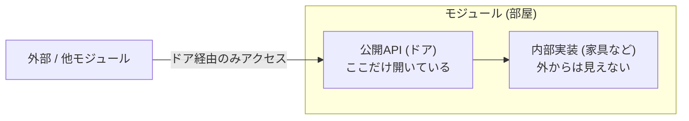
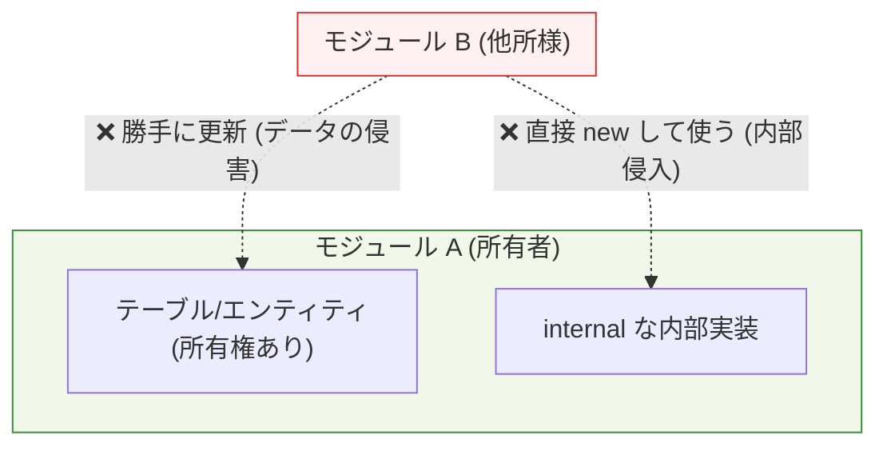
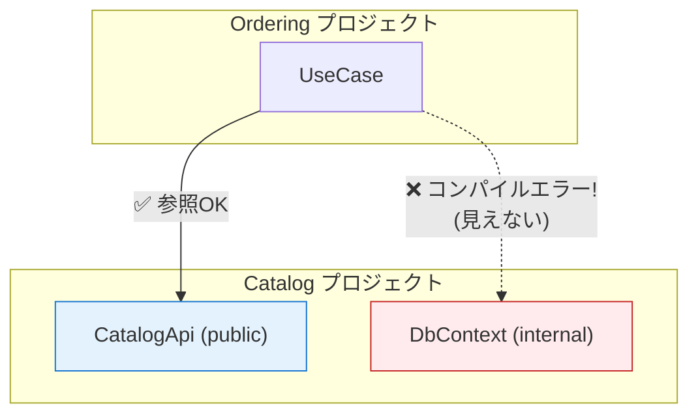

# 第02章：“モジュール”の正体：フォルダ分けじゃないよ📦🙅‍♀️

### 今日のゴール🎯

* 「モジュール＝**責務のまとまり＋境界（ルール）**」を腹落ちさせる😊✨
* フォルダ分けだけで起きる“見た目分割の罠”を避ける😇💥
* 「境界を越える」って何かを、コードで体感する⌨️🧩

---

## 1) まず結論：モジュールは“部屋”だよ🏠🚪


モジュールって、**同じ目的の機能がまとまった“部屋”**みたいなもの🏠✨

* 部屋の中（内部実装）は散らかっててもOKじゃないけど…基本は**外に見せない**🙈
* 外に出すのは**ドア（公開API）だけ**🚪✨
* となりの部屋に入るなら、**ドアから入る**（＝公開API経由）😊

こういう「境界がはっきりしたモジュール」を、**1つのアプリとしてデプロイしつつ**中身を分割して運用するのがモジュラーモノリスのコアだよ🧩🏠
（＝単一デプロイでも、内部はモジュールが独立して境界を持つ感じ） ([Milan Jovanović][1])



---

## 2) 「フォルダ分け＝モジュール」だと何がダメ？📦😵

### よくある“見た目だけ分割”😇

* `Catalog/` フォルダ
* `Ordering/` フォルダ
* `Identity/` フォルダ

…って分けたのに、実態は👇

#### 💥失敗パターンあるある

* Ordering が Catalog の **DBアクセス（DbContext）** を直接触る🗃️🫠
* Ordering が Catalog の **内部クラス** を new して使う🧨
* “便利”だからって Shared に何でも入れて、全モジュールがベタ依存🍱⚠️

こうなると、フォルダは分かれてるのに中身はスパゲッティ🍝😭
**変更が怖い**、**影響範囲が読めない**が再発しちゃうよ〜😵‍💫

---

## 3) “境界を越える”ってどういうこと？🧱➡️🧱

境界を越える＝だいたいこの3つのどれか！👇

### ① 内部実装に侵入する🙈

* 他モジュールの `internal` なクラス（本来見せないやつ）を使う
* 例：`CatalogDbContext` を Ordering が直触り

### ② データの所有権を踏む👟💥

* Catalog が責任を持つテーブル/エンティティを Ordering が勝手に更新する
* 「誰がそのデータの責任者？」が崩れると、整合性が壊れやすい😇

### ③ 仕様（ルール）が漏れる🫗

* 「割引計算」「在庫引当」みたいな大事ルールが、あちこちにコピペされる
* そのうち片方だけ修正されて事故る🚑💦



---

## 4) 境界（ルール）を“守らせる”コツ3点🚦✨

### ルール①：外に出すのは「窓口」だけ🪟📣

* モジュール間の会話は **公開API（Facade/Service/Interface）** だけでやる
* DTO（外に持ち出してOKなデータ）もここで決める📦✨

### ルール②：「見せない」を言語機能で作る🙅‍♀️

C# の `internal` は「**同じアセンブリ（同じプロジェクト）内だけ**見える」アクセス修飾子だよ🔒
つまりプロジェクトを分けると、**内部を物理的に隠せる**！最高〜😆✨ ([Microsoft Learn][2])

### ルール③：境界を“破ったらコンパイルで落とす”🧯

* 「ルールはドキュメント」だけだと破られる（人は急ぐので…😇）
* **破れない形**にしておくと、未来の自分が救われる🫶✨



---

## 5) 手を動かす（C#）⌨️：フォルダ分けの罠を“コンパイルエラー”で体験しよう💥✅

ここはミニ実験だよ😊🧪
**3プロジェクト**作って「内部に侵入すると怒られる」を体感する！

### ✅ 作るもの（最小）

* `Catalog`（クラスライブラリ）📦
* `Ordering`（クラスライブラリ）📦
* `Host`（コンソール）▶️（動作確認用）

> .NET は現行LTSが .NET 10（2025/11/11 リリース）だよ〜📅✨ ([Microsoft][3])
> Visual Studio 2026 も .NET 10 とセットで案内されてる感じ！🛠️✨ ([Microsoft Learn][4])

---

### 😇 まずダメ例：Ordering が Catalog の内部に侵入する（したい）

#### Catalog 側（`Catalog` プロジェクト）

```csharp
namespace Catalog;

internal class CatalogDbContext // ← 外に見せたくない“内部”
{
    public string FindName(string productId) => productId switch
    {
        "p-1" => "りんご🍎",
        _ => "なぞの商品❓"
    };
}

public sealed class CatalogApi // ← これが“ドア（公開API）”
{
    public string GetProductName(string productId)
    {
        var db = new CatalogDbContext();
        return db.FindName(productId);
    }
}
```

#### Ordering 側（`Ordering` プロジェクト）で侵入してみる😇

```csharp
using Catalog;

namespace Ordering;

public sealed class PlaceOrderUseCase
{
    public string Run(string productId)
    {
        // ❌ これをやりたい気持ちは分かる…でもダメ！
        var db = new CatalogDbContext(); // ← internal だから見えないはず
        return db.FindName(productId);
    }
}
```

✅ ここで狙い通り：**コンパイルエラー**になるよ！🎉
「内部（internal）には入れません🙅‍♀️」って、言語が止めてくれるの最高だよね😆✨ ([Microsoft Learn][2])

---

### 😎 良い例：Ordering は “ドア（公開API）” から入る🚪✨

```csharp
using Catalog;

namespace Ordering;

public sealed class PlaceOrderUseCase
{
    private readonly CatalogApi _catalog;

    public PlaceOrderUseCase(CatalogApi catalog)
    {
        _catalog = catalog;
    }

    public string Run(string productId)
    {
        // ✅ 公開API経由ならOK！
        var name = _catalog.GetProductName(productId);
        return $"注文OK🛒✨ 商品={name}";
    }
}
```

#### Host 側（`Host` プロジェクト）で動かす▶️

```csharp
using Catalog;
using Ordering;

var useCase = new PlaceOrderUseCase(new CatalogApi());
Console.WriteLine(useCase.Run("p-1"));
```

---

## 6) ミニ演習📝（10〜15分）

### 演習A：公開APIに“必要なものだけ”追加しよう🪟✨

`CatalogApi` に次を追加してね👇

* `GetProductSnapshot(productId)` を作る
* 返すのは `ProductSnapshot`（DTO）

  * `ProductId`
  * `Name`
  * `Price`（とりあえず int でOK）

💡ポイント：Ordering は `CatalogDbContext` に触れないまま、必要な情報を取れるようにする😊

### 演習B：「境界を越える行為」を3つ言語化しよう🧠✍️

次の文章を埋めてみてね👇

* 境界を越えるとは「（　　　）に侵入すること」
* 境界を越えるとは「（　　　）の所有権を踏むこと」
* 境界を越えるとは「（　　　）が漏れてコピペされること」

---

## 7) AI活用プロンプト例🤖✨（コピペOK）

### プロンプト①：公開API設計の相談🪟

「Catalogモジュールの内部（DbContextやEntity）を外に出さずに、Orderingが注文に必要な最小情報だけ取得できる公開API案を3つ出して。DTO設計も一緒に。」

### プロンプト②：境界違反レビュー🔍

「このコードはモジュラーモノリスの境界を破ってる？破ってるなら理由と、公開API経由に直す修正案を提示して。」

### プロンプト③：internal の使い分け🔒

「Catalogプロジェクトで internal にするべき型／public にするべき型の判断基準を、初心者向けに例付きで教えて。」

---

## まとめ（覚える1行）📌

**モジュール＝責務のまとまり＋境界（破れない形で守らせる仕組みまでセット）**🧩🔒✨

[1]: https://www.milanjovanovic.tech/blog/what-is-a-modular-monolith?utm_source=chatgpt.com "What Is a Modular Monolith?"
[2]: https://learn.microsoft.com/en-us/dotnet/csharp/language-reference/keywords/internal?utm_source=chatgpt.com "internal keyword - C# reference"
[3]: https://dotnet.microsoft.com/ja-jp/platform/support/policy/dotnet-core?utm_source=chatgpt.com ".NET および .NET Core の公式サポート ポリシー"
[4]: https://learn.microsoft.com/ja-jp/visualstudio/releases/2026/release-notes?utm_source=chatgpt.com "Visual Studio 2026 リリース ノート"
