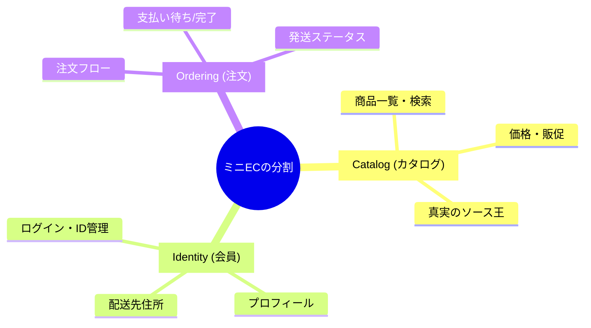
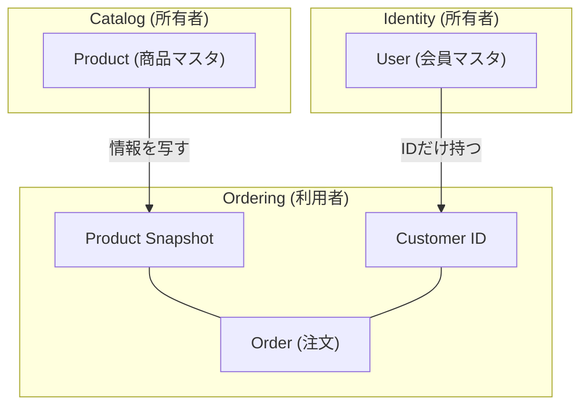
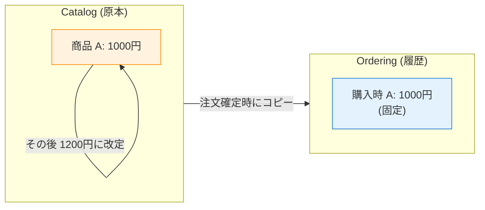
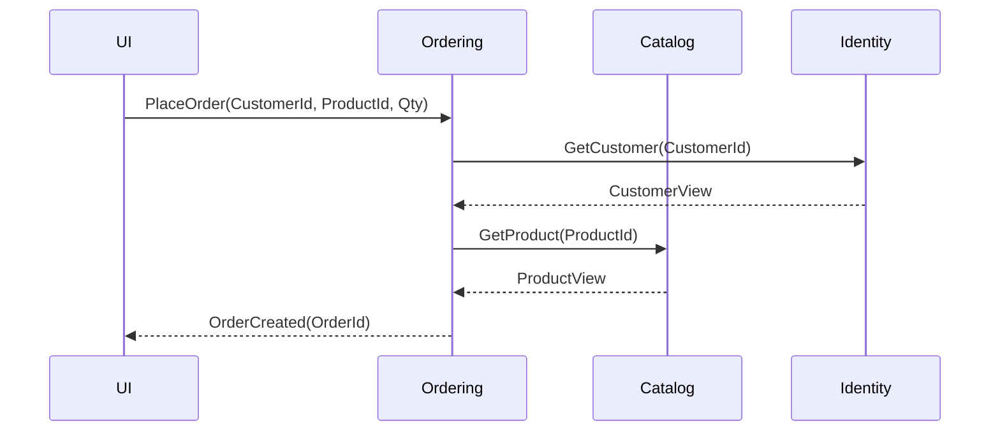

# 第03章：題材紹介：ミニECで学ぶよ🛒😊

この章は「モジュラーモノリスの練習台（題材）」を決めて、**境界（モジュール）を線引き**する回だよ〜🖍️✨
サンプルは **.NET 10 / C# 14** 前提で書くね（いまの最新ど真ん中！）🚀 ([Microsoft for Developers][1])

---

## 今日のゴール🎯


* ミニECの登場人物＆やることを把握する👀✨
* **Catalog / Ordering / Identity** の3モジュールに、ざっくり責務を割り振れるようになる📦📦📦
* 「それ、どのモジュールの仕事？」を口グセにする😆🧠

---

## まずは世界観（ストーリー）📚✨


あなたは小さなネットショップの開発者さん👩‍💻🧑‍💻
売ってるのは雑貨でもゲームグッズでもOK🎁
最初は機能を絞って、**“境界の練習”** に集中するよ🧩✨

### このミニECがやること（最小セット）✅

* 商品を見せる（一覧・詳細）🛍️
* 会員がログインできる🔐
* 注文できる🧾
* 支払いできる（成功/失敗）💳
* 発送できる（ステータス更新）📦

「返品」「クーポン」「在庫引当」「分割配送」みたいな難しいのは、いったん封印〜🙅‍♀️（後でいくらでも足せる！）

---

## 3モジュールの紹介📦✨（ここがこの章の主役！）

### ① Catalog（商品カタログ）🛍️

**関心ごと：商品を “売れる状態で見せる”**

* 商品一覧・検索🔎
* 商品詳細（名前、説明、画像、価格など）📝
* 価格や表示用の情報（販促文言など）💰✨

**境界のキモ🖍️**
Catalogは「商品情報の真実（ソース）」になりやすいよ👑
だから他が勝手に商品テーブルをいじるのは危険⚠️

---

### ② Identity（会員）🧑‍🤝‍🧑🔐

**関心ごと：人（アカウント）を “特定して管理する”**

* 会員登録、ログイン、パスワード変更🔑
* 顧客プロフィール（氏名、メールなど）📇
* 配送先住所（複数あってもOK）🏠

**境界のキモ🖍️**
Identityは「誰が誰か」を握る場所。
Orderingが「ユーザー管理」を始めたら破滅のカウントダウン⏳😇

---

### ③ Ordering（注文）🧾📦

**関心ごと：注文という “業務の流れ（状態）” を管理する**

* カート→注文確定🛒✅
* 支払いの結果を受けて状態更新💳➡️✅/❌
* 発送の結果を受けて状態更新📦➡️🚚➡️✅

**境界のキモ🖍️**
Orderingは「状態が変わる中心」になりやすいよ🚥
ここが肥大化しやすいから、最初に線引きしておくと勝ち✨



---

## 代表ユースケース（この題材で何をする？）🧩✨

### ユースケースA：注文する🛒➡️🧾

1. ログインしてる（Identity）🔐
2. 商品を選ぶ（Catalog）🛍️
3. 注文を作る（Ordering）🧾✨

### ユースケースB：支払う💳

1. 注文が「支払い待ち」状態
2. 決済の結果で「支払い済み/失敗」に変わる（Ordering）🚥

### ユースケースC：発送する📦

1. 支払い済みの注文だけ発送OK
2. 「発送済み」に変える（Ordering）🚚✨

---

## ざっくり境界候補を線引きしてみる🖍️😊

### まずは “責務だけ” で切る（最初はこれでOK！）✅

* **Catalog**：商品を見せる・選ばせる
* **Identity**：会員を識別する・住所を持つ
* **Ordering**：注文の状態を進める（作成/支払い/発送）

ここで超大事ルール👇
**「同じデータを、複数モジュールが “主” として持たない」** 🙅‍♀️
（コピーやスナップショットはOK！“主” が誰かを決めるのが大事✨）



---

## “衝突しそうな言葉” を先にメモしよう📝💥


モジュールが分かれると、同じ英単語でも意味がズレがち😵‍💫
今のうちに「この言葉、誰の辞書？」を決めると事故が減るよ🛡️✨

* **Product**：Catalogの言葉（Orderingは参照する側）
* **Customer / User**：Identityの言葉（Orderingは顧客IDを持つだけ、など）
* **Order**：Orderingの言葉（Catalogは持たない）

---

## まずダメ例😇 → 良い例😎（境界の感覚をつかむコーナー）

### ダメ例😇（全部盛りサービス）

* `OrderService` が `Products` テーブルも `Users` テーブルも直接読んで
* 価格計算も住所管理もログイン判定もぜーんぶやる😵
* 変更が入るたびに影響範囲が読めない💥

**結果**：
「注文修正しただけなのにログインが壊れた」みたいな地獄が起きる😇🔥

---

### 良い例😎（モジュールに聞きに行く）


* Orderingは「注文の状態」と「注文のルール」に集中🧾🚥
* 商品のことはCatalogに聞く🛍️
* ユーザーのことはIdentityに聞く🔐

**さらにポイント✨**
注文には「その時点の価格や商品名」を**スナップショット**として持たせると強い💪
（Catalogの価格が変わっても、過去の注文は守れる🛡️）



---

## 手を動かす（C#）⌨️✨：まずは “会話の窓口” をスケッチしてみよ！


この章ではまだ大工事しないで、**「モジュール同士がどう話すか」** の形だけ作るよ😊
（実装は薄くてOK！“境界の姿” が目的🧩）

```csharp
// まずは「他モジュールにお願いする時の窓口」を決めるイメージ✨

// Catalog に聞きたいこと
public interface ICatalogQuery
{
    Task<ProductView?> GetProduct(string productId);
}

public sealed record ProductView(
    string ProductId,
    string Name,
    decimal Price,
    bool IsActive
);

// Identity に聞きたいこと
public interface IIdentityQuery
{
    Task<CustomerView?> GetCustomer(string customerId);
}

public sealed record CustomerView(
    string CustomerId,
    string DisplayName,
    string DefaultShippingAddress
);

// Ordering が自分の世界で持つ「注文作成コマンド」
public sealed record PlaceOrderCommand(
    string CustomerId,
    string ProductId,
    int Quantity
);
```

> いまは「こういう問い合わせ口が必要そうだな〜」って形を作るだけでOK😊✨
> 実装の中身は第6章以降で育てていくよ🪴

---

## ざっくりフロー図（注文する）🧾🛒


「Orderingが中心で、必要な情報を他に聞く」感じを掴もう〜✨



---

## ミニ演習📝✨（10〜15分くらい）

### 演習1：仕分けゲーム🎮


次の機能はどのモジュール？（迷ったら理由も一言♪）

* 商品検索 🔎
* 配送先住所の変更 🏠
* 注文のキャンセル 🚫
* 「この注文は誰の注文？」の表示 👀

### 演習2：データの“主”を決めよう👑

* 「価格」は誰のデータ？
* 「注文時の価格」はどこに置く？（ヒント：スナップショット🧊）

### 演習3：衝突ワード探し💥

あなたの題材だと「同じ言葉で意味が割れそう」な単語を3つ書いてみてね📝
（例：Account / User / Member とか）

---

## AI活用プロンプト例🤖✨（コピペOK）


### ① 境界の候補を増やしたい🧩

```text
あなたはソフトウェア設計の先生です。
ミニEC（Catalog/Ordering/Identity）の機能を列挙し、
各機能がどのモジュールに属するのが自然か、理由つきで提案してください。
「境界を越えてはいけない例」も3つ挙げてください。
```

### ② “衝突しそうな言葉” を洗い出したい💥

```text
Catalog/Ordering/Identity の3つの文脈で、
意味が衝突しやすい用語（例：Order, Customer, Product など）を挙げ、
それぞれのモジュールにおける定義（短文）を作ってください。
```

### ③ C#のDTOスケッチを整えたい🧾

```text
次のインターフェース群に対して、初心者にも読みやすい DTO(record) 設計を提案してください。
nullの扱い、命名、責務の境界が分かるようにコメントも付けてください。
（ここにコードを貼る）
```

---

## まとめ（覚える1行）📌✨

**「モジュール分けは、フォルダ分けじゃなくて“責務と会話”の線引き」** 🧩🖍️

---

次の章（第4章）では、この線引きを支える超基本スキル **SoC（関心の分離）** をやって、
「混ぜた地獄😇」を避けるコツを身につけていくよ〜✂️✨

[1]: https://devblogs.microsoft.com/dotnet/announcing-dotnet-10/?utm_source=chatgpt.com "Announcing .NET 10"
