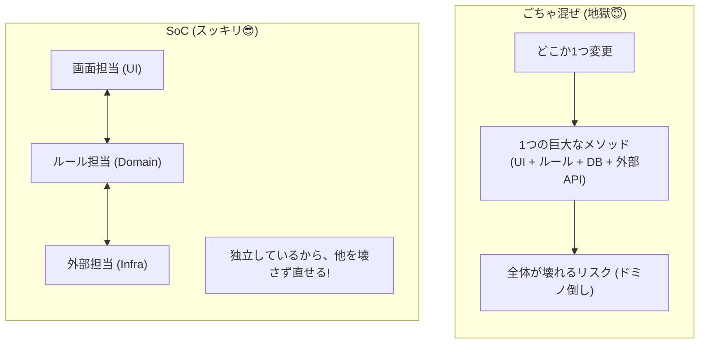
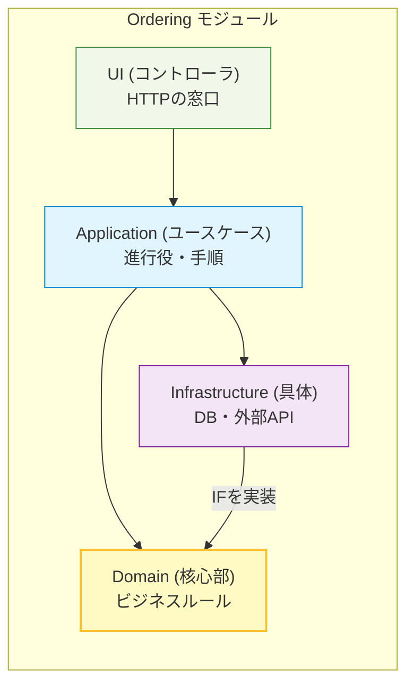
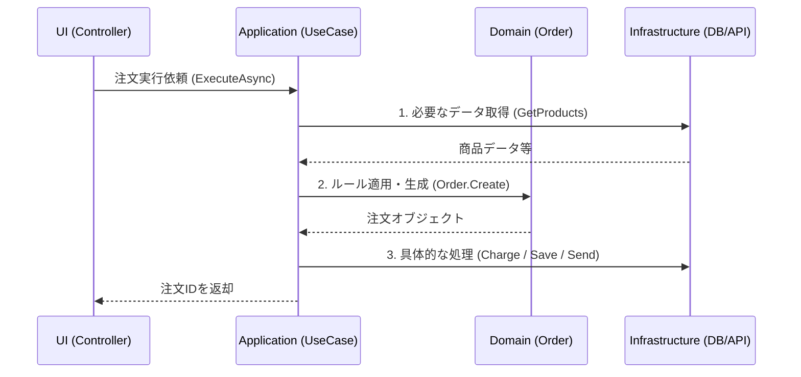

# 第04章：設計の超基本：SoC（関心の分離）✂️✨

### 今日のゴール🎯

* 「UI／業務ロジック／DB／外部API」を**ごちゃ混ぜにしない**感覚がつかめる😊✨
* “混ぜた地獄”コードを見て「うわ…😇」ってなったあと、**分けてスッキリ😎**できる
* モジュラーモノリスで「モジュール境界」を守るための**超・基礎体力**がつく💪🧩

---

## 1) SoCってなに？（超ざっくり）🧠✨


SoC（Separation of Concerns）は、ひとことで言うと…

> **「別の理由で変わるものは、別の場所に置こう」**✂️📦

たとえば、同じ“注文する”処理でも👇

* 画面（UI）の都合で変わる（ボタン増えた、入力項目変わった）🖥️
* ルールが変わる（合計が0円なら注文不可、割引条件が変わる）🧾
* DBの都合で変わる（テーブル設計変更、DBを替える）🗄️
* 外部サービスの都合で変わる（決済APIの仕様変更）🌐

…これ、**全部いっしょのメソッドに入れると**、変更が来たときにドミノ倒し💥になります😵‍💫



---

## 2) モジュラーモノリスでSoCが超大事な理由🏠🧩


モジュラーモノリスは「1つのアプリの中を、モジュール境界で分けて強くする」やり方だよね🏠✨
このとき SoC ができてないと…

* モジュールの“外”の事情（DBやUI）が、モジュールの“中核のルール”に侵入😇
* 結果：境界が溶ける🫠 → 「分けた意味がない」になる💥

逆に、SoCできてると…

* ルールはルールとして守れる🔒
* UIやDBや外部APIが変わっても、影響範囲が小さい✨
* テストもしやすい🧪

ちなみに今どきの .NET は **.NET 10（LTS）**が中心で、C# も **C# 14**が最新の流れだよ（この章のサンプルもこの世代の書き味でOK）📌✨ ([Microsoft for Developers][1])
Visual Studio も **Visual Studio 2026** が出ていて、AI統合もどんどん強い🌟 ([Microsoft Learn][2])

---

## 3) まずダメ例😇→ “混ぜた地獄”を体験しよう🔥


やりがちな「全部入り」例（注文確定＋決済＋DB＋メール＋ログが1か所）👇

```csharp
public async Task<IActionResult> Checkout(CheckoutRequest req)
{
    // 1) 入力チェック（UI都合）
    if (string.IsNullOrWhiteSpace(req.UserId)) return BadRequest("UserId required");
    if (req.Items.Count == 0) return BadRequest("No items");

    // 2) DB直アクセス（永続化都合）
    var user = await _db.Users.FindAsync(req.UserId);
    if (user is null) return NotFound("User not found");

    var productIds = req.Items.Select(x => x.ProductId).ToList();
    var products = await _db.Products.Where(p => productIds.Contains(p.Id)).ToListAsync();

    // 3) 業務ルール（本来コア）
    decimal total = 0;
    foreach (var item in req.Items)
    {
        var p = products.Single(x => x.Id == item.ProductId);
        if (p.Stock < item.Qty) return BadRequest("Out of stock");
        total += p.Price * item.Qty;
        p.Stock -= item.Qty; // 在庫減らす（副作用）
    }
    if (total <= 0) return BadRequest("Invalid total");

    // 4) 外部API（決済）
    var chargeId = await _paymentApi.ChargeAsync(user.CreditCardToken, total);

    // 5) さらにDB（注文保存）
    var order = new OrderEntity { UserId = user.Id, Total = total, PaymentId = chargeId };
    _db.Orders.Add(order);
    await _db.SaveChangesAsync();

    // 6) 外部I/O（メール）
    await _email.SendAsync(user.Email, "Thanks!", $"OrderId: {order.Id}");

    return Ok(new { order.Id });
}
```

### 何がヤバいの？😵‍💫（痛いところあるある）

* 決済APIの仕様が変わる → このメソッドを直す💥
* DBが変わる → このメソッドを直す💥
* 画面入力が増える → このメソッドを直す💥
* ルールが増える → さらに肥大化💥
* テストしたい → DBも決済もメールも必要😇（無理ゲー）

---

## 4) 良い例😎→ “関心で分ける”とこうなる🧩✨

同じ「注文する」でも、役割で分けるよ👇

### 分け方の定番（1モジュール内の基本形）🧅


* **UI（Controller / API）**：HTTPの受け取り、入力の一次整形、結果の返却🖥️
* **Application（UseCase）**：ユースケース進行役（注文確定の手順）📋
* **Domain（ルール）**：ビジネスルールの中心（在庫・合計・状態など）🔒
* **Infrastructure（実装）**：DB/外部API/メールなどの“具体”🧰

> 大事：**Domain は I/O を知らない**（DBやHTTPや外部APIに触れない）🙅‍♀️✨



---

## 5) 手を動かす（C#）⌨️✨：同じ処理をSoCで作り直す

ここから「最小セット」でいくよ😊
（注文モジュール `Ordering` の中だけで完結させるイメージ🛒）

---

### Step A：Domainを作る（ルール担当）🔒

「注文を作るときのルール」を Domain に閉じ込める✨

```csharp
public sealed class Order
{
    public Guid Id { get; } = Guid.NewGuid();
    public string UserId { get; }
    public IReadOnlyList<OrderLine> Lines { get; }
    public Money Total { get; }

    private Order(string userId, IReadOnlyList<OrderLine> lines, Money total)
    {
        UserId = userId;
        Lines = lines;
        Total = total;
    }

    public static Order Create(string userId, IEnumerable<OrderLine> lines)
    {
        if (string.IsNullOrWhiteSpace(userId))
            throw new DomainException("UserId is required");

        var list = lines?.ToList() ?? throw new DomainException("Lines required");
        if (list.Count == 0) throw new DomainException("No items");

        var total = list.Aggregate(Money.Zero, (acc, x) => acc + (x.UnitPrice * x.Qty));
        if (total.Amount <= 0) throw new DomainException("Invalid total");

        return new Order(userId, list, total);
    }
}

public sealed record OrderLine(string ProductId, int Qty, Money UnitPrice);

public sealed record Money(decimal Amount, string Currency)
{
    public static Money Zero => new(0, "JPY");
    public static Money operator +(Money a, Money b)
        => a.Currency == b.Currency ? new(a.Amount + b.Amount, a.Currency)
                                    : throw new DomainException("Currency mismatch");

    public static Money operator *(Money a, int qty)
        => new(a.Amount * qty, a.Currency);
}

public sealed class DomainException : Exception
{
    public DomainException(string message) : base(message) { }
}
```

👉 ここ、DBも決済もメールも出てこないよね？それがSoCの勝ちポイント😎✨

---

### Step B：Application（UseCase）を作る（手順担当）📋


UseCaseは「注文の流れ」を組み立てるけど、**具体実装には触れない**（触れるのは interface だけ）🧩

```csharp
public interface IProductReader
{
    Task<IReadOnlyList<ProductSnapshot>> GetProductsAsync(IReadOnlyList<string> productIds);
}

public sealed record ProductSnapshot(string Id, Money Price, int Stock);

public interface IPaymentGateway
{
    Task<string> ChargeAsync(string userId, Money total);
}

public interface IOrderRepository
{
    Task SaveAsync(Order order, string paymentId);
}

public interface IEmailSender
{
    Task SendThanksAsync(string userId, Guid orderId);
}

public sealed class PlaceOrder
{
    private readonly IProductReader _products;
    private readonly IPaymentGateway _payment;
    private readonly IOrderRepository _orders;
    private readonly IEmailSender _email;

    public PlaceOrder(IProductReader products, IPaymentGateway payment, IOrderRepository orders, IEmailSender email)
    {
        _products = products;
        _payment = payment;
        _orders = orders;
        _email = email;
    }

    public async Task<Guid> ExecuteAsync(string userId, IReadOnlyList<(string productId, int qty)> items)
    {
        // 1) 必要なデータ取得（読み取り）
        var ids = items.Select(x => x.productId).Distinct().ToList();
        var snaps = await _products.GetProductsAsync(ids);

        // 2) ルール適用（Domainへ）
        var lines = items.Select(i =>
        {
            var p = snaps.Single(x => x.Id == i.productId);
            if (p.Stock < i.qty) throw new DomainException("Out of stock");
            return new OrderLine(p.Id, i.qty, p.Price);
        }).ToList();

        var order = Order.Create(userId, lines);

        // 3) 決済（外部I/Oはポート越し）
        var paymentId = await _payment.ChargeAsync(userId, order.Total);

        // 4) 保存（DBもポート越し）
        await _orders.SaveAsync(order, paymentId);

        // 5) 通知（メールもポート越し）
        await _email.SendThanksAsync(userId, order.Id);

        return order.Id;
    }
}
```



---

### Step C：UIは“薄く”する（HTTP担当）🖥️


コントローラは「HTTPの受け渡し」が主役✨

```csharp
[ApiController]
[Route("api/orders")]
public sealed class OrdersController : ControllerBase
{
    private readonly PlaceOrder _placeOrder;
    public OrdersController(PlaceOrder placeOrder) => _placeOrder = placeOrder;

    [HttpPost("checkout")]
    public async Task<IActionResult> Checkout([FromBody] CheckoutRequest req)
    {
        try
        {
            var orderId = await _placeOrder.ExecuteAsync(
                req.UserId,
                req.Items.Select(x => (x.ProductId, x.Qty)).ToList()
            );

            return Ok(new { orderId });
        }
        catch (DomainException ex)
        {
            return BadRequest(new { error = ex.Message });
        }
    }
}

public sealed record CheckoutRequest(string UserId, List<CheckoutItem> Items);
public sealed record CheckoutItem(string ProductId, int Qty);
```

> ちなみに最近の ASP.NET Core（.NET 10）だと Minimal API 側でバリデーションも強化されてて、入力チェックを“境界”でやりやすくなってるよ✨（境界で整える＝SoCに追い風） ([Microsoft Learn][3])

---

### Step D：Infrastructureで“具体”を実装する🧰


ここはDB（EF Coreなど）や外部APIの具体を置く場所✨
（サンプルなので雰囲気だけ👇）

```csharp
public sealed class FakePaymentGateway : IPaymentGateway
{
    public Task<string> ChargeAsync(string userId, Money total)
        => Task.FromResult($"PAY-{Guid.NewGuid()}");
}
```

---

## 6) これで何が嬉しいの？😆✨（効果まとめ）

* ルール（Domain）が**単体テストしやすい**🧪（DBいらない）
* 決済をモックにして、注文フローをテストできる🤖
* UI変更してもDomainは基本ノーダメージ🛡️
* DB変更してもUseCaseは基本ノーダメージ🛡️
* モジュール化したときも「外へ漏らさない形」が作れる🏠🧩

---

## 7) ミニ演習📝✨

### 演習1：関心を色分けしよ🖍️

さっきの“混ぜた地獄”コードをコピーして、コメントで👇を付けてみてね😊

* `[UI]` `[Domain]` `[DB]` `[External]` `[CrossCutting(ログ等)]`
  → どれが多いか数える📊（だいたい地獄は全部多い😇）

### 演習2：分割プランを3つ書く✍️

* Domainに残すルールは？🔒
* UseCaseでやる手順は？📋
* Infrastructureに追い出すI/Oは？🧰

### 演習3：テスト1本だけ書く🧪

* `Order.Create()` に「Itemsが空なら例外」みたいなテストを追加✨
  （最初の1本がいちばん大事！🎉）

---

## 8) AI活用プロンプト例🤖✨（コピペOK）


### 目的：混ぜたコードをSoCに直す✂️

```text
このC#のCheckoutメソッドを、SoC（関心の分離）でリファクタしてください。
- UI(Controller)は薄く
- Application(UseCase)を新規作成
- Domainにビジネスルールを集約
- DB/外部API/メールはInfrastructureに移動し、interface(ポート)越しに呼ぶ
生成物：フォルダ構成案 / クラス一覧 / 主要コード
```

### 目的：テストを増やす🧪

```text
Domain層のOrder.Createに対して、xUnitでテストケースを5つ提案して。
境界値（0円、空配列、qty=0、通貨違いなど）を含めて、テストコードも生成して。
```

### 目的：依存の方向をチェックする🚦

```text
このプロジェクト構成で、依存関係ルール（内側が外側を参照しない）を守れているかレビューして。
違反の可能性がある参照例も挙げて。
```

---

## 9) まとめ（覚える1行）📌✨

**「ルールは中へ🔒、I/Oは外へ🧰、UIは薄く🖥️」** 😎✂️✨

---

次の第5章（境界づけ＝Bounded Contextミニ版🧱🌍）に行くと、「どこまでを1モジュールにする？」がもっと気持ちよく決められるようになるよ😊💡

[1]: https://devblogs.microsoft.com/dotnet/dotnet-and-dotnet-framework-january-2026-servicing-updates/?utm_source=chatgpt.com ".NET and .NET Framework January 2026 servicing ..."
[2]: https://learn.microsoft.com/en-us/visualstudio/releases/2026/release-notes?utm_source=chatgpt.com "Visual Studio 2026 Release Notes"
[3]: https://learn.microsoft.com/en-us/aspnet/core/release-notes/aspnetcore-10.0?view=aspnetcore-10.0&utm_source=chatgpt.com "What's new in ASP.NET Core in .NET 10"
