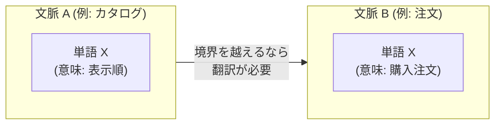
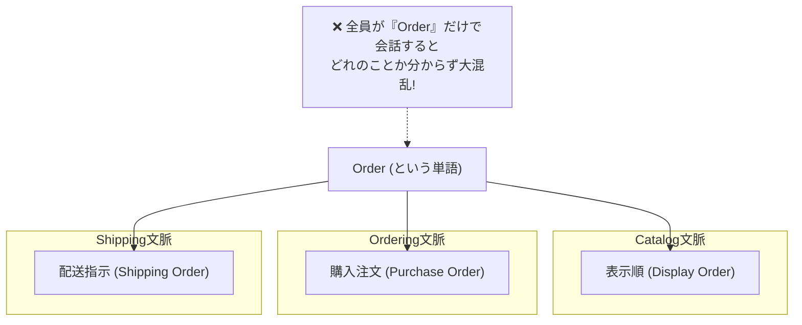
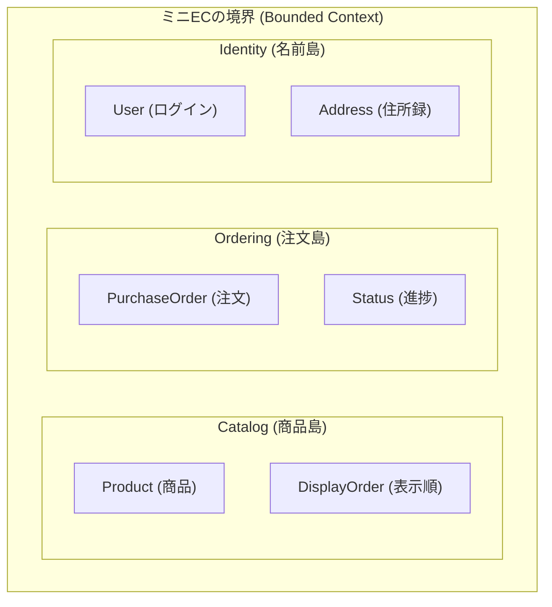

# 第05章：境界づけ入門：Bounded Contextのミニ版🧱🌍

### 今日のゴール🎯

* **同じ単語でも意味がズレる事故**（Order問題😵）を体感する
* “境界”を **言葉（用語）ベース**で切るコツをつかむ✂️
* ミニEC題材で **3つの境界（Catalog / Ordering / Identity）** を「それっぽく」置けるようになる🛒✨

---

## 0. まず、いまの「最新」メモ🗒️✨

いまの最新は **.NET 10（LTS）** が中心だよ〜！

* .NET 10 は **2025/11/11** にリリース、**2026/1/13 時点の最新パッチは 10.0.2**（サポートも LTS で長め）だよ✅ ([Microsoft][1])
* C# も **C# 14** が “今どき” のラインだよ✨（拡張メンバーなど） ([Microsoft Learn][2])
* Visual Studio も **Visual Studio 2026** が出てて、AI 連携を強化してる流れだよ🤖🧡 ([Microsoft Learn][3])

（この章は設計が主役なので、言語機能は“味付け程度”にするね🍳）

---

## 1. Bounded Contextって何？（ミニ版でOK）🧱🌍


超ざっくり言うと👇

> **「ある言葉（モデル）が、同じ意味で通じる範囲」** が Bounded Context（境界づけられた文脈）だよ✨
> その範囲を越えるなら、**意味の翻訳（変換）が必要**になるよ〜🗺️

DDDでは、大きいモデルを **Bounded Context に分割して、相互関係を“明示”する**のが超重要って話になってるよ📌 ([martinfowler.com][4])



---

## 2. 事故る原因：「同じ単語」でも意味が違う😇💥

### 例：Order（オーダー）問題😵

ミニECだと “Order” がめちゃくちゃ揉めがち〜！

* **Ordering（注文）** の Order
  → 「お客様の購入注文」🛒💳
* **Catalog（商品）** の order / display order
  → 「表示順・並び順」📦🔽
* **Shipping（発送）** が入ると
  → 「出荷指示」「配送オーダー」🚚📦

同じ “Order” って単語を、みんなが好きに使うと…

* DBの `Order` テーブルに「表示順」まで混ざる
* `Order.Status` が “表示状態” なのか “注文状態” なのか地獄
* 変更したら別機能が壊れる（しかも理由が読めない）😇

これが「境界を切る」前に起きる典型事故だよ〜💥



---

## 3. まずは“衝突しそうな言葉”を見つけよう🔎🧠✨

Bounded Context の入り口は、だいたいここ！

### 衝突しがちな言葉リスト（ミニECあるある）🧨

* Order（注文？表示順？出荷？）
* Customer / User / Member（誰？ログイン？購入者？会員？）
* Product（商品？商品マスタ？注文時点のスナップショット？）
* Price（定価？割引後？税抜？税込？）
* Status（注文状態？配送状態？公開状態？）

### 見つけ方のコツ🧩

次のどれかが出たら「境界の匂い」だよ👃✨

* 同じ単語が **画面/部署/担当**で意味が違う
* 仕様書で同じ単語なのに、説明が毎回長い
* “え、こっちの意味だと思ってた！” が起きる
* クラス名が `Order2` / `OrderInfo` / `OrderEntity` と増殖してる😇

---

## 4. ダメ例😇 → 良い例😎（ここが本体！）

### ダメ例：ぜんぶ “Order” に押し込む🧟‍♀️

「表示順」も「購入注文」も “Order” でいっちゃうとこうなる👇

```csharp
public class Order
{
    // Catalogっぽい（表示順）
    public int DisplayOrder { get; set; }        // え、注文に表示順…？

    // Orderingっぽい（購入注文）
    public Guid OrderId { get; set; }
    public Guid CustomerId { get; set; }
    public DateTime OrderedAt { get; set; }
    public string Status { get; set; } = "New";

    // さらに増えていく…
    public string? ShippingStatus { get; set; }  // 配送…？
    public decimal? TotalPrice { get; set; }     // 価格…？
}
```

**何が起きる？😇**

* `DisplayOrder` を直したら “注文” 側が壊れる（関係ないのに）
* “Status” の意味が揺れて、if 文が増殖🌿
* どこを直していいか分からない😵

---

### 良い例：言葉の意味が同じ範囲ごとに分ける🧱✨

“Order” を **Ordering の中だけ**で「購入注文」として扱う。
Catalog 側は、そもそも “Order” じゃなくて **SortOrder / DisplayOrder** と呼ぶ。

```csharp
namespace Catalog;

// 「表示順」は Catalog の言葉📦
public sealed class DisplaySortOrder
{
    public int Value { get; }
    public DisplaySortOrder(int value)
    {
        if (value < 0) throw new ArgumentOutOfRangeException(nameof(value));
        Value = value;
    }
}

public sealed class Product
{
    public Guid ProductId { get; }
    public string Name { get; }
    public DisplaySortOrder SortOrder { get; }

    public Product(Guid productId, string name, DisplaySortOrder sortOrder)
        => (ProductId, Name, SortOrder) = (productId, name, sortOrder);
}
```

```csharp
namespace Ordering;

// 「注文」は Ordering の言葉🛒
public enum OrderStatus { Created, Paid, Cancelled }

public sealed class PurchaseOrder
{
    public Guid OrderId { get; }
    public Guid CustomerId { get; }
    public DateTime OrderedAt { get; }
    public OrderStatus Status { get; private set; }

    public PurchaseOrder(Guid orderId, Guid customerId, DateTime orderedAt)
        => (OrderId, CustomerId, OrderedAt, Status) = (orderId, customerId, orderedAt, OrderStatus.Created);

    public void MarkPaid()
    {
        if (Status != OrderStatus.Created) throw new InvalidOperationException("支払いは Created のときだけ💳");
        Status = OrderStatus.Paid;
    }
}
```

**良いポイント😎✨**

* Catalog の “並び順” は、Ordering に混ざらない
* Ordering の “注文状態” は、Catalog に汚染されない
* 名前を変えただけで、仕様の誤解が激減する📉✨

---

## 5. “境界”を切るための最小手順🧩🧭

ここからは手を動かす前の「思考手順」だよ🧠✨
（5分でできるやつ！）

### 手順①：衝突単語を 5〜10 個書き出す📝

例：Order / Customer / Product / Price / Status

### 手順②：単語ごとに「意味」を一行で書く✍️

* Ordering の Order：購入注文
* Catalog の order：表示順
* Identity の Customer：ログイン＋会員情報（認証・個人情報）

### 手順③：意味が同じ単語同士を“島”にまとめる🏝️

* Catalog：商品・カテゴリ・表示順・在庫表示…
* Ordering：注文・決済・注文明細・金額計算…
* Identity：会員・ログイン・住所録・権限…

### 手順④：島に名前を付ける（＝Bounded Context名）🏷️

この教材だと：

* **Catalog**（商品を売るための世界）📦
* **Ordering**（注文を成立させる世界）🛒
* **Identity**（誰が誰か、ログインや会員の世界）🪪



---

## 6. “境界をまたぐ”ときは、翻訳が必要になる🗺️🔁

たとえば Ordering が「商品名」を注文に入れたいとするよね？

ここで大事なのは👇
Ordering の中では **Catalog の Product をそのまま握らない**（握ると境界が溶ける🫠）

よくある素直な方針はこれ👇

* 注文に必要な商品情報は **スナップショット（写し）** として持つ📸

```csharp
namespace Ordering;

public sealed class OrderedItemSnapshot
{
    public Guid ProductId { get; }
    public string ProductName { get; }
    public decimal UnitPrice { get; }

    public OrderedItemSnapshot(Guid productId, string productName, decimal unitPrice)
        => (ProductId, ProductName, UnitPrice) = (productId, productName, unitPrice);
}
```

こうすると、Catalog の都合で Product が変わっても、**過去の注文が壊れない**よ🛡️✨

（この “境界を越える設計” は後の章でめっちゃ効いてくるよ〜！）

---

## 7. 手を動かす（C#）⌨️✨：用語衝突ミニ体験

ここは超ミニでOK！
やることは **「Order を分ける」だけ**😊

### やること✅

1. コンソールアプリを作る
2. `Catalog` と `Ordering` の namespace を作る
3. “ダメ例” を書いて違和感を感じる
4. “良い例” に分けて、呼び出し側が読みやすくなるのを体験✨

#### 動作チェック用（Main）🚀

```csharp
using Catalog;
using Ordering;

var p = new Product(
    productId: Guid.NewGuid(),
    name: "かわいいマグカップ☕",
    sortOrder: new DisplaySortOrder(10)
);

var order = new PurchaseOrder(
    orderId: Guid.NewGuid(),
    customerId: Guid.NewGuid(),
    orderedAt: DateTime.UtcNow
);

order.MarkPaid();

Console.WriteLine($"商品: {p.Name} / 並び順: {p.SortOrder.Value}");
Console.WriteLine($"注文: {order.OrderId} / 状態: {order.Status}");
```

**読むだけで意味が分かる**のが正解だよ〜😎✨

---

## 8. ミニ演習📝✨（提出物っぽく）

### 演習A：衝突単語探しゲーム🔎

ミニECを想像して、衝突しそうな単語を **最低7個**書いてね✍️
（例：Order / Customer / Product / Price / Status / Address / Payment …）

### 演習B：3つに島分け🏝️

その7個を **Catalog / Ordering / Identity** のどれに入れるか振り分けてみてね😊

### 演習C：リネームして事故防止🛡️

“Order” みたいに揉める単語を **2つ**選んで、誤解が減る名前に変えてみて✨
例：

* Order（表示順）→ `DisplaySortOrder`
* Order（購入注文）→ `PurchaseOrder`

---

## 9. AI活用プロンプト例🤖✨（コピペOK）

### ① 衝突単語の洗い出し

「ミニEC（Catalog/Ordering/Identity）を前提に、衝突しやすい用語を20個挙げて。
それぞれ『意味が割れそうな例』も一言で添えて。
最後に、Bounded Context を3〜5個提案して。」

### ② 既存コードから境界候補を推定

「以下のクラス一覧から、Bounded Context の候補を提案して。
衝突していそうな用語と、そのリネーム案も出して。
（貼り付ける：クラス名、主要プロパティ、主要メソッド）」

### ③ “翻訳DTO” の案を作る

「Catalog の Product から Ordering に渡すべき最小情報を提案して。
“注文履歴が将来壊れない” 観点で、スナップショットDTO案を C# で書いて。」

---

## 10. まとめ（覚える1行）📌✨

**Bounded Context は “言葉の意味が同じで通じる範囲” を切ること。衝突単語を見つけたら境界のサイン！** 🧱🌍 ([martinfowler.com][4])

---

次の章（第6章）では、この境界を **Visual Studio の Solution/Project 構成**として “形” にしていくよ〜🛠️✨
そのとき今日の「島分け」が、そのまま効いてくるからね😊🧡

[1]: https://dotnet.microsoft.com/ja-jp/platform/support/policy/dotnet-core?utm_source=chatgpt.com ".NET および .NET Core の公式サポート ポリシー"
[2]: https://learn.microsoft.com/ja-jp/dotnet/csharp/whats-new/csharp-14?utm_source=chatgpt.com "C# 14 の新機能"
[3]: https://learn.microsoft.com/en-us/visualstudio/releases/2026/release-notes?utm_source=chatgpt.com "Visual Studio 2026 Release Notes"
[4]: https://www.martinfowler.com/bliki/BoundedContext.html?utm_source=chatgpt.com "Bounded Context"
