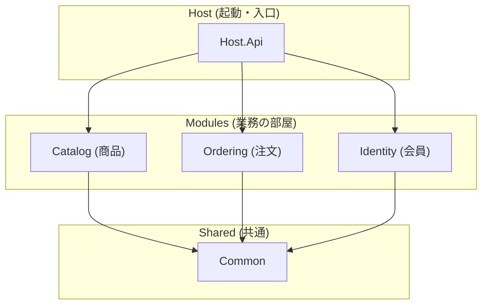
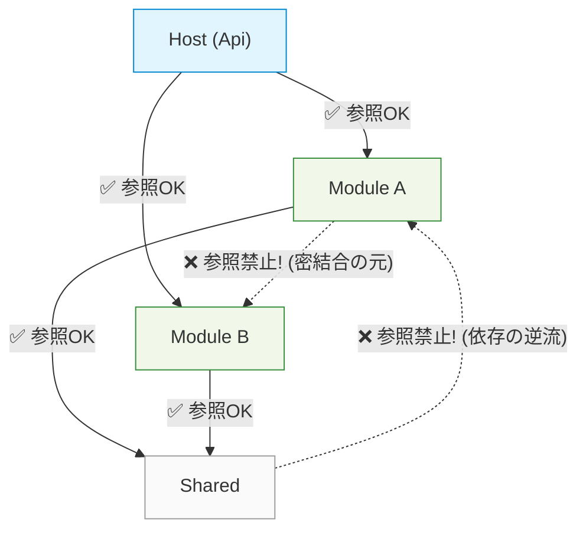

# 第06章：ソリューション構成：Visual Studioで作る基本形🛠️🪟

### 今日のゴール🎯

* **“増えても崩れない”置き場所**を先に作っちゃう🏠🧩
* Visual Studio上で、**Host / Modules / Shared** がスッと分かるSolution構成を作る✨
* とりあえず **ビルドして動く** ところまで行く🚀

---

## 0) まず“完成イメージ”を見よう👀✨

### フォルダ構成（おすすめ最小形）📁


* 迷子になりにくい「src」1本立てが強い💪

```
/MiniECommerce
  /src
    /Host
      MiniECommerce.Host.Api
    /Modules
      /Catalog
        MiniECommerce.Modules.Catalog
      /Ordering
        MiniECommerce.Modules.Ordering
      /Identity
        MiniECommerce.Modules.Identity
    /Shared
      MiniECommerce.Shared
  MiniECommerce.sln
```

> いまは **1モジュール=1プロジェクト** でOK👌（次章で“モジュール内レイヤー”を増やすよ🧅）

---

## 1) ありがちなダメ例😇💥 → どう壊れる？


### ダメ例：1プロジェクト巨大化モノリス🍝

* `WebApp` 1個だけ
* 中身をフォルダで「Catalog」「Ordering」って分けてるつもり
* でも…**参照ルールが無い**から、どこからでもどこでも呼べる😵

**起きること**

* 変更の影響範囲が読めない😵‍💫
* 「一応フォルダ分けしたのに、結局ぐちゃぐちゃ」になりがち🍝
* テストもしんどい🧪💦

---

## 2) 良い例😎✨：SolutionとProjectで“境界”を作る🧱


### 良い例：Host / Modules / Shared を物理的に分ける🏠📦

* **Host**：アプリの入口（Web API / UI / 起動）🚪
* **Modules**：業務のまとまり（Catalog/Ordering/Identity）🛒🧾👤
* **Shared**：本当に共有していい薄いものだけ🍱⚠️（増やしすぎ注意！）

**効果**

* 依存関係が見える👀
* 「ここ触ったらここまで影響」って読める📌
* 追加機能も“置き場所”で迷わない🧭✨



---

## 3) Visual Studioで“骨組み”を作ろう🛠️✨（手順どおりでOK）

### 3-1. Solutionを作成🏗️

1. Visual Studioで **新しいプロジェクトの作成**
2. テンプレ：**空のソリューション（Blank Solution）** を選ぶ（またはSolutionだけ作成できるテンプレ）
3. Solution名：`MiniECommerce`（例）
4. できたらSolution直下に **src** フォルダを作る📁

### 3-2. Solution Folderを作る📦（見た目を整える）

Solution上で右クリック → **追加** → **新しいソリューション フォルダー**

* `Host`
* `Modules`
* `Shared`

> これ、地味だけど超効くよ✨「どこに何があるか」が一瞬で分かる👀

### 3-3. Host（入口）プロジェクトを追加🚪🌐

1. Solution右クリック → 追加 → **新しいプロジェクト**
2. テンプレ：**ASP.NET Core Web API**
3. プロジェクト名：`MiniECommerce.Host.Api`
4. 場所：`/src/Host/MiniECommerce.Host.Api`
5. Solution Folderの `Host` に入れる（ドラッグでOK）🧲

### 3-4. Modules（業務）プロジェクトを追加🧩

同じ要領で **クラスライブラリ** を3つ作る📚

* `MiniECommerce.Modules.Catalog` → `/src/Modules/Catalog/...`
* `MiniECommerce.Modules.Ordering` → `/src/Modules/Ordering/...`
* `MiniECommerce.Modules.Identity` → `/src/Modules/Identity/...`

Solution Folderの `Modules` の下に置く（さらに **Catalog/Ordering/Identity** のSolution Folderを作ってもOK）📦✨

### 3-5. Shared（共有）を1つだけ追加🍱

* テンプレ：クラスライブラリ
* `MiniECommerce.Shared` → `/src/Shared/MiniECommerce.Shared`

---

## 4) いちばん大事：参照ルール（今日の最小ルール）🚦📌


この章では、いったん **これだけ守ればOK** でいくよ😊✨

### ルール（最小）✅

* ✅ Host は Modules を参照してOK（入口だから）
* ✅ Modules は Shared を参照してOK（必要最小だけ）
* ❌ Modules 同士は参照しない（Catalog→Orderingみたいなの禁止）🙅‍♀️
* ❌ Shared は Modules を参照しない（逆流禁止）🚫

### Visual Studioで参照を追加する場所🧷

* `MiniECommerce.Host.Api` を右クリック
  → **依存関係** → **プロジェクト参照の追加**
  → `MiniECommerce.Modules.*` をチェック✅

> 「Modules同士参照しない」は、後々めちゃ効くよ…！✨
> “横に広がる依存”が始まると、雪だるま式に壊れる☃️💥



---

## 5) 手を動かす（C#）⌨️✨：とりあえず動いた！を作る🚀

### 5-1. 各モジュールに “自己紹介” を置く🧩

それぞれのモジュールに `ModuleInfo.cs` を作ってね😊

```csharp
// src/Modules/Catalog/MiniECommerce.Modules.Catalog/ModuleInfo.cs
namespace MiniECommerce.Modules.Catalog;

public static class ModuleInfo
{
    public const string Name = "Catalog";
}
```

```csharp
// src/Modules/Ordering/MiniECommerce.Modules.Ordering/ModuleInfo.cs
namespace MiniECommerce.Modules.Ordering;

public static class ModuleInfo
{
    public const string Name = "Ordering";
}
```

```csharp
// src/Modules/Identity/MiniECommerce.Modules.Identity/ModuleInfo.cs
namespace MiniECommerce.Modules.Identity;

public static class ModuleInfo
{
    public const string Name = "Identity";
}
```

### 5-2. Hostに「読み込んでるモジュール一覧」APIを作る📣


`MiniECommerce.Host.Api` の `Program.cs` に1本だけ追加しよう✨
（Minimal APIの書き方だよ〜😊）

```csharp
using MiniECommerce.Modules.Catalog;
using MiniECommerce.Modules.Identity;
using MiniECommerce.Modules.Ordering;

var builder = WebApplication.CreateBuilder(args);
var app = builder.Build();

app.MapGet("/modules", () =>
{
    var modules = new[]
    {
        ModuleInfo.Name, // Catalog
        MiniECommerce.Modules.Ordering.ModuleInfo.Name,
        MiniECommerce.Modules.Identity.ModuleInfo.Name
    };

    return Results.Ok(modules);
});

app.Run();
```

✅ これで「HostがModulesを参照している」状態が目で分かる！👀✨
ブラウザで `/modules` を開いて `["Catalog","Ordering","Identity"]` が出たら勝ち🏆🎉

---

## 6) VS Code併記：フォルダ構成の見え方👀🧰

Visual StudioはSolution Folderで整うけど、VS Codeは**実フォルダが正義**📁✨
さっきの `src/Host` `src/Modules` `src/Shared` がそのまま効くよ😊

### dotnet CLIで作る版（VS Code派向け）🧪


```bash
dotnet new sln -n MiniECommerce
mkdir -p src/Host src/Modules/Catalog src/Modules/Ordering src/Modules/Identity src/Shared

dotnet new webapi -n MiniECommerce.Host.Api -o src/Host/MiniECommerce.Host.Api
dotnet new classlib -n MiniECommerce.Modules.Catalog -o src/Modules/Catalog/MiniECommerce.Modules.Catalog
dotnet new classlib -n MiniECommerce.Modules.Ordering -o src/Modules/Ordering/MiniECommerce.Modules.Ordering
dotnet new classlib -n MiniECommerce.Modules.Identity -o src/Modules/Identity/MiniECommerce.Modules.Identity
dotnet new classlib -n MiniECommerce.Shared -o src/Shared/MiniECommerce.Shared

dotnet sln MiniECommerce.sln add src/Host/MiniECommerce.Host.Api/MiniECommerce.Host.Api.csproj
dotnet sln MiniECommerce.sln add src/Modules/Catalog/MiniECommerce.Modules.Catalog/MiniECommerce.Modules.Catalog.csproj
dotnet sln MiniECommerce.sln add src/Modules/Ordering/MiniECommerce.Modules.Ordering/MiniECommerce.Modules.Ordering.csproj
dotnet sln MiniECommerce.sln add src/Modules/Identity/MiniECommerce.Modules.Identity/MiniECommerce.Modules.Identity.csproj
dotnet sln MiniECommerce.sln add src/Shared/MiniECommerce.Shared/MiniECommerce.Shared.csproj

dotnet add src/Host/MiniECommerce.Host.Api/MiniECommerce.Host.Api.csproj reference \
  src/Modules/Catalog/MiniECommerce.Modules.Catalog/MiniECommerce.Modules.Catalog.csproj \
  src/Modules/Ordering/MiniECommerce.Modules.Ordering/MiniECommerce.Modules.Ordering.csproj \
  src/Modules/Identity/MiniECommerce.Modules.Identity/MiniECommerce.Modules.Identity.csproj
```

---

## 7) 今どき情報📌✨（“いま”の土台）

* 現時点で **.NET 10 はLTS** で、2025-11-11にリリース、2028-11-14までサポート（Active）だよ📅🛡️ ([Microsoft][1])
* **C# 14** は .NET 10 対応で、Visual Studio 2026 に .NET 10 SDK が含まれる案内になってるよ🧠✨ ([Microsoft Learn][2])
* Visual Studio 2026 は 2026-01-13 の更新（例：18.2.0）が公開されてるよ🛠️✨ ([Microsoft Learn][3])

---

## 8) ミニ演習📝✨（15〜30分）


1. `Modules/Shipping` を追加してみよう🚚

* `MiniECommerce.Modules.Shipping`（クラスライブラリ）を作る
* `ModuleInfo.Name = "Shipping"` を追加
* Hostの `/modules` にも追加して表示してみる

2. **参照ルールチェック**🚦

* ShippingからOrderingのクラスを参照しようとして、**やめる**🙅‍♀️
* 「横参照したくなる気持ち」を味わうのが目的😆（次章以降で上手に解決するよ✨）

---

## 9) AI活用プロンプト例🤖✨（コピペOK）


### 9-1. 構成レビューしてもらう👀

「このSolution構成（Host/Modules/Shared）をモジュラーモノリスとして運用したいです。
現状の参照関係のリスクと、初心者でも守れる“最小ルール”を箇条書きで提案して。」

### 9-2. 追加モジュールの雛形を作ってもらう🧩

「`MiniECommerce.Modules.Shipping` を追加します。
`ModuleInfo` と、Host側の `/modules` に追加する差分パッチを出して。」

### 9-3. 命名を整えてもらう🧼

「プロジェクト名とフォルダ名を、規則（MiniECommerce.Host.* / MiniECommerce.Modules.* / MiniECommerce.Shared）に沿って一覧で提案して。迷いやすいポイントも教えて。」

---

## まとめ（覚える1行）📌✨

**“置き場所（Solution/Project）を先に決めると、モジュールは増えても迷子にならない”** 🧭🏠🧩

---

次の第7章では、このModulesの中を **Domain / Application / Infrastructure** に分けて、さらに気持ちよくしていくよ〜🧅✨

[1]: https://dotnet.microsoft.com/en-us/platform/support/policy/dotnet-core?utm_source=chatgpt.com "NET and .NET Core official support policy"
[2]: https://learn.microsoft.com/en-us/dotnet/csharp/whats-new/csharp-14?utm_source=chatgpt.com "What's new in C# 14"
[3]: https://learn.microsoft.com/en-us/visualstudio/releases/2026/release-notes?utm_source=chatgpt.com "Visual Studio 2026 Release Notes"
