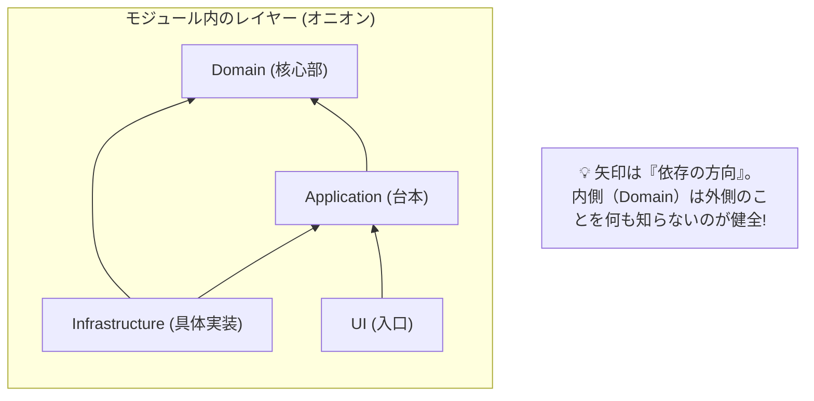
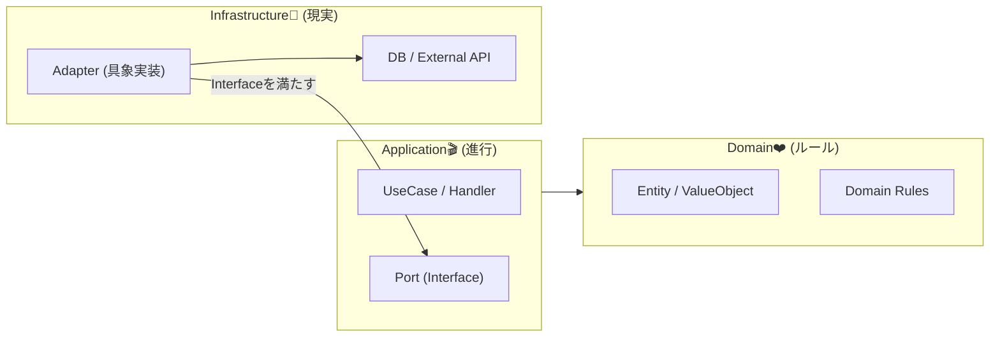
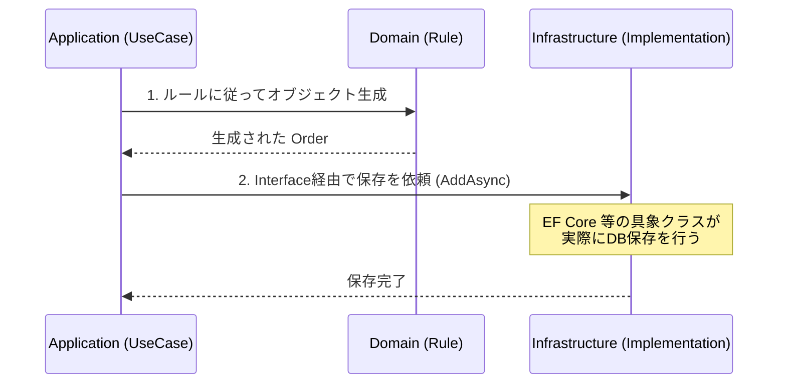

# 第07章：モジュール内レイヤー：Domain / Application / Infrastructure 🧅✨

## 今日のゴール🎯

* 「このコード、どこに置くべき？」が迷わなくなる😊
* **Domain（ルール）**と**Application（ユースケース）**と**Infrastructure（外部との接続）**を、ふわっとじゃなく“手で分けられる”ようになる✂️✨
* そして最後に、ミニECの **Ordering** モジュールで「置き場所の正解」を体験するよ🛒💕

---

## まず超ざっくりイメージ🧠💡


モジュールの中って、だいたいこの3層に分けると事故が減るの✨

* **Domain（ど真ん中）**：ビジネスのルール❤️（純度高め、外部に依存しない）
* **Application（司会進行）**：ユースケースを回す🎬（注文する・支払う等）
* **Infrastructure（現実世界担当）**：DB・API・ファイル・メールなど🌍（泥臭いの全部ここ）

この分け方は、いわゆるクリーンアーキテクチャ系の考えと相性がよくて、**内側は外側を知らない**が基本だよ😊 ([Microsoft Learn][1])



---

## 3層それぞれ「何を置く？」早見表📦✨


### 1) Domain（ルールの中心）❤️


ここに置くもの👇

* Entity / Value Object（例：`Order`, `OrderId`, `Money`）
* 集約（Aggregate）関連（※第15章で超やるけど、今は雰囲気でOK😊）
* ドメインルール（例：「注文明細が0件なら注文できない🙅‍♀️」）
* ドメインサービス（※“ルール”だけで完結する計算や判定）

置いちゃダメなもの🙅‍♀️

* `DbContext` / EF Core属性 / SQL
* `HttpClient` / API呼び出し
* 画面・Web・Consoleの事情

> Domainは「物語のルールブック」📕✨
> ルールブックに「DB接続手順」書き始めると地獄になるよ😇💥

---

### 2) Application（ユースケースを回す）🎬✨


ここに置くもの👇

* ユースケース（例：`PlaceOrder`、`CancelOrder`）
* Command/Query、Handler（CQSは第16章で気持ちよくなるやつ✍️👀）
* DTO（モジュール外へ渡す形、入力/出力の形）
* **ポート（インターフェース）**：`IOrderRepository`、`IPaymentGateway` みたいな「こういう機能がほしい」宣言📣

置いちゃダメなもの🙅‍♀️

* SQL直書き、EF Coreの具体実装
* 外部APIの認証・リトライの泥臭い処理

> Applicationは「台本＋進行役」🎭✨
> ルール自体はDomain、現実処理はInfrastructureに任せるのがコツ😊

---

### 3) Infrastructure（現実世界との接着剤）🔌🌍


ここに置くもの👇

* DBアクセス（EF Core、Dapper、SQL、Migration）
* 外部APIクライアント（決済、配送、メール送信📩）
* ファイル、時計、乱数、環境変数…“現実”の全部🧱

やることの本質👇

* Applicationが定義した **interface** を実装する（例：`IOrderRepository` の実装）
* 実行時にDIで差し込む（この「差し込み」思想が強い✨） ([Microsoft Learn][1])



---

## ありがち事故😇💥（ダメ例→良い例）


### ダメ例：DomainがDBを知ってしまう🪦

「注文保存」をDomainに書いちゃうパターン👇

```csharp
// ❌ Domain層に置いちゃダメ
public class Order
{
    public void Save()
    {
        using var db = new OrderingDbContext(); // EF Coreに依存😵
        db.Orders.Add(this);
        db.SaveChanges();
    }
}
```

何がヤバい？😵‍💫

* DomainがEF Core（外部事情）に縛られる
* テストが重くなる＆差し替えできない
* “ルールの中心”が汚れて、設計が崩れていく…🫠

---

### 良い例：Applicationに「欲しい機能」を宣言して、Infrastructureが実装する✨

```csharp
// ✅ Application層：欲しい機能（ポート）を宣言
public interface IOrderRepository
{
    Task AddAsync(Order order, CancellationToken ct);
}
```

```csharp
// ✅ Infrastructure層：実装（アダプタ）
public sealed class EfOrderRepository : IOrderRepository
{
    private readonly OrderingDbContext _db;

    public EfOrderRepository(OrderingDbContext db) => _db = db;

    public async Task AddAsync(Order order, CancellationToken ct)
    {
        _db.Orders.Add(order);
        await _db.SaveChangesAsync(ct);
    }
}
```

この分け方は、**内側が外側の具体実装を知らなくていい**構造に近づくよ😊 ([Microsoft Learn][1])
（EF Coreをどう使うかは流派があるけど、DbContext直でもRepositoryでも、**“置き場所”の考え方**が大事！） ([Microsoft Learn][2])

---

## 手を動かす（C#）⌨️✨：Orderingモジュールを3層で作るよ🛒


ここでは「注文する」ユースケースを超ミニで作るよ😊
ポイントは **“どこに置くか”** だけに集中！✨

### ① Domain：Order（ルールを守る）❤️

```csharp
namespace Ordering.Domain;

public sealed class Order
{
    private readonly List<OrderLine> _lines = new();

    public Guid Id { get; } = Guid.NewGuid();
    public IReadOnlyList<OrderLine> Lines => _lines;

    public void AddLine(string sku, int quantity)
    {
        if (string.IsNullOrWhiteSpace(sku)) throw new ArgumentException("SKU is required.");
        if (quantity <= 0) throw new ArgumentOutOfRangeException(nameof(quantity), "Quantity must be > 0.");

        _lines.Add(new OrderLine(sku.Trim(), quantity));
    }

    public void EnsurePlaceable()
    {
        if (_lines.Count == 0) throw new InvalidOperationException("Order must have at least one line.");
    }
}

public sealed record OrderLine(string Sku, int Quantity);
```

ここが大事🥰

* 「数量は正の数」みたいな**ルール**はDomainに置く❤️
* Applicationは“進行役”なので、ルール自体はDomainに寄せるのが気持ちいい✨

---

### ② Application：PlaceOrder（ユースケースを回す）🎬

```csharp
namespace Ordering.Application;

using Ordering.Domain;

public sealed record PlaceOrderRequest(IReadOnlyList<PlaceOrderLine> Lines);
public sealed record PlaceOrderLine(string Sku, int Quantity);
public sealed record PlaceOrderResult(Guid OrderId);

public interface IOrderRepository
{
    Task AddAsync(Order order, CancellationToken ct);
}

public sealed class PlaceOrderHandler
{
    private readonly IOrderRepository _repo;

    public PlaceOrderHandler(IOrderRepository repo) => _repo = repo;

    public async Task<PlaceOrderResult> HandleAsync(PlaceOrderRequest req, CancellationToken ct)
    {
        // ユースケースの進行役✨（DomainルールはDomainが持つ）
        var order = new Order();

        foreach (var line in req.Lines)
        {
            order.AddLine(line.Sku, line.Quantity);
        }

        order.EnsurePlaceable();

        await _repo.AddAsync(order, ct);

        return new PlaceOrderResult(order.Id);
    }
}
```

ここが大事🥳

* Applicationは「注文する」という“流れ”を組み立てる🎬
* DBの話はしない（Repository interfaceで“お願い”するだけ）🙏✨

---

### ③ Infrastructure：まずはInMemoryで“置き場所確認”🧠（DBは後でOK）

```csharp
namespace Ordering.Infrastructure;

using Ordering.Application;
using Ordering.Domain;

public sealed class InMemoryOrderRepository : IOrderRepository
{
    private readonly List<Order> _orders = new();

    public Task AddAsync(Order order, CancellationToken ct)
    {
        _orders.Add(order);
        return Task.CompletedTask;
    }
}
```

Infrastructureは「現実担当」なので、最初はこういう仮実装でもOK😊
（DBに差し替えるのは第12〜14章で気持ちよくやろう🗃️✨）



---

### ④ Host（実行する側）でDIして動かす🚀

```csharp
using Microsoft.Extensions.DependencyInjection;
using Ordering.Application;
using Ordering.Infrastructure;

var services = new ServiceCollection();

// Applicationが欲しい機能を、Infrastructureが提供する✨
services.AddSingleton<IOrderRepository, InMemoryOrderRepository>();
services.AddTransient<PlaceOrderHandler>();

var sp = services.BuildServiceProvider();

var handler = sp.GetRequiredService<PlaceOrderHandler>();

var result = await handler.HandleAsync(
    new PlaceOrderRequest(new[]
    {
        new PlaceOrderLine("SKU-001", 2),
        new PlaceOrderLine("SKU-777", 1),
    }),
    CancellationToken.None);

Console.WriteLine($"Order placed! 🎉 OrderId={result.OrderId}");
```

「interfaceは内側、実装は外側、実行時に差し込む」って流れが見えたら勝ち！😊✨ ([Microsoft Learn][1])

---

## ミニ演習📝✨（10〜20分でOK）

### 演習1：仕分けクイズ📦

次のクラスはどこ？（Domain / Application / Infrastructure）

* `Money`
* `PlaceOrderHandler`
* `EfOrderRepository`
* `OrderShippedEmailSender`
* `Order`

👉 自分の答えを書いたら、理由も1行つけてね😊

---

### 演習2：ルール追加❤️

Domainの`Order`にルール追加してみて！

* 「同じSKUはまとめて数量加算する」✨

  * 例：`SKU-001`を2回追加したら、行は1つで数量合計にする

---

### 演習3：外部サービスっぽいものを追加🔌

Applicationに

* `INotificationSender`（interface）を追加して
  Infrastructureに
* `ConsoleNotificationSender`（実装）を作って
  注文後に「通知」を飛ばしてみよう📩✨

---

## AI活用プロンプト例🤖✨（Copilot / Codex向け）

そのままコピペでOKだよ😊

1. **置き場所相談（最強）**

* 「この機能はDomain/Application/Infrastructureのどこに置くべき？理由も添えて。候補ファイル名も提案して」

2. **Domainルールの実装補助**

* 「Orderに“同じSKUは数量加算”ルールを追加したい。副作用が少ない実装例を提案して」

3. **interface設計**

* 「Application層に置くIOrderRepositoryのメソッド設計を、ユースケース（PlaceOrder/CancelOrder）から逆算して提案して」

4. **Infrastructure差し替え**

* 「InMemoryOrderRepositoryをEfOrderRepositoryに差し替えるときの注意点（依存関係・DTO・永続化モデルの分離）を箇条書きで」

---

## まとめ（覚える1行）📌✨

**Domainはルール❤️ / Applicationは進行🎬 / Infrastructureは現実🌍 —— “置き場所”を守るとモジュールが強くなる！** 💪😊

---

次の第8章では、この3層をさらに強くするために「参照していい方向（依存関係ルール🚦）」をカチッと決めるよ〜！✨

[1]: https://learn.microsoft.com/en-us/dotnet/architecture/modern-web-apps-azure/common-web-application-architectures?utm_source=chatgpt.com "Common web application architectures - .NET"
[2]: https://learn.microsoft.com/en-us/dotnet/architecture/microservices/microservice-ddd-cqrs-patterns/infrastructure-persistence-layer-implementation-entity-framework-core?utm_source=chatgpt.com "Implementing the infrastructure persistence layer with ..."
