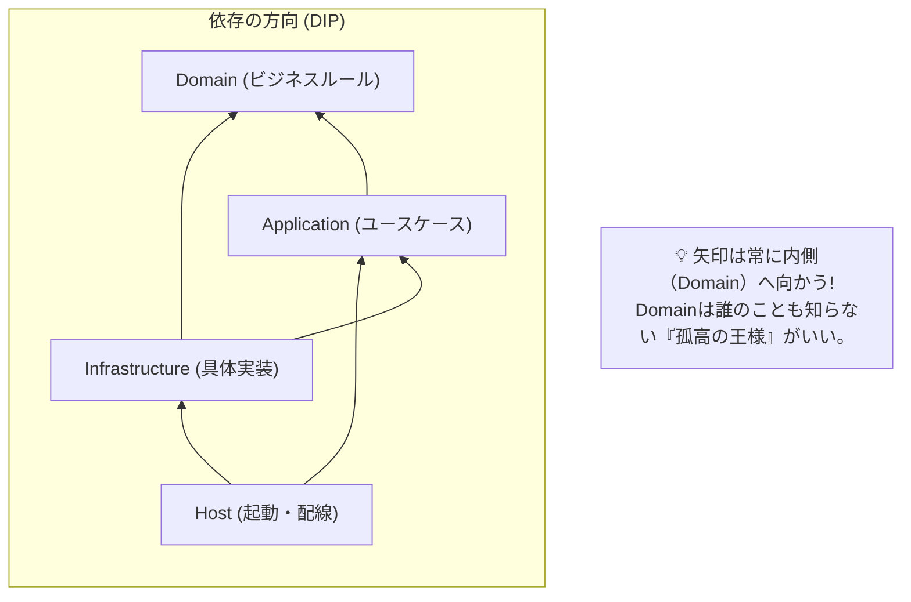
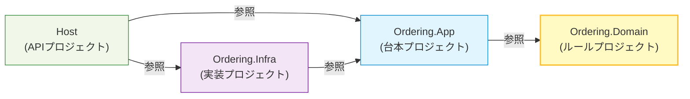
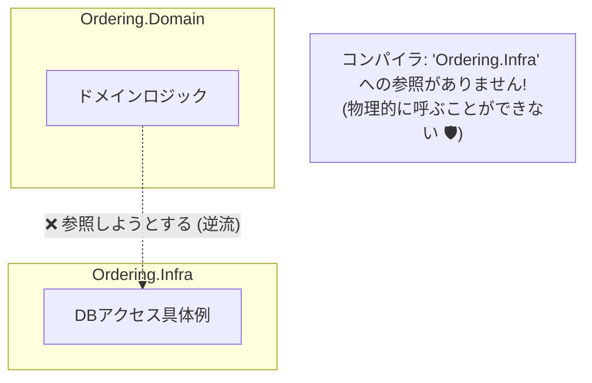

# 第08章：依存関係ルール：参照していい方向だけにする🚦📌

## 今日のゴール🎯✨

* 「どの層が、どの層を参照していいか」を**先に宣言**できるようになる😊
* そのルールを **Project参照（=コンパイル）で守る**ところまでやる💪
* 依存が逆流したときに起きる“地獄”を先に体験して、二度とやらないようにする😇🔥

---

## まずは結論：依存の矢印はこう！➡️🧅


モジュール内の基本ルールはこれでいこう👇

* **Domain**（いちばん内側）
  → できるだけ **誰にも依存しない**（ビジネスルールだけ✨）
* **Application**（ユースケース）
  → **Domainにだけ依存**してOK
* **Infrastructure**（DB/外部API/フレームワーク）
  → **Application・Domainに依存**してOK（実装の置き場🧰）
* **Host**（Web/Consoleなど起動する側）
  → **全部を組み立てる側**（配線係🔌）

イメージ👇

* Host ➡️ Infrastructure ➡️ Application ➡️ Domain
  （矢印は “参照していい方向” だよ🚦）



※今の最新では **.NET 10（LTS）** が 2025/11/11 リリースで、サポートは 2028/11/14 までだよ📅✨ ([Microsoft][1])
※C# は **C# 14** が最新で、.NET 10 でサポートされてるよ🧡 ([Microsoft Learn][2])

---

## まずダメ例😇💥（やりがち）

### ダメ例1：Domain が “外側の詳細” を参照しちゃう

* Domain が **EF Core** を参照する
* Domain が **HttpClient** を叩く
* Domain が **設定（Configuration）** や **ログ（ILogger）** を触る

これをやると…👇

* 「ビジネスルールをちょっと直したいだけ」なのに **DBやWebの都合に引きずられる**😵
* Domain のテストが重くなる（=遅い・不安定）🧪💦
* “変更が怖い”モノリスに逆戻り😇

### ダメ例2：Application が Infrastructure の実装クラスを new しちゃう

* Application が `new SqlOrderRepository()` とかし始める😇
  → その瞬間、Application が DB の種類に縛られる🔒

---

## 良い例😎✨（依存の逆流を止める考え方）

コツはこれ👇

### ✅「変わりやすいもの」を外へ追い出す🏃‍♀️💨

* DB（EF Core）・外部API・ファイル・フレームワーク
  → **Infrastructure**へ

### ✅「変えたくない核」を内側に閉じ込める🔒✨

* ルール、判定、状態遷移、計算
  → **Domain**へ

---

## 依存OK/NG 早見ルール🚦

* Domain → Application：❌（逆流！）
* Domain → Infrastructure：❌（地獄への扉🚪🔥）
* Application → Domain：✅
* Infrastructure → Application：✅
* Infrastructure → Domain：✅
* Host →（必要なもの全部）：✅（ただし“触り方”は第10章で綺麗にするよ🪟）

---

## 手を動かす（C#）⌨️🛠️：参照ルールを Project で固定する

例として Ordering モジュールをこう分けるよ📦✨

* `Modules/Ordering/Ordering.Domain`
* `Modules/Ordering/Ordering.Application`
* `Modules/Ordering/Ordering.Infrastructure`
* `Host`（Web でも Console でもOK）

### ① Project 参照はこう貼る🚦

* Ordering.Application ➡️ Ordering.Domain を参照
* Ordering.Infrastructure ➡️ Ordering.Application を参照（結果として Domain も見える）
* Domain は **何も参照しない**（ここ大事💎）



---

## コードで “逆流しない形” を触ってみよ😊🧩

### Ordering.Domain（ルールだけ）🧡

```csharp
namespace Ordering.Domain;

public readonly record struct OrderId(Guid Value);

public sealed class Order
{
    public OrderId Id { get; }
    public bool IsPaid { get; private set; }

    public Order(OrderId id)
    {
        Id = id;
        IsPaid = false;
    }

    public void MarkAsPaid()
    {
        if (IsPaid) return; // 二重払い防止（超ミニ不変条件）
        IsPaid = true;
    }
}
```

### Ordering.Application（ユースケース＋“必要な口”）🪟

```csharp
using Ordering.Domain;

namespace Ordering.Application;

// “DBに保存する” という要求だけ定義（実装は知らない）
public interface IOrderRepository
{
    Task SaveAsync(Order order, CancellationToken ct);
}

public sealed class PayOrderService
{
    private readonly IOrderRepository _repo;

    public PayOrderService(IOrderRepository repo)
    {
        _repo = repo;
    }

    public async Task PayAsync(OrderId id, CancellationToken ct)
    {
        // 本当は取得→検証…だけど今日は依存関係が主役なので省略😊
        var order = new Order(id);
        order.MarkAsPaid();

        await _repo.SaveAsync(order, ct);
    }
}
```

### Ordering.Infrastructure（実装の置き場）🧰

※今日はわかりやすく “インメモリ実装” にするね（DB実装は第12章以降で本格的に🗃️✨）

```csharp
using Ordering.Application;
using Ordering.Domain;

namespace Ordering.Infrastructure;

public sealed class InMemoryOrderRepository : IOrderRepository
{
    private readonly Dictionary<Guid, Order> _store = new();

    public Task SaveAsync(Order order, CancellationToken ct)
    {
        _store[order.Id.Value] = order;
        return Task.CompletedTask;
    }
}
```

### Host（組み立て係🔌）

```csharp
using Ordering.Application;
using Ordering.Domain;
using Ordering.Infrastructure;

var repo = new InMemoryOrderRepository();
var service = new PayOrderService(repo);

await service.PayAsync(new OrderId(Guid.NewGuid()), CancellationToken.None);
Console.WriteLine("Paid ✅");
```

✅ここまでで「内側（Application/Domain）が外側（Infrastructure）を知らない」状態ができたよ🎉

---

## “逆流” をわざと起こしてみる😇🔥（学習にめっちゃ効く）

### 実験：Domain に Infrastructure を使わせようとしてみて？

たとえば Domain 側で `InMemoryOrderRepository` を `new` しようとすると…

* Domain プロジェクトは Infrastructure を参照してないので **コンパイルできない**👏✨
  → これが「Project参照で守る」の最強ポイントだよ🚦💪



---

## ミニ演習📝✨（5分）

### Q1：OK/NG 判定してみてね🚦

1. Application が Domain の `Order` を使う
2. Domain が `HttpClient` を使う
3. Infrastructure が Application の `IOrderRepository` を実装する
4. Application が `SqlOrderRepository` を `new` する
5. Host が全部を組み立てる

（答え：1✅ 2❌ 3✅ 4❌ 5✅）

### Q2：修正チャレンジ💪

次のコードの“悪いところ”を直してね👇

* Application に `new SqlOrderRepository()` が出てきたら、**I/F を介して渡す**形にする🪄

---

## AI活用プロンプト例🤖✨

コピペして使ってOKだよ😊

1. 「依存ルールをチェックして！」

* 「このソリューション構成（Domain/Application/Infrastructure/Host）で、依存関係が逆流してないか確認したい。各プロジェクトが参照してよい先を表にして、NG参照が起きやすいパターンも挙げて。」

2. 「逆流を直すリファクタ案ちょうだい！」

* 「Application が Infrastructure を new してしまっている。DIP の形に直す手順と、最小のコード差分例を出して。」

3. 「アーキテクチャテストの雛形も！」（第29章の予告🔍）

* 「Domain が EF Core や Web に依存してないことをテストで保証したい。ArchUnitNET か NetArchTest で最小のテスト例を作って。」

※ArchUnitNET は NuGet で配布されてるよ（例：TngTech.ArchUnitNET）。 ([nuget.org][3])
※NetArchTest.Rules もあるけど更新は古めなので、採用は好みでOKだよ（雰囲気を掴むには十分👍）。 ([nuget.org][4])

---

## まとめ（覚える1行）📌✨

**「依存は内向き。変わりやすい詳細は外へ。」**🚦🧅✨

次の第9章は、このルールをさらに強くするために
**interface（境界）と DI（渡し方）**でガッチリ守っていくよ〜🧩🔌💕

[1]: https://dotnet.microsoft.com/ja-jp/platform/support/policy/dotnet-core?utm_source=chatgpt.com ".NET および .NET Core の公式サポート ポリシー"
[2]: https://learn.microsoft.com/en-us/dotnet/csharp/whats-new/csharp-14?utm_source=chatgpt.com "What's new in C# 14"
[3]: https://www.nuget.org/packages/TngTech.ArchUnitNET?utm_source=chatgpt.com "TngTech.ArchUnitNET 0.13.1"
[4]: https://www.nuget.org/packages/NetArchTest.Rules/?utm_source=chatgpt.com "NetArchTest.Rules 1.3.2"
