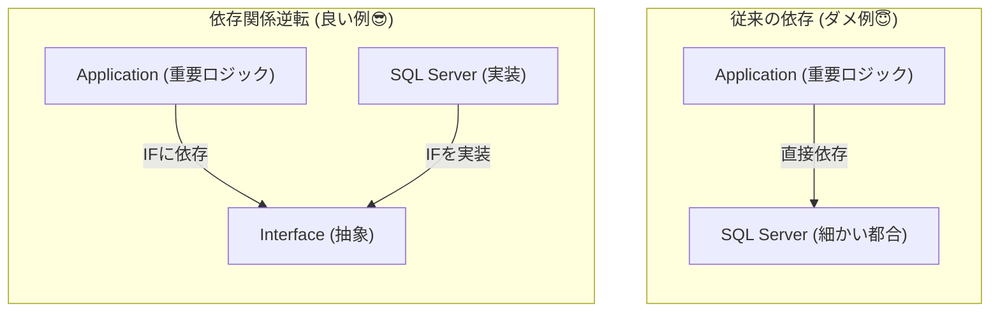
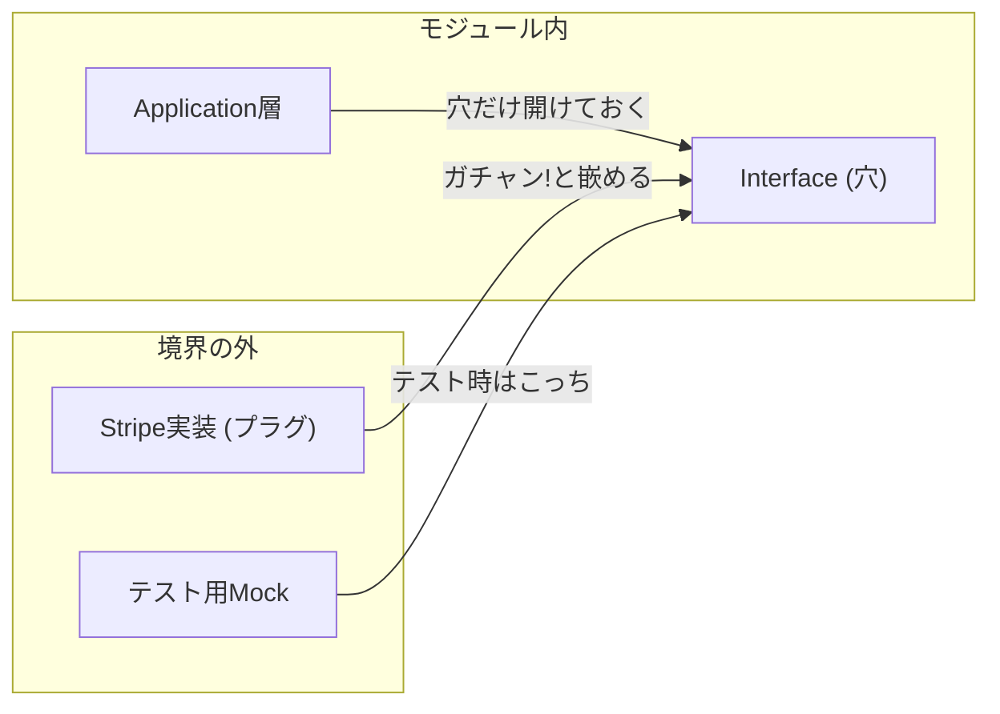
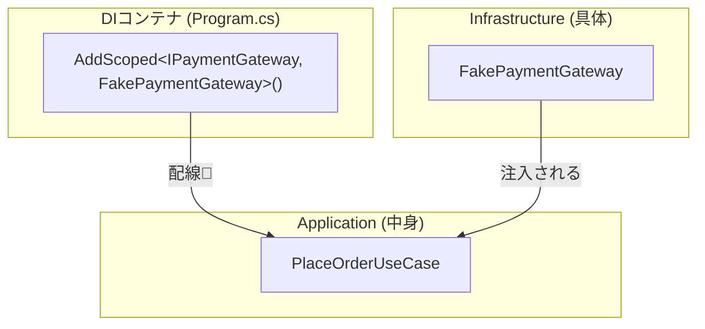

# 第09章：DIP/DI超入門：境界はinterfaceで守る🧩🔌

※いまの最新は **C# 14 + .NET 10** だよ〜！🎀（この章のコードもその前提でOK） ([Microsoft Learn][1])

---

## 今日のゴール🎯💖

* 「DIPってなに？DIってなに？」を **ごちゃ混ぜにしない** で説明できるようになる🧠✨
* **Application層がInfrastructure層を直接newしない** 形に直す🛠️🚫
* interface + コンストラクタ注入で、**差し替え** と **テスト** がラクになる体験をする🧪🌈

---

## まず用語をふわっと整理📚🐣

### 1) DIP（依存関係逆転）ってなに？🔄

🧩

「大事なルール（中心のロジック）」が「細かい都合（DBや外部API）」に引っ張られないようにする考え方だよ😊✨
つまり、**“「中心ロジックは詳細を知らない」を守るのがDIP〜！💪🧡



### DI（依存性注入）って？🔌

### DI（依存性注入）って？🔌

DIPを実現しやすくする **配線テク** だよ〜！
「必要なものは自分でnewしないで、外から渡してもらう」ってやつ😊🎁 ([Microsoft Learn][2])

---

## なんでモジュラーモノリスで超効くの？🏠🧩

モジュール内でも外でも、**境界の外（DB/外部API/メール送信/決済など）** は変わりやすいの🥺💦
そこをinterfaceで“コンセント化🔌”しておくと…

* 実装を差し替えても、中心のロジックは無傷😎✨
* テストではニセモノ実装に差し替えできて速い🧪⚡
* 依存関係ルール（第8章）も守りやすい🚦💖



---

## まずダメ例😇💥（境界が溶ける）

「注文する」ユースケースが、外部決済を直接newしちゃう例👇

```csharp
public sealed class PlaceOrderUseCase
{
    public async Task PlaceAsync()
    {
        var payment = new StripePaymentClient("api-key"); // ← 直new 😇💥
        await payment.ChargeAsync(1000);
        // ...
    }
}
```

これのつらさ😭🍂

* テストで決済が走る（怖い！遅い！）😱
* 決済ライブラリ変更でロジックが巻き添え😵‍💫
* Application層が“外の詳細”に依存しちゃう

---

## 良い例😎✨（interfaceで境界を作る）

やることはシンプル！

1. **Application側に「必要な機能」のinterfaceを置く**🧩
2. **実装はInfrastructure側**に置く🏗️
3. **UseCaseはinterfaceだけ知る**😊
4. 入口（Host/Program.cs）で配線🔌✨（DI）

---

## 手を動かす（C#）⌨️🎀

ここでは「決済」を題材にするよ！（DBでもメールでも同じノリでできるよ〜）💌🗃️

## 1) Application層：境界interfaceを作る🧩

（例）Ordering.Application に置くイメージ✨

```csharp
public interface IPaymentGateway
{
    Task<PaymentResult> ChargeAsync(
        int amountYen,
        CancellationToken ct);
}

public sealed record PaymentResult(
    bool IsSuccess,
    string? FailureReason = null);
```

ポイント💡

* interfaceは「どうやって」じゃなくて **「何ができる？」** だけを書く😊✨
* ここには外部SDKの型を入れない（後で地獄になる）😇🔥

---

## 2) Application層：UseCaseはinterfaceに依存する😎

```csharp
public sealed class PlaceOrderUseCase
{
    private readonly IPaymentGateway _payment;

    public PlaceOrderUseCase(IPaymentGateway payment)
        => _payment = payment;

    public async Task PlaceAsync(int totalYen, CancellationToken ct)
    {
        var result = await _payment.ChargeAsync(totalYen, ct);

        if (!result.IsSuccess)
            throw new InvalidOperationException(
                $"Payment failed: {result.FailureReason}");

        // ここに「注文確定」などの中心ロジックが続く想定✨
    }
}
```

ここで大事なのはこれ📌

* UseCaseは **IPaymentGatewayしか知らない**（決済の詳細に触れない）🧠✨
* 「newが消えた」＝差し替え可能になった🎉

---

## 3) Infrastructure層：実装を書く🏗️🔧

（例）Ordering.Infrastructure に置くイメージ✨
※ここは“外の詳細”OKゾーンだよ😊

```csharp
public sealed class FakePaymentGateway : IPaymentGateway
{
    public Task<PaymentResult> ChargeAsync(
        int amountYen,
        CancellationToken ct)
    {
        // 本物のSDK呼び出しの代わりに、今はダミー実装でOK👌
        if (amountYen <= 0)
            return Task.FromResult(new PaymentResult(false, "amount must be positive"));

        return Task.FromResult(new PaymentResult(true));
    }
}
```

---

## 4) 配線する（DI）🔌✨：Program.csで登録

ASP.NET Core では、サービスを登録して、コンストラクタに注入してもらうのが基本だよ😊
（組み込みのDIコンテナがこれをやってくれる） ([Microsoft Learn][2])

```csharp
var builder = WebApplication.CreateBuilder(args);

builder.Services.AddScoped<IPaymentGateway, FakePaymentGateway>();
builder.Services.AddScoped<PlaceOrderUseCase>();

var app = builder.Build();

app.MapPost("/orders", async (PlaceOrderUseCase useCase, CancellationToken ct) =>
{
    await useCase.PlaceAsync(totalYen: 1000, ct);
    return Results.Ok(new { message = "order placed!" });
});

app.Run();
```



### AddScoped / AddSingleton / AddTransientって？🧠🧁

* **Scoped**：リクエスト中は同じインスタンス（Webでよく使う）
* **Singleton**：アプリ中ずっと同じ（状態持つと危険なこと多い⚠️）
* **Transient**：毎回new（軽いもの向け）

公式の説明もこの考え方で書かれてるよ📝✨ ([Microsoft Learn][3])

---

## 5) テストがめちゃラクになる🧪🌈（DIコンテナ不要でもOK）

UseCaseにニセモノを渡すだけでテストできるよ〜！🎉

```csharp
public sealed class AlwaysFailPaymentGateway : IPaymentGateway
{
    public Task<PaymentResult> ChargeAsync(int amountYen, CancellationToken ct)
        => Task.FromResult(new PaymentResult(false, "card declined"));
}

public static class PlaceOrderTests
{
    public static async Task PaymentFails_Throws()
    {
        var useCase = new PlaceOrderUseCase(new AlwaysFailPaymentGateway());

        try
        {
            await useCase.PlaceAsync(1000, CancellationToken.None);
            throw new Exception("Expected exception but not thrown");
        }
        catch (InvalidOperationException)
        {
            // success 🎉
        }
    }
}
```

これがDIの気持ちよさだよ〜🥹💖
「配線（注入）」さえできれば、中心ロジックがめっちゃ守られる！

---

## よくある落とし穴🐣⚠️

## 罠1：interface作りすぎ問題😵‍💫

目安はこれ👇

* **外に出るもの（DB/外部API/時刻/乱数/ファイル/メール）** はinterface候補👍
* 純粋計算（税計算など）まで全部interface化しないでOK🙆‍♀️✨

## 罠2：Service Locatorしちゃう😇

IServiceProviderから毎回Resolveするやつは、依存が見えなくなって事故りやすいよ〜💥
DIの基本は **コンストラクタで受け取って依存を見える化** だよ😊 ([Microsoft Learn][4])

## 罠3：組み込みコンテナで足りる？🥺

多くのアプリは **組み込みDIで十分** ってガイドにもあるよ✨ ([Microsoft Learn][4])

---

## ミニ演習📝🎀（10〜20分）

## 演習A：IClockで「現在時刻」を差し替えよう⏰✨

1. interface IClock（Nowを返す）をApplicationに作る
2. UseCase内のDateTime.Nowを消してIClockに置き換える
3. テストでは固定時刻のFakeClockを渡す

できたら「期限切れ判定」がテストで超ラクになるよ😊💖

## 演習B：決済を2種類にしてみる（おまけ）🔑💳

「開発用はFake、本番はReal」みたいに複数実装を扱いたいときは **キー付きサービス** という仕組みもあるよ✨ ([Microsoft Learn][5])
（今は“へぇ〜”でOK！第10章以降で活きてくる🥰）

---

## AI活用プロンプト例🤖✨（コピペでOK）

* 「IPaymentGatewayのinterfaceと、Fake実装を作って。例外じゃなくResultで返す設計案も欲しい」🧩
* 「PlaceOrderUseCaseをテストしやすい形にリファクタして。依存はコンストラクタ注入で」🧪
* 「AddScoped/AddSingleton/AddTransientのどれが良いか、理由も含めて提案して」🔌

---

## まとめ（覚える1行）📌💖

**「中心ロジックは具象に依存しない。interfaceに依存して、newは入口（配線）でやる」** 🧩🔌✨

---

次の第10章は、この“interfaceの窓口”を **モジュール間の公式な窓口（公開API）** に育てていくよ〜📣🪟💖

[1]: https://learn.microsoft.com/en-us/dotnet/csharp/whats-new/csharp-14?utm_source=chatgpt.com "What's new in C# 14"
[2]: https://learn.microsoft.com/en-us/aspnet/core/fundamentals/dependency-injection?view=aspnetcore-10.0&utm_source=chatgpt.com "Dependency injection in ASP.NET Core"
[3]: https://learn.microsoft.com/ja-jp/dotnet/core/extensions/dependency-injection?utm_source=chatgpt.com "NET での依存関係の挿入"
[4]: https://learn.microsoft.com/en-us/dotnet/core/extensions/dependency-injection-guidelines?utm_source=chatgpt.com "Dependency injection guidelines - .NET"
[5]: https://learn.microsoft.com/ja-jp/aspnet/core/fundamentals/dependency-injection?view=aspnetcore-10.0&utm_source=chatgpt.com "ASP.NET Core での依存関係の挿入"
