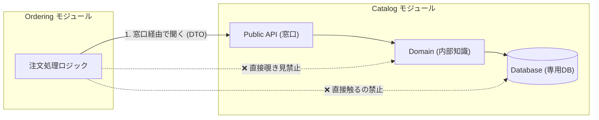
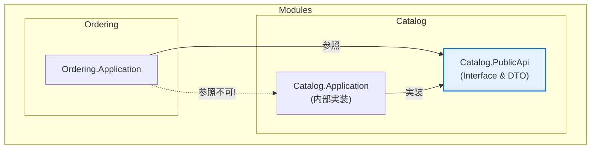

# 第10章：公開API設計：モジュール間は“窓口”だけで話す📣🪟

## 第10章　公開API設計：モジュール間は“窓口”だけで話す📣🪟


### 今日のゴール🎯✨

* モジュール同士が **“中身を覗かず”** に協力できるようにする😊
* 「参照地獄」「依存の雪だるま☃️」にならない **窓口（公開API）** を作れるようになる
* DTO（受け渡し用データ）を使って **ドメインやDBの事情を漏らさない** ようにする🧯

---

## 1) “窓口ルール”ってなに？🪟🙂

モジュールって「お店」だと思ってね🏪✨

* 店の裏（Domain / DB / EF Core / 内部クラス）には入らせない🙅‍♀️
* 代わりに、受付（公開API）だけ用意して「注文はここでお願いします！」ってする📣

この“受付”があると、モジュールの中を自由に改装しても（リファクタしても）他モジュールが壊れにくいよ😊
「モジュールは自分のデータ・ロジック・APIを持つ」「外に見せる面は狭く」が基本方針だよ。([Dometrain][1])



---

## 2) まずダメ例😇💥（依存が雪だるま☃️）

### やりがちパターン

Ordering が Catalog の “中身” を直接触る👇

```csharp
// Ordering 側なのに…
using Catalog.Infrastructure; // ← えっ
using Catalog.Domain;         // ← えっ

public class PlaceOrderService
{
    private readonly CatalogDbContext _db;

    public PlaceOrderService(CatalogDbContext db) // ← CatalogのDBに直結
    {
        _db = db;
    }

    public async Task PlaceAsync(Guid productId)
    {
        var product = await _db.Products.FindAsync(productId); // ← テーブル構造依存
        if (product is null) throw new Exception("not found");

        // product の内部ルールにも依存しがち…
        // Order 作成処理…
    }
}
```

### 何がヤバいの？😵‍💫

* Catalog がテーブル名やEntity構造を変えた瞬間に Ordering が壊れる💥
* Ordering が Catalog の事情（EF/DB/ドメイン）を知りすぎる👀
* 直参照が増えるほど、修正が怖くなる＆影響範囲が読めなくなる☃️

---

## 3) 良い例😎✨（公開API＝“窓口”だけ触る）

Ordering は **Catalog.PublicApi** だけを見る👀✨
Catalog の中は「どう実装してるか」知らなくてOK🙆‍♀️

### 目指す依存関係（超ざっくり）

* Ordering → Catalog.PublicApi ✅
* Ordering → Catalog.Domain / Infrastructure ❌
* Ordering → CatalogのDbContext ❌

---

## 4) 公開APIの“3点セット”🎁🪟

公開APIはだいたいこの3つで組むと安定するよ😊

1. **窓口インターフェース（Facade）**
2. **DTO（Request/Response）**
3. （必要なら）**イベント（後で非同期連携したい時）**

> 「外に見せる面は狭く」「内部型は隠す」がコツだよ。([Dometrain][1])

---

## 5) 手を動かす（ミニEC：Catalog の窓口を作る）⌨️🛠️

### 5-1) プロジェクト構成（イメージ）📦

* Modules

  * Catalog

    * Catalog.PublicApi   👈 外に見せるのはココだけ🪟
    * Catalog.Application
    * Catalog.Domain
    * Catalog.Infrastructure
  * Ordering

    * Ordering.Application（ここが Catalog.PublicApi を呼ぶ）




---

### 5-2) Catalog.PublicApi：窓口とDTOを作る🪟✨

```csharp
namespace Catalog.PublicApi;

// “読み取り窓口”の例（他モジュールが欲しい情報だけ！）
public interface ICatalogQuery
{
    Task<ProductSummaryDto?> GetProductSummaryAsync(
        ProductIdDto productId,
        CancellationToken ct = default);
}

// DTOは “素朴なデータ” にする（EntityやDbContextは絶対出さない🙅‍♀️）
public readonly record struct ProductIdDto(Guid Value);

public sealed record ProductSummaryDto(
    ProductIdDto Id,
    string Name,
    int PriceYen,
    bool IsOnSale);
```

ポイント😊

* **DTOは小さく・目的別に**（なんでも詰め込まない）
* “Catalogのドメイン型” を外に出さない（後で自由に変えたいから）✨
* これは REST でも RPC でも同じ考え方で、**ドメインをAPIにそのまま漏らさない** が大事だよ。([Microsoft Learn][2])

---

### 5-3) Catalog.Application：中で実装する（でも外からは見えない）🧅

```csharp
using Catalog.PublicApi;

namespace Catalog.Application;

// internal にして “外から触れない” を徹底💪
internal sealed class CatalogQuery : ICatalogQuery
{
    private readonly IProductReadModel _readModel;

    public CatalogQuery(IProductReadModel readModel)
    {
        _readModel = readModel;
    }

    public async Task<ProductSummaryDto?> GetProductSummaryAsync(
        ProductIdDto productId,
        CancellationToken ct = default)
    {
        var p = await _readModel.FindAsync(productId.Value, ct);
        if (p is null) return null;

        return new ProductSummaryDto(
            new ProductIdDto(p.Id),
            p.Name,
            p.PriceYen,
            p.IsOnSale);
    }
}

// 読み取り専用の内部ポート（Infrastructureで実装してOK）
internal interface IProductReadModel
{
    Task<ProductReadModel?> FindAsync(Guid productId, CancellationToken ct);
}

internal sealed record ProductReadModel(
    Guid Id,
    string Name,
    int PriceYen,
    bool IsOnSale);
```

---

### 5-4) Host（起動側）でDI登録：AddCatalogModule みたいにまとめる🧩🔌

```csharp
using Microsoft.Extensions.DependencyInjection;

namespace Catalog;

public static class CatalogModule
{
    public static IServiceCollection AddCatalogModule(this IServiceCollection services)
    {
        // PublicApiのインターフェースを、内部実装に結びつける
        services.AddScoped<Catalog.PublicApi.ICatalogQuery, Catalog.Application.CatalogQuery>();

        // internal ポートの実装（例：DB読み取り）もここで登録
        services.AddScoped<Catalog.Application.IProductReadModel, Catalog.Infrastructure.ProductReadModelEf>();

        return services;
    }
}
```

「他モジュールに公開するのは **ICatalogQuery だけ**」って状態を作れるのが気持ちいいよ😆🪟

---

### 5-5) Ordering.Application：Catalog.PublicApi だけ呼ぶ📣

```csharp
using Catalog.PublicApi;

namespace Ordering.Application;

public sealed class PlaceOrderService
{
    private readonly ICatalogQuery _catalog;

    public PlaceOrderService(ICatalogQuery catalog)
    {
        _catalog = catalog;
    }

    public async Task PlaceAsync(Guid productId, CancellationToken ct = default)
    {
        var summary = await _catalog.GetProductSummaryAsync(new ProductIdDto(productId), ct);
        if (summary is null) throw new InvalidOperationException("商品が見つからないよ🥲");

        // ここから先は Ordering の世界で完結！
        // CatalogのDBもEntityも知らなくてOK🙆‍♀️
        // Order作成…
    }
}
```

---

## 6) 公開API設計の“鉄板ルール”🚦✅

### ✅ ルール1：公開面は “細く短く”🪡

* メソッド数を増やしすぎない
* 「なんでも取れる」「なんでも更新できる」窓口はだいたい事故る😇

### ✅ ルール2：Entity / DbContext / Repository を外に出さない🙅‍♀️

* 外に出した瞬間、それが“仕様”になって固定される💥
* DTOで受け渡し、内部は自由に変えられるようにする✨([Microsoft Learn][2])

### ✅ ルール3：同期連携は最小限に（依存チェーンに注意）⛓️😵

* A→B→C→D… ってつながると遅い＆壊れやすい
* “どうしても必要な分だけ” 同期で、あとはイベント化を検討🔔

### ✅ ルール4：ルールは自動テストで守る（後で崩れるから）🧪🛡️

「モジュール同士は参照しない／公開APIだけ呼ぶ」みたいな制約は、アーキテクチャテストで守るのが強いよ💪
（後の章でやるけど、こういう思想があるよ〜って覚えとこ😊）([Milan Jovanović][3])

---

## 7) ミニ演習📝✨

### 演習A：Ordering の“窓口”を作ってみよう🪟

* Ordering.PublicApi を作る
* `IOrderingCommand` を定義して、`PlaceOrderAsync` を置く
* Request/Response DTO を作る（例：`PlaceOrderRequestDto` / `PlaceOrderResultDto`）

### 演習B：Catalog の窓口を “目的別に分割” してみよう🧠

* `ICatalogQuery` の中に、用途が違うDTOが混ざってきたら…

  * `ICatalogProductQuery`
  * `ICatalogPriceQuery`
    みたいに分けて、窓口をスッキリさせよう✨

---

## 8) AI活用プロンプト例🤖✨（コピペでOK！）

### ① 窓口インターフェース案を出してもらう🪟

* 「Catalogモジュールが他モジュールに提供すべき最小のQuery APIを、C#のinterfaceで提案して。DTOも提案して。EntityやDbContextを外に出さないで。」

### ② DTO設計をレビューしてもらう🔍

* 「このDTOはドメイン知識を漏らしてない？過剰に情報を渡してない？公開APIとして破壊的変更になりそうな点を指摘して。」

### ③ “ダメ例→良い例”の変換を頼む😇➡️😎

* 「このコードは他モジュールのDbContextを直参照してる。公開API（Facade + DTO）経由に直して。依存関係も整理して。」

---

## まとめ（覚える1行）📌💖

**「モジュール間は“窓口（公開API）”だけで話す。中身（Domain/DB）は絶対に触らせない🪟」**

---

必要なら次は、**「公開APIの粒度（どこまでDTOを分ける？同期/非同期どっち？）」**を、ミニECのユースケース（注文・支払い・発送）で一緒に設計していこう😊🛒✨

[1]: https://dometrain.com/blog/getting-started-with-modular-monoliths-in-dotnet/?srsltid=AfmBOopXiToGXHc8tObuD59i2vY6cdYk5gx4P1pGeIiKzQOPwibTtVUp&utm_source=chatgpt.com "Learn how to build Modular Monoliths in .NET - Dometrain"
[2]: https://learn.microsoft.com/en-us/azure/architecture/microservices/design/api-design?utm_source=chatgpt.com "API Design - Azure Architecture Center - Microsoft Learn"
[3]: https://www.milanjovanovic.tech/blog/shift-left-with-architecture-testing-in-dotnet?utm_source=chatgpt.com "Shift Left With Architecture Testing in .NET"
