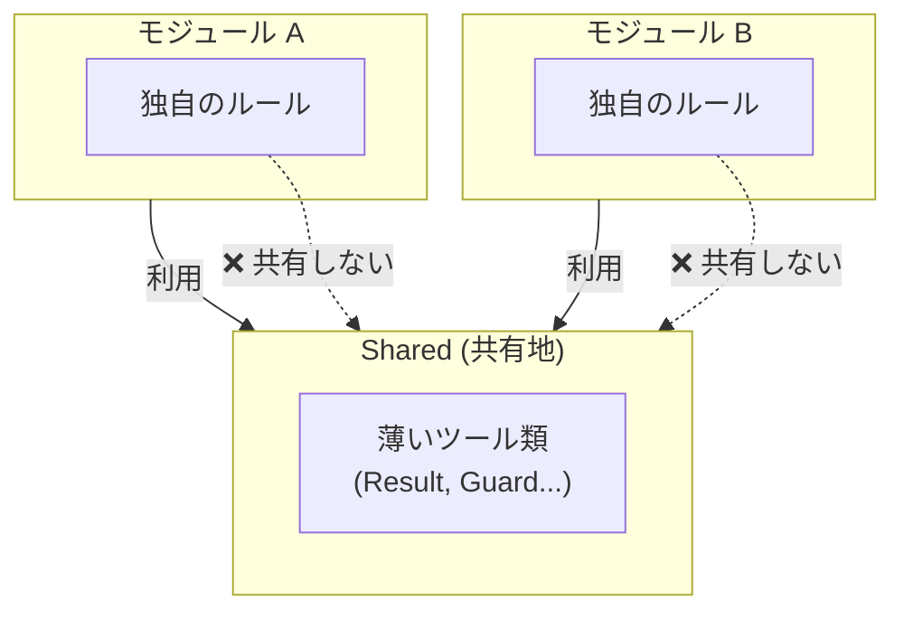
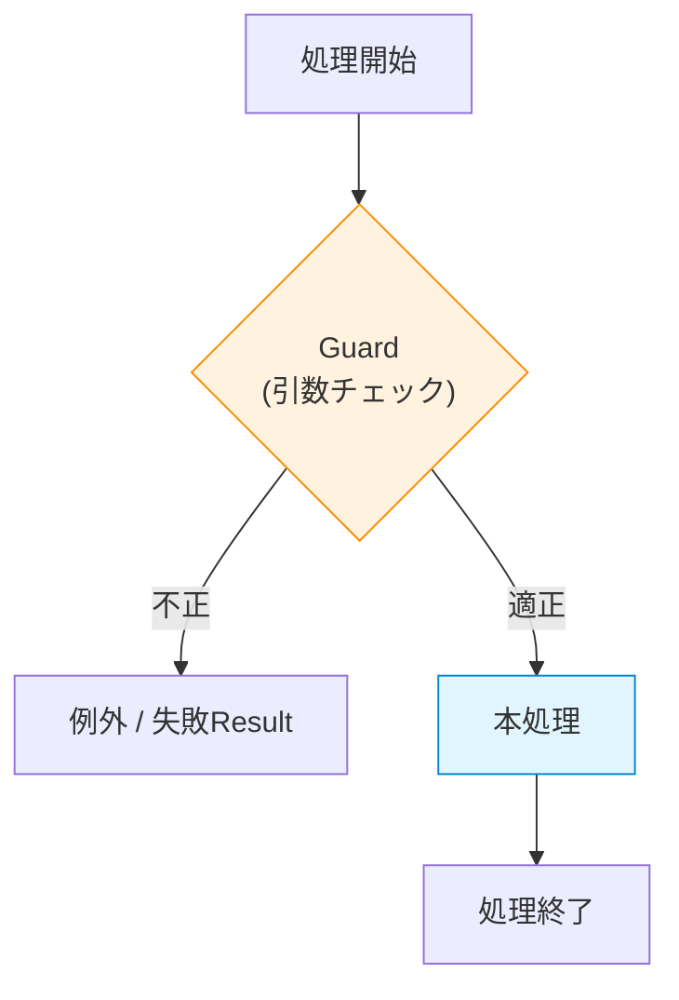

# 第11章：Sharedの扱い：共有は“最小”が正解⚠️🍱

## 第11章　Sharedの扱い：共有は“最小”が正解⚠️🍱


## 今日のゴール🎯

* **Sharedを「便利箱」にしないルール**を作れるようになる🙅‍♀️🧰
* **Sharedに入れてOK/NG**を判断できるようになる✅❌
* “Shared地獄”を回避しつつ、ちゃんと再利用もできる形にする✨

（いまの最新環境だと **.NET 10 / C# 14 / Visual Studio 2026** が軸だよ🪟🛠️）([マイクロソフトサポート][1])

---

## まずダメ例😇 → こうしてSharedが腐る💥

### 😇ダメ例あるある

* `Shared/Utils` に **なんでも**入れる（文字列整形、日付、拡張メソッド、DBヘルパ…）
* `Shared/DTO` に **全部のDTO**を置く（注文DTO、商品DTO、会員DTO…）
* `Shared/Enums` に **ドメインの状態**を置く（`OrderStatus` とか）
  → こうなると「Sharedを変える＝全モジュールが壊れる」になりがち😵‍💫💣

### 😎なにが問題？


Sharedは **みんなが参照する中心**になりやすいから、肥大化すると「結合の塊」になるの。
DDDでは、大きいモデルを **Bounded Context に分割して、相互関係を“明示”する**のが超重要って話になってるよ📌 ([DevIQ][2])



---

## 1) Sharedに入れていいもの✅ / ダメなもの🙅‍♀️


### ✅入れていい（だいたいコレだけで十分🍱）


**ポイント：ドメインの匂いがしない、安定してる、依存が薄い**

* **超基礎プリミティブ**

  * `Result<T>` / `Error`（技術的な成功・失敗表現）
  * `Guard`（引数チェックの共通）
  * “型安全ID”の土台（例：`StrongId<T>`）
* **横断関心の“薄い”抽象**（薄い＝業務用語がない）

  * `IClock`（時間の取得）みたいなやつ⏰
* **Sharedに置くなら「小さく・壊れにくく・テストしやすく」**が絶対条件🧪✨



### 🙅‍♀️入れちゃダメ（ここが地雷原💣）


* **ドメイン知識そのもの**

  * 例：`OrderStatus`, `PaymentMethod`, `ShippingAddress` など（OrderingのものはOrderingへ！）
* **モジュール間連携のDTOをSharedに集約**

  * 連携は第10章の「公開API（窓口）」でやるのが筋🪟📣（Sharedは逃げ場にしない！）
* **インフラ実装の共通化**（DB、HTTP、EFの共通リポジトリ…）

  * 依存が増えてSharedが“巨大な土台”になって死ぬ😇

---

## 迷ったときの判断フロー🔍✨（これだけ覚えて）


次の質問に「YES」が多いほど Shared に入れない方が安全だよ🛡️

1. **名前にドメイン用語が入ってる？**（Order, Catalog, User…）
   → YESなら **そのモジュールへ** 🧱
2. **変更頻度が高い？**
   → YESなら共有しない（共有＝調整コスト増）📈
3. **参照先（依存）が重い？**（EF/HTTP/外部SDK…）
   → YESならSharedは避ける（薄く保てない）🚫
4. **本当に2モジュール以上で“同じ意味”で使う？**
   → 「似てるけど意味が違う」なら分ける（Bounded Contextの考え方🧱🌍）

---

## 共有のやり方は3種類🍱✨（おすすめ順）


1. **あえて複製する（Copy）**📄✨

   * 小さいコードなら、共有より複製の方が安全なこと多いよ（結合が増えない）
2. **モジュールの公開APIで渡す（Published Languageっぽいやつ）🪟📦**

   * “窓口DTO”は **そのモジュールが責任を持つ**（Sharedに置かない）
3. **Shared Kernel（最終手段）⚠️**

   * 複数の境界で“共通の核”を共同管理するやつ。**範囲は極小に**が鉄則([DevIQ][2])

---

## 手を動かす（C#）⌨️✨：Shared.Primitives を“最小”で作る

ここでは Shared を **2つに分ける発想**でいくよ（最初は1個でもOKだけど、考え方が大事😊）

* `Shared.Primitives`：薄い土台（依存ほぼ無し）
* （必要になったら）`Shared.Abstractions`：薄いinterface類

### 1) Shared.Primitives を追加する🛠️

* ソリューションに **Class Library** を追加
* 名前：`Shared.Primitives`
* ターゲット：`.NET 10`（いまはC# 14が標準だよ）([マイクロソフトサポート][1])

### 2) “成功/失敗”を表す Result を置く✅

（この章では「Sharedに入れてOKな例」として扱うよ。深掘りは第17-18章でガッツリやる😎）

```csharp
namespace Shared.Primitives;

public readonly record struct Error(string Code, string Message)
{
    public static Error None => new("", "");
    public bool IsNone => string.IsNullOrEmpty(Code);
}

public readonly record struct Result<T>(T? Value, Error Error)
{
    public bool IsSuccess => Error.IsNone;

    public static Result<T> Ok(T value) => new(value, Error.None);
    public static Result<T> Fail(string code, string message) => new(default, new Error(code, message));
}
```

### 3) Guard（引数チェック）を“薄く”置く🧯

```csharp
namespace Shared.Primitives;

public static class Guard
{
    public static string NotNullOrWhiteSpace(string? value, string name)
    {
        if (string.IsNullOrWhiteSpace(value))
            throw new ArgumentException($"{name} is required.", name);
        return value;
    }
}
```

### 4) Ordering側で使ってみる🛒✨（例）

「注文を作る」みたいなユースケースで、Sharedの薄い道具だけ使うよ🙂

```csharp
using Shared.Primitives;

namespace Ordering.Application;

public static class PlaceOrder
{
    public static Result<string> Execute(string? customerId)
    {
        var id = Guard.NotNullOrWhiteSpace(customerId, nameof(customerId));

        // ここでは仮に注文IDを返すだけ
        var orderId = $"ORD-{id}-{DateTime.UtcNow:yyyyMMddHHmmss}";
        return Result<string>.Ok(orderId);
    }
}
```

✅ここでのコツ

* Sharedは「**道具箱（プリミティブ）だけ**」
* `OrderStatus` とか `Order` とか、**ドメイン本体は絶対にSharedへ逃がさない**🧱🔒

---

## ミニ演習📝✨（3問）

1. 次のうち Shared に入れてよさそうなのはどれ？（理由も一言で）

   * A `OrderStatus`
   * B `IClock`
   * C `ProductDto`
   * D `Guard.NotNullOrWhiteSpace`

2. `Shared/DTO` に `OrderDto` が山盛りです😇 どう分解する？

   * ヒント：「窓口DTOはそのモジュールの公開API側に置く」🪟

3. “共有したい衝動”が出たら、判断フローの質問を4つ全部答えてみてね🔍

---

## AI活用プロンプト例🤖✨（コピペOK）

* 「このクラスは Shared に置くべき？置かないべき？理由と移動先候補を3つ出して」
* 「Shared が肥大化している。依存関係を減らす分割案（Shared.Primitives / Shared.Abstractions / 各モジュール）を提案して」
* 「`Shared/DTO` を廃止したい。各モジュールの公開API（窓口）にDTOを移す手順と、移行中に壊さない作戦を出して」
* 「‘ドメイン用語がSharedに混入’している箇所を検出するルール案（命名・参照・レビュー観点）を作って」

---

## まとめ（覚える1行）📌✨

**Sharedは“みんなの便利箱”じゃなくて、超薄い“道具箱”だけにする⚠️🍱**

次の章は、データ境界（Repository）で「DBの都合をドメインに持ち込まない」話に進むよ🗃️✨

[1]: https://support.microsoft.com/en-us/topic/-net-10-0-update-january-13-2026-64f1e2a4-3eb6-499e-b067-e55852885ad5?utm_source=chatgpt.com ".NET 10.0 Update - January 13, 2026 - Microsoft Support"
[2]: https://deviq.com/domain-driven-design/shared-kernel?utm_source=chatgpt.com "Shared Kernel in DDD"
