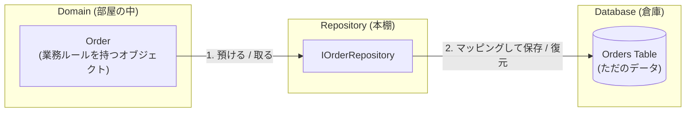
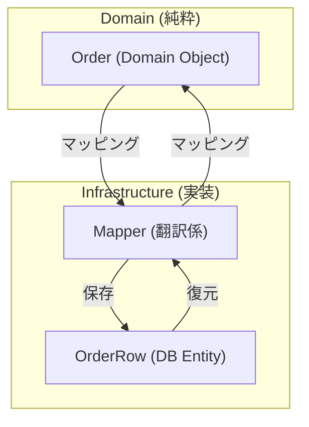
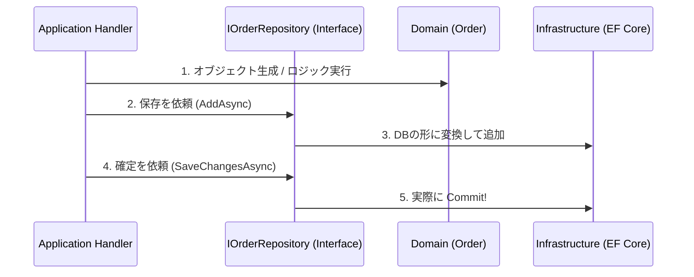

# 第12章：データ境界①：Repositoryって何者？🗃️✨

### 今日のゴール🎯

* 「Repositoryって結局なに？」を**スッキリ一言で言える**ようになる😊
* Domain / Application / Infrastructure の間にある **“データ境界”** を作れるようになる🧱✨
* 「やりすぎRepository（万能ラッパー）」に落ちないコツがわかる😇➡️😎

---

## まず結論：Repositoryは“ドメインのための本棚”📚🧩


Repository は、ざっくり言うと👇

* **Domain（業務ルール）**から見たら
  👉「Order を *探して*、*保存する* ための “本棚”」📚
* **DB / ORM（EF Core）**から見たら
  👉「細かい事情を Domain に漏らさない “防波堤”」🌊🛡️

ポイントはこれ👇
✅ Domain は **DBの都合（テーブル、JOIN、Include、トランザクション詳細）** を知らない
✅ Repository は **“集約（Aggregate）” を出し入れ**する（※後の章で集約やるよ🔒🧱）



---

## でも注意！EF Coreでは「Repositoryは必須」じゃない⚠️😳

ここ、今どき大事ポイント✨

* EF Core の `DbContext` は、説明として **Unit of Work + Repository パターンの性質を持つ**よ、とMicrosoftが明言してるよ📌 ([Microsoft Learn][1])
* さらに Microsoft のアーキテクチャガイドでも、「シンプルに行くなら DbContext を直接使う」選択も普通にアリって言ってるよ😊 ([Microsoft Learn][2])
* そして今の主流は **.NET 10（LTS） + EF Core 10（LTS）** が軸（2025年11月リリース、2026年1月時点でサポート中）✨ ([Microsoft][3])
* C#側も **C# 14** が “Visual Studio 2026 / .NET 10 SDK” で試せるよ🎉 ([Microsoft Learn][4])

じゃあ「Repositoryいらないの？」ってなるけど、**モジュラーモノリス教材的には“作れるようになった方が強い”**です💪✨
理由👇

* **境界を守る**（DomainにEFを漏らさない）🧱
* **テストがラク**（ApplicationのユースケースをDB抜きで回しやすい）🧪
* **将来の差し替え**に耐える（DB変更、Dapper化、イベントソーシング…など）🔁

---

## まずダメ例😇➡️「万能Repository」になって事故るやつ💥


## ダメ例あるある🙅‍♀️

* `IGenericRepository<T>` を作って
  `GetAll()`, `Find(Expression<Func<T,bool>>)` とか増殖…🧟‍♀️
* そのうち `Include` や `IQueryable` を外へ流し始めて
  👉 **結局EFの知識が漏れる**🌋
* “抽象化”のつもりが、ただの **EF弱体化ラッパー** に…🥲

---

## 良い例😎➡️「集約に寄せたRepository」になる✨


## 良いRepositoryの形🧠

* 1リポジトリ = だいたい **1集約ルート**（例：`Order`）📦
* メソッド名は **意図が読める**（例：`GetByIdAsync`, `SaveAsync`）🔍
* Query（参照系）が複雑なら、**Repositoryに全部詰めない**
  👉 後の章の CQS/CQRS で “読み取り専用の道” を作る方がキレイ✍️👀

---

## 手を動かす（C#）⌨️🛒✨

ここでは **Orderingモジュール**を想定して、最小Repositoryを作るよ😊
（※フォルダ/プロジェクト名は第6〜8章の形をイメージでOK！）

---

## 1) Domain：Order（集約ルート）とIOrderRepository📦🧱

```csharp
// Modules/Ordering/Ordering.Domain/Orders/Order.cs
namespace Ordering.Domain.Orders;

public sealed class Order
{
    public Guid Id { get; }
    public Guid CustomerId { get; }
    public Money Total { get; private set; }
    public OrderStatus Status { get; private set; }

    private Order(Guid id, Guid customerId, Money total, OrderStatus status)
    {
        Id = id;
        CustomerId = customerId;
        Total = total;
        Status = status;
    }

    public static Order Create(Guid customerId)
        => new(Guid.NewGuid(), customerId, Money.Zero(), OrderStatus.Created);

    public void AddItem(Money price)
    {
        if (Status != OrderStatus.Created)
            throw new InvalidOperationException("作成中以外は追加できないよ🙅‍♀️");

        Total = Total.Add(price);
    }

    public void MarkAsPaid()
    {
        if (Status != OrderStatus.Created)
            throw new InvalidOperationException("支払い済みにできない状態だよ🙅‍♀️");

        Status = OrderStatus.Paid;
    }
}

public enum OrderStatus { Created, Paid }
```

```csharp
// Modules/Ordering/Ordering.Domain/Orders/Money.cs
namespace Ordering.Domain.Orders;

public readonly record struct Money(decimal Amount)
{
    public static Money Zero() => new(0m);

    public Money Add(Money other) => new(Amount + other.Amount);
}
```

```csharp
// Modules/Ordering/Ordering.Domain/Orders/IOrderRepository.cs
namespace Ordering.Domain.Orders;

public interface IOrderRepository
{
    Task<Order?> GetByIdAsync(Guid orderId, CancellationToken ct);
    Task AddAsync(Order order, CancellationToken ct);
    Task SaveChangesAsync(CancellationToken ct);
}
```

### ここが“境界の芯”🧠✨


Domain は **EF Coreを一切知らない**！
`DbContext` も `DbSet` も `EntityTypeConfiguration` も出てこないのが勝ち🏆

---

## 2) Infrastructure：EF Core用のDbContext + Repository実装🗄️🛠️

### EF Core 10（.NET 10 LTS）で行く前提のイメージだよ✨ ([Microsoft Learn][5])

```csharp
// Modules/Ordering/Ordering.Infrastructure/Persistence/OrderingDbContext.cs
using Microsoft.EntityFrameworkCore;

namespace Ordering.Infrastructure.Persistence;

public sealed class OrderingDbContext : DbContext
{
    public OrderingDbContext(DbContextOptions<OrderingDbContext> options) : base(options) { }

    public DbSet<OrderRow> Orders => Set<OrderRow>();

    protected override void OnModelCreating(ModelBuilder modelBuilder)
    {
        modelBuilder.Entity<OrderRow>(b =>
        {
            b.ToTable("Orders");
            b.HasKey(x => x.Id);
            b.Property(x => x.TotalAmount).HasColumnType("decimal(18,2)");
        });
    }
}

// “DB用の形” は Domain と分ける（まずは最小でOK）


public sealed class OrderRow
{
    public Guid Id { get; set; }
    public Guid CustomerId { get; set; }
    public decimal TotalAmount { get; set; }
    public int Status { get; set; }
}
```

```csharp
// Modules/Ordering/Ordering.Infrastructure/Orders/EfOrderRepository.cs
using Microsoft.EntityFrameworkCore;
using Ordering.Domain.Orders;
using Ordering.Infrastructure.Persistence;

namespace Ordering.Infrastructure.Orders;

public sealed class EfOrderRepository : IOrderRepository
{
    private readonly OrderingDbContext _db;

    public EfOrderRepository(OrderingDbContext db) => _db = db;

    public async Task<Order?> GetByIdAsync(Guid orderId, CancellationToken ct)
    {
        var row = await _db.Orders.AsNoTracking()
            .SingleOrDefaultAsync(x => x.Id == orderId, ct);

        return row is null ? null : MapToDomain(row);
    }

    public async Task AddAsync(Order order, CancellationToken ct)
    {
        var row = MapToRow(order);
        await _db.Orders.AddAsync(row, ct);
    }

    public Task SaveChangesAsync(CancellationToken ct)
        => _db.SaveChangesAsync(ct);

    private static Order MapToDomain(OrderRow row)
    {
        // Domainのコンストラクタがprivateなので、ここは「復元用の工夫」が必要になることが多いよ😊
        // 今回は簡略化：Createして状態だけ合わせる（本番はFactory/復元コンストラクタ等を検討）
        var order = Order.Create(row.CustomerId);

        // “復元” の本質は後の章（集約/永続化境界）で丁寧にやるよ🧱✨
        if ((OrderStatus)row.Status == OrderStatus.Paid)
            order.MarkAsPaid();

        // Total復元（簡略）
        var diff = new Money(row.TotalAmount);
        order.AddItem(diff);

        return order;
    }

    private static OrderRow MapToRow(Order order)
        => new()
        {
            Id = order.Id,
            CustomerId = order.CustomerId,
            TotalAmount = order.Total.Amount,
            Status = (int)order.Status
        };
}

```



### ここでの学びポイント📌


* Infrastructure は **EF Coreを使ってOK**（むしろここが担当）🛠️
* でも Domain には **EFの型を漏らさない**🧱
* 「DomainモデルとDBモデルを分ける」のは、境界を守る基本ムーブ✨

> ちなみに、EFの `DbContext` 自体が UoW/Repositoryの性質を持つ、という説明もあるので、ケースによっては “Repositoryを薄くする/作らない” も設計として正解だよ😊 ([Microsoft Learn][1])

---

## 3) Application：ユースケース（注文作成→保存）🧩📣

```csharp
// Modules/Ordering/Ordering.Application/PlaceOrder/PlaceOrderCommand.cs
namespace Ordering.Application.PlaceOrder;

public sealed record PlaceOrderCommand(Guid CustomerId);
```

```csharp
// Modules/Ordering/Ordering.Application/PlaceOrder/PlaceOrderHandler.cs
using Ordering.Domain.Orders;

namespace Ordering.Application.PlaceOrder;

public sealed class PlaceOrderHandler
{
    private readonly IOrderRepository _repo;

    public PlaceOrderHandler(IOrderRepository repo) => _repo = repo;

    public async Task<Guid> HandleAsync(PlaceOrderCommand cmd, CancellationToken ct)
    {
        var order = Order.Create(cmd.CustomerId);
        // 本当はここで item追加とか、支払いとか…（後の章で育てるよ🛒✨）

        await _repo.AddAsync(order, ct);
        await _repo.SaveChangesAsync(ct);

        return order.Id;
    }
}

```



### Applicationがやること😊

* 「どういう順で処理する？」の**段取り**担当🎬
* Domainのルールを呼び出す
* 保存は Repository にお願いする🙏✨

---

## 4) Host（APIなど）：DI登録してつなぐ🔌🧩

```csharp
// Host/Program.cs（イメージ）
using Microsoft.EntityFrameworkCore;
using Ordering.Domain.Orders;
using Ordering.Infrastructure.Orders;
using Ordering.Infrastructure.Persistence;

var builder = WebApplication.CreateBuilder(args);

// DbContext（例：SQL Server想定。使うDBに合わせて変えてね😊）
builder.Services.AddDbContext<OrderingDbContext>(opt =>
    opt.UseSqlServer(builder.Configuration.GetConnectionString("Ordering")));

builder.Services.AddScoped<IOrderRepository, EfOrderRepository>();

// HandlerもDIで
builder.Services.AddScoped<Ordering.Application.PlaceOrder.PlaceOrderHandler>();

var app = builder.Build();
app.Run();
```

---

## ミニ演習📝✨（手を動かすと定着するよ！）

1. `GetByIdAsync` を使って「注文を取得して支払い済みにする」ユースケースを1本作ってみてね💳✨
2. Repositoryに **`IQueryable` を返したくなる誘惑**が来たら、ぐっとこらえて
   　「ユースケースに必要な形は何？」をメソッド名で表現してみて😊🔍
3. “参照だけ” の要件（注文一覧表示）を想定して、
   　Repositoryじゃなくて **Query用クラス**（例：`OrderQueries`）を Application側に作る案も考えてみよ✍️👀

---

## AI活用プロンプト例🤖✨（Copilot / Codex向け）

* 「`IOrderRepository` を使うユースケースで、`SaveChangesAsync` の呼び忘れを防ぐ設計案を3つ出して」🧠
* 「DomainモデルとDBモデルを分けたときのマッピング方針（Factory/復元コンストラクタ/Mapper）を比較して」📦
* 「“万能Repository”がダメになる具体例を、EF CoreでありがちなAPI設計の失敗としてコード付きで見せて」😇💥

---

## まとめ（覚える1行）📌✨

**Repositoryは、Domainが“DBを知らずに”集約を出し入れするための本棚📚🧩**

---

次の第13章では、「DBが1つでもモジュール分けできる」って話に進むよ🧠🗄️✨
ここまでのRepository理解があると、**“テーブルの持ち主（責任者）”** を決めるのが一気にラクになるよ〜😊💪

[1]: https://learn.microsoft.com/en-us/dotnet/api/microsoft.entityframeworkcore.dbcontext?view=efcore-10.0&utm_source=chatgpt.com "DbContext Class (Microsoft.EntityFrameworkCore)"
[2]: https://learn.microsoft.com/en-us/dotnet/architecture/microservices/microservice-ddd-cqrs-patterns/infrastructure-persistence-layer-implementation-entity-framework-core?utm_source=chatgpt.com "Implementing the infrastructure persistence layer with ..."
[3]: https://dotnet.microsoft.com/en-us/platform/support/policy/dotnet-core?utm_source=chatgpt.com "NET and .NET Core official support policy"
[4]: https://learn.microsoft.com/ja-jp/dotnet/csharp/whats-new/csharp-14?utm_source=chatgpt.com "C# 14 の新機能"
[5]: https://learn.microsoft.com/en-us/ef/core/what-is-new/ef-core-10.0/whatsnew?utm_source=chatgpt.com "What's New in EF Core 10"
