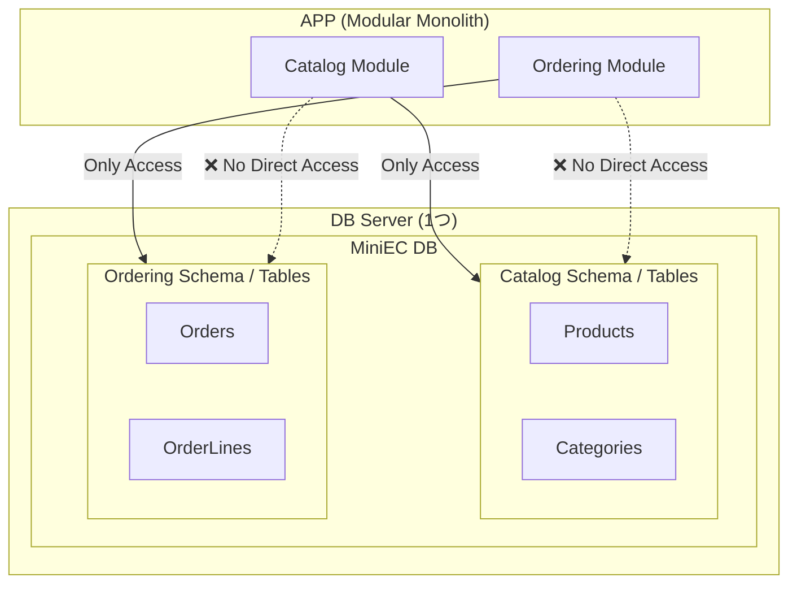

# 第13章：データ境界②：DBが1つでもモジュール分けはできる🧠🗄️

この構成で、

「第13章」

の詳細な教育コンテンツを作成してください。

「C#は初級～中級」「モジュラーモノリス  は初めて」「設計は超入門者」を前提としてください。
（即ち１人でプログラミングはそこそこ書いてきているが、本格的な設計をほぼ学んでいない状態）

## 他の主な備考のリスト

- C#は2026年最新版を前提にしてください、その外の環境等や開発環境も2026年最新環境を前提にしてOKです。
- Visual Studio前提でOK。Visual Studio Codeの方がやりやすい場合はそちらを別途出してもOK.
 両方とも出してOKですが。上記２つ以外の開発環境はよほどでなければ出さないようにしてください
-  「Github Copilot拡張機能」もしくは「OpenAI CodexなどのAI拡張機能」などが「利用可能な開発環境であるという前提」でOKであり、
 そうAI導入済みであることを前提とした教材カリキュラムとしてください。
- 出力結果の記事中に、これら「前提条件についてわざわざ『●●の環境を前提とします』などと触れる」必要はありません。
(すべてのページにそんなことが入っていては鬱陶しい）
- 女子大学生程度に教える程度で、親しみやすい簡易な口調でお願いします。
- 絵文字をたくさんいれてください。
- プラットフォームは「Windowsを前提」にしてください。
- 絵文字をたくさんいれてください。
- 必ず「本日時点での最新情報をサーチ・リサーチ」した上で記事を構成してください。

---

## モジュラーモノリス教育コンテンツ：30章・詳細アウトライン🏠🧩✨

### 第1章　はじめに：モジュラーモノリスって何？🏠✨

* 目標：**モノリスのまま内部を分割**して強くする
* モノリス／モジュラーモノリス／マイクロサービスの違い
* よくある悩み：変更が怖い、影響範囲が読めない😵

### 第2章　“モジュール”の正体：フォルダ分けじゃないよ📦🙅‍♀️

* モジュール＝責務のまとまり＋境界（ルール）
* 「見た目だけ分割」の失敗例💥
* “境界を越える”とはどういうこと？

### 第3章　題材紹介：ミニECで学ぶよ🛒😊

* 商品（Catalog）・注文（Ordering）・会員（Identity）
* 代表ユースケース（注文する、支払う、発送する）
* ざっくり境界候補を線引きしてみる🖍️

### 第4章　設計の超基本：SoC（関心の分離）✂️✨

* UI／業務／永続化／外部I/Oを混ぜない
* “混ぜた地獄”の例を見て納得する😇

### 第5章　境界づけ入門：Bounded Contextのミニ版🧱🌍

* 同じ単語でも意味が違う問題（Orderの例）
* まずは「衝突しそうな言葉」を分けるコツ

### 第6章　ソリューション構成：Visual Studioで作る基本形🛠️🪟

* SolutionとProjectの分け方（最小構成）
* 命名ルール（Modules / Shared / Host）
* VS Code併記：フォルダ構成の見え方👀

---

### 第7章　モジュール内レイヤー：Domain / Application / Infrastructure 🧅✨

* 役割の違い（初心者向けに超やさしく）
* 「Domainはルールの中心」って何？😊

### 第8章　依存関係ルール：参照していい方向だけにする🚦📌

* 例：Domain → ApplicationはOK？（ルール決め）
* “外側の詳細”を内側に入れない理由

### 第9章　DIP/DI超入門：境界はinterfaceで守る🧩🔌

* interfaceの意味（差し替え・テスト）
* newしないで渡す（コンストラクタ注入）
* DIコンテナは「後でOK」👌

### 第10章　公開API設計：モジュール間は“窓口”だけで話す📣🪟

* 他モジュールを直接触らないルール
* 公開インターフェースとDTO
* 依存が雪だるまになるのを防ぐ☃️

### 第11章　Sharedの扱い：共有は“最小”が正解⚠️🍱

* 共有しがちなもの（Utils/共通DTO）あるある
* Sharedに入れていいもの・ダメなもの🙅‍♀️
* “ドメイン知識”はSharedに置かない

---

### 第12章　データ境界①：Repositoryって何者？🗃️✨

* Repositoryの役割（ドメインをDBから守る）
* Application/Domainとどう繋ぐ？

### 第13章　データ境界②：DBが1つでもモジュール分けはできる🧠🗄️

*## 1) 「物理DBは1つ、論理スキーマは別」の図🖼️

は誤解😆

* スキーマ分割／テーブル所有の考え方
* “誰がそのデータの責任者？”を決める

### 第14章　データ境界③：Migration運用の最小ルール🧰✅

* Migrationの流れ（作成→適用→レビュー）
* モジュール単位での整理の仕方
* 事故を減らすチェックリスト📋

---

### 第15章　集約（Aggregate）入門：一貫性を守る単位を決めよう🔒🧱

* 1回の更新で必ず整合する範囲
* 集約ルート経由でのみ更新（なぜ？）

### 第16章　CQS入門：更新と参照を分けると超ラク✍️👀

* CommandとQueryを混ぜない
* APIが読みやすくなる体験✨

### 第17章　エラー設計①：エラーを“仕様”として分類する🚧🧩

* 入力エラー／業務ルール違反／インフラ障害
* リトライ可能？ユーザーに見せる？👀

### 第18章　エラー設計②：例外とResultを使い分ける😵‍💫✅

* 例外を投げる場所・止める場所
* 境界でResultに変換して整える

---

### 第19章　ドメインイベント①：イベントって何？（過去形がコツ）🔔🕰️

* “起きた事実”を表現する
* OrderPaid / OrderShipped のように過去形

### 第20章　ドメインイベント②：どこで発行する？（Raiseポイント）📍🔔

* 集約内で出す？アプリ層で出す？
* “一貫性を壊さない”発行位置の考え方

### 第21章　ドメインイベント③：ハンドラ設計（副作用は外へ）📦📩

* メール送信・通知・ログなどは外に逃がす
* 疎結合で機能追加できる快感😆✨

---

### 第22章　Outbox①：なぜ必要？「DB更新とイベント送信がズレる」問題📤💥

* 失敗例（更新成功、送信失敗…）😇
* “ズレ”が起きる現実（ネットワーク、再試行）

### 第23章　Outbox②：最小Outbox実装（テーブルに書くだけ）🗒️✅

* Outboxテーブル設計（最低限）
* 更新とOutbox書き込みを同一トランザクションに

### 第24章　Outbox③：配信処理の基本（ポーリング/バッチ/別プロセス）🔁🚚

* 送信の流れ（未送信→送信→完了）
* 重複送信に備える（次章の冪等性へ）

---

### 第25章　冪等性：リトライ前提で壊れない設計🔁🛡️

* 冪等キー／重複排除
* “二重適用”を状態遷移で防ぐ

---

### 第26章　状態機械①：状態遷移表を作ってみよう🚥📋

* 状態（Created/Paid/Shipped/Cancelled…）
* 許される遷移・禁止遷移を書き出す

### 第27章　状態機械②：ガード条件（条件付き遷移）を整理する🧠🚦

* 「支払い済みなら発送OK」みたいな条件
* ガード条件が散るとバグる😵→まとめる

### 第28章　状態機械③：C#で“漏れ”を防ぐ（型で守る）🧱✨

* enumだけで終わらせない工夫
* “許可されない遷移はコンパイルで気づける”方向へ

---

### 第29章　テストと崩壊防止：モジュール境界を守り続ける🧪🛡️

* I/O分離でロジックを単体テスト
* モジュール単位のテスト方針
* 参照ルール破りを検出する考え方（自動チェック）🔍

### 第30章　移行＆卒業制作：既存モノリスを育てて完成🏁🎉

* 段階移行（痛い所から切る）🩹
* “最初に切る境界”の選び方
* 最終課題：自分の題材でモジュール化して提出✨

---

## 各章に必ず付ける「学習セット」🎁😊

* 今日のゴール🎯
* まずダメ例😇→良い例😎
* 手を動かす（C#）⌨️
* ミニ演習📝
* AI活用プロンプト例🤖✨
* まとめ（覚える1行）📌

---

必要なら、この30章アウトラインをさらに“教材っぽく”して、
**各章の所要時間の目安・演習の難易度・提出物**まで付けた「カリキュラム表」にもできるよ😊📚✨
