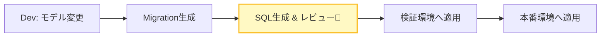
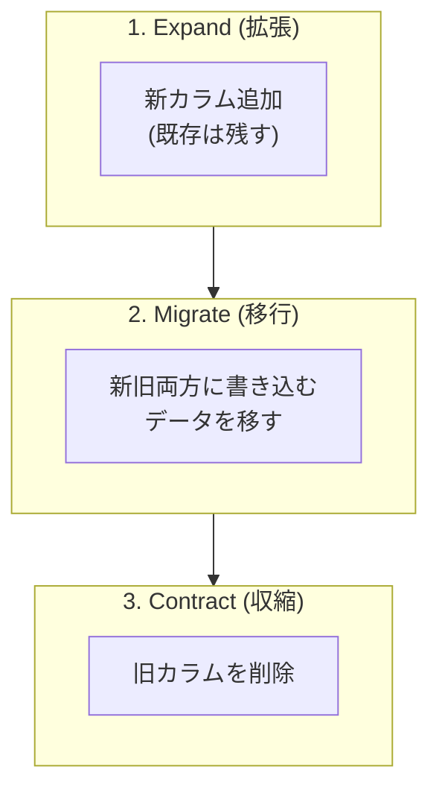
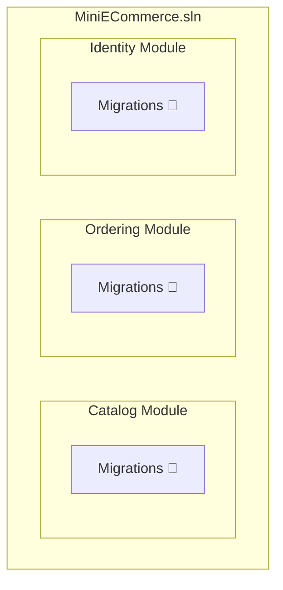

# 第14章：データ境界③：Migration運用の最小ルール🧰✅

## 今日のゴール🎯

* **「Migrationを作る→レビューする→安全に適用する」**の最小ルールを身につけるよ✨
* モジュールが増えても、DB変更で事故らない運用にするよ🛡️💖

---

## まず最初に：Migrationってなに？🧠🗄️

Migrationは、**「DBの設計図の変更履歴（差分）」**だよ📓✨
C#側のモデル（Entity）を変えたら、DBも同じように変えないとズレちゃう😵‍💫

でも本番DBは超こわい…！
EF Coreは基本ちゃんと作ってくれるけど、**意図が伝わらない変更**（例：名前変更）では、**列を消して作り直す**みたいな危険な差分を作ることがあるの🥶
→ だから **「必ずレビュー」**が大事！ ([Microsoft Learn][1])

---

## いちばん大事な3原則🧡（これだけで事故率が激減する）




### ① Migrationは「モジュールの持ち物」📦🧩

* Orderingのテーブル変更なら、**OrderingモジュールのMigration**として作る
* Catalogの変更が混ざったらアウト🙅‍♀️💥（責任がボヤける）

### ② 本番は「SQLとして適用」が基本🧾🚀

本番で `dotnet ef database update` を直でやるのは、基本おすすめされてないよ〜😖
理由：**SQLをレビューできない**＆**本番サーバーにSDKやソースが必要**になりがちだから。
→ **SQLスクリプトを生成してレビューしてから適用**が推奨だよ✅ ([Microsoft Learn][2])

### ③ 「壊れる変更」は2段階以上でやる🧯🪜


列削除・型変更・NOT NULL化…みたいな変更は、いきなりやると死にがち😇
安全にやる王道は **Expand → Migrate → Contract**（増やす→移す→消す）だよ✨ ([PlanetScale][3])



---

## 最小の運用フロー（これをテンプレ化しよ！）📋✨

### Step 0：前提の“形”（モジュール別Migrationの置き場）🏠🧩


おすすめはこんな感じ👇

* `Modules/Ordering/Ordering.Infrastructure/Persistence/Migrations`
* `Modules/Catalog/Catalog.Infrastructure/Persistence/Migrations`
* `Modules/Identity/Identity.Infrastructure/Persistence/Migrations`

> 「Migrationをどこに出すか」は `--output-dir` で指定できるよ✅ ([Microsoft Learn][1])



---

### Step 1：モデルを変更する✍️🧠

例：Orderingの `Order` に `CustomerNote`（任意メモ）を追加する📝✨

---

### Step 2：Migrationを作る🛠️✨（**モジュールのDbContextを指定**）


CLI例（イメージ）👇
※ `--project` と `--startup-project` をちゃんと指定すると迷子にならないよ🧭 ([Microsoft Learn][1])

```bash
dotnet ef migrations add AddCustomerNoteToOrder ^
  --project .\src\Modules\Ordering\Ordering.Infrastructure ^
  --startup-project .\src\Host\Host.Api ^
  --context OrderingDbContext ^
  --output-dir Persistence\Migrations
```

---

### Step 3：Migrationを“必ずレビュー”する👀⚠️（ここが命！）


レビュー観点はこれだけでOK✅

* **DropColumn / DropTable** が入ってない？🧨
* **Renameのつもりが Drop + Add になってない？**（データ消える😱）
  EF Coreは「名前変更」を理解できず、**列を削除して追加**を生成しがちだよ → `RenameColumn` に直す必要があるの🛠️ ([Microsoft Learn][1])
* 生SQL（`migrationBuilder.Sql(...)`）があるなら、実行順と安全性を確認🔍 ([Microsoft Learn][1])

---

### Step 4：ローカルで適用して動作確認🧪💻

ローカルでの確認は `database update` が楽ちん✨（本番は別！）

```bash
dotnet ef database update ^
  --project .\src\Modules\Ordering\Ordering.Infrastructure ^
  --startup-project .\src\Host\Host.Api ^
  --context OrderingDbContext
```

EF Coreの「適用方法の選び方」も公式にまとまってるよ✅ ([Microsoft Learn][2])

---

### Step 5：本番向けSQLを生成する🧾✨（レビュー＆CI向け）


#### ✅ 基本：最新までのSQLを生成

```bash
dotnet ef migrations script ^
  --project .\src\Modules\Ordering\Ordering.Infrastructure ^
  --startup-project .\src\Host\Host.Api ^
  --context OrderingDbContext ^
  --output .\artifacts\db\ordering.sql
```

#### ✅ 超おすすめ：**idempotent**（どこまで適用済みでもOKなSQL）

複数環境（検証/本番）で「今どこまで当たってるっけ？」問題が減るよ〜！✨
EF Coreは `--idempotent` をサポートしてるよ✅ ([Microsoft Learn][2])

```bash
dotnet ef migrations script --idempotent ^
  --project .\src\Modules\Ordering\Ordering.Infrastructure ^
  --startup-project .\src\Host\Host.Api ^
  --context OrderingDbContext ^
  --output .\artifacts\db\ordering.idempotent.sql
```

---

## モジュールが複数DbContextのときの“事故ポイント”🚧😵‍💫

### ✅ 事故ポイント：Migration履歴テーブルが衝突する💥

DbContextが複数あるのに、全部が同じ `__EFMigrationsHistory` を使うと混乱しやすいよ〜😇

**最小ルール**：

* **モジュールごとに「履歴テーブルのschema/名前」を分ける**（Orderingなら ordering schema など）
  （ここはプロジェクトの方針でOK！とにかく衝突回避が目的🙆‍♀️）

---

## 事故を減らすチェックリスト📋🛡️（PRに貼っとくと強い！）


### ✅ Migration作成時

* [ ] 変更対象モジュールは1つだけ？📦
* [ ] `--context` 合ってる？🧠
* [ ] `--output-dir` がモジュール配下？🗂️

### ✅ レビュー時（必須！）

* [ ] Renameが Drop+Add になってない？（データ消える😱） ([Microsoft Learn][1])
* [ ] Drop系が入ってるなら、段階移行（Expand→Migrate→Contract）にできない？🪜✨ ([PlanetScale][3])
* [ ] “本番で適用するSQL”を生成して読んだ？🧾👀 ([Microsoft Learn][2])

### ✅ 適用時

* [ ] 本番はSQLスクリプト方式？（基本推奨） ([Microsoft Learn][2])
* [ ] 失敗時のロールバック（戻す/止める）手順はある？🧯

---

## 手を動かす（C#）⌨️✨：ミニハンズオン🛒🧩

### やること

Orderingに「注文メモ（CustomerNote）」を追加して、Migrationを作って、idempotent SQLを出すよ📝✨

1. `Order` に `CustomerNote` を追加
2. `dotnet ef migrations add ...`
3. 生成されたMigrationの `Up()` を開いて、Drop系がないか確認👀
4. `dotnet ef migrations script --idempotent` でSQL生成🧾✨
5. SQLファイルをPRに含める（チーム運用なら超おすすめ！）

---

## ミニ演習📝🎯

### Q1（やさしめ）😊

`CustomerNote` を **NOT NULL** にしたい！どうする？
→ いきなりNOT NULLにせず、まずは…？🪜✨（Expand→Migrate→Contractの考え方だよ！）

### Q2（ちょい実務）😎

プロパティ名を `Name` → `FullName` に変えたらMigrationが `DropColumn` になった！
→ どう直す？（ヒント：`RenameColumn`） ([Microsoft Learn][1])

---

## AI活用プロンプト例🤖✨（コピペでOK）

### ✅ Migrationレビュー用👀

* 「このEF Core Migrationの `Up()` をレビューして、データ損失リスク（Drop/型変更/NOT NULL化）を指摘して。安全な段階移行案も出して」

### ✅ Rename事故の修正用🛠️

* 「`DropColumn`+`AddColumn` になってしまったMigrationを、`RenameColumn` を使う形に書き換えて。注意点も教えて」 ([Microsoft Learn][1])

### ✅ Expand→Migrate→Contractの設計用🪜

* 「本番無停止を意識して、列の型変更を Expand→Migrate→Contract に分割した計画（複数リリース）を提案して」

---

## まとめ（覚える1行）📌✨

**Migrationは“作る”より“レビュー＆安全に適用する”が本番スキルだよ🧾🛡️**
（SQL生成して見てから当てる！が基本✅ ([Microsoft Learn][2])）

---

## おまけ：いまの最新前提メモ🆕✨

* EF Coreは **EF Core 10**（.NET 10世代）が安定版として案内されてるよ📦✨ ([Microsoft Learn][4])
* .NET 10はLTSとして2025年11月リリース扱いで情報がまとまってるよ🗓️✨ ([GitHub][5])

---

次は「第15章 集約（Aggregate）入門🔒🧱」で、**“DBの一貫性を守る単位”**を決めていくよ〜！😊✨

[1]: https://learn.microsoft.com/en-us/ef/core/managing-schemas/migrations/managing "Managing Migrations - EF Core | Microsoft Learn"
[2]: https://learn.microsoft.com/en-us/ef/core/managing-schemas/migrations/applying "Applying Migrations - EF Core | Microsoft Learn"
[3]: https://planetscale.com/blog/backward-compatible-databases-changes?utm_source=chatgpt.com "Backward compatible database changes"
[4]: https://learn.microsoft.com/en-us/ef/core/what-is-new/?utm_source=chatgpt.com "EF Core releases and planning"
[5]: https://github.com/dotnet/core/blob/main/release-notes/10.0/README.md?utm_source=chatgpt.com "core/release-notes/10.0/README.md at main · dotnet/ ..."
