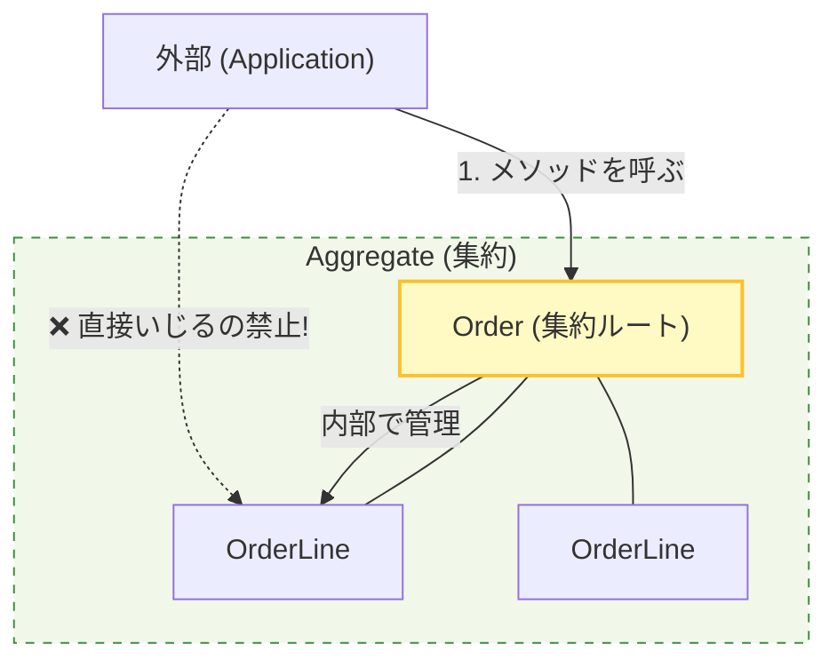
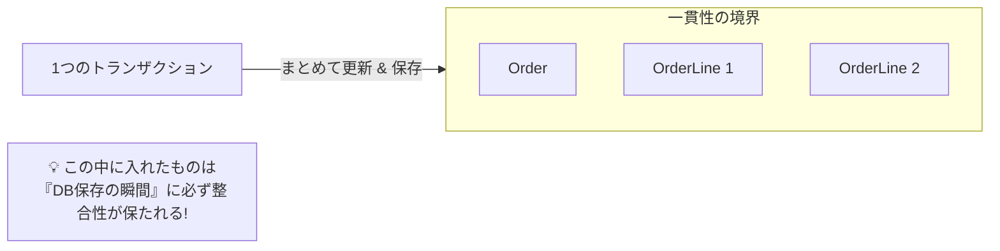

# 第15章：集約（Aggregate）入門：一貫性を守る単位を決めよう🔒🧱

この章は「**バグりにくい“更新の単位”を決める**」回だよ〜😊
DDDでいう **Aggregate（集約）** は、ひとことで言うと…

> **「1回の更新で、必ず整合（ルール）を守りきる範囲」** 🧱🔒

そして、その入口になるのが **Aggregate Root（集約ルート）**。
**外部は“集約ルート”だけ触ってOK**、中の子たち（子Entity）は勝手にいじらない！が超大事✨
（MicrosoftのDDDガイドでも、子Entityを独立に作成・更新せず、集約ルートが整合性を管理するのが基本、と説明されてるよ） ([Microsoft Learn][1])

---

## 🎁 学習セット（この章もフル装備！）😊✨

### 今日のゴール🎯

* 「集約＝整合を守る“更新単位”」を腹落ちさせる🧠💡
* **Order集約**を例に、**集約ルート経由でのみ更新**する設計を体験する🛒✅
* 「どこまでを1つにまとめる？」の決め方（チェックリスト）を持ち帰る📋✨

---

## まずダメ例😇💥（“誰でも中身を触れる”地獄）


### ❌ ダメな設計の特徴

* 子Entityが public setter で外から自由に書き換えられる😵‍💫
* `Order.Items.Add(...)` が外部からできる（＝ルール無視が簡単）💥
* “支払い後に商品追加”とか“発送済みをキャンセル”とかが平気で起きる😇

```csharp
public class Order
{
    public Guid Id { get; set; }
    public bool IsPaid { get; set; }
    public bool IsShipped { get; set; }

    // 外から Add/Remove し放題 😇
    public List<OrderLine> Lines { get; set; } = new();
}

public class OrderLine
{
    public Guid ProductId { get; set; }
    public int Quantity { get; set; } // マイナスも入るかも😇
}
```

✅ 一見ラクそうだけど、**ルールの置き場がなくなってバグが増える**やつだよ〜😇💥

---

## 良い例😎✨（“入口を1つにして、ルールを守らせる”）


### ✅ 良い設計の方針（この章の核）🧱🔒



* 外部が触っていいのは **集約ルートだけ** 🏰✨

* 外部が触っていいのは **集約ルートだけ** 🏰✨
* 子Entityやコレクションは **外から直接いじれない** 🙅‍♀️
* ルール（不変条件）は **集約ルートのメソッドで強制** ✅

---

## 手を動かす（C#）⌨️🛒✨：Order集約を作ろう！

ここからは **Ordering モジュールの Domain** に置く想定で進めるよ😊
（モジュールの外は “公開API” だけで話す、は前の章のルールね🪟📣）

---

### 1) 値オブジェクト（Value Object）を作る💎✨

（Money と Id）

「金額」や「ID」はプリミティブで雑に扱うと事故りやすいので、軽く包むよ😊

```csharp
public readonly record struct OrderId(Guid Value)
{
    public static OrderId New() => new(Guid.NewGuid());
}

public readonly record struct ProductId(Guid Value);

public readonly record struct Money(decimal Amount, string Currency)
{
    public static Money Jpy(decimal amount)
    {
        if (amount < 0) throw new ArgumentOutOfRangeException(nameof(amount));
        return new Money(amount, "JPY");
    }

    public Money Add(Money other)
    {
        if (Currency != other.Currency) throw new InvalidOperationException("Currency mismatch");
        return new Money(Amount + other.Amount, Currency);
    }

    public Money Multiply(int n)
    {
        if (n < 0) throw new ArgumentOutOfRangeException(nameof(n));
        return new Money(Amount * n, Currency);
    }
}
```

---

### 2) 子Entity：OrderLine（注文行）を作る📦🧾


子は **外から勝手に new できなくてもOK**（必要なら内部だけで作る）😊

```csharp
public sealed class OrderLine
{
    public ProductId ProductId { get; }
    public int Quantity { get; private set; }
    public Money UnitPrice { get; }

    internal OrderLine(ProductId productId, int quantity, Money unitPrice)
    {
        if (quantity <= 0) throw new ArgumentOutOfRangeException(nameof(quantity));
        ProductId = productId;
        Quantity = quantity;
        UnitPrice = unitPrice;
    }

    internal void Increase(int delta)
    {
        if (delta <= 0) throw new ArgumentOutOfRangeException(nameof(delta));
        Quantity += delta;
    }

    internal Money LineTotal() => UnitPrice.Multiply(Quantity);
}
```

---

### 3) 集約ルート：Order を作る🏰🧱✨


ここが本番！
**ルールはここに置く**よ😊（支払い後は追加できない、発送は支払い後だけ、など）

```csharp
public sealed class Order
{
    private readonly List<OrderLine> _lines = new();

    public OrderId Id { get; }
    public IReadOnlyList<OrderLine> Lines => _lines; // 外から Add できない👍

    public bool IsPaid { get; private set; }
    public bool IsShipped { get; private set; }

    private Order(OrderId id)
    {
        Id = id;
    }

    public static Order CreateNew() => new(OrderId.New());

    public void AddItem(ProductId productId, int quantity, Money unitPrice)
    {
        EnsureNotShipped();
        EnsureNotPaid();

        // 同一商品はまとめる（ルールは好みでOK）
        var existing = _lines.FirstOrDefault(x => x.ProductId == productId);
        if (existing is null)
        {
            _lines.Add(new OrderLine(productId, quantity, unitPrice));
        }
        else
        {
            existing.Increase(quantity);
        }
    }

    public Money Total()
    {
        var total = Money.Jpy(0);
        foreach (var line in _lines)
            total = total.Add(line.LineTotal());
        return total;
    }

    public void MarkPaid()
    {
        EnsureNotShipped();
        if (_lines.Count == 0) throw new InvalidOperationException("Cannot pay an empty order");
        IsPaid = true;
    }

    public void Ship()
    {
        if (!IsPaid) throw new InvalidOperationException("Cannot ship before payment");
        EnsureNotShipped();
        IsShipped = true;
    }

    private void EnsureNotPaid()
    {
        if (IsPaid) throw new InvalidOperationException("Order is already paid");
    }

    private void EnsureNotShipped()
    {
        if (IsShipped) throw new InvalidOperationException("Order is already shipped");
    }
}
```

✅ これで「外部が OrderLine を勝手にいじってルール破り」が起きにくくなるよ〜😆🛡️

> こういう **“整合性・業務ルールは集約ルートのメソッドで守る”** という考え方は、MicrosoftのDDDガイドでも中核として説明されてるよ。 ([Microsoft Learn][1])

---

## 集約をどう切る？🧠✂️✨（迷ったときのチェックリスト📋）




集約の境界は「大きくしすぎる」と重くなるし、「小さすぎる」と整合が守れない…😵
そこで、まずはこれで決めるのがおすすめ😊

### ✅ 集約に“入れるべき”もの

* **同じトランザクション（1回の更新）で絶対に整合が必要**なもの🔒
* その場で守りたい **不変条件（ルール）** があるもの📌

  * 例：`支払い済みなら追加禁止`、`発送は支払い後のみ` など

### ⚠️ 集約に“入れすぎない”ほうがいいもの

* 別の“所有者（責任者）”がいるデータ（別モジュールのもの）🙅‍♀️
* 参照は必要だけど、同時更新しないもの（ID参照で十分）🆔✨
* とにかく巨大になって、更新競合やロックが増えるもの😵‍💫

> 「集約ルート＝整合性の境界」「DB更新の窓口はリポジトリを通す」という整理は、Microsoftのガイドでも明確に書かれてるよ。 ([Microsoft Learn][2])

---

## ミニ演習📝✨（やると一気に身につく！）

### 演習1：ルール追加💪

次のどれか1つを **Order に追加**してみてね😊

* 1回の注文で最大99個まで📦
* 支払い後は `Ship()` しか呼べない（他は全部禁止）🚫
* 同一商品は最大10個まで🧾

### 演習2：境界クイズ🧠


「Customer（会員）」は Order集約に入れる？入れない？🤔

* 入れるなら理由は？
* 入れないなら、Order には何を持つ？（例：CustomerId だけ）🆔

---

## AI活用プロンプト例🤖✨（Copilot / Codex向け）

### ① ルールを満たすメソッド追加

```text
Order aggregate rootに「Cancel」を追加したいです。
制約:
- Shipped後はCancel禁止
- Paid後のCancelは「RefundRequired = true」を立てる（boolでOK）
- 空の注文はCancelできない
ドメインメソッドとして実装案と、例外メッセージも提案して。
```

### ② 単体テスト生成（xUnit）

```text
上のOrder集約に対してxUnitのテストを書いて。
観点:
- Paid後にAddItemすると例外
- Paid前にShipすると例外
- Linesが外からAddできない（IReadOnlyListであること）
Arrange/Act/Assertで読みやすく。
```

### ③ 集約の切り方レビュー

```text
このユースケースでの集約境界をレビューして。
- PlaceOrderでOrder作成
- Inventory(在庫)も同時に減らしたい
強整合にすべきか、イベント/非同期にすべきか、判断基準も添えて。
```

---

## まとめ（覚える1行）📌✨

**集約は「1回の更新で整合を守りきる最小単位」🧱🔒
外部は“集約ルート”だけ触って、中はルールでガチガチに守る！😆🛡️**

---

### おまけ：いまどきC#/.NETの前提（超短く）🧁

この時点の最新LTSは **.NET 10（2025-11-11リリース）**、言語は **C# 14** が中心だよ。 ([Microsoft for Developers][3])
IDEも **Visual Studio 2026** が公開されてる。 ([Microsoft Learn][4])
EF Coreも **EF Core 10** が公開済み。 ([Microsoft Learn][5])

---

次の章（第16章）は **CQS（更新と参照を分ける）✍️👀** で、ここで作った「更新の入口がきれいなOrder」がめちゃ効いてくるよ〜😊✨

[1]: https://learn.microsoft.com/en-us/dotnet/architecture/microservices/microservice-ddd-cqrs-patterns/net-core-microservice-domain-model?utm_source=chatgpt.com "Implementing a microservice domain model with .NET - .NET"
[2]: https://learn.microsoft.com/en-us/dotnet/architecture/microservices/microservice-ddd-cqrs-patterns/infrastructure-persistence-layer-design?utm_source=chatgpt.com "Designing the infrastructure persistence layer - .NET"
[3]: https://devblogs.microsoft.com/dotnet/announcing-dotnet-10/?utm_source=chatgpt.com "Announcing .NET 10"
[4]: https://learn.microsoft.com/ja-jp/visualstudio/releases/2026/release-notes?utm_source=chatgpt.com "Visual Studio 2026 リリース ノート"
[5]: https://learn.microsoft.com/en-us/ef/core/what-is-new/ef-core-10.0/whatsnew?utm_source=chatgpt.com "What's New in EF Core 10"
