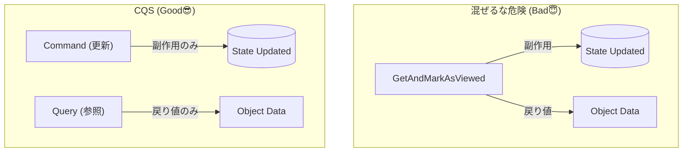
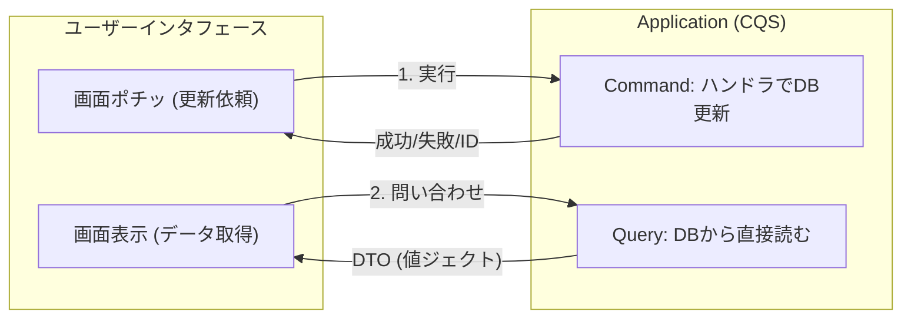

# 第16章：CQS入門：更新と参照を分けると超ラク✍️👀

### 今日のゴール🎯

* 「**Command（更新）**」と「**Query（参照）**」を混ぜると何がツラいか、体感でわかる😵‍💫
* C#で **“混ぜない形”** のAPI/クラス設計にできるようになる🧩
* モジュール内でもモジュール間でも、**読みやすくて壊れにくい**設計に近づく🚦✨

---

## まず超ざっくり結論📌✨

**CQS（Command-Query Separation）**は「メソッドは *状態を変える* か、*値を返す* か、どっちかにしよ！」っていう原則だよ😊
“質問（Query）”が副作用で世界を変えたら、バグの温床になりがち…！😇 ([martinfowler.com][1])

---

## 1) なんで「混ぜる」と地獄になるの？😇🔥


たとえばこんなメソッド、見たことない？👇

* `GetOrderDetailAndMarkAsViewed(orderId)`
  → **見た目は参照**なのに、内部で `ViewedAt` 更新してる😵
  → キャッシュしたら壊れる / テストが不安定 / 何回呼ばれたかで結果が変わる…！

CQSを守ると、こういう “こっそり副作用” が減って、
✅ 仕様が読みやすい
✅ 影響範囲が追いやすい
✅ テストが超ラク
になるよ😊✨ ([martinfowler.com][1])



---

## 2) CQSって何？（Command と Query）🧠🧩


### Command（コマンド）✍️

* **状態を変える**（DB更新、集約の状態変更、イベント発行など）
* 返り値は「結果（成功/失敗）」「ID」くらいにするのが定番✅

### Query（クエリ）👀

* **値を返す**（一覧、詳細、検索、集計）
* 参照は “世界を変えない” のが基本（副作用なし）✨ ([martinfowler.com][1])



---

## 3) CQS と CQRSの違い（混同しがち注意⚠️）

* **CQS**：メソッド/操作レベルの「混ぜない」原則（今回の主役） ([martinfowler.com][1])
* **CQRS**：もっと大きい設計で「更新モデル」と「参照モデル」を分けるパターン（必要なときだけ採用） ([martinfowler.com][2])

> つまり「まずは CQS を普段の設計で徹底する」だけでも、かなり強くなるよ💪✨

---

## 4) ダメ例😇 → 良い例😎（ミニEC：Orderingモジュール）

### ダメ例😇（混ぜてる）

* `PlaceOrder(...)` が **注文を作って**、さらに **注文詳細DTOも返す**
  → 便利に見えるけど、責務が混ざる＆テストが面倒になりやすい💥

### 良い例😎（分ける）

* Command：`PlaceOrder` → 返すのは `OrderId` とか `Result` ✅
* Query：`GetOrderDetail` → 必要なDTOを返す ✅

「作った直後に詳細が欲しい」なら、
**(1) Commandで作る → (2) Queryで取りに行く**
に分けるのがスッキリ✨（APIも読みやすい！）

---

## 5) 手を動かす（C#）⌨️✨：CQSの最小実装

ここでは **Ordering** モジュール内で、Command/Query を分けるよ🧩

### 5-1) フォルダ案📁

* `Modules/Ordering/Application/Commands/...`
* `Modules/Ordering/Application/Queries/...`
* `Modules/Ordering/Contracts/...`（外に見せるDTO/公開窓口）
* `Modules/Ordering/Infrastructure/...`

---

### 5-2) Command：注文を作る✍️🛒


```csharp
namespace Modules.Ordering.Application.Commands;

public sealed record PlaceOrderCommand(
    Guid CustomerId,
    IReadOnlyList<PlaceOrderItem> Items
);

public sealed record PlaceOrderItem(Guid ProductId, int Quantity);

public sealed record CommandResult<T>(bool IsSuccess, T? Value, string? Error)
{
    public static CommandResult<T> Ok(T value) => new(true, value, null);
    public static CommandResult<T> Fail(string error) => new(false, default, error);
}
```

```csharp
namespace Modules.Ordering.Application.Commands;

public interface IPlaceOrderHandler
{
    Task<CommandResult<Guid>> HandleAsync(PlaceOrderCommand command, CancellationToken ct);
}
```


```csharp
using Modules.Ordering.Domain;
using Modules.Ordering.Domain.Repositories;

namespace Modules.Ordering.Application.Commands;

public sealed class PlaceOrderHandler(IOrderRepository repo) : IPlaceOrderHandler
{
    public async Task<CommandResult<Guid>> HandleAsync(PlaceOrderCommand command, CancellationToken ct)
    {
        if (command.Items.Count == 0)
            return CommandResult<Guid>.Fail("商品が1つもないよ😵");

        if (command.Items.Any(x => x.Quantity <= 0))
            return CommandResult<Guid>.Fail("数量は1以上にしてね🙏");

        var order = Order.Create(command.CustomerId, command.Items
            .Select(x => new OrderLine(x.ProductId, x.Quantity))
            .ToList());

        await repo.AddAsync(order, ct);
        await repo.SaveChangesAsync(ct);

        return CommandResult<Guid>.Ok(order.Id);
    }
}
```

> ✅ Commandは「更新する」が仕事。
> ✅ 返すのはIDや結果。**詳細DTOを返し始めると混ざりやすい**ので注意⚠️

---

### 5-3) Query：注文詳細を取る👀📄


```csharp
namespace Modules.Ordering.Application.Queries;

public sealed record GetOrderDetailQuery(Guid OrderId);

public sealed record OrderDetailDto(
    Guid OrderId,
    Guid CustomerId,
    string Status,
    DateTimeOffset CreatedAt,
    IReadOnlyList<OrderLineDto> Lines
);

public sealed record OrderLineDto(Guid ProductId, int Quantity);
```

```csharp
namespace Modules.Ordering.Application.Queries;

public interface IGetOrderDetailHandler
{
    Task<OrderDetailDto?> HandleAsync(GetOrderDetailQuery query, CancellationToken ct);
}
```

```csharp
using Microsoft.EntityFrameworkCore;
using Modules.Ordering.Infrastructure;

namespace Modules.Ordering.Application.Queries;

public sealed class GetOrderDetailHandler(OrderingDbContext db) : IGetOrderDetailHandler
{
    public async Task<OrderDetailDto?> HandleAsync(GetOrderDetailQuery query, CancellationToken ct)
    {
        // Queryは「読む」だけ。AsNoTracking で軽くするのが定番✨
        return await db.Orders
            .AsNoTracking()
            .Where(o => o.Id == query.OrderId)
            .Select(o => new OrderDetailDto(
                o.Id,
                o.CustomerId,
                o.Status,
                o.CreatedAt,
                o.Lines.Select(l => new OrderLineDto(l.ProductId, l.Quantity)).ToList()
            ))
            .SingleOrDefaultAsync(ct);
    }
}
```

> ✅ Queryは “表示に必要な形（DTO）” に投影してOK！
> ✅ 参照は副作用なしが基本だよ✨ ([martinfowler.com][1])

---

## 6) APIにすると、何が嬉しい？📣🪟✨


例えばHost側（Web API）で…

* `POST /orders` → Command
* `GET /orders/{id}` → Query

って分けると、**エンドポイントも設計も超読みやすい**😍

```csharp
app.MapPost("/orders", async (
    PlaceOrderCommand cmd,
    IPlaceOrderHandler handler,
    CancellationToken ct) =>
{
    var result = await handler.HandleAsync(cmd, ct);
    return result.IsSuccess
        ? Results.Created($"/orders/{result.Value}", new { orderId = result.Value })
        : Results.BadRequest(new { error = result.Error });
});

app.MapGet("/orders/{id:guid}", async (
    Guid id,
    IGetOrderDetailHandler handler,
    CancellationToken ct) =>
{
    var dto = await handler.HandleAsync(new GetOrderDetailQuery(id), ct);
    return dto is null ? Results.NotFound() : Results.Ok(dto);
});
```

---

## 7) よくある落とし穴あるある😵‍💫⚠️

### 罠1：Commandが「ついでに」DTO返し始める

* “便利だから” で混ざると、後から地味に苦しくなる😇
  ✅ **CommandはID/結果まで**、DTOはQueryで取ろう✨

### 罠2：Queryで更新しちゃう（閲覧フラグ更新など）

* キャッシュ、リトライ、並列アクセスで破綻しやすい💥
  ✅ それが必要なら **別Command** にする✍️

### 罠3：いきなりCQRS（大分離）に飛ぶ

* CQRSは強いけど、複雑さも増えるよ⚠️
  ✅ まずは **CQSを徹底** → 必要になったらCQRS検討でOK👌 ([martinfowler.com][2])

---

## 8) ミニ演習📝✨

1. 次の “混ぜメソッド” を **2つに分割**してね✂️

* `GetOrderAndMarkAsViewed(orderId)`

  * Query：`GetOrderDetail(orderId)`
  * Command：`MarkOrderAsViewed(orderId)`

2. Queryを1つ追加しよう👀

* `SearchOrders(customerId, status, from, to)` → 一覧DTOを返す

3. Commandを1つ追加しよう✍️

* `CancelOrder(orderId, reason)` → Resultだけ返す

---

## 9) AI活用プロンプト例🤖✨（Copilot / Codex向け）

* 「このクラス、CQSに沿うようにCommandとQueryに分割して。返り値はCommandはResult、QueryはDTOで。テストもxUnitで用意して」
* 「`PlaceOrderHandler` に入力バリデーションを追加して。失敗理由をユーザー向け文言で返して」
* 「`GetOrderDetailHandler` をEF Coreで `AsNoTracking` + `Select` 投影にして、N+1が起きない形にして」

---

## まとめ（覚える1行）📌✨

**「更新(Command)と参照(Query)は混ぜない。便利そうでも分けた方が未来がラク！」** 😊🧩✨

---

### おまけ：この章で使ってる“最新”の根拠メモ🗓️

* Visual Studio 2026 は 2026-01-13 のアップデート情報が公開されてるよ（Release Notes）。([Microsoft Learn][3])
* .NET は .NET 10 系が最新として配布・更新されてる（2026-01-13 の更新情報あり）。([Microsoft][4])

[1]: https://martinfowler.com/bliki/CommandQuerySeparation.html?utm_source=chatgpt.com "Command Query Separation"
[2]: https://martinfowler.com/bliki/CQRS.html?utm_source=chatgpt.com "CQRS"
[3]: https://learn.microsoft.com/en-us/visualstudio/releases/2026/release-notes?utm_source=chatgpt.com "Visual Studio 2026 Release Notes"
[4]: https://dotnet.microsoft.com/en-us/download/dotnet?utm_source=chatgpt.com "Browse all .NET versions to download | .NET"
