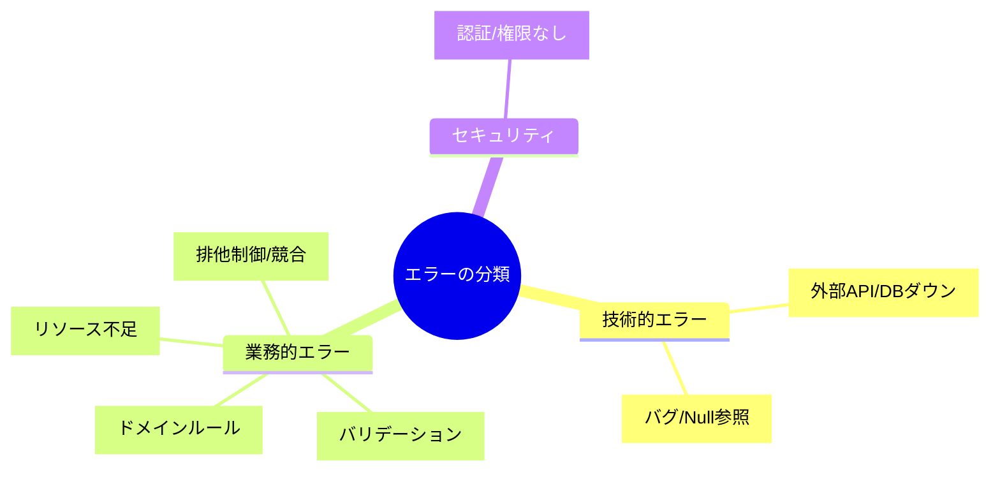
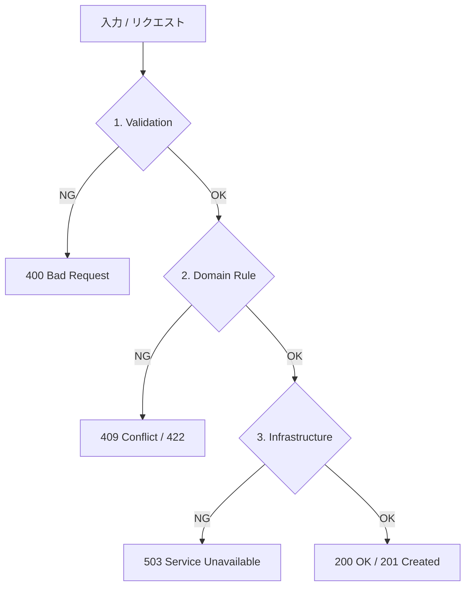
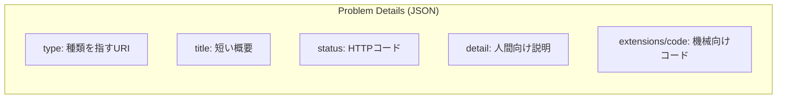

# 第17章：エラー設計①：エラーを“仕様”として分類する🚧🧩

### 今日のゴール🎯

* 「失敗」を**タイプ別に分けて**、チームで同じ言葉で話せるようにする🗣️✨
* モジュールの公開APIに、**起こり得るエラーを“仕様”として載せられる**ようにする📣🪟
* API（HTTP）に返す形を**Problem Detailsで統一**する準備をする📦🧠（RFC 9457） ([RFCエディタ][1])

---

## まずダメ例😇（あるある）


* 何でも `throw new Exception("失敗")` で終わり💥
* 画面には「エラーが発生しました」だけ😭（ユーザーは何していいかわからない）
* ログにはスタックトレースだけ📄（運用は地獄）
* どの失敗が「入力ミス」なのか「業務ルール違反」なのか「障害」なのか誰も判断できない🤯

👉 結果：**仕様が読めない**、テストが弱い、クライアントも困る、運用も困る…😵‍💫

---

## いい例😎（この章の結論）




失敗はぜんぶ「エラー」だけど、**性格が違う**んだよね🧠✨
だからまずは「分類」を決めちゃう！

### まずは“3つ＋α”でOK🧩


**基本の3つ**

1. **入力エラー（Validation）**：ユーザーの入力が変なら失敗📝
2. **業務ルール違反（Domain）**：入力は正しいけど「それはできない」🙅‍♀️
3. **インフラ障害（Infrastructure）**：DB/通信/外部APIなど都合で失敗🌩️

**よく出る＋α**

* **NotFound**（対象がない）🔎
* **Conflict**（同時更新や状態競合）⚔️
* **Auth**（認証・権限）🔐
* **Unexpected**（バグっぽい）🐛

---

## 分類ごとの「扱い方」ルール📌（超大事！）


分類が決まると、次が自動で決められるよ😊✨

### 1) 直す人は誰？👤


* Validation：**ユーザー/クライアントが直す**
* Domain：**仕様として“できない”**（画面の案内が必要）
* Infrastructure：**運用/再試行/復旧**
* Unexpected：**開発が直す（バグ）**

### 2) リトライしていい？🔁

* Infrastructure：リトライの可能性あり（タイムアウト等）
* Validation/Domain：基本リトライしても無駄🙅‍♀️

### 3) 画面に見せていい？👀

* Validation：見せてOK（どこがダメか）
* Domain：見せてOK（何がルール違反か）
* Infrastructure/Unexpected：**詳細は見せない**（情報漏えい防止）🔒



---

## HTTP（Web API）に返す形は「Problem Details」で揃える📦✨


今のASP.NET Coreでは、APIのエラー応答を **ProblemDetails** で統一するのが王道だよ🙂
標準はRFC 9457（Problem Details for HTTP APIs）で、RFC 7807を置き換える形になってるよ📜 ([RFCエディタ][1])
ASP.NET Coreのエラー処理ガイドもこの方向で整理されてるよ🧭 ([Microsoft Learn][2])

さらに、400の既定応答が `ValidationProblemDetails` になってる（=バリデーションは“構造化して返す”のが普通）っていうのもポイント🧁 ([Microsoft Learn][3])

---

## 手を動かす（C#）⌨️🧩：分類できる「エラー型」を作ろう

ここでは **“分類の器”** だけ作るよ！
（例外とResultの使い分けは次章でしっかりやるよ😆）

```csharp
namespace Modules.Shared.Errors;

public enum ErrorKind
{
    Validation,   // 入力が変
    Domain,       // 業務ルール違反（仕様）
    NotFound,     // 対象がない
    Conflict,     // 状態競合（同時更新など）
    Unauthorized, // 未ログイン
    Forbidden,    // 権限なし
    Infrastructure, // DB/外部I/O
    Unexpected    // 想定外（バグの疑い）
}

public sealed record AppError(
    string Code,        // 機械向け（例: ORDER_CART_EMPTY）
    string Title,       // 短い説明
    string? Detail,     // 人間向け（必要最小限）
    ErrorKind Kind,
    bool IsRetryable = false
);

public static class Errors
{
    public static AppError Validation(string code, string title, string? detail = null)
        => new(code, title, detail, ErrorKind.Validation);

    public static AppError Domain(string code, string title, string? detail = null)
        => new(code, title, detail, ErrorKind.Domain);

    public static AppError NotFound(string code, string title, string? detail = null)
        => new(code, title, detail, ErrorKind.NotFound);

    public static AppError Conflict(string code, string title, string? detail = null)
        => new(code, title, detail, ErrorKind.Conflict);

    public static AppError Infrastructure(string code, string title)
        => new(code, title, null, ErrorKind.Infrastructure, IsRetryable: true);

    public static AppError Unexpected(string code = "UNEXPECTED", string title = "Unexpected error")
        => new(code, title, null, ErrorKind.Unexpected);
}
```

### エラーコード命名のミニルール📛


* **大文字スネーク**：`ORDER_ALREADY_PAID` / `CATALOG_PRODUCT_NOT_FOUND`
* **モジュール名を先頭に**してもOK：`ORDERING_ORDER_ALREADY_PAID`（大規模になったら効く）💪

---

## 例：Orderingの「注文確定」で起こり得る失敗を分類してみる🛒✨

「注文する」は、だいたいこう分かれるよ👇

* Validation：住所が空、数量が0、形式が変📝
* Domain：カート空、在庫不足、支払い済み🙅‍♀️
* NotFound：カートが存在しない🔎
* Conflict：同時に二重確定しようとしてる⚔️
* Infrastructure：DBタイムアウト、外部決済が落ちた🌩️

---

## 境界（公開API）で「HTTPステータス」にマップする🧭

分類があると、HTTPも迷わない😊
（ここは“方針”を固定しちゃうのが勝ち！）

* Validation → **400**（ValidationProblemDetailsが相性◎） ([Microsoft Learn][3])
* Domain → **409**（または422）※「仕様としてできない」
* NotFound → **404**
* Conflict → **409**
* Unauthorized → **401**
* Forbidden → **403**
* Infrastructure → **503**（or 500）+ リトライ可の合図🔁
* Unexpected → **500**（詳細は隠す）🔒

そして返す本文は **ProblemDetails** に寄せるのが今どきの流れだよ📦 ([Microsoft Learn][2])



---

## ミニ演習📝✨

次のユースケースで「起こり得る失敗」を**最低3つずつ**出して、分類してみてね😊
（Catalog / Ordering / Identity を意識してね🧩）

1. 商品検索（Catalog）🔎
2. 注文確定（Ordering）🛒
3. ログイン（Identity）🔐

💡できたら、各エラーに

* Code（例：`ORDER_CART_EMPTY`）
* Kind（Validation/Domain…）
* ユーザーに見せるTitle（短く）
  を付けて“仕様リスト”にしてみよう📋✨

---

## AI活用プロンプト例🤖✨

* 「このAPI（注文確定）で起こり得る失敗を、Validation/Domain/Infrastructure/NotFound/Conflict/Authに分類して。エラーコード案も付けて」
* 「業務ルール違反（Domain）のエラーだけ、ユーザー向けメッセージを“短く・否定しない言い方”で10案出して」
* 「ProblemDetailsで返すときのstatus/title/detail/extensions(code)の設計案を出して」

---

## まとめ（覚える1行）📌

**エラーは“例外処理の話”の前に、まず“仕様として分類”する！**🚧✨

次章（第18章）で、この分類を使いながら「例外とResultをどう使い分ける？」を気持ちよく整理していくよ〜😆✅

（ちなみに今は .NET 10 / C# 14 が最新で、Visual Studio 2026 から使えるよ🪟✨） ([Microsoft Learn][4])

[1]: https://www.rfc-editor.org/rfc/rfc9457.html?utm_source=chatgpt.com "RFC 9457: Problem Details for HTTP APIs"
[2]: https://learn.microsoft.com/en-us/aspnet/core/fundamentals/error-handling-api?view=aspnetcore-10.0&utm_source=chatgpt.com "Handle errors in ASP.NET Core APIs"
[3]: https://learn.microsoft.com/ja-jp/aspnet/core/web-api/?view=aspnetcore-10.0&utm_source=chatgpt.com "ASP.NET Core を使って Web API を作成する"
[4]: https://learn.microsoft.com/en-us/dotnet/csharp/whats-new/csharp-14?utm_source=chatgpt.com "What's new in C# 14"
