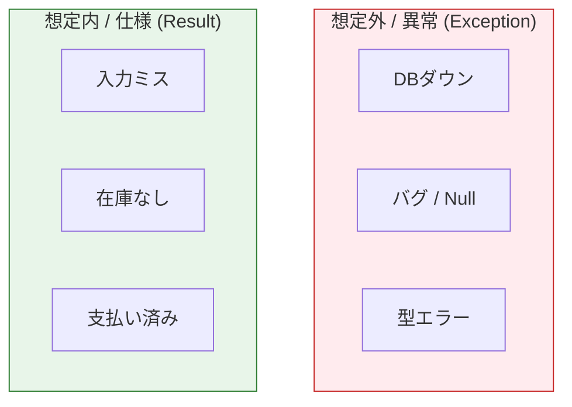
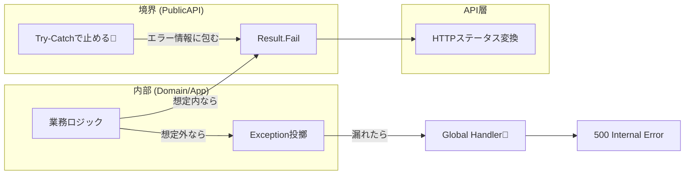

# 第18章：エラー設計②：例外とResultを使い分ける😵‍💫✅

### 今日のゴール🎯

* 「例外（Exception）」と「Result（成功/失敗の戻り値）」を、**どこで・どう使い分けるか**が分かる😊
* モジュラーモノリスで大事な「境界」で、**例外をキレイに止めてResultに変換**できるようになる🧱✨
* 最終的に API なら **ProblemDetails** までスムーズに繋げられるようになる📮🧩

（※ C# 14 が最新で .NET 10 対応だよ👍）([Microsoft Learn][1])

---

## 1) まず結論！例外とResultの使い分けルール🧭✨




### ✅ Resultを使う（＝「想定内の失敗」）🙂

* 入力ミス（Validation）
* 業務ルール違反（Business Rule）
* 見つからない（NotFound）
* 競合（Conflict：二重注文、既に支払い済み など）
  👉 **「起こりうる失敗」**は、呼び出し側が分岐しやすい Result が向いてるよ💡

### ✅ 例外を使う（＝「想定外 / 異常系」）😱

* DB 接続が落ちた、外部 API が落ちた、タイムアウト…（Infrastructure）
* null が来た、ありえない状態、バグっぽい（Unexpected / Programming error）
  👉 例外は重いし、**通常フローに使わない**のが推奨だよ🚫
  （ASP.NET Core のベストプラクティスでも「通常フローに例外を使わない」って明言されてる👍）([Microsoft Learn][2])

---

## 2) まずダメ例😇💥：例外が「仕様」になって地獄

### ダメ例あるある☠️

* NotFound を例外で表現して、画面側が try/catch で分岐してる
* 例外がモジュール境界を越えて飛び出して、別モジュールが「知らない例外」を握りつぶす
* ログが例外だらけで、本当にヤバい障害が埋もれる🫠

「例外はレアであるべき」なので、こうなると運用がしんどいよ〜😭 ([Microsoft Learn][2])

---

## 3) モジュラーモノリス的“正解ムーブ”🧩🏠✨（3つのゾーン）

### 🥚ゾーンA：モジュール内部（Domain / Application）

* **想定内の失敗 → Result**
* **想定外の失敗 → 例外（投げてOK）**

### 🧱ゾーンB：モジュール境界（公開API・窓口）

* ここが超重要！
* **例外はここで止める🛑**
* 外に出すのは **Result（整形済み）**だけにする✨

### 🌐ゾーンC：ホスト層（Web/API）

* Result を HTTP に変換（400/404/409/500 など）
* 例外が漏れた最後の保険として、**集中例外ハンドリング**を置く（IExceptionHandler など）🧯 ([Microsoft Learn][3])



---

## 4) 手を動かす（C#）⌨️✨：ミニResult型を作ろう🎁

「Shared」に置いてOKなやつ（ドメイン知識じゃなくて技術の道具だからね）🧰😊

```csharp
namespace Shared;

public enum ErrorKind
{
    Validation,
    BusinessRule,
    NotFound,
    Conflict,
    Infrastructure,
    Unexpected,
}

public sealed record Error(
    ErrorKind Kind,
    string Code,
    string Message
);

public readonly record struct Result
{
    public bool IsSuccess { get; }
    public Error? Error { get; }

    private Result(bool isSuccess, Error? error)
    {
        IsSuccess = isSuccess;
        Error = error;
    }

    public static Result Ok() => new(true, null);
    public static Result Fail(Error error) => new(false, error);
}

public readonly record struct Result<T>
{
    public bool IsSuccess { get; }
    public T? Value { get; }
    public Error? Error { get; }

    private Result(bool isSuccess, T? value, Error? error)
    {
        IsSuccess = isSuccess;
        Value = value;
        Error = error;
    }

    public static Result<T> Ok(T value) => new(true, value, null);
    public static Result<T> Fail(Error error) => new(false, default, error);
}
```

---

## 5) 例外を投げる場所・止める場所😵‍💫🛑

### 例外を“投げていい”代表例💣

* Infrastructure（DB/外部API/ファイル）での I/O 失敗
* “ありえない”状態（不変条件が壊れた、バグっぽい）

### 例外を“止める”場所🧱

* **公開API（モジュールの窓口）**
* もしくは Application の「ユースケース入口」でもOK（呼び出し規約として）

Microsoft も「回復できないならcatchしない」「上位で回復できる場所で扱う」って方針だよ🧯 ([Microsoft Learn][4])

---

## 6) ハンズオン🛒✨：Orderingモジュールでやってみる

### 例：支払いユースケース（想定内の失敗はResult）

* 既に支払い済み → Conflict（Result）
* 注文が存在しない → NotFound（Result）
* DBが落ちた → 例外（止めて Infrastructure エラーResultに変換）

```csharp
using Shared;

namespace Modules.Ordering.Application;

public sealed class PayOrderUseCase
{
    private readonly IOrderRepository _repo;

    public PayOrderUseCase(IOrderRepository repo)
    {
        _repo = repo;
    }

    public async Task<Result> ExecuteAsync(Guid orderId)
    {
        // ここは「ユースケース入口」＝境界に近い場所
        try
        {
            var order = await _repo.FindAsync(orderId);
            if (order is null)
            {
                return Result.Fail(new Error(
                    ErrorKind.NotFound,
                    "ORDER_NOT_FOUND",
                    "注文が見つかりませんでした🫥"
                ));
            }

            // ドメインルール違反は Result で返す設計にする（想定内）
            var paid = order.TryPay();
            if (!paid.IsSuccess)
            {
                return Result.Fail(paid.Error!);
            }

            await _repo.SaveAsync(order);
            return Result.Ok();
        }
        catch (Exception ex)
        {
            // 例外は外に漏らさない（モジュール外に投げない）
            // ログは本番なら必須！（ここでは省略）
            return Result.Fail(new Error(
                ErrorKind.Infrastructure,
                "INFRA_FAILURE",
                $"インフラ都合で失敗しました🙏（{ex.GetType().Name}）"
            ));
        }
    }
}
```

ドメイン側（Order）の「想定内」だけResultにしておくと、読みやすいよ😊

```csharp
using Shared;

namespace Modules.Ordering.Domain;

public sealed class Order
{
    public Guid Id { get; }
    public bool IsPaid { get; private set; }

    public Order(Guid id) => Id = id;

    public Result TryPay()
    {
        if (IsPaid)
        {
            return Result.Fail(new Error(
                ErrorKind.Conflict,
                "ORDER_ALREADY_PAID",
                "この注文はすでに支払い済みだよ💳✅"
            ));
        }

        IsPaid = true;
        return Result.Ok();
    }
}
```

---

## 7) （APIなら）Result → HTTP ProblemDetailsへ📮✨

Minimal API なら、`TypedResults` や `ProblemDetails` 系に繋げるとキレイ！
.NET 10 の Minimal API まわりは ProblemDetails とも相性良くなってるよ🧩 ([Microsoft Learn][5])

```csharp
using Microsoft.AspNetCore.Http.HttpResults;
using Shared;
using Modules.Ordering.Application;

app.MapPost("/orders/{id:guid}/pay", async Task<IResult> (Guid id, PayOrderUseCase useCase) =>
{
    var result = await useCase.ExecuteAsync(id);

    if (result.IsSuccess) return TypedResults.NoContent();

    return result.Error!.Kind switch
    {
        ErrorKind.NotFound => TypedResults.Problem(
            title: "Not Found",
            detail: result.Error.Message,
            statusCode: 404
        ),
        ErrorKind.Conflict => TypedResults.Problem(
            title: "Conflict",
            detail: result.Error.Message,
            statusCode: 409
        ),
        ErrorKind.Validation => TypedResults.Problem(
            title: "Bad Request",
            detail: result.Error.Message,
            statusCode: 400
        ),
        _ => TypedResults.Problem(
            title: "Server Error",
            detail: result.Error.Message,
            statusCode: 500
        )
    };
});
```

さらに「漏れた例外」を一括処理したいなら `IExceptionHandler` で集中管理できるよ🧯 ([Microsoft Learn][3])

---

## 8) ミニ演習📝✨（やってみよ〜！）

1. ✅ `CancelOrderUseCase` を作ってみよう🛑

* 既に発送済みならキャンセル不可 → `BusinessRule` or `Conflict` の Result
* 存在しない → NotFound

2. ✅ Error の `Code` を増やして「画面表示」と「ログ」を分けよう👀🪵

* 表示：やさしい文
* ログ：`Code` と `ex` で追えるように

3. ✅ `TryPay()` を「状態機械の入口」っぽくしてみよう🚥

* `Created` / `Paid` を enum で持って、禁止遷移を Result にする

---

## 9) AI活用プロンプト例🤖✨（Copilot/Codex向け）

* 「`Result` と `ErrorKind` を使って `CancelOrderUseCase` を実装して。NotFound/Conflict/Infrastructure を分けてね」
* 「この `Result` を HTTP に変換する `MapToHttpResult()` 拡張メソッドを書いて」
* 「`TryPay()` の単体テストを xUnit で。支払い済みのとき Conflict を返すテストも追加して」
* 「例外を catch したときのログ設計案（どの情報を入れる？）を提案して」

---

## まとめ（覚える1行）📌✨

**「想定内の失敗はResult🙂、想定外は例外😱、例外は境界で止めてResultに整える🧱」**

次の章（19章）からは、この“Resultで整えた世界”に **ドメインイベント🔔** を流していくよ〜！わくわく😊✨

[1]: https://learn.microsoft.com/en-us/dotnet/csharp/whats-new/csharp-14?utm_source=chatgpt.com "What's new in C# 14"
[2]: https://learn.microsoft.com/en-us/dotnet/standard/design-guidelines/exceptions-and-performance?utm_source=chatgpt.com "Exceptions and Performance - Framework Design Guidelines"
[3]: https://learn.microsoft.com/en-us/aspnet/core/fundamentals/error-handling?view=aspnetcore-10.0&utm_source=chatgpt.com "Handle errors in ASP.NET Core"
[4]: https://learn.microsoft.com/en-us/dotnet/standard/exceptions/best-practices-for-exceptions?utm_source=chatgpt.com "Best practices for exceptions - .NET"
[5]: https://learn.microsoft.com/en-us/aspnet/core/fundamentals/minimal-apis/responses?view=aspnetcore-10.0&utm_source=chatgpt.com "Create responses in Minimal API applications"
