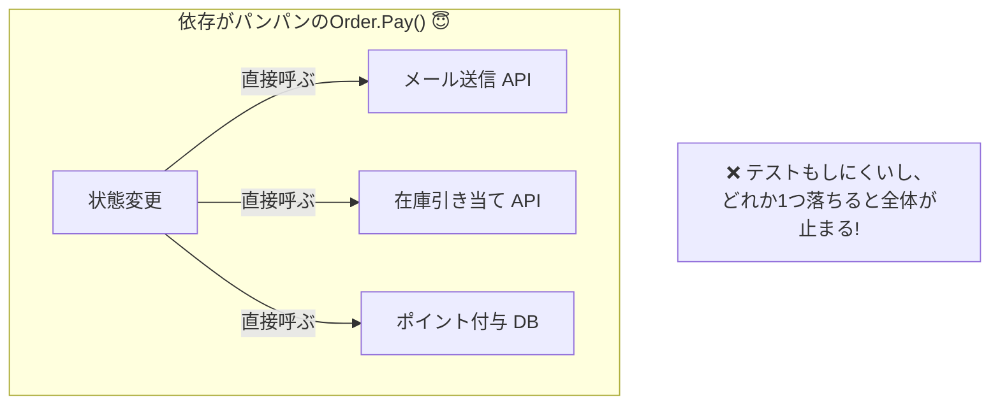
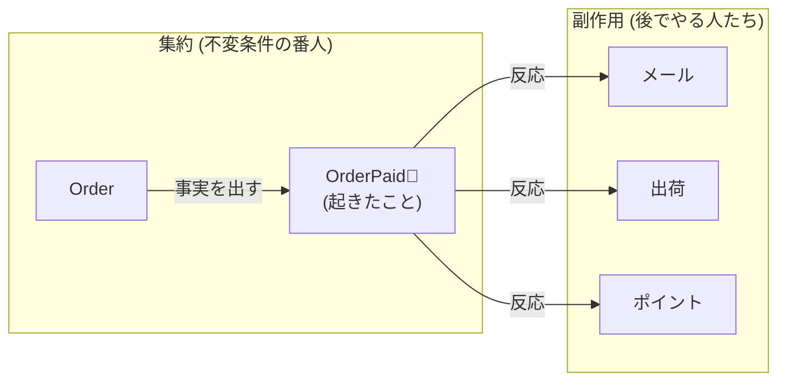
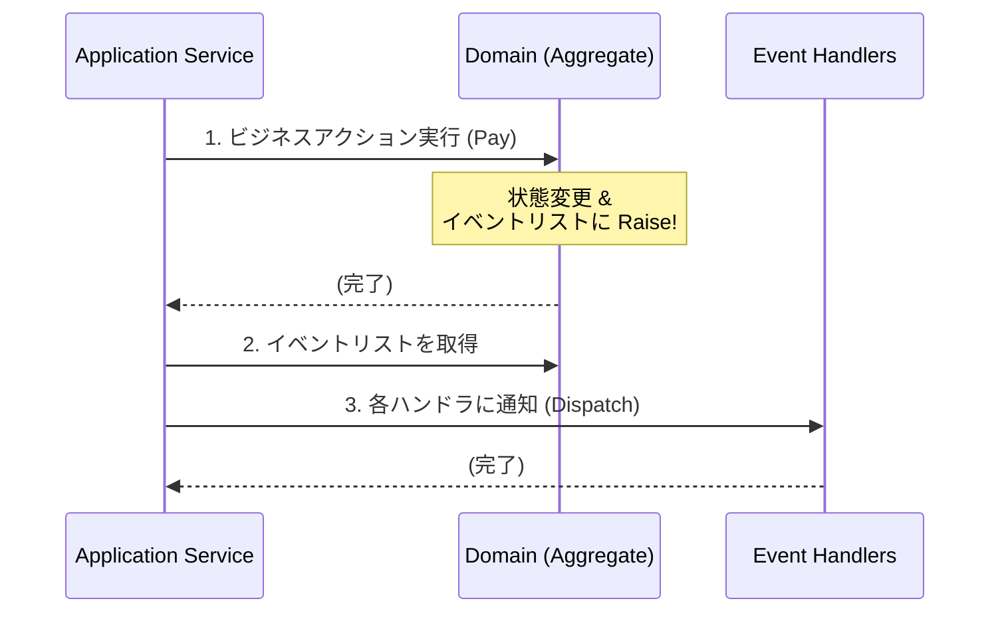

# 第19章：ドメインイベント①：イベントって何？（過去形がコツ）🔔🕰️

まず、2026/01/21時点の「今どき前提」をそろえると、最新の安定版は **.NET 10（LTS）**＆**C# 14**、ツールは **Visual Studio 2026（2026/01/13に18.2.0アップデート）**あたりが軸だよ〜🧩✨ ([Microsoft for Developers][1])
（ドメインイベント自体は“流行り廃り”より設計の基礎だから、ここを押さえるとずっと効く💪😊）

---

## 今日のゴール🎯✨

* 「ドメインイベント」＝ **“起きた事実”を表すメッセージ**だと理解する🔔
* 名前は **過去形**（OrderPaid / OrderShipped）で付けられる🕰️
* 集約（Aggregate）の中では **副作用（メール送信等）をやらず**、イベントとして外に渡す📦
* “あとで誰かが反応する”形にして、**変更に強くする**🧩✨
  ※Microsoftも「変更の副作用を明示化して疎結合にできる」って方向で説明してるよ([Microsoft Learn][2])

---

## まずダメ例😇💥（副作用を集約に詰め込む）


「支払い処理の中で、メールも在庫もポイントも全部やる」みたいなやつ…最初は気持ちいいけど、あとで爆発しがち💣😵‍💫

```csharp
public class Order
{
    public void Pay(
        IPaymentGateway paymentGateway,
        IEmailSender emailSender,
        IInventoryService inventoryService)
    {
        // ドメインの状態変更
        this.Status = OrderStatus.Paid;

        // 💥副作用がドメインに直書き（地雷）
        paymentGateway.Charge(this.TotalPrice);
        inventoryService.ReserveItems(this.Items);
        emailSender.SendPaidMail(this.CustomerEmail);
    }
}
```

### 何がツラいの？😵‍💫

* **依存が増えすぎ**：Orderが“何でも屋”になって太る🐷💦
* **テストが地獄**：支払いのテストにメール・在庫のモックが必要😇
* **変更が怖い**：メール文面変更でOrderに手を入れる羽目…😱
* **トランザクションも混ざる**：DB更新と外部I/Oが絡んで失敗時がカオス🌪️



---

## 良い例😎✨（“起きた事実”だけを出す）




### ドメインイベントとは？🔔


* **「何かをしろ」じゃない**
* **「何が起きた」**を表す（過去形！）🕰️

  * ❌ PayOrder（命令っぽい）
  * ✅ OrderPaid（起きた事実）

### イベントで得すること🧩✨

* “支払い完了”が起きたら、

  * メール送る📧
  * ポイント付与🎁
  * 請求書作る🧾
  * 出荷を進める📦
    …みたいなのを **後から追加**しやすい😆✨
    （ドメインは「Paidになった」を言うだけ）

---

## 手を動かす（C#）⌨️✨：最小ドメインイベント実装

ここでは「Orderingモジュール」内で、**Orderが支払い完了したら OrderPaid イベントを出す**ところまでやるよ🛒💳🔔

### 1) ドメインイベントの“型”を用意する🧱

```csharp
public interface IDomainEvent
{
    DateTimeOffset OccurredAt { get; }
}
```

イベントはだいたい「いつ起きたか」くらい持ってると便利⏰😊

---

### 2) “イベントを溜める”基底クラスを作る📦✨


集約（Entity / Aggregate）がイベントを出したら、いったん自分の中に保持しておく作戦！

```csharp
public abstract class Entity
{
    private readonly List<IDomainEvent> _domainEvents = new();

    public IReadOnlyList<IDomainEvent> DomainEvents => _domainEvents;

    protected void Raise(IDomainEvent domainEvent)
        => _domainEvents.Add(domainEvent);

    public void ClearDomainEvents()
        => _domainEvents.Clear();
}
```

> ここが超大事ポイント👉
> **ドメイン層は「イベントを発行（溜める）」まで**
> **実際に処理する（メール送る等）は外側**（次章以降でやるよ📦📩）

---

### 3) OrderPaidイベントを作る🔔🕰️（過去形！）

イベントは「外に渡す情報」だから、**必要最小限**がコツだよ😊
（重いオブジェクトを丸ごと入れないのが無難🙆‍♀️）

```csharp
public sealed record OrderPaid(
    Guid OrderId,
    Guid CustomerId,
    decimal PaidAmount,
    DateTimeOffset OccurredAt
) : IDomainEvent;
```

---

### 4) 集約（Order）で “Raise” する🔔✨

```csharp
public enum OrderStatus { Created, Paid }

public sealed class Order : Entity
{
    public Guid Id { get; }
    public Guid CustomerId { get; }
    public decimal TotalPrice { get; private set; }
    public OrderStatus Status { get; private set; } = OrderStatus.Created;

    public Order(Guid id, Guid customerId, decimal totalPrice)
    {
        Id = id;
        CustomerId = customerId;
        TotalPrice = totalPrice;
    }

    public void Pay(decimal amount, DateTimeOffset now)
    {
        // ✅ ルール（不変条件）チェック
        if (Status == OrderStatus.Paid)
            throw new InvalidOperationException("すでに支払い済みだよ😇");

        if (amount != TotalPrice)
            throw new InvalidOperationException("金額が一致しないよ😵‍💫");

        // ✅ 状態変更（ドメインの責務）
        Status = OrderStatus.Paid;

        // ✅ 副作用はしない。起きた事実だけ出す！
        Raise(new OrderPaid(Id, CustomerId, amount, now));
    }
}
```

---

### 5) アプリ層でイベントを取り出して処理する📦📩


ここは「最小の雰囲気」だけ作るね😊（ガチ運用は第22〜24章のOutboxで強化するよ📤💥）

```csharp
public interface IDomainEventHandler<in TEvent>
    where TEvent : IDomainEvent
{
    Task Handle(TEvent domainEvent, CancellationToken ct);
}

public sealed class OrderPaidSendMailHandler : IDomainEventHandler<OrderPaid>
{
    public Task Handle(OrderPaid e, CancellationToken ct)
    {
        Console.WriteLine($"📧 OrderPaid: order={e.OrderId} customer={e.CustomerId} amount={e.PaidAmount}");
        return Task.CompletedTask;
    }
}
```

で、アプリサービス側で「溜まってるイベントを処理」する：

```csharp
public sealed class PayOrderService
{
    private readonly OrderPaidSendMailHandler _handler;

    public PayOrderService(OrderPaidSendMailHandler handler)
        => _handler = handler;

    public async Task PayAsync(Order order, decimal amount, CancellationToken ct)
    {
        order.Pay(amount, DateTimeOffset.UtcNow);

        // 本当はここでDB保存（Repository）する想定🗄️
        // await _repo.SaveAsync(order);

        // イベントを処理（最小）
        foreach (var e in order.DomainEvents)
        {
            if (e is OrderPaid paid)
                await _handler.Handle(paid, ct);
        }

        order.ClearDomainEvents();
    }
}
```

> ここでやってるのは「ミニ版ディスパッチャ」だよ🔁
> 本格版は次章以降で「複数ハンドラ」「非同期」「Outbox」「失敗耐性」へ育てる🌱✨



---

## ちょい整理🧠✨「イベント」と「コマンド」の違い


* **コマンド（Command）✍️**：
  「支払って！」みたいに **お願い・命令**（未来形っぽい）
* **ドメインイベント（Domain Event）🔔**：
  「支払われた！」みたいに **起きた事実**（過去形🕰️）

この違いが分かると、設計が一気にスッキリするよ😆✨

---

## ミニ演習📝✨

### 演習1：イベント名を直してみよう🔔

次の名前、どれが良い？（理由も書けたら最高🎉）

* `PaymentCompleted`
* `OrderPaid`
* `PayOrder`
* `OrderWasPaid`

👉おすすめは **OrderPaid**（短くて、ドメインの言葉っぽい）😊

### 演習2：OrderShippedも作ろう📦🚚

* `OrderStatus` に `Shipped` を追加
* `Ship(now)` を実装
* `OrderShipped` イベントを Raise
* ハンドラで `Console.WriteLine("🚚 shipped!")`

### 演習3：テストを書こう🧪✨

* `Pay()` したら `DomainEvents` に `OrderPaid` が1個入る
* 2回 `Pay()` したら例外（or Result）になる（第18章とつなぐ😎）

---

## AI活用プロンプト例🤖✨（Copilot / Codex向け）

1. 「OrderPaid / OrderShipped のイベント設計を、必要最小限のフィールドで提案して。過去形で命名して」🔔🕰️
2. 「Entity基底クラスに DomainEvents を溜める実装を追加して。スレッド安全性は今は不要、シンプルに」📦
3. 「xUnitで、Pay()がOrderPaidイベントをRaiseするテストを書いて」🧪
4. 「“命令っぽいイベント名”を見つけて、過去形の自然な名前に直して」✍️➡️🔔
5. 「ドメイン層に副作用が混ざってるコードを、ドメインイベント方式にリファクタして」🧩✨

---

## まとめ（覚える1行）📌✨

**ドメインイベントは「起きた事実（過去形）」を外へ渡して、ドメインを副作用から守る🔔🛡️**

---

次の第20章では、「じゃあイベントって **どこでRaiseするのが安全？**（集約内？アプリ層？）」を“事故らない基準”で整理するよ📍🔔✨

[1]: https://devblogs.microsoft.com/dotnet/announcing-dotnet-10/?utm_source=chatgpt.com "Announcing .NET 10"
[2]: https://learn.microsoft.com/en-us/dotnet/architecture/microservices/microservice-ddd-cqrs-patterns/domain-events-design-implementation?utm_source=chatgpt.com "Domain events: Design and implementation - .NET"
