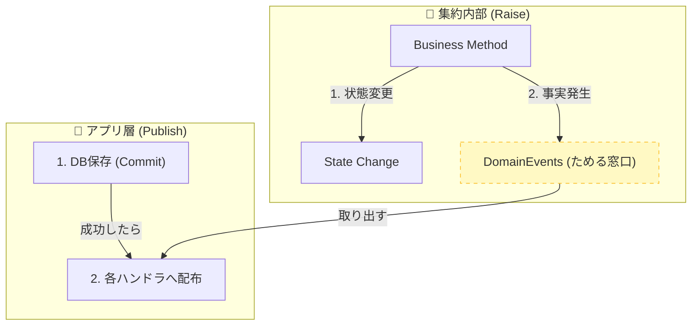
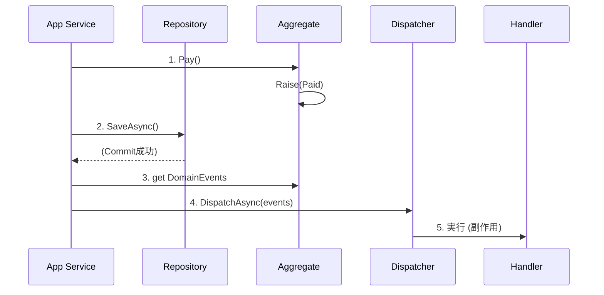

# 第20章：ドメインイベント②：どこで発行する？（Raiseポイント）📍🔔

---

### 今日のゴール🎯✨

* 「ドメインイベントを**どこでRaise（発行）**するのが正解？」が腹落ちする😊
* 「一貫性（整合性）を壊さない」Raise位置の考え方がわかる🔒
* C#で **“集約でRaise → コミット後に外で配る”** の基本形を手を動かして作れる⌨️💪

（この章の考え方は、MicrosoftのDDD/ドメインイベント解説とも方向性が一致してるよ📚✨） ([Microsoft Learn][1])

---

## まず結論🧠✨（Raiseポイントはここ！）

### ✅ 基本ルール（超だいじ）📌

**「その事実が“成立した瞬間”にRaiseする」**
そして、その“成立”を決めるのはたいてい **集約（Aggregate）** だよ🔔🧱

* **状態が変わる（＝事実が成立する）**
  → そのメソッドの中（＝集約内）でRaiseするのが自然✨
* でも… **送信（メール・通知・外部連携）までは集約でやらない** 🙅‍♀️
  → “副作用”は外に逃がす（次章21でガッツリやるよ📦📩）

---

## まずダメ例😇💥 → どう壊れる？

### ダメ例①：ControllerでRaiseしちゃう🎮💦

「注文が支払い済みになった」って、Controllerが決めていい？
…ううん、**ドメインのルールを知らない層**が “事実認定” すると事故る😵‍💫

* まだ検証前なのにイベント出しちゃう
* 例外でロールバックしたのにイベントだけ飛ぶ
* 結果、「起きてないのに起きたことになってる」世界線👻

### ダメ例②：集約の中でメール送信📧🔥

集約の `Pay()` の中で `EmailSender.Send()` とかやると…

* テストが地獄（メール送らないと通らない）😇
* 失敗時の再実行で二重送信しやすい🔁💥
* “ドメイン”が“インフラ”に汚染される🧼💦

---

## Raise位置を決める3つの判断軸🧭✨


### ① それは「集約の状態変化」？🧱

例：Orderが `Paid` になった、`Shipped` になった
➡️ **集約内でRaise** が基本✨

### ② それは「複数集約の調停」？🤝

例：注文確定後に在庫引当も必要、ポイント付与も必要…みたいな “連携の都合”
➡️ **アプリ層（ユースケース層）で調停** して、必要ならイベントを作る（ただし“事実”の源泉は集約）📦✨
（Microsoftも、複数集約にまたがるルールは最終的整合性＋ドメインイベントで扱う話をしてるよ） ([Microsoft Learn][1])

### ③ それは「技術都合」？🛠️

例：EF Coreのフックで勝手にRaise、みたいな
➡️ 初学者はまず **やらない** 方が安全🙅‍♀️（便利だけど、見えにくくなる😵）

---

## 良い例😎✨：集約でRaiseして「ためる」→ アプリ層で「配る」




## ざっくり構図（これが気持ちいいやつ）🧠🧩


1. **集約**：状態を変える + イベントを `DomainEvents` に積む🧺
2. **アプリ層**：保存（コミット）成功後に、積まれたイベントを配る📣
3. **ハンドラ**：メール・通知・ログ・他モジュール連携などの副作用を担当📦

> 「Raise（事実の発生）」と「Publish（配布）」を分ける
> これで一貫性が守りやすくなるよ🔒✨



---

## 手を動かす（C#）⌨️✨：最小の“Raise→配布”セット

### 1) Domain：イベントの型と、集約の土台🧱🔔


```csharp
namespace Ordering.Domain;

// 目印（マーカー）としてのインターフェース
public interface IDomainEvent
{
    DateTimeOffset OccurredAt { get; }
}

// 集約がイベントをため込むための土台
public abstract class AggregateRoot
{
    private readonly List<IDomainEvent> _domainEvents = new();
    public IReadOnlyList<IDomainEvent> DomainEvents => _domainEvents;

    protected void AddDomainEvent(IDomainEvent e) => _domainEvents.Add(e);
    public void ClearDomainEvents() => _domainEvents.Clear();
}
```

### 2) Domain：Order集約で「事実成立の瞬間」にRaiseする🛒✅


```csharp
namespace Ordering.Domain;

public enum OrderStatus { Created, Paid, Shipped, Cancelled }

public sealed record OrderId(Guid Value);
public sealed record PaymentId(Guid Value);

// 「支払い完了」という “起きた事実” ✅（過去形）🔔
public sealed record OrderPaid(OrderId OrderId, PaymentId PaymentId, DateTimeOffset OccurredAt) : IDomainEvent;

public sealed class Order : AggregateRoot
{
    public OrderId Id { get; }
    public OrderStatus Status { get; private set; } = OrderStatus.Created;

    public PaymentId? PaidBy { get; private set; }
    public DateTimeOffset? PaidAt { get; private set; }

    public Order(OrderId id) => Id = id;

    public void Pay(PaymentId paymentId, DateTimeOffset now)
    {
        // ここが「一貫性を守る」場所🔒
        if (Status != OrderStatus.Created)
            throw new InvalidOperationException("この注文は支払いできません");

        Status = OrderStatus.Paid;
        PaidBy = paymentId;
        PaidAt = now;

        // ✅ 事実が成立した瞬間にRaise（ここがRaiseポイント）🔔
        AddDomainEvent(new OrderPaid(Id, paymentId, now));
    }
}
```

### 3) Application：保存成功後にイベントを配る📦📣


```csharp
namespace Ordering.Application;
using Ordering.Domain;

public interface IOrderRepository
{
    Task<Order?> FindAsync(OrderId id, CancellationToken ct);
    Task SaveAsync(Order order, CancellationToken ct);
}

// 「配る」係（中身は後で差し替えOK）🧩
public interface IDomainEventDispatcher
{
    Task DispatchAsync(IEnumerable<IDomainEvent> events, CancellationToken ct);
}

public sealed class PayOrderUseCase
{
    private readonly IOrderRepository _repo;
    private readonly IDomainEventDispatcher _dispatcher;

    public PayOrderUseCase(IOrderRepository repo, IDomainEventDispatcher dispatcher)
    {
        _repo = repo;
        _dispatcher = dispatcher;
    }

    public async Task ExecuteAsync(Guid orderId, Guid paymentId, CancellationToken ct)
    {
        var order = await _repo.FindAsync(new OrderId(orderId), ct)
                   ?? throw new InvalidOperationException("注文が見つかりません");

        order.Pay(new PaymentId(paymentId), DateTimeOffset.UtcNow);

        // ✅ まず保存（コミット）
        await _repo.SaveAsync(order, ct);

        // ✅ 保存成功後に配る（Publishは外！）
        await _dispatcher.DispatchAsync(order.DomainEvents, ct);
        order.ClearDomainEvents();
    }
}
```

この形にしておくと、あとで **Outbox（第22〜24章）** に繋げるのが超ラクになるよ🔁📤✨
（「DB更新とイベント送信がズレる」問題に自然に対処できるルート！）

---

## ちょい上級🍰：EF Coreで“コミット後に配る”を自動化する話（軽く）


「`SaveChanges` のタイミングで配りたい」ってなったら、EF Coreには **SaveChangesInterceptor** があるよ🧩
公式にも `SaveChangesInterceptor` が用意されてる（EF Core 10でもOK） ([Microsoft Learn][2])
EF Core 10は .NET 10 前提のLTSで、2028年11月までサポート予定だよ📅✨ ([Microsoft Learn][3])

ただし！最初は “見える形（手でDispatch）” の方が理解が早い😊✨
Interceptorは慣れてからでOKだよ〜👍

---

## Raiseポイントの早見表🧾✨

* **集約内でRaiseする（おすすめ）** 😎

  * ✅ “OrderがPaidになった” みたいな **状態変化の事実**
  * ✅ 不変条件（ルール）を通過したあとに出せる

* **アプリ層でRaiseする（条件付き）** 🤔

  * ✅ “複数集約の調停が完了した” みたいな **ユースケースの節目**
  * ✅ ただし、元になる事実は各集約でRaiseしておくのが基本

* **UI/Controller/InfrastructureでRaiseする（避けたい）** 🙅‍♀️

  * ❌ 事実認定がズレる
  * ❌ ロールバックとイベントがズレやすい

---

## ミニ演習📝✨（手を動かすと定着するよ〜！）

1. `OrderShipped` イベントを追加してみよう🚚🔔

   * `Ship()` メソッドで `Status = Shipped` にしてからRaiseできてる？
2. 「支払い済みの注文だけ発送できる」ガード条件を入れよう🚧
3. “ポイント付与”はどこでやる？🎁

   * ヒント：**Orderの中でポイントを増やす？** → たぶん違う😆
   * 「OrderPaidをハンドラで受けて、別の処理を起動」が気持ちいい✨

---

## AI活用プロンプト例🤖✨（Copilot / Codex向け）

* 「`AggregateRoot` に DomainEvents を持たせて、`Order.Pay()` が `OrderPaid` をRaiseする形にリファクタして」🧹✨
* 「`PayOrderUseCase` のテストを書いて。イベントが1回だけ発行されることも検証して」🧪🔁
* 「“Raiseは集約、Publishは外” を守れていない箇所がないかレビューして、修正案も出して」🔍🧠

---

## まとめ（覚える1行）📌✨

**「事実が成立した瞬間に集約でRaise。配布（副作用）はコミット後に外でやる」** 🔔🧱➡️📦

---

必要なら次の第21章で、**“副作用を外に逃がすハンドラ設計”** を気持ちよく作っていこうね😆📩✨
（メール送信・通知・ログが“後付けで増やせる快感”くるよ〜！）

[1]: https://learn.microsoft.com/en-us/dotnet/architecture/microservices/microservice-ddd-cqrs-patterns/domain-events-design-implementation?utm_source=chatgpt.com "Domain events: Design and implementation - .NET"
[2]: https://learn.microsoft.com/en-us/dotnet/api/microsoft.entityframeworkcore.diagnostics.savechangesinterceptor?view=efcore-10.0&utm_source=chatgpt.com "SaveChangesInterceptor Class"
[3]: https://learn.microsoft.com/en-us/ef/core/what-is-new/ef-core-10.0/whatsnew?utm_source=chatgpt.com "What's New in EF Core 10"
