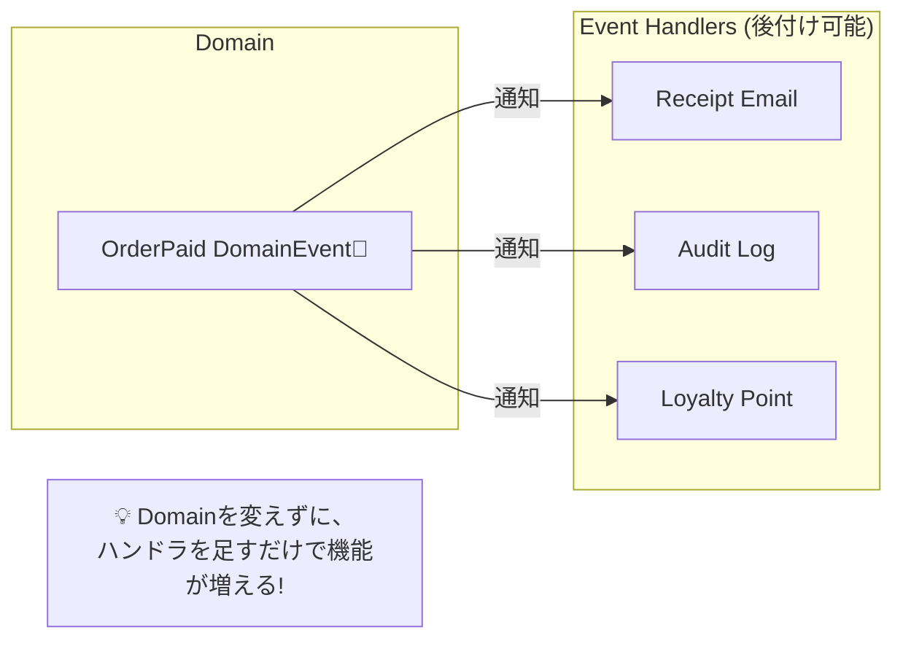
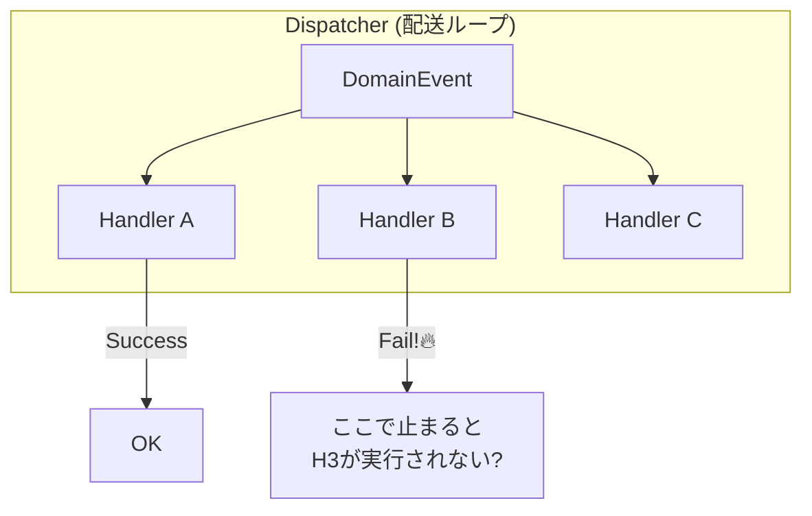

# 第21章：ドメインイベント③：ハンドラ設計（副作用は外へ）📦📩

ミニECの「注文が支払われた（OrderPaid）」を例に、**“起きた事実”に反応して動く仕組み**を作るよ〜！😊
ここから一気に「機能追加がラクになる」感覚が出てくる章です🎉

---

## 今日のゴール🎯✨

* ドメイン（集約）から **副作用（メール送信・通知・ログ・外部API）を追い出せる**ようになる📤
* ドメインイベントの **ハンドラ設計の型（置き場所・責務・DI）**を覚える🧩
* 「同じイベントに、複数の反応を足せる」状態にする（疎結合の快感😆）🌈

---

## まずダメ例😇 → 良い例😎

### ダメ例😇：集約の中で副作用やりまくり💥


「支払い完了したらメール送って、ポイント付与して、Slack通知して…」を **Orderの中で直に**やるやつ。

* テストが地獄😵（メール送信のモック、外部API、ログ…）
* 失敗時の扱いがぐちゃぐちゃ（DB更新は成功したのにメール失敗…みたいなズレ）📉
* 機能追加のたびに Order が肥大化🍔

### 良い例😎：集約は“事実を宣言”だけ🔔✨

集約はこう言うだけ：

> 「支払いが完了した（OrderPaid）」🔔

実際にメールを送るのは、外の世界（ハンドラ）に任せる📩➡️

---

## ハンドラ設計の基本ルール（超大事）🧠🧩




### ルール1️⃣：**ドメインは“副作用ゼロ”が目標**🧼✨

* ドメイン（Domain）は「正しい状態遷移」「不変条件」だけ守る💎
* メール・通知・外部API・ログは **アプリ層/インフラ層へ**📦

### ルール2️⃣：ハンドラは「反応して外へ投げる係」📩➡️


ハンドラの仕事はだいたいこの3つ：

* 通知する（メール、Push、Slack）📣
* 記録する（監査ログ、分析イベント）📝
* “次の仕事”を作る（別処理のキック）🚀

### ルール3️⃣：**ハンドラから集約を直接いじらない**🙅‍♀️


イベントを受けて、また同じ集約を更新すると…

* 無限ループの香り♾️😇
* “いつどの順で”問題が爆発💥

> 更新が必要なら、**別のCommand（ユースケース）**として起こす、が安全✍️

### ルール4️⃣：同じイベントにハンドラは複数OK🎉

「OrderPaid」に対して

* レシートメール送る📩
* 会計ログを書く🧾
* ポイント付与の処理をキック🎁
  みたいに **追加するだけ**で拡張できる✨

### ルール5️⃣：イベントの配送は“遅延配送”が基本⏳

ドメインイベントは、**即時にハンドラを呼ばず**、いったん溜めておいて
**トランザクション確定の前後（SaveChangesの前後）**でまとめて配るのが定番だよ🧠✨ ([Microsoft Learn][1])

（ここは次の Outbox 章にも繋がるやつ！📤💥）

---

## 置き場所のおすすめ（モジュラーモノリス向け）🏠🧩


Orderingモジュールの例：

* `Modules/Ordering/Domain/Events/`

  * ドメインイベント（“起きた事実”）だけ置く🔔
* `Modules/Ordering/Application/EventHandlers/`

  * ドメインイベントハンドラ（ユースケース寄り）📦
* `Modules/Ordering/Infrastructure/...`

  * メール送信などの実装（外部I/O）📩🌐

---

## 手を動かす（C#）⌨️✨

（例：OrderPaid を受けて「レシートメール送信」と「監査ログ」を追加するよ😊）

> ちなみに今どきの前提としては **.NET 10（LTS）**が最新で、2025-11-11リリース＆2028-11-14までサポートの見込みだよ📅✨ ([Microsoft][2])
> 言語は **C# 14 が最新**で .NET 10 でサポートされてるよ🧠✨ ([Microsoft Learn][3])

---

### 1) ドメインイベントを用意する🔔

```csharp
namespace Modules.Ordering.Domain.Events;

public interface IDomainEvent
{
    DateTime OccurredAtUtc { get; }
}

public sealed record OrderPaidDomainEvent(
    Guid OrderId,
    Guid CustomerId,
    decimal Amount
) : IDomainEvent
{
    public DateTime OccurredAtUtc { get; } = DateTime.UtcNow;
}
```

---

### 2) 集約でイベントを“溜める”🧺✨

```csharp
namespace Modules.Ordering.Domain;

using Modules.Ordering.Domain.Events;

public abstract class AggregateRoot
{
    private readonly List<IDomainEvent> _domainEvents = new();
    public IReadOnlyCollection<IDomainEvent> DomainEvents => _domainEvents;

    protected void Raise(IDomainEvent ev) => _domainEvents.Add(ev);
    public void ClearDomainEvents() => _domainEvents.Clear();
}

public sealed class Order : AggregateRoot
{
    public Guid Id { get; private set; }
    public Guid CustomerId { get; private set; }
    public decimal TotalAmount { get; private set; }
    public bool IsPaid { get; private set; }

    public void MarkAsPaid()
    {
        if (IsPaid) return; // ざっくりガード（詳細は状態機械章で✨）
        IsPaid = true;

        Raise(new OrderPaidDomainEvent(Id, CustomerId, TotalAmount));
    }
}
```

---

### 3) ハンドラの共通インターフェースを作る🧩

MediatR みたいなライブラリを使う方法もあるけど、まずは **最小の自前**でいくね😊

```csharp
namespace Modules.SharedKernel.Events;

public interface IDomainEventHandler<in TEvent>
{
    Task Handle(TEvent ev, CancellationToken ct);
}
```

---

### 4) 副作用サービスはインターフェースで抽象化🔌✨

```csharp
namespace Modules.Ordering.Application.Abstractions;

public interface IEmailSender
{
    Task SendAsync(string to, string subject, string body, CancellationToken ct);
}

public interface IAuditLogger
{
    Task WriteAsync(string message, CancellationToken ct);
}
```

---

### 5) イベントハンドラを書く（副作用はここ）📩📝

#### ✅ レシートメール送信ハンドラ📩

```csharp
namespace Modules.Ordering.Application.EventHandlers;

using Modules.Ordering.Application.Abstractions;
using Modules.Ordering.Domain.Events;
using Modules.SharedKernel.Events;

public sealed class SendReceiptEmailOnOrderPaidHandler
    : IDomainEventHandler<OrderPaidDomainEvent>
{
    private readonly IEmailSender _email;

    public SendReceiptEmailOnOrderPaidHandler(IEmailSender email)
        => _email = email;

    public Task Handle(OrderPaidDomainEvent ev, CancellationToken ct)
    {
        var subject = $"お支払いありがとうございます🧾✨ Order: {ev.OrderId}";
        var body = $"合計: {ev.Amount} 円\nいつもありがとう😊";
        // ここでは例として to を固定にしないで、CustomerId→メール解決を別サービスにしてもOK👍
        return _email.SendAsync("customer@example.com", subject, body, ct);
    }
}
```

#### ✅ 監査ログハンドラ📝


```csharp
namespace Modules.Ordering.Application.EventHandlers;

using Modules.Ordering.Application.Abstractions;
using Modules.Ordering.Domain.Events;
using Modules.SharedKernel.Events;

public sealed class AuditOnOrderPaidHandler
    : IDomainEventHandler<OrderPaidDomainEvent>
{
    private readonly IAuditLogger _audit;

    public AuditOnOrderPaidHandler(IAuditLogger audit)
        => _audit = audit;

    public Task Handle(OrderPaidDomainEvent ev, CancellationToken ct)
        => _audit.WriteAsync($"OrderPaid: order={ev.OrderId} amount={ev.Amount}", ct);
}
```

👆見て！同じイベントに **ハンドラ2つ**付けられた🎉
これが「機能追加が怖くなくなる」第一歩だよ〜😆✨

---

### 6) “配送係（ディスパッチャ）”を用意する📦🚚


溜まっている DomainEvents を集めて、該当ハンドラ全部に配る係！

```csharp
namespace Modules.SharedKernel.Events;

using Microsoft.Extensions.DependencyInjection;

public interface IDomainEventDispatcher
{
    Task DispatchAsync(IEnumerable<object> domainEvents, CancellationToken ct);
}

public sealed class DomainEventDispatcher : IDomainEventDispatcher
{
    private readonly IServiceProvider _sp;

    public DomainEventDispatcher(IServiceProvider sp) => _sp = sp;

    public async Task DispatchAsync(IEnumerable<object> domainEvents, CancellationToken ct)
    {
        foreach (var ev in domainEvents)
        {
            // ev の型に対する IDomainEventHandler<T> を全部取り出して順番に実行
            var handlerType = typeof(IDomainEventHandler<>).MakeGenericType(ev.GetType());
            var handlers = _sp.GetServices(handlerType);

            foreach (var handler in handlers)
            {
                var method = handlerType.GetMethod("Handle")!;
                var task = (Task)method.Invoke(handler, new[] { ev, ct })!;
                await task.ConfigureAwait(false);
            }
        }
    }
}
```

> 現実のプロジェクトでは MediatR を使って同じことをもっと綺麗にすることも多いよ😊
> でも今は「仕組みが腹落ち」するのが最優先👍

---

### 7) いつDispatchするの？⏳（超重要ポイント）

おすすめは、**SaveChangesの前後**で「まとめてDispatch」だよ✨ ([Microsoft Learn][1])
EF Coreなら SaveChangesInterceptor を使うと、DbContextを汚さずに差し込めるよ〜🧰 ([Microsoft Learn][4])

（この“ズレ問題”が次の Outbox 章の主役になる📤💥）



---

## ミニ演習📝✨

1. `OrderPaidDomainEvent` に対して「ポイント付与」を追加してみよう🎁

   * `ILoyaltyPointService.AddPoints(customerId, points)` みたいなインターフェースを作って
   * ハンドラ1個追加するだけでOKにする😊

2. ハンドラが失敗したとき（メール送信失敗など）に

   * 例外にする？ログだけ？リトライ？
     を「エラー設計（第17-18章）」の分類で考えてみよう🚧✨

---

## よくある落とし穴⚠️😵

* **ハンドラの中でDB更新を始めて、地獄の依存ループ**になる♻️💥
  → 更新したいなら “別のユースケース” に切る✍️
* **ハンドラの順序に依存**しちゃう（先にログ、次にメール…みたいな前提）
  → 依存しない設計に寄せる（順序は保証しない方が安全）🧠
* **イベントに情報を詰め込みすぎる**（巨大DTO化）🍔
  → まずは “事実” に必要最小限だけ載せる🔔

---

## AI活用プロンプト例🤖✨

* 「`OrderPaidDomainEvent` を受けて、メール送信する `IDomainEventHandler<OrderPaidDomainEvent>` をC#で書いて。副作用は `IEmailSender` 経由にして、テストしやすくして」📩🧪
* 「同じイベントに監査ログも追加したい。`IAuditLogger` を使うハンドラを追加して。依存関係が増えないように」📝🧩
* 「Domainに副作用が入ってるかチェックする観点をリスト化して」🔍✅

---

## まとめ（覚える1行）📌✨

**「ドメインは“事実を宣言”だけ。副作用はハンドラに逃がす！」** 🔔➡️📩🧩

---

次の第22章は、この章でチラ見せした「DB更新とイベント送信がズレる問題」📤💥を、Outboxで倒しに行くよ〜！😆🔥

[1]: https://learn.microsoft.com/en-us/dotnet/architecture/microservices/microservice-ddd-cqrs-patterns/domain-events-design-implementation?utm_source=chatgpt.com "Domain events: Design and implementation - .NET"
[2]: https://dotnet.microsoft.com/ja-jp/platform/support/policy/dotnet-core?utm_source=chatgpt.com ".NET および .NET Core の公式サポート ポリシー"
[3]: https://learn.microsoft.com/en-us/dotnet/csharp/whats-new/csharp-14?utm_source=chatgpt.com "What's new in C# 14"
[4]: https://learn.microsoft.com/en-us/ef/core/logging-events-diagnostics/interceptors?utm_source=chatgpt.com "Interceptors - EF Core"
