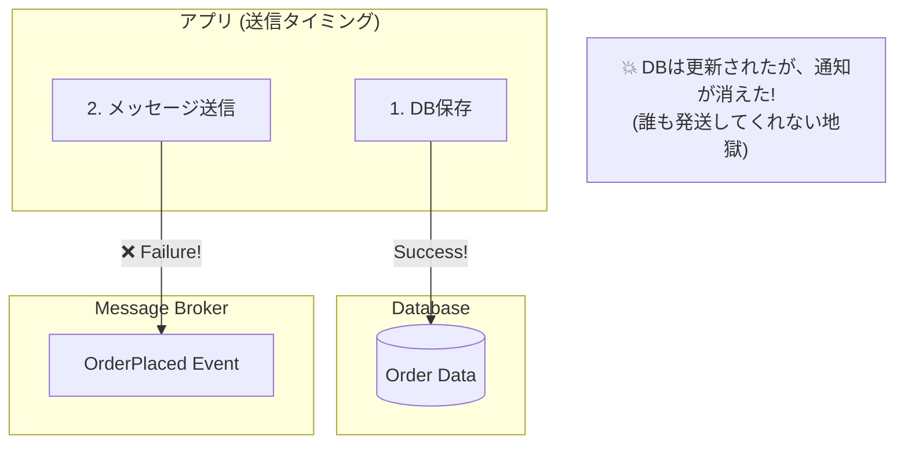
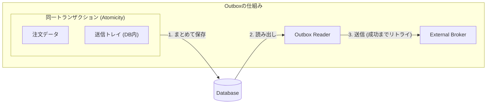

# 第22章：Outbox①：なぜ必要？「DB更新とイベント送信がズレる」問題📤💥

第19〜21章で「ドメインイベント便利〜！🔔✨」ってなったよね😊
でも現実の世界では、イベントを**外に送る**瞬間に“事故”が起きます😇💣
その事故の名前がだいたい **Dual Write（2重書き）問題** です。

---

## 今日のゴール🎯

* **「DBの更新」と「イベント送信」がズレる**と何が起きるか、腹落ちする😵‍💫
* Outboxが**なぜ効くのか**を、図と例で理解する🧠✨
* 次章（Outbox実装）に向けて、**必要な用語と注意点**を押さえる✅

---

## まず結論（超ざっくり）📌

**DB更新とイベント送信を“別々に成功させよう”とするとズレる。**
だから、**「送る予定」をDBに一緒に書いて**、あとで安全に送る📤✅
これが **Outbox（送信トレイ）** です。 ([AWS ドキュメント][1])

---

## まずダメ例😇 → 何がダメなの？

### “よくある正直な実装”😇（でも危険）

「注文を確定したら、DB保存して、イベント送信するだけだよね？」ってやつ。

```csharp
public async Task PlaceOrderAsync(Order order)
{
    // 1) DB更新（注文を保存）
    await _db.Orders.AddAsync(order);
    await _db.SaveChangesAsync();

    // 2) イベント送信（他モジュールへ通知）
    await _bus.PublishAsync(new OrderPlaced(order.Id));
}
```

**問題は「この2つが別の世界」ってこと**😵

* DBはDBの都合で失敗する
* 送信はネットワークやブローカーの都合で失敗する
* しかも、**片方だけ成功**が普通に起こる😇

---

## “ズレ”が起きる4つの地獄👻（ここが本質）




同じ処理なのに、結果が割れるのが怖いポイント！

### ケースA：DB成功✅ / 送信失敗❌（めっちゃ多い）

* 注文はDBに入った
* でもイベントが飛んでない
  → 他モジュールが「注文来てない」と思う
  → **発送されない / メール来ない / 在庫引かれない**…😇📦

### ケースB：DB失敗❌ / 送信成功✅（さらに怖い）


* DBには注文がない（ロールバック）
* でもイベントだけ飛んだ
  → 受け手は「注文がある前提」で動く
  → **幽霊イベント（ghost message）** 的な状態👻
  ※「キューやDBが分散トランザクションをサポートしない」ことが多く、こういう不整合が起きうる、という説明が定番です。 ([docs.particular.net][2])

### ケースC：両方失敗❌❌

* まあ、これはまだマシ（何も起きない）😇

### ケースD：両方成功✅✅

* 理想✨（でもA/Bが混ざる世界で運用するのが現実）




---

## なんでこうなるの？（超やさしく）🧠

**「DB」と「メッセージ送信」は別システム**だから。
“同時に絶対成功させる”には分散トランザクションみたいな考えが出るけど、現代の構成だと「使えない/使わない」ケースが多いです。だから **Outbox** が王道になります。 ([docs.particular.net][2])

---

## 良い例😎：Outboxの考え方（第22章はここを理解する章！）📤✅


### アイデアはこれだけ！

**イベントを送る前に、まず「送る予定」をDBに保存する。**
しかも **業務データの更新と同じトランザクション**で。

```
[同一トランザクション]
  ✅ Orders を更新
  ✅ OutboxMessages に「OrderPlaced送るよ」を書く
コミット！

[別プロセス/別スレッド]
  🔁 OutboxMessages を読んで
  📤 ブローカーへ送信
  ✅ 送った印を付ける
```

この“送信トレイ”が Outbox🗒️✨
「確実に届けたい」系の説明として、Microsoft/AWS などでも Transactional Outbox は定番パターン扱いです。 ([Microsoft Learn][3])

---

## Outboxが解決するポイント💪✨

### 1) 「DB成功なのに送れない」を“あとで回収”できる🔁


送信が失敗しても、Outboxに残ってるから
**リトライで取り返せる**💪

### 2) 「送ったのにDBにない」幽霊イベントを減らせる👻→✅

DB更新がコミットされなかったら、Outboxにも書かれない。
つまり、**送る根拠がDBに残らない**。

### 3) 運用が強くなる🧰

* 「Outboxの滞留」が監視できる👀
* 障害時も“溜まるだけ”で、復旧後に流せる🚚✨

---

## ただし！Outboxにも“落とし穴”がある😵‍💫（次章への伏線）

Outboxは「ズレ」を減らすけど、**別の現実**が出るよ👇

### ✅ 基本は “少なくとも1回” 配信（At-least-once）


リトライすると、**同じイベントが2回届く**ことがある🔁
だから次の章（第25章：冪等性🔁🛡️）が超重要になる！

### ✅ 順序も意識が必要（OrderCreated の後に OrderPaid とか）

Outboxを実装するとき、**イベント順序**を崩さない設計が要るよ〜って注意もよく言われます。 ([Microsoft Learn][4])

---

## 手を動かす（C#）⌨️✨：ズレを“体験”してみよう😇💥

DBやブローカー無しで、**疑似的に事故る**ミニ実験！
（Visual Studioで Console App 作って貼り付けでOK✨）

```csharp
using System;
using System.Collections.Generic;

public static class Program
{
    static readonly Random Rng = new();

    public static void Main()
    {
        var db = new List<string>();      // DBのつもり
        var broker = new List<string>();  // ブローカーのつもり

        for (int i = 1; i <= 20; i++)
        {
            var orderId = $"ORD-{i:000}";
            try
            {
                // 1) DB更新（たまに失敗）
                MaybeFail(0.15, "DB Save failed");
                db.Add(orderId);

                // 2) イベント送信（たまに失敗）
                MaybeFail(0.20, "Publish failed");
                broker.Add($"OrderPlaced:{orderId}");

                Console.WriteLine($"✅ OK {orderId}");
            }
            catch (Exception ex)
            {
                Console.WriteLine($"💥 NG {orderId} : {ex.Message}");
            }
        }

        // 不整合を観察
        Console.WriteLine("\n--- 結果 ---");
        Console.WriteLine($"DB件数     : {db.Count}");
        Console.WriteLine($"Broker件数 : {broker.Count}");

        // DBにあるのにイベントがない（ケースA）
        int missing = 0;
        foreach (var id in db)
        {
            if (!broker.Contains($"OrderPlaced:{id}")) missing++;
        }
        Console.WriteLine($"DBだけ成功（通知漏れ）: {missing}");
    }

    static void MaybeFail(double probability, string message)
    {
        if (Rng.NextDouble() < probability) throw new Exception(message);
    }
}
```

🎉 これで「DBだけ成功（通知漏れ）」が普通に出るはず！
この“漏れ”を現実の運用でゼロにしたい → Outboxへ📤✅

---

## ミニ演習📝✨（理解チェック）

1. 上の実験で出た「DBだけ成功」のとき、ECサイト利用者には何が起きそう？😵

   * 例：画面は注文完了って出たのに、メール来ない…📩❌

2. 逆に「イベントだけ成功（幽霊イベント）」が起きたら、受け手は何をしがち？👻

   * 例：在庫だけ減る、請求だけ走る…😇

3. Outboxで“完全に消えない問題”はどれ？（ヒント：🔁）

   * ✅ 重複（2回届く） → だから冪等性！

---

## AI活用プロンプト例🤖✨（コピペOK）

### ① 事故パターンを洗い出す

「注文確定→DB保存→イベント発行」の処理で起きる不整合パターンを、
“DB成功/失敗 × 発行成功/失敗” の表で整理して。
それぞれのユーザー影響と、運用で起きる症状（問い合わせ例）も書いて。

### ② 自分の題材に当てはめる

私のシステムは「◯◯（例：予約、課金、発送）」があり、
DB更新と外部通知（メール/別サービス/キュー）があります。
Outboxが必要になる境界を、モジュラーモノリスのモジュール単位で提案して。
“今すぐ必要/後でOK” の判断基準もください。

### ③ ログ・監視の観点

Outbox方式を入れた場合に、監視すべきメトリクス（滞留件数、最古メッセージの経過時間など）と、
アラート条件の例を提案して。

---

## まとめ（覚える1行）📌✨

**DB更新とイベント送信はズレるのが普通。だから「送る予定」をDBに一緒に書く（Outbox）📤✅**

---

## 次章予告👀✨（第23章）

次は **最小Outbox実装**！

* Outboxテーブルの最小設計🗒️
* “同一トランザクションで一緒に書く”✅
* 送信ワーカーがどう動くか🔁🚚

ちなみに .NET 10 / C# 14 / Visual Studio 2026 の最新環境で進めるよ〜🛠️✨ ([devblogs.microsoft.com][5])

[1]: https://docs.aws.amazon.com/prescriptive-guidance/latest/cloud-design-patterns/transactional-outbox.html?utm_source=chatgpt.com "Transactional outbox pattern - AWS Prescriptive Guidance"
[2]: https://docs.particular.net/nservicebus/outbox/?utm_source=chatgpt.com "Outbox • NServiceBus - Particular Developer Portal"
[3]: https://learn.microsoft.com/en-us/azure/architecture/databases/guide/transactional-outbox-cosmos?utm_source=chatgpt.com "Transactional Outbox pattern with Azure Cosmos DB"
[4]: https://learn.microsoft.com/ja-jp/azure/architecture/databases/guide/transactional-outbox-cosmos?utm_source=chatgpt.com "Azure Cosmos DB を使用したトランザクション送信トレイ パターン"
[5]: https://devblogs.microsoft.com/dotnet/announcing-dotnet-10/?utm_source=chatgpt.com "Announcing .NET 10"
