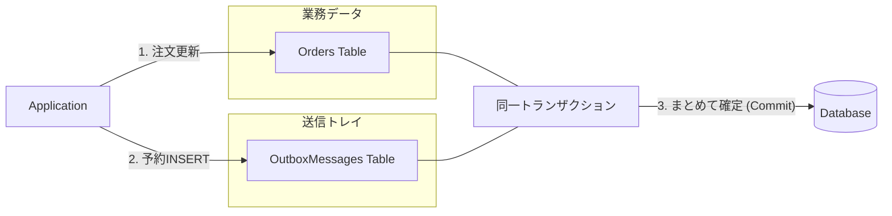
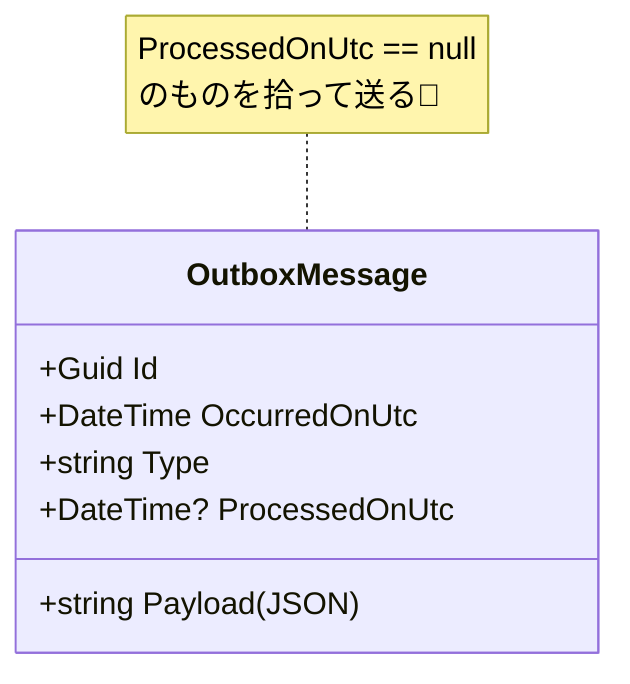

# 第23章：Outbox②：最小Outbox実装（テーブルに書くだけ）🗒️✅

（今どきの前提として：**.NET 10 + C# 14**が最新ラインだよ〜✨）([Microsoft Learn][1])

---

## 今日のゴール🎯

**「注文の更新」＋「イベント送信の予約（Outboxに書く）」を、同じトランザクションで確実にセットで成功させる**こと！💪✨
送信はまだしないよ！まずは「書く」だけ✍️🗒️

Transactional Outbox は「DB更新とメッセージ送信（予定）」の**二重書き（Dual-Write）問題**を避けるための定番パターンだよ〜📦🔁([microservices.io][2])

---

## まずダメ例😇 → 良い例😎

## ダメ例😇（ズレるやつ💥）

1. DBの注文を `Paid` に更新 ✅
2. そのあとメッセージブローカーに送信しようとする 📤
3. でもネットワークやブローカー障害で送信失敗… 😭
   → **DBは更新されたのに、通知だけ飛ばない**（ズレ）💔

## 良い例😎（Outboxでズレ止め🛡️）




1. DBの注文を `Paid` に更新 ✅
2. **同じDBのOutboxテーブルに「送るべきイベント」を1行INSERT** ✅
3. これらを**同一トランザクション**でコミット🎯
   → 以後、送信処理が落ちても、Outboxに残ってるから**後で必ず再送できる**💪✨([microservices.io][2])

---

## 手を動かす（C#）⌨️✨

ここでは **最小構成**でいくよ！「テーブルに書くだけ」🗒️✅
（配信ループは次章：第24章でやるよ🔁🚚）

---

## 1) Outboxテーブル（最低限）🧱🗄️

「まず動く」最小カラムはこれ👇

* `Id`：主キー（Guid）🔑
* `OccurredOnUtc`：いつ起きたイベント？🕰️
* `Type`：イベント種別（文字列）🏷️
* `Payload`：イベント本体（JSON文字列）📦
* `ProcessedOnUtc`：配信済みなら日時、未送信ならNULL✅❌

> 「未送信は ProcessedOnUtc = NULL」って覚えると分かりやすいよ😊✨



---

## 2) EF Core のエンティティを作る🧩

```csharp
using System.Text.Json;

public sealed class OutboxMessage
{
    public Guid Id { get; init; } = Guid.NewGuid();
    public DateTime OccurredOnUtc { get; init; } = DateTime.UtcNow;

    // 例: "Ordering.OrderPaid"
    public string Type { get; init; } = default!;

    // JSON化したイベント本体
    public string Payload { get; init; } = default!;

    // NULLなら未送信、値ありなら送信済み
    public DateTime? ProcessedOnUtc { get; set; }
}
```

---

## 3) DbContext に足す🧠🛠️

```csharp
using Microsoft.EntityFrameworkCore;

public sealed class AppDbContext : DbContext
{
    public DbSet<Order> Orders => Set<Order>();
    public DbSet<OutboxMessage> OutboxMessages => Set<OutboxMessage>();

    protected override void OnModelCreating(ModelBuilder modelBuilder)
    {
        modelBuilder.Entity<OutboxMessage>(b =>
        {
            b.ToTable("OutboxMessages");
            b.HasKey(x => x.Id);

            b.Property(x => x.Type).HasMaxLength(200).IsRequired();
            b.Property(x => x.Payload).IsRequired();

            // ポーリングしやすいように（次章で効いてくる✨）
            b.HasIndex(x => x.ProcessedOnUtc);
            b.HasIndex(x => x.OccurredOnUtc);
        });
    }
}
```

---

## 4) 「注文更新」＋「Outbox書き込み」を同じ SaveChanges に乗せる🧁✨

ここが本章のキモ‼️
**1回の SaveChanges でまとめて保存**すると、EF Coreは（プロバイダが対応していれば）**トランザクションで包んでくれる**よ✅([Microsoft Learn][3])

### 例：支払い完了（OrderPaid）をOutboxに積む💳🔔

```csharp
using System.Text.Json;
using Microsoft.EntityFrameworkCore;

public sealed record OrderPaid(Guid OrderId, decimal Amount, DateTime PaidOnUtc);

public sealed class PayOrderService
{
    private readonly AppDbContext _db;

    public PayOrderService(AppDbContext db) => _db = db;

    public async Task PayAsync(Guid orderId, decimal amount)
    {
        var order = await _db.Orders.SingleAsync(x => x.Id == orderId);

        // ① 業務更新（例：支払い済みにする）
        order.MarkAsPaid(amount);

        // ② “送るべきこと”を Outbox に書くだけ（送らない！）
        var evt = new OrderPaid(orderId, amount, DateTime.UtcNow);

        _db.OutboxMessages.Add(new OutboxMessage
        {
            Type = nameof(OrderPaid), // まずは最小でOK（本格運用は後で改善✨）
            Payload = JsonSerializer.Serialize(evt),
        });

        // ③ 1回の SaveChanges でまとめて確定（＝同一トランザクションになりやすい）
        await _db.SaveChangesAsync();
    }
}
```

✅ これで「注文だけ更新されて、イベントが消える」みたいなズレが激減するよ〜💪✨
（※複数回 SaveChanges したり、別DbContextに跨ると話が変わるので、まずはこの形を基本にしよ😊）

---

## ここでの理解ポイント🧠✨

## ✅ Outbox行は「配送の予約メモ」🗒️📌

* Outboxに書いた瞬間に「送った」ではないよ！
* 送るのは次章（第24章）で、未送信（`ProcessedOnUtc = NULL`）を拾って配送する🔁🚚

## ✅ なんで “同一トランザクション” が大事？🔒

* DB更新とOutbox INSERT が**セットで成功/失敗**するから✨
* 「片方だけ成功」が消える（これが勝ち筋）🏆([microservices.io][2])

---

## ミニ演習📝🌸

1. `OrderShipped` イベントも作って、発送処理でOutboxに積んでみよう🚚📦
2. `Type` を `nameof(...)` じゃなくて `typeof(OrderPaid).FullName` にしてみよう🔎（あとでルーティングしやすいよ）
3. `Payload` を見やすくするために `JsonSerializerOptions { WriteIndented = true }` を試してみよう✨

---

## AI活用プロンプト例🤖✨（コピペOK）

```text
EF Core 10 / .NET 10 前提で、最小の OutboxMessages テーブル設計を提案して。
カラムは「Id, OccurredOnUtc, Type, Payload, ProcessedOnUtc」を必須にして、
インデックス案も添えて。SQL Server想定。
```

```text
次のC#コードにOutboxを追加して。
「注文更新」と「Outbox追加」を同一 SaveChanges にまとめたい。
例外時に片方だけ保存されないように注意点も教えて。
（コード：…）
```

```text
OutboxMessage.Type の命名を、後からイベントのバージョニングに耐える形にしたい。
初心者向けに、まずやるべき安全な命名ルールを3案出して。
```

---

## まとめ（覚える1行）📌✨

**「送信は後でOK。まず Outbox に同じトランザクションで “書いて残す”！」**🗒️✅🔁

---

## おまけ：使いどころ注意⚠️🙂

Outboxは超強いけど、状況によっては“やりすぎ”になることもあるよ〜（複雑さや運用コストが増える）🧯
「本当に外部へ確実に届けたい？」がYESのときに採用すると気持ちいい✨([squer.io][4])

---

次の第24章では、いよいよ **「未送信Outboxを拾って配信する」**（ポーリング/バッチ/別プロセス）を作って、**配送の流れ**を完成させよ〜🔁🚚🎉

[1]: https://learn.microsoft.com/en-us/dotnet/csharp/whats-new/csharp-14?utm_source=chatgpt.com "What's new in C# 14"
[2]: https://microservices.io/patterns/data/transactional-outbox.html?utm_source=chatgpt.com "Pattern: Transactional outbox"
[3]: https://learn.microsoft.com/en-us/ef/core/saving/transactions?utm_source=chatgpt.com "Transactions - EF Core"
[4]: https://www.squer.io/blog/stop-overusing-the-outbox-pattern?utm_source=chatgpt.com "Stop overusing the outbox pattern | Blog"
