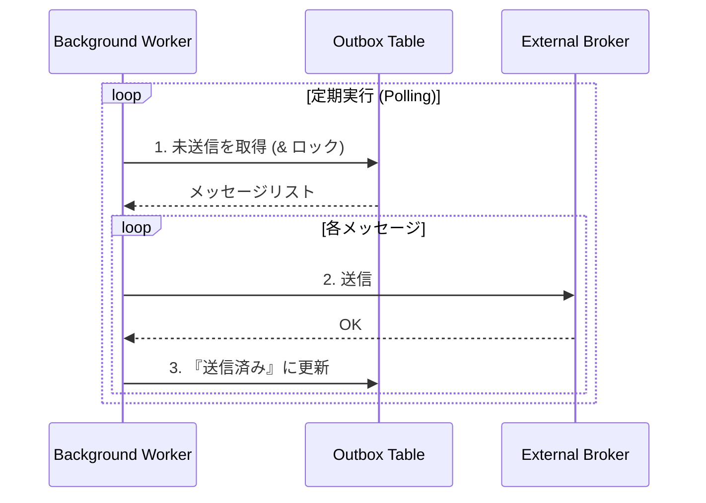
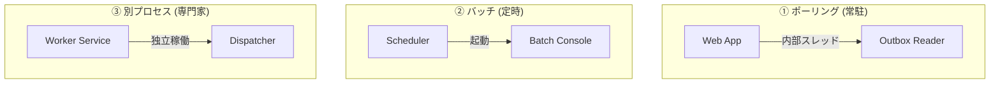

# 第24章：Outbox③：配信処理の基本（ポーリング/バッチ/別プロセス）🔁🚚

## 今日のゴール🎯

* Outboxテーブルに入った「未送信イベント」を、**安全に取り出して送る**流れを作れるようになる😊
* 代表3パターン（ポーリング / バッチ / 別プロセス）を、**それぞれの向き不向き込みで**選べるようになる🧠✨
* 「失敗する前提」で、**再試行・重複・監視**までの最低ラインを押さえる🛡️📈

---

## まずダメ例😇💥（“送れたと思い込む”）

### ダメな実装あるある

* 注文確定の処理の中で、そのまま外部に送信（HTTPやメッセージング）しちゃう
* 送信に失敗したら例外で落ちる
* 送信が成功したかどうかをDBに残さない

### 何が起きる？😵‍💫

* DB更新は成功したのに送信だけ失敗 → **イベント消滅**（やばい）
* 逆に送信だけ成功してDB更新失敗 → **幽霊イベント**（もっとやばい）
* リトライで二重送信 → **二重処理祭り**（次章の冪等性へ🔁）

---

## 良い例😎✅（“未送信→送信→完了”の状態管理）




Outboxの配信処理は、ざっくりこう👇

1. Outboxから「未送信」を取る📤
2. まず「処理中（ロック）」にする🔒
3. 送信する🚚
4. 成功なら「送信済」にする✅
5. 失敗なら「再試行待ち」にする（次に回す）🔁

この「状態の見える化」が、運用でめちゃくちゃ効きます📋✨

---

## 2026年の“今どき”前提で行こう🧩🧠

* バックグラウンド処理は **Hosted Service（BackgroundService）** が定番✨（ASP.NET Coreの公式ドキュメントでも説明されています）([Microsoft Learn][1])
* 永続化は EF Core 10 が .NET 10 とセットのLTSとして整理されてます([Microsoft Learn][2])
* .NET 10 は LTS リリースとして 2025-11-11 に正式リリースされています([GitHub][3])

---

## 配信処理の3パターン🔁🧰（ポーリング/バッチ/別プロセス）


### ① ポーリング（アプリ内で定期実行）🔁🧃

**イメージ**：Webアプリの中に “Outbox配達員” を常駐させる👷‍♀️🚚

* ✅ 実装が一番ラク（同じプロセス・同じDI）
* ✅ デプロイが1個で済む
* ⚠️ Web負荷が高いとバックグラウンドも影響を受けやすい
* ⚠️ スケールアウトしたら「配達員が複数人」になる（重複対策が必須）🔁

> Hosted Service（BackgroundService）はこの用途で定番です([Microsoft Learn][1])

---

### ② バッチ（一定間隔で起動して処理）⏰📦

**イメージ**：1分ごとに起きて配達して、終わったら寝る😴➡️🚚➡️😴

* ✅ “常駐”が嫌なときに良い（軽い）
* ✅ 失敗しても次回に期待できる
* ⚠️ 実行間隔が荒いと「遅延」が出る（リアルタイム性は低め）
* ⚠️ バッチが重くなると時間オーバー問題⏳

---

### ③ 別プロセス（専用ワーカー/Windowsサービス）🧱🚚

**イメージ**：Webとは別の “配達専門チーム” を置く💪📮

* ✅ Webが重くても配信は回る（分離強い）
* ✅ 監視・再起動・リソース割当がしやすい
* ⚠️ デプロイ/運用の対象が増える
* ⚠️ “どこまで分けるか”の設計が必要

.NET の Worker Service を Windows サービスとして動かす流れも、公式で案内されています([Microsoft Learn][4])



---

## まず作る「最小の配信フロー」🧪✨

### Outboxテーブル（超シンプル案）🗒️

* Id（GUID）
* Type（イベント種類）
* Payload（JSON）
* Status（Pending / Processing / Sent / Failed）
* OccurredAt（作成時刻）
* SentAt（送信時刻）
* Attempts（試行回数）
* NextAttemptAt（次回試行可能時刻）
* LockId / LockedUntil（ロック用、あると便利🔒）

ポイントはこれ👇

* **Pending**：未送信
* **Processing**：誰かが今送ってる（重複防止の要）
* **Sent**：完了
* **Failed**：諦め（手動対応へ）

---

## 手を動かす（C#）⌨️😊：ポーリング版（BackgroundService）🔁


「最小」なので、送信先はまず **Console出力** にします（外部MQは後でOK）🧪✨

```csharp
using System.Text.Json;
using Microsoft.EntityFrameworkCore;
using Microsoft.Extensions.Hosting;
using Microsoft.Extensions.Logging;

public sealed class OutboxDispatcher : BackgroundService
{
    private readonly IServiceScopeFactory _scopeFactory;
    private readonly ILogger<OutboxDispatcher> _logger;

    public OutboxDispatcher(IServiceScopeFactory scopeFactory, ILogger<OutboxDispatcher> logger)
    {
        _scopeFactory = scopeFactory;
        _logger = logger;
    }

    protected override async Task ExecuteAsync(CancellationToken stoppingToken)
    {
        // 重要：ExecuteAsync で重い同期処理をしない（awaitで非同期にする）という注意が公式にもあります🧠
        // :contentReference[oaicite:5]{index=5}  ←（注：コードブロック内には置かないルールなので、下の文章に引用を置きます）

        while (!stoppingToken.IsCancellationRequested)
        {
            try
            {
                using var scope = _scopeFactory.CreateScope();
                var db = scope.ServiceProvider.GetRequiredService<AppDbContext>();

                // 1) “取る” + 2) “ロックする” を短いトランザクションで
                var batch = await ClaimBatchAsync(db, batchSize: 20, stoppingToken);

                // 3) 送信（ここではデモとしてコンソール）
                foreach (var msg in batch)
                {
                    try
                    {
                        await SendAsync(msg, stoppingToken);
                        msg.MarkSent(DateTimeOffset.UtcNow);
                    }
                    catch (Exception ex)
                    {
                        msg.MarkRetry(ex.Message, DateTimeOffset.UtcNow);
                        _logger.LogWarning(ex, "Outbox send failed. id={Id}", msg.Id);
                    }
                }

                await db.SaveChangesAsync(stoppingToken);
            }
            catch (Exception ex)
            {
                _logger.LogError(ex, "Outbox dispatcher loop crashed. Will continue.");
            }

            // 4) ポーリング間隔（短すぎるとDBに優しくない😇）
            await Task.Delay(TimeSpan.FromSeconds(1), stoppingToken);
        }
    }

    private static async Task<List<OutboxMessage>> ClaimBatchAsync(
        AppDbContext db, int batchSize, CancellationToken ct)
    {
        var now = DateTimeOffset.UtcNow;
        var lockId = Guid.NewGuid().ToString("N");
        var lockedUntil = now.AddSeconds(30);

        // “ポータブル寄り”の最小案：
        // - まず対象候補を読む
        // - 1件ずつ「Pending → Processing」更新に成功したものだけ確保
        // これならDB方言に依存しにくい（ただし高負荷向きではない）
        var candidates = await db.OutboxMessages
            .Where(x => x.Status == OutboxStatus.Pending &&
                        (x.NextAttemptAt == null || x.NextAttemptAt <= now))
            .OrderBy(x => x.OccurredAt)
            .Take(batchSize * 3)
            .ToListAsync(ct);

        var claimed = new List<OutboxMessage>(batchSize);

        foreach (var m in candidates)
        {
            if (claimed.Count >= batchSize) break;

            // 楽観ロック的に条件付き更新（Pendingの間だけProcessingにする）
            var updated = await db.OutboxMessages
                .Where(x => x.Id == m.Id && x.Status == OutboxStatus.Pending)
                .ExecuteUpdateAsync(s => s
                    .SetProperty(x => x.Status, OutboxStatus.Processing)
                    .SetProperty(x => x.LockId, lockId)
                    .SetProperty(x => x.LockedUntil, lockedUntil),
                    ct);

            if (updated == 1)
            {
                // 取り直し（Trackingのズレを避けるため）
                var fresh = await db.OutboxMessages.FirstAsync(x => x.Id == m.Id, ct);
                claimed.Add(fresh);
            }
        }

        return claimed;
    }

    private static Task SendAsync(OutboxMessage msg, CancellationToken ct)
    {
        // 本番では MessageBus / HTTP / Email などに差し替え
        Console.WriteLine($"[OUTBOX SEND] type={msg.Type} payload={msg.Payload}");
        return Task.CompletedTask;
    }
}

public enum OutboxStatus { Pending, Processing, Sent, Failed }

public sealed class OutboxMessage
{
    public Guid Id { get; private set; }
    public string Type { get; private set; } = "";
    public string Payload { get; private set; } = "";
    public OutboxStatus Status { get; private set; } = OutboxStatus.Pending;
    public DateTimeOffset OccurredAt { get; private set; }
    public DateTimeOffset? SentAt { get; private set; }
    public int Attempts { get; private set; }
    public DateTimeOffset? NextAttemptAt { get; private set; }
    public string? LockId { get; private set; }
    public DateTimeOffset? LockedUntil { get; private set; }
    public string? LastError { get; private set; }

    public void MarkSent(DateTimeOffset now)
    {
        Status = OutboxStatus.Sent;
        SentAt = now;
        LockId = null;
        LockedUntil = null;
        LastError = null;
    }

    public void MarkRetry(string error, DateTimeOffset now)
    {
        Attempts++;
        LastError = error;

        // ざっくり指数バックオフ（1s,2s,4s... 最大30sくらい）
        var delaySec = Math.Min(30, Math.Pow(2, Math.Min(Attempts, 10)));
        NextAttemptAt = now.AddSeconds(delaySec);

        Status = OutboxStatus.Pending;
        LockId = null;
        LockedUntil = null;

        // 例：10回超えたらFailedにする、など運用ルールでOK
        if (Attempts >= 10) Status = OutboxStatus.Failed;
    }
}

public sealed class AppDbContext : DbContext
{
    public DbSet<OutboxMessage> OutboxMessages => Set<OutboxMessage>();
    public AppDbContext(DbContextOptions<AppDbContext> options) : base(options) { }
}
```

BackgroundService の注意点（`ExecuteAsync` をブロックさせない等）は公式でも強調されています([Microsoft Learn][1])

---

## “複数配達員”になったときのコツ👥🚚（重複を減らす）


スケールアウトや別プロセス化をすると、**同時に複数インスタンスがポーリング**します。

ここで強いのが **「DBで行ロックして奪い合いを回避」** するやり方✨

* PostgreSQL / MySQL には `SKIP LOCKED` 系の文法がある
* SQL Server だと近い動きを **`UPDLOCK` + `READPAST`** で作ることが多いです([NP Blog][5])

例（SQL Serverのイメージ）👇

* `READPAST`：ロック中の行を飛ばす
* `UPDLOCK`：取った行に更新ロックをかける
  （注意点があるので、挙動理解とテストは必須です）([Medium][6])

---

## バッチ版の作り方📦⏰（超ざっくり）

考え方は同じで、違うのは「ループし続ける」か「起動→処理→終了」かだけ😊

* Worker/Consoleアプリを作る
* `ProcessOnceAsync()` を実装する
* Windowsのスケジューラ等で 1分ごとに起動する

「常駐が嫌」「1分遅れてもOK」なら、これが気持ちいいです😴✨

---

## 別プロセス版（専用ワーカー）の作り方🧱🚚

* Worker Service を作る（BackgroundServiceと同じモデル）
* Windowsサービスとして動かす（運用しやすい）

この流れは Microsoft のドキュメントに沿って進めるのが安全です([Microsoft Learn][4])

---

## ミニ演習📝✨


### 演習1（必須）🧪

* `OutboxMessage` に `Type="OrderPaid"` のレコードを手で入れる
* Dispatcher が拾って Console に出したら成功🎉
* `Sent` に変わることを確認✅

### 演習2（ちょい上）💪

* `SendAsync` をわざと 50% 失敗させる（乱数で例外）🎲
* `Attempts` が増えて、`NextAttemptAt` が未来になるのを確認🔁
* 最終的に `Failed` に落ちる動きを確認😇

### 演習3（さらに上）👥

* Dispatcher を2つ起動（別プロセスでも同一でもOK）
* 同じOutboxを奪い合っても、**二重送信が起きにくい**ことを観察👀

---

## AI活用プロンプト例🤖✨（コピペOK）

* 「OutboxDispatcher の BackgroundService を、CancellationToken を正しく扱って書いて。処理は “Claim → Send → Mark” の順で」
* 「EF Core で条件付き更新（Pending → Processing）を安全にするコードを提案して。競合したらスキップする方針で」
* 「SQL Serverで Outbox を複数ワーカーが処理する時のロック戦略（READPAST/UPDLOCKなど）と注意点を整理して」
* 「Outbox配信の失敗時、指数バックオフと Dead-letter（Failed）運用の最小ルール案を出して」

---

## まとめ（覚える1行）📌✨

**Outbox配信は “未送信を安全に確保して、送って、結果をDBに残す” だけ。あとは失敗と重複に優しくする😊🔁🛡️**

---

次の第25章（冪等性）では、この章でわざと残した「重複しうる」世界を、**受け取り側＆送信側の両方で壊れない**ように整えていくよ🔁🛡️✨

[1]: https://learn.microsoft.com/en-us/aspnet/core/fundamentals/host/hosted-services?view=aspnetcore-10.0&utm_source=chatgpt.com "Background tasks with hosted services in ASP.NET Core"
[2]: https://learn.microsoft.com/en-us/ef/core/what-is-new/?utm_source=chatgpt.com "EF Core releases and planning"
[3]: https://github.com/dotnet/core/blob/main/release-notes/10.0/README.md?utm_source=chatgpt.com "core/release-notes/10.0/README.md at main · dotnet/ ..."
[4]: https://learn.microsoft.com/ja-jp/dotnet/core/extensions/windows-service?utm_source=chatgpt.com "を使用して Windows サービスを作成する BackgroundService"
[5]: https://www.npiontko.pro/2025/05/19/outbox-pattern?utm_source=chatgpt.com "Transactional Outbox Pattern: From Theory to Production"
[6]: https://medium.com/%40hnasr/the-truth-about-sql-server-readpast-992f4a463808?utm_source=chatgpt.com "SQL Server READPAST. Useful but watch out"
