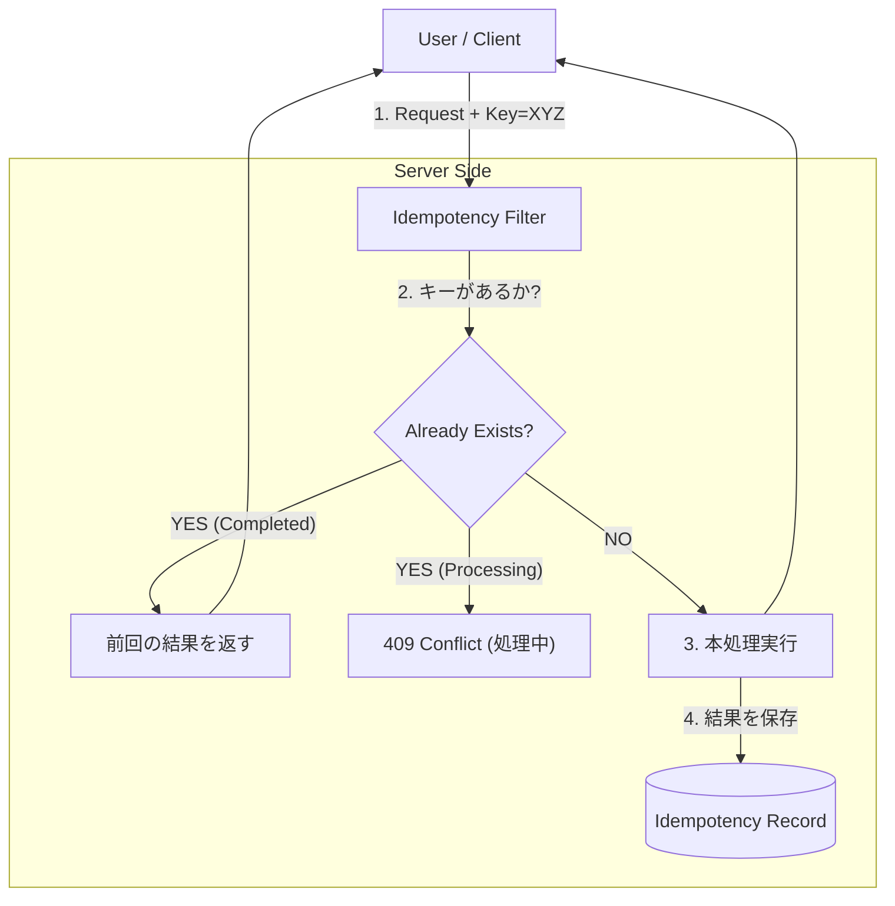
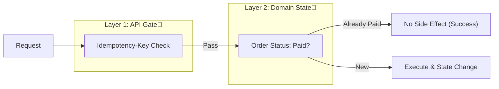

# 第25章：冪等性：リトライ前提で壊れない設計🔁🛡️

第22〜24章のOutboxで「イベント配信は *だいたい* **少なくとも1回（at-least-once）**」になります📤🚚
つまり…ネットワークや再試行で **同じ操作が2回以上届く**のが“普通”です😇

この章は、その現実を前提に **「何回来ても壊れない」** を作る章だよ〜！✨

---

## 今日のゴール🎯

* **冪等性（Idempotency）** を「言葉」じゃなく「実装」で説明できる😊
* **Idempotency-Key**（冪等キー）で **POSTでも安全にリトライ**できるようにする🔑🔁
* **二重適用（2回課金・2回在庫減り）** を **DB＋状態遷移** で止める🧱🛡️

---

## まず超大事：冪等性ってなに？🤔💡

冪等＝**同じリクエストを何回送っても、最終的な結果が1回と同じ** になること🌈

HTTPの世界だと「PUT/DELETE は冪等」「POST は基本冪等じゃない」って扱いが定番だよ📮
（HTTP仕様でも、PUT/DELETE は冪等なメソッドとして定義されてるよ） ([RFCエディタ][1])

でも実務はこうなる👇

* 決済や注文作成は **POST** が多い
* 通信失敗で **クライアントがリトライ** する
* Outbox/メッセージ配信でも **重複** する
  → だから **POSTを冪等に“してあげる”** 必要があるの🛡️✨

---

## まずダメ例😇💥（二重課金・二重発送が起きるやつ）

たとえば「支払い確定」を素直に書くと…

```csharp
// ❌ ダメ例：2回呼ばれたら2回処理される
app.MapPost("/orders/{orderId:guid}/pay", async (Guid orderId, AppDb db) =>
{
    var order = await db.Orders.FindAsync(orderId);
    if (order is null) return Results.NotFound();

    order.Status = "Paid";
    order.PaidAt = DateTimeOffset.UtcNow;

    db.Outbox.Add(new OutboxMessage
    {
        Type = "OrderPaid",
        Payload = $"{{\"orderId\":\"{orderId}\"}}",
        OccurredAt = DateTimeOffset.UtcNow
    });

    await db.SaveChangesAsync();
    return Results.Ok(new { orderId, status = order.Status });
});
```

これ、通信が不安定で **同じリクエストが2回届く** と…

* Paid を2回セット（まだマシ😇）
* Outbox が2回積まれて **メール2通**📩📩
* 在庫減らしてたら **在庫が2回減る**🧨
* 決済API呼んでたら **2回課金**💸💸（最悪）

---

## 良い例😎🛡️：Idempotency-Keyで「同じキーなら同じ結果」




### Idempotency-Keyって？🔑

クライアントが **一意なキー**（だいたいUUID）を付けて送る方式だよ✨
IETFでも「Idempotency-Key」ヘッダーの仕様が標準化に向かって整理されていて、**同じキー＋同じ内容なら前回の結果を返す**、違う内容ならエラー、同時処理なら衝突（Conflict）…みたいな指針が書かれてるよ📚 ([IETF Datatracker][2])

さらに実例として、Stripeも「同じキーの再送は前回結果を返す／違うパラメータならエラー」みたいな運用をしてる（超わかりやすい）💳✨ ([Stripe Docs][3])

---

## 実装方針（この章の完成形）🧭🧩

「注文支払い（Pay）」を冪等にするために、サーバ側でこうするよ👇

### 1) Idempotencyレコードを保存する🗃️

* **Key**（Idempotency-Key）
* **操作名**（例: `Ordering.PayOrder`）
* **ユーザー識別**（例: UserId / ClientId）※キーの衝突防止
* **リクエスト指紋（Fingerprint）**（同じキーで別内容を防ぐ）
* **結果（HTTPステータス、レスポンスボディ）**
* **状態（Processing / Completed）**
* **期限（TTL）**

IETF draftでも「キーは別payloadに再利用しない」「fingerprint を使って判定」みたいな話が入ってるよ🧠 ([IETF Datatracker][2])

---

## 手を動かす（C#）⌨️✨：最小Idempotencyを作る！

### 0) .NET（2026最新）メモ📝

本日時点（2026-01-21）で、.NET 10 は LTS で、直近パッチは 2026-01-13 の 10.0.2 が案内されてるよ🧩 ([Microsoft][4])
（教材の前提「最新」で組んでOKな根拠ね👍）

---

## 1) テーブル設計🗄️🔑（SQL ServerでもSQLiteでもOK）

### Idempotencyテーブル（例）

```sql
CREATE TABLE IdempotencyRecords (
    Id BIGINT IDENTITY PRIMARY KEY,
    Scope NVARCHAR(100) NOT NULL,        -- 例: "Ordering.PayOrder"
    UserKey NVARCHAR(100) NOT NULL,      -- 例: userId / clientId
    IdempotencyKey NVARCHAR(128) NOT NULL,
    RequestHash NVARCHAR(64) NOT NULL,   -- SHA-256など
    Status NVARCHAR(20) NOT NULL,        -- "Processing" / "Completed"
    ResponseStatus INT NULL,
    ResponseBody NVARCHAR(MAX) NULL,     -- JSON文字列
    CreatedAt DATETIMEOFFSET NOT NULL,
    ExpiresAt DATETIMEOFFSET NOT NULL
);

CREATE UNIQUE INDEX UX_Idempotency
ON IdempotencyRecords (Scope, UserKey, IdempotencyKey);
```

> ここ超大事💡
> **ユニーク制約**が「同じキーの二重作成」を止める最終防衛線だよ🛡️

---

## 2) RequestHash（fingerprint）を作る🧠🔍

「同じIdempotency-Keyなのに中身が違う」を検出したい！
IETF draftでも「fingerprint（payloadから作る印）」の話があるよ🧾 ([IETF Datatracker][2])

```csharp
using System.Security.Cryptography;
using System.Text;
using System.Text.Json;

static string ComputeRequestHash<T>(T body)
{
    // JSONにしてからハッシュ（超シンプル版）
    var json = JsonSerializer.Serialize(body);
    var bytes = Encoding.UTF8.GetBytes(json);
    var hash = SHA256.HashData(bytes);
    return Convert.ToHexString(hash); // 64 hex chars
}
```

---

## 3) “冪等化ラッパー”を作る🧩🔁（アプリ層でOK）

今回は「支払いAPI」だけ冪等にする想定で、ハンドラで包むよ😊

ポイントはこれ👇

* **(Scope, UserKey, IdempotencyKey)** で既存を探す
* あれば：

  * RequestHashが違う → **422**（同じキーの使い回し禁止） ([IETF Datatracker][2])
  * Completed → **保存してあるレスポンスを返す**
  * Processing → **409**（処理中） ([IETF Datatracker][2])
* なければ：

  * まず Processing で作る（ユニーク制約で競合を抑える）
  * 本処理を実行
  * 完了レスポンスを保存して Completed にする

```csharp
record PayRequest(decimal Amount);

app.MapPost("/orders/{orderId:guid}/pay", async (
    Guid orderId,
    PayRequest req,
    HttpContext http,
    AppDb db) =>
{
    // 1) key取得（この操作は必須にするのが実務では多い）
    if (!http.Request.Headers.TryGetValue("Idempotency-Key", out var keyValues))
    {
        // IETF draftの指針でも「必須なら 400」 :contentReference[oaicite:8]{index=8}
        return Results.BadRequest(new
        {
            title = "Idempotency-Key is missing",
            detail = "This operation requires Idempotency-Key."
        });
    }
    var idemKey = keyValues.ToString();

    // 2) scope + userKey（超簡易：今回は固定ユーザー扱いの例）
    var scope = "Ordering.PayOrder";
    var userKey = "demo-user"; // 実務では認証のsubなどにする

    // 3) fingerprint
    var reqHash = ComputeRequestHash(new { orderId, req.Amount });

    // 4) 既存チェック
    var existing = await db.IdempotencyRecords
        .Where(x => x.Scope == scope && x.UserKey == userKey && x.IdempotencyKey == idemKey)
        .SingleOrDefaultAsync();

    if (existing is not null)
    {
        if (!string.Equals(existing.RequestHash, reqHash, StringComparison.OrdinalIgnoreCase))
        {
            // 同じキーで別payload → 422（draftの例） :contentReference[oaicite:9]{index=9}
            return Results.UnprocessableEntity(new
            {
                title = "Idempotency-Key is already used",
                detail = "Do not reuse the same Idempotency-Key across different payloads."
            });
        }

        if (existing.Status == "Completed")
        {
            return Results.Json(
                JsonSerializer.Deserialize<object>(existing.ResponseBody ?? "{}"),
                statusCode: existing.ResponseStatus ?? 200
            );
        }

        // Processing（同時リトライなど）→ 409（draftの例） :contentReference[oaicite:10]{index=10}
        return Results.Conflict(new
        {
            title = "A request is outstanding for this Idempotency-Key",
            detail = "The original request is still processing."
        });
    }

    // 5) 新規作成（Processing）
    var record = new IdempotencyRecord
    {
        Scope = scope,
        UserKey = userKey,
        IdempotencyKey = idemKey,
        RequestHash = reqHash,
        Status = "Processing",
        CreatedAt = DateTimeOffset.UtcNow,
        ExpiresAt = DateTimeOffset.UtcNow.AddHours(24) // 例
    };

    db.IdempotencyRecords.Add(record);

    // ここで SaveChanges を先に打つのがコツ！
    // → ユニーク制約で「同時に2人がProcessing作る」を抑える
    try
    {
        await db.SaveChangesAsync();
    }
    catch (DbUpdateException)
    {
        // 競合したらもう一度読みに行く（再試行）
        var reread = await db.IdempotencyRecords
            .Where(x => x.Scope == scope && x.UserKey == userKey && x.IdempotencyKey == idemKey)
            .SingleAsync();

        if (!string.Equals(reread.RequestHash, reqHash, StringComparison.OrdinalIgnoreCase))
            return Results.UnprocessableEntity(new { title = "Idempotency-Key is already used" });

        if (reread.Status == "Completed")
            return Results.Json(JsonSerializer.Deserialize<object>(reread.ResponseBody ?? "{}"), statusCode: reread.ResponseStatus ?? 200);

        return Results.Conflict(new { title = "A request is outstanding for this Idempotency-Key" });
    }

    // 6) 本処理（トランザクション推奨）
    using var tx = await db.Database.BeginTransactionAsync();

    var order = await db.Orders.SingleOrDefaultAsync(x => x.Id == orderId);
    if (order is null)
    {
        record.Status = "Completed";
        record.ResponseStatus = 404;
        record.ResponseBody = JsonSerializer.Serialize(new { title = "Not Found" });
        await db.SaveChangesAsync();
        await tx.CommitAsync();
        return Results.NotFound();
    }

    // ✅ 状態遷移で二重適用を止める（詳細は第26章〜に繋がる！）
    if (order.Status == OrderStatus.Paid)
    {
        var body = new { orderId, status = "Paid", note = "already paid" };
        record.Status = "Completed";
        record.ResponseStatus = 200;
        record.ResponseBody = JsonSerializer.Serialize(body);
        await db.SaveChangesAsync();
        await tx.CommitAsync();
        return Results.Ok(body);
    }

    order.MarkPaid(req.Amount); // ドメインに寄せるのが◎

    db.Outbox.Add(OutboxMessage.Create("OrderPaid", new { orderId }));

    await db.SaveChangesAsync();
    await tx.CommitAsync();

    // 7) 結果を保存して Completed
    var response = new { orderId, status = "Paid" };
    record.Status = "Completed";
    record.ResponseStatus = 200;
    record.ResponseBody = JsonSerializer.Serialize(response);
    await db.SaveChangesAsync();

    return Results.Ok(response);
});
```

---

## ここがキモ🧠🛡️：冪等性は「キー」だけじゃ足りない

冪等性って、実は **2階建て** で守ると強いよ✨

### ① APIレベル（Idempotency-Key）🔑

* 同じキー → 同じ結果を返す
* キー使い回し（別payload）→ 422
* 同時リトライ → 409
  （このへんの考え方はIETF draftにまとまってる） ([IETF Datatracker][2])

### ② ドメインレベル（状態遷移・一意制約）🚥

* 「Paid → Paid」は“変化なし”にする（何回来てもOK）
* 「Paidの後にPayを受けた」なら副作用なし
* DBのユニーク制約で最終防御

> つまり
> **キーで“入口”を守って、状態遷移で“中身”も守る**🧱✨



---

## ミニ演習📝🎮

1. `/orders/{id}/pay` を叩いて、同じ `Idempotency-Key` で2回呼んでみてね🔁

   * 2回目が **同じレスポンス** になったら成功🎉
2. 同じキーのまま `Amount` を変えて呼ぶ

   * **422** になったら成功✅
3. “処理時間が長い”ふりをして（`await Task.Delay(3000)` とか）同時に2回投げる

   * 片方が **409** になったらOK🛡️

---

## AI活用プロンプト例🤖✨（Copilot / Codex向け）

※そのまま貼ってOKだよ😊

* 「Minimal APIで Idempotency-Key を必須にして、(scope,user,key) のレコードをDBに保存し、Completedなら保存レスポンスを返す実装を作って。キー再利用でpayloadが違う時は422、処理中は409。EF Core想定で。」
* 「IdempotencyRecords のエンティティと Fluent API 設定（ユニークインデックス含む）を生成して。」
* 「統合テスト（xUnit + WebApplicationFactory）で、同じIdempotency-Keyの2回呼び出しが同じレスポンスになることを検証して。」

---

## まとめ（覚える1行）📌✨

**冪等性＝「リトライされても同じ結果」：キーで入口を守り、状態遷移で中身も守る🔁🛡️**

---

次の第26章は、この章でチラ見せした「状態遷移」を **表にして漏れを潰す**よ🚥📋✨

[1]: https://www.rfc-editor.org/rfc/rfc9110.html?utm_source=chatgpt.com "RFC 9110: HTTP Semantics"
[2]: https://datatracker.ietf.org/doc/draft-ietf-httpapi-idempotency-key-header/ "
            
    
        draft-ietf-httpapi-idempotency-key-header-07 - The Idempotency-Key HTTP Header Field
    

        "
[3]: https://docs.stripe.com/api/idempotent_requests?utm_source=chatgpt.com "Idempotent requests | Stripe API Reference"
[4]: https://dotnet.microsoft.com/ja-jp/platform/support/policy/dotnet-core?utm_source=chatgpt.com ".NET および .NET Core の公式サポート ポリシー"
