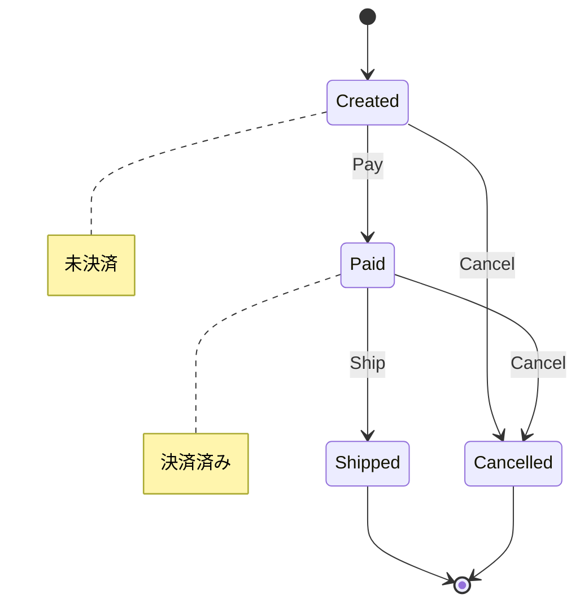

# 第26章：状態機械①：状態遷移表を作ってみよう🚥📋

「冪等性（第25章）」まで来たら、次の壁はコレ👇
**“同じ処理が何回来ても壊れない”ためには、そもそも「今この注文は何ができる状態？」をハッキリさせないと無理！**😵‍💫💥
そこで **状態機械（ステートマシン）** の出番だよ〜🧠✨

（ちなみに2026年の最新ど真ん中は **.NET 10 + C# 14** あたりが基準になるよ📌）([Microsoft][1])

---

## 今日のゴール🎯

* 「注文（Order）」の **状態（Status）** を整理できる🧩
* 「イベント（Trigger）」を並べて **状態遷移表** を作れる📋✨
* **許される遷移 / 禁止遷移** を明確にできる🚫✅
* 「禁止遷移＝業務ルール違反」として扱う感覚がつく🚧

---

## まずダメ例😇💥

## ダメなやつ：if地獄で状態が破壊される

「今の状態」を意識せずに処理すると、すぐ破綻するよ〜😇

```csharp
// 😇 ダメ例：状態を見ずに何でもできちゃう
public void Ship()
{
    Status = OrderStatus.Shipped; // え、未決済でも発送できるの？😇
}

public void Pay()
{
    Status = OrderStatus.Paid; // 発送後に決済…？😇
}
```

これだと、**バグが“仕様っぽい顔”して紛れ込む**のが最悪ポイント😵‍💫🌀

---

## 良い例😎✨

## 良いやつ：表で「できる / できない」を決めてからコードを書く

最初にやるのはコードじゃなくて **表**📋✨
表があると、チームでもAIでもレビューしやすいし、未来の自分が助かるよ〜🥹💖

---

## 状態機械の超基本🧠🧩

状態機械って要するに👇

* **状態（State）**：いまのフェーズ（Created / Paid / Shipped / Cancelled …）
* **トリガー（Trigger）**：起こしたい操作（Pay / Ship / Cancel …）
* **遷移（Transition）**：状態がどう変わるか（Created + Pay → Paid）

「状態機械」は昔から定番の考え方で、**状態と遷移でプログラムを組み立てる**のがコアだよ📌([Microsoft Learn][2])

---

## 手を動かす前にやること✍️🗂️

この章では、Orderingモジュールの「注文（Order）」を題材にするよ🛒✨
まずはこの2つを紙かメモに書く📝

## 1) 状態を列挙する🧩

まず最小でOK！今回はロードマップ通りこのへん👇

* Created（作成済み・未決済）
* Paid（決済済み）
* Shipped（発送済み）
* Cancelled（キャンセル済み）

## 2) トリガーを列挙する🔔

ユースケースの入口を意識して、これだけに絞る👇

* Pay（決済する）
* Ship（発送する）
* Cancel（キャンセルする）

---

## 状態遷移表を作ろう🚥📋✨




ここが本編だよ〜！
「行＝今の状態」「列＝やりたい操作」にして、セルに結果を書く感じ😊

## 注文の状態遷移表📋

| 現在の状態＼トリガー | Pay（決済）               | Ship（発送）               | Cancel（キャンセル）        |
| ---------- | --------------------- | ---------------------- | -------------------- |
| Created    | Paid ✅                | × 🚫                   | Cancelled ✅          |
| Paid       | Paid ✅（冪等：変化なしでもOK）🔁 | Shipped ✅              | Cancelled ✅（※ポリシー次第） |
| Shipped    | × 🚫                  | Shipped ✅（冪等：再実行は無視）🔁 | × 🚫                 |
| Cancelled  | × 🚫                  | × 🚫                   | Cancelled ✅（冪等）🔁    |

ポイントはここ👇✨

* **× は「業務ルール違反」**（第17章の分類でいう “仕様としてのエラー”）🚧
* **冪等（同じ操作が来ても壊れない）**は、表の時点で決める🔁🛡️
* 「Paid から Cancel できるか？」は **事業ルール**（あなたのEC次第）🧠

---

## 表ができたら、コードで“仕様”として固定する🔒✨

ここでは「ライブラリ無し」で最小実装にするよ（まずは自力で感覚をつかむ🧠✨）
※ライブラリを使うなら Stateless が定番の1つだよ〜（NuGetで配布されてる）([NuGet][3])

---

## 手を動かす（C#）⌨️✨

### 1) enum を作る🧩

```csharp
public enum OrderStatus
{
    Created,
    Paid,
    Shipped,
    Cancelled
}

public enum OrderTrigger
{
    Pay,
    Ship,
    Cancel
}
```

### 2) 遷移表をコードにする📋➡️🧱

```csharp
public static class OrderStateMachineSpec
{
    // 「許可される遷移だけ」定義するのがコツ✅
    private static readonly IReadOnlyDictionary<(OrderStatus From, OrderTrigger Trigger), OrderStatus> _allowed
        = new Dictionary<(OrderStatus, OrderTrigger), OrderStatus>
        {
            {(OrderStatus.Created, OrderTrigger.Pay),    OrderStatus.Paid},
            {(OrderStatus.Created, OrderTrigger.Cancel), OrderStatus.Cancelled},

            {(OrderStatus.Paid, OrderTrigger.Pay),    OrderStatus.Paid},     // 🔁冪等
            {(OrderStatus.Paid, OrderTrigger.Ship),   OrderStatus.Shipped},
            {(OrderStatus.Paid, OrderTrigger.Cancel), OrderStatus.Cancelled},

            {(OrderStatus.Shipped, OrderTrigger.Ship), OrderStatus.Shipped}, // 🔁冪等

            {(OrderStatus.Cancelled, OrderTrigger.Cancel), OrderStatus.Cancelled} // 🔁冪等
        };

    public static bool TryGetNext(OrderStatus from, OrderTrigger trigger, out OrderStatus next)
        => _allowed.TryGetValue((from, trigger), out next);
}
```

### 3) Order から使う🛒✨

「できない遷移」はここで止める🚫

```csharp
public sealed class Order
{
    public OrderStatus Status { get; private set; } = OrderStatus.Created;

    public bool TryApply(OrderTrigger trigger)
    {
        if (!OrderStateMachineSpec.TryGetNext(Status, trigger, out var next))
            return false; // 🚫業務ルール違反

        Status = next;
        return true;
    }
}
```

ここまでで「表＝仕様」が、コードに固定されたよ🥳🎉
（次章で **ガード条件** を入れてもっと賢くするよ🧠🚦）

---

## ミニ演習📝✨

## 演習1：表を拡張してみよう📋

次の状態を追加して、遷移表を更新してみてね👇

* Delivered（配達完了）📦🏠

質問：

* Shipped → Delivered は何トリガー？
* Delivered から Cancel はできる？（たぶん無理だよね😇）

## 演習2：禁止遷移のときに理由を返そう💬

今は false だけど、
「なぜダメか」を返すとAPIが親切になるよ😊✨

例：

* 「未決済の注文は発送できません」
* 「発送済みの注文はキャンセルできません」

---

## AI活用プロンプト例🤖✨

## 仕様づくりをAIに手伝わせる🧠📋

* 「この注文フローの状態とトリガーを列挙して、状態遷移表をMarkdownで作って」
* 「禁止遷移を洗い出して、“業務ルール違反メッセージ案”を作って」
* 「冪等にすべきトリガー候補を提案して。理由も添えて」

## コード支援（Copilot / Codex向け）⌨️✨

* 「この状態遷移表から、C#の遷移辞書（Dictionary）を生成して」
* 「TryApply が false のとき、理由を返す設計にリファクタして」
* 「状態遷移の単体テスト（xUnit）を作って」

---

## まとめ📌

**状態遷移表は、“できること / できないこと”を先に決めてバグを封じる表だよ🚥📋✨**

次の第27章では、ここに **ガード条件（条件付き遷移）** を入れて、さらに事故りにくくするよ〜🧠🚦💕

[1]: https://dotnet.microsoft.com/en-us/platform/support/policy/dotnet-core?utm_source=chatgpt.com "NET and .NET Core official support policy"
[2]: https://learn.microsoft.com/en-us/dotnet/framework/windows-workflow-foundation/state-machine-workflows?utm_source=chatgpt.com "State Machine Workflows - .NET Framework"
[3]: https://www.nuget.org/packages/stateless/?utm_source=chatgpt.com "Stateless 5.20.0"
