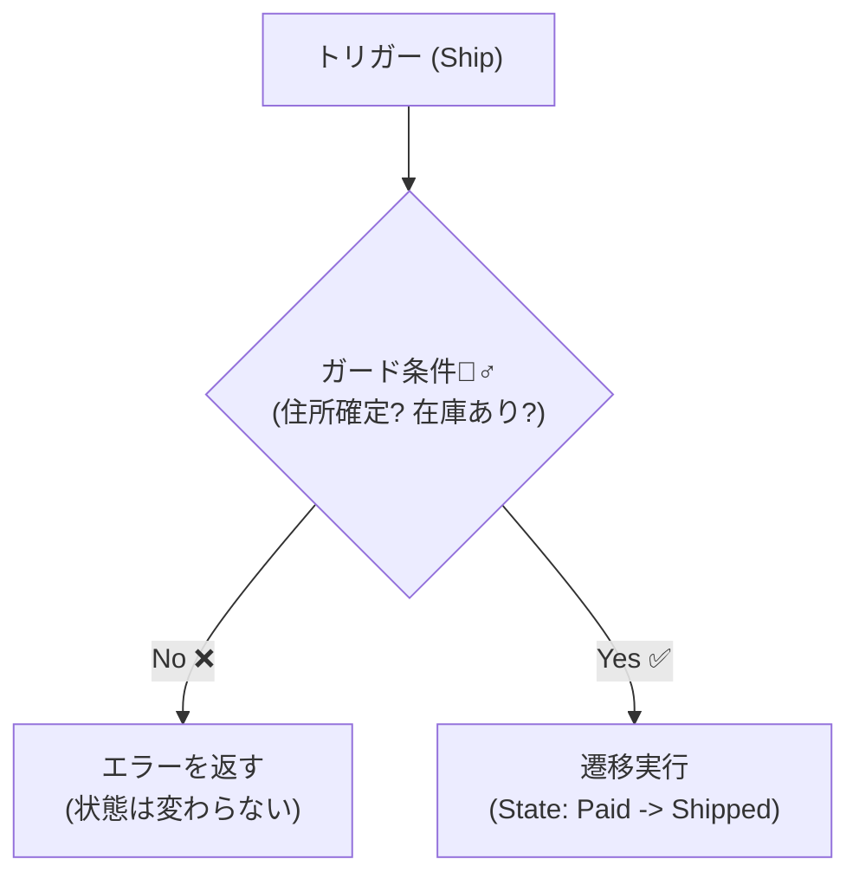

# 第27章：状態機械②：ガード条件（条件付き遷移）を整理する🧠🚦

## 今日のゴール🎯

* 「この状態なら次へ進める」だけじゃなくて、**“条件が揃ってる時だけ進める”** をキレイに整理できるようになる✨
* ガード条件（Guard Condition）を **散らさず**、**バグらず**、**読みやすく** まとめる型を身につける💪😊

（ちなみに今の最新だと、.NET 10.0.2 / SDK 10.0.102 が出てて、C# 14 が使えるよ〜🆕✨） ([Microsoft][1])

---

## まず「ガード条件」ってなに？🚧

状態遷移って、前章のイメージだとこんな感じだよね👇

* Created → Paid → Shipped
* Created/Paid → Cancelled

ここに「条件」を足したのがガード条件！✨

たとえば「Paid なら Shipped OK」じゃなくて、
**「Paid かつ、住所OK かつ、在庫確保済み なら Shipped OK」**みたいなやつ😊

---

## まずダメ例😇：ガード条件が散ると、バグる💥

### ありがちな事故あるある💣

* UIでチェック
* APIでもチェック
* Application Serviceでもチェック
* Domainでもまたチェック

その結果…

* A画面からは発送できないのに、B画面からは発送できちゃう😵
* “キャンセル可能”の条件が場所ごとにズレてる😇
* 仕様変更（例：キャンセル期限追加）で修正漏れが出る💀

### ダメコード例（散ってるやつ）😇

```csharp
// ApplicationService と Controller とか、いろんな場所に if が散っていく…😇
if (order.State != OrderState.Paid) throw new InvalidOperationException("未払いです");
if (!order.AddressConfirmed) throw new InvalidOperationException("住所未確定です");
if (!order.StockReserved) throw new InvalidOperationException("在庫未確保です");

// どこか別ルートでは AddressConfirmed を忘れてたりする…💥
order.State = OrderState.Shipped;
```

---

## 良い例😎：ガード条件は「遷移の横」に置く🧠✨




コツは超シンプル👇

### ✅ ルール

**「遷移（From→To）」と「ガード条件」を同じ場所に並べる**📌
→ すると、読む人が **“この遷移は何が必要？”** を一瞬で追える👀✨

---

## ガード条件の集め方🧺✨（チェックリスト付き）

前章で作った状態遷移表に、右側へ「条件」列を足すイメージだよ🧾💕

### ガード条件はだいたい4種類に分かれるよ🧠

1. **状態系**：今の状態が合ってる？（Paid からしか Ship できない等）
2. **データ系**：必要な情報が揃ってる？（住所/在庫/金額/本人確認など）
3. **時間系**：期限はOK？（30分以内キャンセル、発送締め時刻など）
4. **外部依存系**：外部がOK返した？（決済/配送API/在庫サービスなど）

> ⭐ポイント：
> **外部依存系は “事前に確認して、その結果を持ってから” ガードに入れる**のがキレイ✨
> （ドメインがいきなり外部APIを叩くと、テスト地獄になりやすいよ〜😵）

---

## 例：ミニEC（注文）の遷移＋ガード条件表🛒🚚

| From    | Trigger | To        | ガード条件（例）                     |
| ------- | ------- | --------- | ---------------------------- |
| Created | Pay     | Paid      | 支払い承認済み（PaymentAuthorized）   |
| Paid    | Ship    | Shipped   | 住所確定 & 在庫確保 & 発送ラベル作成済み      |
| Created | Cancel  | Cancelled | 未発送（＝CreatedならOK）            |
| Paid    | Cancel  | Cancelled | 未発送 & キャンセル期限内（例：支払いから30分以内） |

こうやって表にすると、仕様が一気に見えるよね😊✨

---

## 手を動かす（C#）⌨️✨：ガード条件を「遷移の横」に固定する

ここでは「自作ミニ状態機械」を作って、ガード条件を整理する形を体に入れるよ〜💪😆

### 1) ドメインの状態とトリガー📦

```csharp
public enum OrderState
{
    Created,
    Paid,
    Shipped,
    Cancelled
}

public enum OrderTrigger
{
    Pay,
    Ship,
    Cancel
}
```

### 2) Order（必要最小限の情報だけ）🧾

```csharp
public sealed class Order
{
    public Guid Id { get; } = Guid.NewGuid();
    public OrderState State { get; private set; } = OrderState.Created;

    // ガード条件に使う “材料” たち🧠
    public bool PaymentAuthorized { get; private set; }
    public bool AddressConfirmed { get; private set; }
    public bool StockReserved { get; private set; }
    public bool ShippingLabelCreated { get; private set; }

    public DateTimeOffset CreatedAtUtc { get; } = DateTimeOffset.UtcNow;
    public DateTimeOffset? PaidAtUtc { get; private set; }

    // Application層で外部確認した結果を反映するイメージ✨
    public void MarkPaymentAuthorized() => PaymentAuthorized = true;
    public void ConfirmAddress() => AddressConfirmed = true;
    public void ReserveStock() => StockReserved = true;
    public void CreateShippingLabel() => ShippingLabelCreated = true;

    internal void SetState(OrderState state) => State = state;
    internal void MarkPaidNow() => PaidAtUtc = DateTimeOffset.UtcNow;
}
```

### 3) Result（失敗理由を返す）🚧

```csharp
public readonly record struct Result(bool IsSuccess, string? Error)
{
    public static Result Ok() => new(true, null);
    public static Result Fail(string error) => new(false, error);
}
```

### 4) 「遷移」と「ガード」を並べて固定する🧠🚦

```csharp
public sealed class OrderStateMachine
{
    private readonly Order _order;
    private readonly Func<DateTimeOffset> _utcNow;

    public OrderStateMachine(Order order, Func<DateTimeOffset>? utcNow = null)
    {
        _order = order;
        _utcNow = utcNow ?? (() => DateTimeOffset.UtcNow);
    }

    private sealed record Transition(
        OrderState From,
        OrderTrigger Trigger,
        OrderState To,
        Func<Order, bool> Guard,
        Func<Order, string> GuardFailMessage,
        Action<Order>? OnSuccess = null
    );

    // ✅ ここが本体：遷移の横にガードがいる✨
    private static readonly Transition[] Transitions =
    [
        new(
            From: OrderState.Created,
            Trigger: OrderTrigger.Pay,
            To: OrderState.Paid,
            Guard: CanPay,
            GuardFailMessage: _ => "支払い承認がまだだよ💳😵",
            OnSuccess: o => o.MarkPaidNow()
        ),

        new(
            From: OrderState.Paid,
            Trigger: OrderTrigger.Ship,
            To: OrderState.Shipped,
            Guard: CanShip,
            GuardFailMessage: BuildShipFailMessage
        ),

        new(
            From: OrderState.Created,
            Trigger: OrderTrigger.Cancel,
            To: OrderState.Cancelled,
            Guard: _ => true,
            GuardFailMessage: _ => "Created のキャンセルは常にOKだよ👌"
        ),

        new(
            From: OrderState.Paid,
            Trigger: OrderTrigger.Cancel,
            To: OrderState.Cancelled,
            Guard: o => CanCancelAfterPaid(o),
            GuardFailMessage: _ => "支払い後キャンセルは “支払いから30分以内” だけだよ⏰😵"
        )
    ];

    public Result Fire(OrderTrigger trigger)
    {
        var transition = Transitions.FirstOrDefault(t => t.From == _order.State && t.Trigger == trigger);
        if (transition is null)
            return Result.Fail($"この操作はできないよ🙅‍♀️（State={_order.State}, Trigger={trigger}）");

        if (!transition.Guard(_order))
            return Result.Fail(transition.GuardFailMessage(_order));

        _order.SetState(transition.To);
        transition.OnSuccess?.Invoke(_order);

        return Result.Ok();
    }

    // ===== ガード条件（散らさない！）=====

    private static bool CanPay(Order o)
        => o.PaymentAuthorized;

    private static bool CanShip(Order o)
        => o.AddressConfirmed
           && o.StockReserved
           && o.ShippingLabelCreated;

    private bool CanCancelAfterPaid(Order o)
    {
        if (o.PaidAtUtc is null) return false;
        return (_utcNow() - o.PaidAtUtc.Value) <= TimeSpan.FromMinutes(30);
    }

    private static string BuildShipFailMessage(Order o)
    {
        var missing = new List<string>();
        if (!o.AddressConfirmed) missing.Add("住所確定");
        if (!o.StockReserved) missing.Add("在庫確保");
        if (!o.ShippingLabelCreated) missing.Add("発送ラベル");

        return missing.Count == 0
            ? "発送できない理由があるよ😵（条件を確認してね）"
            : $"発送まだだよ🚚💦 足りないもの：{string.Join(" / ", missing)}";
    }
}
```

### 5) 動かしてみる（超ミニ）🧪

```csharp
var order = new Order();
var sm = new OrderStateMachine(order);

// いきなり発送してみる😇
Console.WriteLine(sm.Fire(OrderTrigger.Ship).Error);

// 支払い承認 → 支払い → 発送準備
order.MarkPaymentAuthorized();
Console.WriteLine(sm.Fire(OrderTrigger.Pay).IsSuccess); // True

order.ConfirmAddress();
order.ReserveStock();
order.CreateShippingLabel();

Console.WriteLine(sm.Fire(OrderTrigger.Ship).IsSuccess); // True
Console.WriteLine(order.State); // Shipped
```

---

## ここが超大事📌：ガード条件の置き場所ルール🧭

* **遷移テーブル（または Configure）に “ガード条件” を隣接させる**
* ガードの中身は、**CanShip / CanCancel…** みたいに「名前つき関数」にして読みやすく✨
* 外部確認が必要なら、Application層で済ませてから **Orderにフラグや材料を渡す**（テストしやすい😊）

---

## 便利ライブラリもあるよ（参考）📚✨

「状態機械をいい感じに書きたい！」ってなったら、**Stateless** が定番だよ〜😊

* `PermitIf(...)` みたいに **ガード付き遷移**が素直に書ける✨ ([NuGet][2])

（でも今章は “整理の型” が目的だから、まず自作で感覚つかむのが勝ち🥇✨）

---

## ミニ演習📝✨

1. **キャンセル条件を強化**してみよう💪

   * 「Paid でもキャンセル可能。ただし *発送ラベル作成前まで*」を追加してね🧾
2. **Ship の条件を追加**してみよう🚚

   * 「配送先が国内ならOK」みたいな条件を足して、メッセージも出し分けてみてね🇯🇵✨
3. **“条件列”を増やす**練習🧠

   * 遷移表の右側に「データ系 / 時間系 / 外部依存系」って分類メモをつけてみよ😊

---

## AI活用プロンプト例🤖✨（Copilot / Codex向け）

（そのまま貼ってOKだよ〜😊）

```text
注文（Order）の状態遷移を設計しています。
状態：Created, Paid, Shipped, Cancelled
遷移：Pay, Ship, Cancel
「ガード条件」を洗い出して、表（From/Trigger/To/Guard）にしてください。
初心者にも分かるように、Guardは短い自然言語で書いてください。
```

```text
C#で状態機械を自作しています。遷移テーブルに Guard と GuardFailMessage を並べたいです。
CanShip/CanCancel などの命名を含めて、読みやすい設計案を出してください。
```

```text
ガード条件が仕様変更で増えます。
「ガードの分類（状態/データ/時間/外部）」の観点で、漏れを検出するチェックリストを作ってください。
```

```text
OrderStateMachine の各ガード条件について、最低限の単体テスト観点（Given/When/Then）を列挙してください。
```

---

## まとめ（覚える1行）📌✨

**ガード条件は “遷移の横” に置く。散らすとバグる。** 🧠🚦💥

次章（第28章）では、ここで作った状態機械をさらに強化して、
**「許可されない遷移を “型” で潰す」**方向へ進むよ〜🧱✨

[1]: https://dotnet.microsoft.com/en-US/download/dotnet/10.0 "Download .NET 10.0 (Linux, macOS, and Windows) | .NET"
[2]: https://www.nuget.org/packages/stateless/ "
        NuGet Gallery
        \| Stateless 5.20.0
    "
