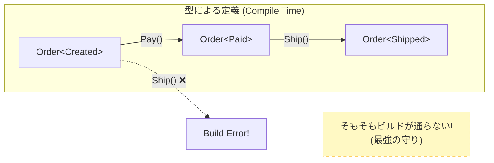

# 第28章：状態機械③：C#で“漏れ”を防ぐ（型で守る）🧱✨

---

## 今日のゴール🎯

* 状態（Created/Paid/Shipped/Cancelled…）の **“ありえない遷移”** を、できるだけ **コンパイル時（＝早い段階）** に気づけるようにするよ🧠✨
* 「enumだけで頑張る」から一歩進んで、**“型”で守る** 発想を体験するよ🧩💪
  （いまの最新C#は **C# 14 / .NET 10** だよ📌）([Microsoft Learn][1])

---

## まずダメ例😇 → 「enumだけ」だと起きがちな事故💥


「状態はenumで持って、ifで分岐すればいいよね！」ってやると…👇

* 新しい状態が増えたのに、分岐を書き忘れる🙈
* “通ってはいけないルート”が、テストが薄いところでこっそり通る🫠
* 事故が起きるのはだいたい本番…😇

例：**Shipped（発送済み）なのにPayできちゃう** みたいなやつ💸📦

---

## 良い例😎：漏れを減らす3段階アップグレード🧗‍♀️✨

### レベル1：状態遷移を「1か所」に集める🗂️✨（まずこれ！）

ポイントはこれ👇

* 遷移ルールを **Orderのあちこちに散らさない**
* “状態 × トリガー” を **表（switch）で管理** する

#### 手を動かす（C#）⌨️🧪：遷移を1か所に集約する

```csharp
// 状態
public enum OrderStatus
{
    Created,
    Paid,
    Shipped,
    Cancelled,
}

// きっかけ（イベント/操作）
public enum OrderTrigger
{
    Pay,
    Ship,
    Cancel,
}

// ドメイン的な失敗（雑に例）
public sealed record DomainError(string Code, string Message)
{
    public static DomainError InvalidTransition(OrderStatus s, OrderTrigger t)
        => new("InvalidTransition", $"遷移できないよ: {s} --{t}--> ???");
}

// 成功/失敗（超ミニResult）
public readonly record struct Result<T>(T? Value, DomainError? Error)
{
    public bool IsOk => Error is null;
    public static Result<T> Ok(T v) => new(v, null);
    public static Result<T> Fail(DomainError e) => new(default, e);
}

public static class OrderStateMachine
{
    // ✅ 状態ごとにトリガーを分ける：外側switchを “defaultなし” にするのがコツ
    public static Result<OrderStatus> Apply(OrderStatus state, OrderTrigger trigger) => state switch
    {
        OrderStatus.Created => trigger switch
        {
            OrderTrigger.Pay    => Result<OrderStatus>.Ok(OrderStatus.Paid),
            OrderTrigger.Cancel => Result<OrderStatus>.Ok(OrderStatus.Cancelled),
            _ => Result<OrderStatus>.Fail(DomainError.InvalidTransition(state, trigger)),
        },

        OrderStatus.Paid => trigger switch
        {
            OrderTrigger.Ship   => Result<OrderStatus>.Ok(OrderStatus.Shipped),
            OrderTrigger.Cancel => Result<OrderStatus>.Ok(OrderStatus.Cancelled),
            _ => Result<OrderStatus>.Fail(DomainError.InvalidTransition(state, trigger)),
        },

        OrderStatus.Shipped =>
            Result<OrderStatus>.Fail(DomainError.InvalidTransition(state, trigger)),

        OrderStatus.Cancelled =>
            Result<OrderStatus>.Fail(DomainError.InvalidTransition(state, trigger)),
    };
}
```

✅ これで「状態が増えたのに外側switchに追加し忘れた」みたいな漏れを、**コンパイラ警告（CS8509）** で拾いやすくなるよ📣✨ ([Microsoft Learn][2])

---

### レベル2：その警告を “エラー化” して、漏れをコンパイルで止める🚫🧱


C#のswitch式は、網羅してないと **CS8509**（非網羅）になりやすいよね👀 ([Microsoft Learn][2])
これを **「警告じゃなくてエラー」** にして、ビルドを落とすと最強🛡️✨

`.editorconfig` でルール重大度を設定できるよ（`dotnet_diagnostic.<rule ID>.severity = ...`）([Microsoft Learn][3])

```ini
## .editorconfig（ソリューション直下に置くイメージ📁）
[*.cs]

## switch式が非網羅ならエラーにする（漏れをビルドで止める🧱）
dotnet_diagnostic.CS8509.severity = error
```

💡これで、`OrderStatus` に `Refunded` とか増やしたのに `OrderStateMachine` 側の外側switchを直さないと **コンパイルで止まる** よ🎉

---

### レベル3：本命🔥「型（typestate）で、そもそも呼べなくする」🧩✨




ここがこの章のメイン💖
狙いはこれ👇

* `Ship()` は **Paidの注文** にしか呼べない
* `Pay()` は **Createdの注文** にしか呼べない
* つまり **不正な遷移が“書けない”**（＝コンパイルで落ちる）🧱✨

#### 手を動かす（C#）⌨️🌟：状態を「型」にする


```csharp
// 状態を “型” で表すよ🧱
public interface IOrderState { }
public interface ICancellableState : IOrderState { } // Cancelできる状態の印

public sealed record CreatedState : ICancellableState;
public sealed record PaidState    : ICancellableState;
public sealed record ShippedState : IOrderState;
public sealed record CancelledState : IOrderState;

public sealed class Order<TState> where TState : IOrderState
{
    public Guid Id { get; }
    public TState State { get; }

    private Order(Guid id, TState state)
    {
        Id = id;
        State = state;
    }

    // 生成は Created で固定🎁
    public static Order<CreatedState> Create(Guid id)
        => new(id, new CreatedState());

    // ✅ Payできるのは Created のときだけ💳
    public Order<PaidState> Pay()
        where TState : CreatedState
        => new(Id, new PaidState());

    // ✅ Shipできるのは Paid のときだけ📦
    public Order<ShippedState> Ship()
        where TState : PaidState
        => new(Id, new ShippedState());

    // ✅ Cancelできるのは「Cancel可能」な状態だけ🧯
    public Order<CancelledState> Cancel()
        where TState : ICancellableState
        => new(Id, new CancelledState());
}
```

#### 使ってみると…こうなる😆✨

```csharp
var o1 = Order<CreatedState>.Create(Guid.NewGuid());

// o1.Ship(); // ❌ コンパイルエラー！CreatedからShipは無理📦🙅‍♀️

var o2 = o1.Pay();   // ✅ OK（Created→Paid）
var o3 = o2.Ship();  // ✅ OK（Paid→Shipped）

// o3.Pay();  // ❌ コンパイルエラー！ShippedからPayは無理💳🙅‍♀️
```

🎉 これが「許可されない遷移はコンパイルで気づける」方向だよ〜！🧱✨
**“バグらないように祈る”じゃなくて、“書けないようにする”** のが気持ちいいやつ🥰

---

## でも現実ではどう使うの？🤔（落とし所💡）


型で守るのは強いけど、実務では👇も考えるよ🧠

* DBには `OrderStatus`（文字列/enum）で保存したい📦🗄️
* APIの入出力は “単一のDTO” にしたい📮
* だから現実の落とし所はよくこうなる👇

✅ **おすすめの落とし所セット🍱✨**

1. まず **レベル1（遷移を1か所）** を必須にする
2. `.editorconfig` で **CS8509をエラー化（レベル2）** して漏れを止める
3. “間違えると大事故” の部分だけ、**レベル3（型で守る）** を採用する（例：決済〜発送あたり）

---

## ミニ演習📝✨

1. `OrderStatus` に `Refunded` を追加してみて、どこが壊れるか見てみよ👀💥
2. `OrderTrigger` に `Refund` を追加して、**戻し処理の遷移** を `OrderStateMachine` に足してみよ🔁
3. typestate版に `RefundedState` を足して、`Refund()` を **Paidだけ** に許可してみよ💪✨
4. `Cancel()` を **Createdだけ** にしたい場合、`ICancellableState` をやめてどう設計する？🤔🧠

---

## AI活用プロンプト例🤖✨

* 「この `OrderStateMachine` の設計で、状態追加時に漏れが起きないようにする改善案を3つ出して」🧠
* 「typestate版の `Order<TState>` を、永続化（DB保存）しやすい形にリファクタして」🗄️
* 「“Cancel可能” の条件が増えた。インターフェース分割で整理して、読みやすい名前も提案して」📛✨
* 「この章のコードに対して、ユースケース（Pay/Ship/Cancel）ごとのテスト観点を列挙して」🧪

---

## まとめ（覚える1行）📌

**状態遷移は「表に集めて」＋「非網羅をエラー化」＋（必要なら）「型で書けないようにする」🧱✨**

[1]: https://learn.microsoft.com/en-us/dotnet/csharp/whats-new/csharp-14?utm_source=chatgpt.com "What's new in C# 14"
[2]: https://learn.microsoft.com/en-us/dotnet/csharp/language-reference/compiler-messages/pattern-matching-warnings?utm_source=chatgpt.com "Resolve pattern matching errors and warnings - C# reference"
[3]: https://learn.microsoft.com/ja-jp/dotnet/fundamentals/code-analysis/configuration-options?utm_source=chatgpt.com "コード分析ルールの構成 - .NET"
