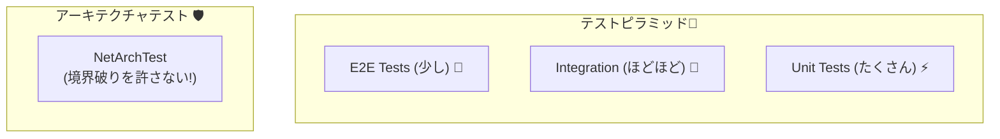
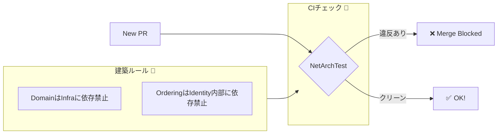

# 第29章：テストと崩壊防止：モジュール境界を守り続ける🧪🛡️

### 今日のゴール🎯

* **境界が“だんだん溶ける”のを、テストで止める**🧊✋
* **「どこをどうテストするか」**を、モジュール単位で迷わないようにする🧩
* **参照ルール破り（依存の漏れ）を自動で検知**して、レビュー疲れを減らす🔍✨

---

## まずダメ例😇 → 良い例😎

### ダメ例😇（崩壊の始まり💥）

* 「ちょっとだけだから…」で **他モジュールの内部クラスを参照**し始める🕳️
* 「共通で使うし」って言って **Shared に便利関数を盛りまくる**🍱➡️🍱🍱🍱
* テストが **E2E ばっかり**で、落ちたとき原因が追いにくい😵‍💫
* 境界が守れてるかは **コードレビューの気合い頼り**🔥（つらい…）

### 良い例😎（守りが強い💪）

* **ドメインはI/Oゼロ**で単体テストしやすい🧠✨
* **モジュールごとにテスト方針**がある（Unit / Integration / API）📦🧪
* **アーキテクチャテスト**で参照ルール破りを自動検出🔍✅
* PRで勝手に崩れない（崩れたらテストが止める）🚧🛡️

---

## 1) 章の地図：この章は“3本柱”でいくよ🗺️🧩✨

### ① I/O分離でロジックを単体テスト🧠🧪

* ドメイン層：**純粋ロジック**（状態遷移・不変条件）をテスト
* アプリ層：ユースケースの分岐をテスト（外部はモック/フェイクでOK）

### ② モジュール単位のテスト方針📦📏

* 「Ordering ならこの粒度まで」「Catalog はここまで」みたいに**決める**
* 迷いが減って、テストが増やしやすい😊

### ③ 参照ルール破りを“自動チェック”🔍🛡️

* **NetArchTest / ArchUnitNET**みたいな“アーキテクチャテスト”で、
  「境界を破る依存」を**テスト失敗にする**✅
* これが一番 “崩壊防止” に効く✨

---

## 2) テストの種類：モジュラーモノリス向けの“ちょうどいい”配分🍰🧪




### テストピラミッド（超ざっくり）🍰

* **Unit（多め）**：速い・原因が分かる・毎回回せる⚡
* **Integration（ほどほど）**：DB/外部I/O込みで確かめる🔌🗄️
* **E2E（少なめ）**：全体の安心（多すぎると重い）🐘

### モジュール別の“おすすめセット”📦✨

* **Domain.UnitTests**：状態機械・不変条件・計算ロジック🔒🧠
* **Application.UnitTests**：ユースケースの分岐、外部呼び出し条件📣
* **Infrastructure.IntegrationTests**：DB永続化・Repository・Outbox等🗃️📤
* **ModuleApiTests（任意）**：公開API（窓口）を通すテスト🪟✅
* **ArchitectureTests（必須級）**：参照ルール監視🔍🛡️

---

## 3) 手を動かす（C#）⌨️✨：まずは“ドメイン単体テスト”から🧠🧪

ここでは Ordering のイメージでいくね🛒
（第26〜28章の状態機械が、ここでめちゃ活きるよ🚥✨）

### 例：Order の状態遷移を守るテスト🚥

* 「Created → Paid はOK」
* 「Created → Shipped はNG（支払い前に発送はダメ🙅‍♀️）」
* 「Cancelled は戻れない」みたいなルールをテストで固定🔒

#### サンプル（雰囲気コード）

```csharp
using Xunit;

public class OrderStateTests
{
    [Fact]
    public void Created_can_transition_to_Paid()
    {
        var order = Order.Create(/*...*/);

        order.Pay(/*...*/);

        Assert.Equal(OrderStatus.Paid, order.Status);
    }

    [Fact]
    public void Created_cannot_transition_to_Shipped()
    {
        var order = Order.Create(/*...*/);

        Assert.Throws<DomainRuleException>(() => order.Ship());
    }
}
```

✅ ポイント

* **DBもHTTPも一切いらない** → 速い⚡
* ルールが変わったらテストも変わる → “仕様の見える化”👀✨

---

## 4) アプリ層テスト：ユースケースの“分岐”を固定する🧩🧪

アプリ層は「支払い成功したら Outbox に積む」みたいな**手順**が多いよね📤🔁
ここは “外部は偽物でOK” にして、分岐をテストするのがコツ😊

### 例：支払い成功 → Order更新 → Outbox追加📤✅

```csharp
using Xunit;

public class PayOrderUseCaseTests
{
    [Fact]
    public async Task When_payment_succeeds_it_writes_outbox()
    {
        var repo = new FakeOrderRepository();
        var outbox = new FakeOutbox();
        var payment = new FakePaymentGateway(alwaysSuccess: true);

        var useCase = new PayOrderUseCase(repo, outbox, payment);

        await useCase.Execute(orderId: "o-1");

        Assert.True(outbox.HasEvent("OrderPaid"));
    }
}
```

✅ ポイント

* **「どの条件で何を呼ぶか」**が明確になる📌
* “副作用の連鎖” があっても、速く回る⚡

---

## 5) インフラ統合テスト：DB・Outbox・Repository を“現実寄り”に確かめる🗄️🧪


### ありがちな落とし穴⚠️

* 「InMemoryで通ったのに本番DBで死ぬ」😵
  （SQLの制約、トランザクション、インデックス、ロック…現実は厳しい🥲）

### そこで：Testcontainers という選択肢🐳✨


テスト用に **使い捨てDBコンテナ**を立てて検証できるライブラリだよ！
Testcontainers for .NET は NuGet でも配布されてる📦（例：4.10.0 のリリース情報あり）([GitHub][1])

#### イメージ（雰囲気コード）

```csharp
using Xunit;
using Testcontainers.PostgreSql;

public class OrderingRepositoryTests : IAsyncLifetime
{
    private PostgreSqlContainer _db = default!;

    public async Task InitializeAsync()
    {
        _db = new PostgreSqlBuilder()
            .WithImage("postgres:16")
            .Build();

        await _db.StartAsync();
        // connectionString = _db.GetConnectionString();
        // apply migrations...
    }

    public async Task DisposeAsync() => await _db.DisposeAsync();

    [Fact]
    public async Task Save_and_load_order_roundtrip()
    {
        // var repo = new EfOrderRepository(connectionString);
        // await repo.Save(order);
        // var loaded = await repo.Get(order.Id);
        // Assert.Equal(order.Status, loaded.Status);
    }
}
```

✅ ポイント

* **本番に近い事故をテストで拾える**🛡️
* Outbox の「同一トランザクションで書けてる？」も検証できる📤✅

---

## 6) 本丸🔥：アーキテクチャテストで“境界破り”を自動検知する🔍🛡️




ここが第29章のメインディッシュ🍽️✨
人間のレビューだけだと、忙しいときに漏れるの…あるある🥲
だから **ルール破りはテストで落とす**のが強い💪

### 使えるライブラリ候補📦

* **NetArchTest**：シンプルに書ける（例が分かりやすい）([GitHub][2])
* **NetArchTest.eNhancedEdition**：NetArchTest派生で改良版（NuGetに1.3.7あり）([GitHub][3])
* **ArchUnitNET**：より“建築テスト”っぽく強力（GitHubで使い方がまとまってる）([GitHub][4])

この章では、初心者でも入りやすい **NetArchTest系**で例を書くね😊

---

### 6-1) レイヤールール（モジュール内の崩壊防止）🧅🚦

**例：Domain は Infrastructure に依存しちゃダメ🙅‍♀️**

```csharp
using NetArchTest.Rules;
using Xunit;

public class LayerRulesTests
{
    [Fact]
    public void Domain_should_not_depend_on_Infrastructure()
    {
        var domainAssembly = typeof(MyApp.Modules.Ordering.Domain.Order).Assembly;

        var result = Types.InAssembly(domainAssembly)
            .That()
            .ResideInNamespace("MyApp.Modules.Ordering.Domain", true)
            .ShouldNot()
            .HaveDependencyOn("MyApp.Modules.Ordering.Infrastructure")
            .GetResult();

        Assert.True(result.IsSuccessful);
    }
}
```

✅ これが守れると…

* Domain が **純粋ロジック**で保たれて、テストもしやすい🧠✨
* “DBの都合” が中に染み込む事故が激減🧊

---

### 6-2) モジュール境界ルール（他モジュールを勝手に触らない）📦🙅‍♀️


**ルール例**

* Ordering は Identity の **Contracts（窓口）だけ**参照OK🪟
* Identity の内部（Domain/Application/Infrastructure）は参照NG🚫

```csharp
using NetArchTest.Rules;
using Xunit;

public class ModuleBoundaryRulesTests
{
    [Fact]
    public void Ordering_should_not_depend_on_Identity_internals()
    {
        var orderingAssembly = typeof(MyApp.Modules.Ordering.Application.PayOrderUseCase).Assembly;

        var forbidden = new[]
        {
            "MyApp.Modules.Identity.Domain",
            "MyApp.Modules.Identity.Application",
            "MyApp.Modules.Identity.Infrastructure"
        };

        var result = Types.InAssembly(orderingAssembly)
            .ShouldNot()
            .HaveDependencyOnAny(forbidden)
            .GetResult();

        Assert.True(result.IsSuccessful);
    }

    [Fact]
    public void Ordering_can_depend_on_Identity_contracts()
    {
        var orderingAssembly = typeof(MyApp.Modules.Ordering.Application.PayOrderUseCase).Assembly;

        var result = Types.InAssembly(orderingAssembly)
            .Should()
            .HaveDependencyOn("MyApp.Modules.Identity.Contracts")
            .GetResult();

        Assert.True(result.IsSuccessful);
    }
}
```

✅ これが効くところ

* 「つい内部クラス使っちゃった」事故を **即検知**🔍
* 境界が **ルールとして固定**される📌

---

### 6-3) “Shared増殖”を抑えるルール🍱⚠️

Shared は便利だけど、増えると境界が溶ける🫠
例えば「Shared にドメイン語彙が入ってない？」を監視するルールも作れるよ！

ルール例（アイデア）💡

* `MyApp.Shared` に `Order` `Payment` みたいな**業務語彙**が入ったらNG🙅‍♀️
* Shared は `Primitives`（ID型など）だけ許可、みたいにする🔒

---

## 7) テスト実行の“最新寄り”トピック：Microsoft Testing Platform🧪🚀

最近の .NET テスト周りは **Microsoft.Testing.Platform** という新しい仕組みも進んでるよ✨

* 軽量で、いろんな実行環境で動かしやすい思想🪶
* .NET の公式ドキュメントに概要があるよ([Microsoft Learn][5])

さらに、xUnit v3 は Microsoft Testing Platform をネイティブ実装してる流れもドキュメント側で触れられてるよ([xunit.net][6])
（「今どれ使う？」はチーム方針でOK！でも“新しい流れ”は知っておくと得😊）

---

## 8) ミニ演習📝✨（やってみよ〜！）

### 演習1：境界破りをわざと起こして、テストに止めてもらう💥🛡️

1. Ordering.Application から Identity.Domain のクラスを `using` してみる
2. ArchitectureTests を実行
3. **落ちたら勝ち🎉**（境界が守れたってこと！）

### 演習2：Domain の中で “うっかりDB” を触ってしまう事故を止める🗄️🙅‍♀️

1. Domain に `DbContext` 参照を入れてみる（ダメ例）
2. Layerルールテストで落ちることを確認
3. 依存をアプリ層/インフラ層に押し戻す💪

### 演習3：テスト方針を“1枚の紙”にする📄🧠

* 各モジュールに対して

  * Unit：何を守る？（不変条件、状態遷移）
  * Integration：何を確かめる？（DB、Outbox、Repository）
  * API：何を保証する？（公開窓口）
    を箇条書きで書く✍️✨

---

## 9) AI活用プロンプト例🤖✨（コピペで使えるよ）

### アーキテクチャテスト生成🔍

* 「次の依存ルールを NetArchTest でテストにしてください：
  Ordering は Identity の Contracts 以外に依存してはいけない。
  対象アセンブリは `MyApp.Modules.Ordering.Application`。」

### “怪しい依存”の洗い出し🕵️‍♀️

* 「このソリューション構成で、モジュール境界が崩れやすい典型パターンを列挙して。
  それぞれに対して ‘検知するアーキテクチャテスト案’ を出して。」

### テスト設計レビュー🧪

* 「このユースケースの分岐表（if条件）を渡すので、
  最小の単体テストケース（Given/When/Then）に分解して。」

### flaky対策🔁

* 「統合テストが不安定です。DB初期化・並列実行・依存関係の観点で、
  よくある原因と対策チェックリストを作って。」

---

## まとめ（覚える1行）📌

**境界は“気合い”じゃなくて、アーキテクチャテストで自動的に守る🛡️🔍**

---

### 参考：この章の“最新前提”の根拠（押さえどころ）📚✨

* C# 14 は .NET 10 対応、Visual Studio 2026 で .NET 10 SDK も扱える旨が公式に案内されてるよ([Microsoft Learn][7])
* ArchUnitNET はリリースが継続していて（例：2025/12のリリース情報あり）、アーキテクチャテストの選択肢として現役だよ([GitHub][8])
* Testcontainers for .NET も継続リリースされていて、使い捨てコンテナで統合テストを支える選択肢になるよ([GitHub][1])
* Microsoft Testing Platform の公式ドキュメントがあり、テスト実行基盤の新しい流れとして把握できるよ([Microsoft Learn][5])

必要なら次は、第29章で作った **ArchitectureTests をCIで必ず走らせる“最小の型”**（失敗時の出し方・ルール追加の手順・運用のコツ）まで、章内の「提出物」っぽく整えて出すね😊🏁

[1]: https://github.com/testcontainers/testcontainers-dotnet/releases?utm_source=chatgpt.com "Releases · testcontainers/testcontainers-dotnet"
[2]: https://github.com/BenMorris/NetArchTest "GitHub - BenMorris/NetArchTest: A fluent API for .Net that can enforce architectural rules in unit tests."
[3]: https://github.com/NeVeSpl/NetArchTest.eNhancedEdition?utm_source=chatgpt.com "NeVeSpl/NetArchTest.eNhancedEdition"
[4]: https://github.com/TNG/ArchUnitNET "GitHub - TNG/ArchUnitNET: A C# architecture test library to specify and assert architecture rules in C# for automated testing."
[5]: https://learn.microsoft.com/en-us/dotnet/core/testing/microsoft-testing-platform-intro?utm_source=chatgpt.com "Microsoft.Testing.Platform overview - .NET"
[6]: https://xunit.net/docs/getting-started/v2/getting-started?utm_source=chatgpt.com "Getting Started with xUnit.net v2 [2025 July 4]"
[7]: https://learn.microsoft.com/en-us/dotnet/csharp/whats-new/csharp-14?utm_source=chatgpt.com "What's new in C# 14"
[8]: https://github.com/TNG/ArchUnitNET/releases?utm_source=chatgpt.com "Releases · TNG/ArchUnitNET"
