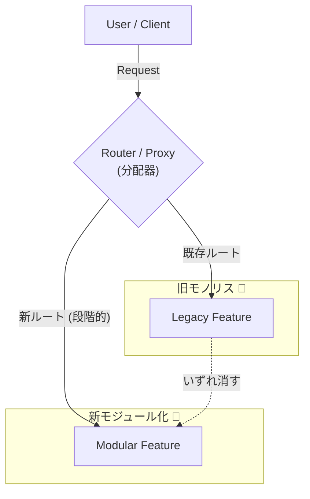
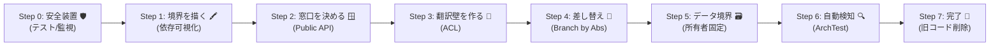

# 第30章：移行＆卒業制作：既存モノリスを育てて完成🏁🎉

## 今日のゴール🎯

* 既存モノリスを**止めずに**モジュール化していく「段階移行」のやり方を身につける🩹✨
* 「最初に切る境界」を**自分で選べる**ようになる🧠🧱
* 最終課題（卒業制作）で、**あなたの題材**をモジュール化して提出できる状態にする📦🎓

---

## まずダメ例😇 → 良い例😎

### ダメ例😇（ビッグバン移行）💥

* いきなり全部リライトする
* 途中で仕様変更が来て詰む😵
* 「完成まで価値ゼロ」になりがち🫠
* だいたい終わる前に炎上🔥

### 良い例😎（段階移行）🩹✨

* 小さく区切って、**出せるところから出す**
* 既存を“絞め殺す木”みたいに少しずつ置き換える（Strangler Fig）🌿
  置き換えを**小さなリリースで積み上げる**のがコツだよ📦 ([martinfowler.com][1])
* モノリスの中身を差し替えるときは「Branch by Abstraction」も超便利🧩
  大きな変更を進めながらも、**継続リリース**できるのが強い💪 ([martinfowler.com][2])

---

## 今回の“最新スタメン”だけ押さえよ📌✨

* **.NET 10（LTS）**が稼働中で、2026-01-13時点のパッチは **10.0.2**（LTSは長く使えるのが強み）🛡️ ([Microsoft][3])
* **C# 14**は「最新のC#」で、.NET 10でサポートされてるよ🧠✨ ([Microsoft Learn][4])
* **Visual Studio 2026 18.2.0**（2026-01-13リリース）が最新アップデートの一つだよ🪟🛠️ ([Microsoft Learn][5])

---

## 段階移行の“3大テク”🍣✨（これだけで戦える）




### 1) Strangler Fig（外側から置き換え）🌿

* 入口（UI/API/ルーティング）に“分岐”を置いて
  **新しい実装に少しずつ流す**イメージだよ🚦 ([Microsoft Learn][6])

### 2) Branch by Abstraction（中身を差し替え）🧩

* 既存の呼び出しを**いったんインターフェースに寄せて**、
  旧実装と新実装を並走させて切り替えるやつ🔁 ([martinfowler.com][2])

### 3) ACL（アンチコラプションレイヤ）🧼🧱

* レガシー側の言葉・型・都合が、新モジュールに侵入して“汚染”するのを防ぐ💦
* 翻訳はACLでやって、モジュールの中は**自分の言葉を守る**✨ ([Microsoft Learn][7])

---

## “最初に切る境界”の選び方🧠🪓（迷ったらこの採点でOK）

次の5項目を、各0〜2点で採点して合計が高いものから✨

1. **痛みが強い**（変更が怖い・バグが多い・改修頻度が高い）😵‍💫
2. **責務がわかりやすい**（チーム内で説明が揃う）📣
3. **依存が少ない**（周りを巻き込みにくい）🧵
4. **データの所有者が決めやすい**（テーブル/集約の責任が見える）🗃️
5. **価値が早く出る**（1〜2週間で“何か出せる”）📦✨

> いきなり「一番デカい塊」を切らないでね😇
> まずは“学びが取れて、爆発しにくい”ところからでOK🧯

---

## 段階移行のロードマップ🏁（この順でやると事故りにくい）

### Step 0：安全装置を付ける🛡️

* まずは**テストの最低ライン**（主要ユースケースのE2E or APIテスト）を用意🧪
* ログ・メトリクスも最低限（失敗の検知が早いと強い）🔭

### Step 1：境界を“紙に描く”🖍️

* 依存の矢印をざっくり描く（誰が誰を呼んでる？）👀
* “言葉が衝突する場所”を特定（Orderが意味違う…みたいな）🧱

### Step 2：モジュールの「窓口」だけ決める🪟

* まず実装じゃなくて、**公開API（窓口）**を決める📣
* 内部のクラスは見せない（DTOやコマンドで話す）📦

### Step 3：ACLで“翻訳壁”を作る🧼🧱

* レガシー↔新モジュール間は、いきなり直結しない
* 変換・吸収はACLでまとめておく（あとで剥がせる）🧽 ([Microsoft Learn][7])

### Step 4：Branch by Abstractionで“差し替えポイント”を作る🔁

* 旧処理を呼んでる所をインターフェース経由に寄せる
* 新実装を入れて、段階的に切り替える🧩 ([martinfowler.com][2])

### Step 5：データ境界を“守れる形”にする🗃️🔒

* テーブル共有が残るなら、まずは「書き込み責務」を1つに固定
* 直接UPDATEし合うのは最初に潰す🧯

### Step 6：参照ルールを“自動で怒る”ようにする😠➡️✅

* 人の注意だけに頼らず、**アーキテクチャテスト**で破りを検出🔍
* 例：NetArchTest系で「HostはModuleのInternalに触るな」みたいなルールにする📏 ([GitHub][8])

### Step 7：旧コードを消して、境界を固める🧱✨

* 置き換え終わったら旧実装を削除（残すと復活する😇）
* 「次に切る候補」を同じ手順で繰り返す🔁



---

## 手を動かす（C#）⌨️✨：移行の最小“型”を作ろう

ここでは「1モジュール目」を切るための“型”だけ作るよ🧩
（あなたの題材に合わせて名前は変えてOK😊）

### 1) 公開API（窓口）を先に作る🪟

```csharp
// Modules/Ordering/Public/IOrderingApi.cs
namespace MyApp.Modules.Ordering.Public;

public interface IOrderingApi
{
    Task PlaceOrderAsync(PlaceOrderCommand command, CancellationToken ct);
}

public sealed record PlaceOrderCommand(
    Guid CustomerId,
    IReadOnlyList<LineItemDto> Items
);

public sealed record LineItemDto(Guid ProductId, int Quantity);
```

ポイント📌

* “内部のEntityやDbContext”を返さない🙅‍♀️
* まずは **コマンド/DTOで会話**させると事故が減るよ📦✨

---

### 2) Branch by Abstractionの差し替え口を作る🧩🔁

```csharp
// Legacy/Ordering/OrderingFacade.cs （Host側でもOK）
public interface IOrderingFacade
{
    Task PlaceOrderAsync(PlaceOrderRequest req, CancellationToken ct);
}

// 旧実装（当面は既存コードを呼ぶだけ）
public sealed class LegacyOrderingFacade : IOrderingFacade
{
    public Task PlaceOrderAsync(PlaceOrderRequest req, CancellationToken ct)
        => LegacyOrderingService.Place(req, ct); // 既存を呼ぶ
}

// 新実装（新モジュールに寄せていく）
public sealed class ModularOrderingFacade : IOrderingFacade
{
    private readonly MyApp.Modules.Ordering.Public.IOrderingApi _api;
    public ModularOrderingFacade(MyApp.Modules.Ordering.Public.IOrderingApi api) => _api = api;

    public Task PlaceOrderAsync(PlaceOrderRequest req, CancellationToken ct)
        => _api.PlaceOrderAsync(
            new(req.CustomerId, req.Items.Select(x => new LineItemDto(x.ProductId, x.Quantity)).ToList()),
            ct
        );
}
```

* “Facade”の向こう側を、旧→新に**入れ替えていく**イメージだよ✨
* この考え方がBranch by Abstraction🧩 ([martinfowler.com][2])

---

### 3) 参照ルールをテストで固定🔍✅（例：NetArchTest）

```csharp
// Tests/Architecture/ModuleRulesTests.cs
using NetArchTest.Rules;
using Xunit;

public class ModuleRulesTests
{
    [Fact]
    public void Host_must_not_reference_module_internal()
    {
        var result = Types.InAssembly(typeof(MyApp.Host.Program).Assembly)
            .That()
            .ResideInNamespace("MyApp.Host")
            .ShouldNot()
            .HaveDependencyOn("MyApp.Modules.Ordering.Internal")
            .GetResult();

        Assert.True(result.IsSuccessful, string.Join(Environment.NewLine, result.FailingTypeNames));
    }
}
```

* 「人が気をつける」より「テストが怒る」が強い😆🛡️ ([GitHub][8])

---

## ミニ演習📝✨（15〜30分でOK）

1. あなたの既存モノリスで「一番痛い機能」を1つ選ぶ😵‍💫➡️🎯
2. その機能の“窓口”を **I〜Api** で1つ定義する🪟
3. 旧実装を **Facade** で包む（今は中身そのままでOK）📦
4. アーキテクチャテストを1本だけ追加する🔍✅
5. 旧→新に差し替える「順番」を箇条書きで書く🗒️✨

---

## 卒業制作（最終課題）✨🎓：あなたの題材でモジュール化して提出！

### 必須要件✅

* モジュール **2つ以上**（例：Catalog / Ordering でもOK）📦📦
* 各モジュールに「公開API（窓口）」がある🪟
* モジュール境界のルールを**自動チェック**（アーキテクチャテスト等）🔍
* “既存コード（またはレガシー相当）”から、段階移行した形跡がある🩹🔁

  * Strangler Fig か Branch by Abstraction のどちらか（両方なら最高）🌿🧩 ([martinfowler.com][1])

### できたら加点✨（おすすめ）

* ACLで外部/レガシー連携の翻訳を隔離🧼🧱 ([Microsoft Learn][7])
* 「最初に切った境界」を選んだ理由が説明できる（採点表を添付）🧠
* 境界の“破り”がPRで検知できる（CIで落ちる等）🚦

### 提出物📦

* リポジトリ（コード）🗂️
* README（モジュール図・境界ルール・起動方法）📝
* 1ページの「移行メモ」

  * 何を最初に切った？なぜ？次は？（3行でOK）✍️
* テスト結果（スクショでもOK）🧪📸

### 合格ライン（超シンプル）🎉

* **境界が言える**（口頭で説明できる）
* **窓口しか通らない**（直接参照が減ってる）
* **ルールが自動で守られてる**（テスト/CI）

---

## AI活用プロンプト例🤖✨（コピペOK）

* 「この既存プロジェクトから、最初に切るべき境界候補を3つ出して。依存の強さ/価値/リスクで理由も。」
* 「Ordering周りの呼び出しを“Branch by Abstraction”にしたい。差し替え点の候補と、段階移行の手順を書いて。」 ([martinfowler.com][2])
* 「レガシーDTOを新モジュールに持ち込みたくない。ACLの変換層（Mapper/Adapter）を設計して、配置場所も提案して。」 ([Microsoft Learn][7])
* 「アーキテクチャテストで ‘HostはModules.*.Internalに依存禁止’ を追加したい。NetArchTestで例を書いて。」 ([GitHub][8])

---

## まとめ（覚える1行）📌✨

**“いきなり全部”じゃなくて、境界を決めて、窓口を作って、少しずつ置き換える🩹🏁**

[1]: https://martinfowler.com/bliki/StranglerFigApplication.html?utm_source=chatgpt.com "Strangler Fig"
[2]: https://martinfowler.com/bliki/BranchByAbstraction.html?utm_source=chatgpt.com "Branch By Abstraction"
[3]: https://dotnet.microsoft.com/en-us/platform/support/policy/dotnet-core?utm_source=chatgpt.com "NET and .NET Core official support policy"
[4]: https://learn.microsoft.com/en-us/dotnet/csharp/whats-new/csharp-14?utm_source=chatgpt.com "What's new in C# 14"
[5]: https://learn.microsoft.com/en-us/visualstudio/releases/2026/release-history?utm_source=chatgpt.com "Visual Studio Release History"
[6]: https://learn.microsoft.com/en-us/azure/architecture/patterns/strangler-fig?utm_source=chatgpt.com "Strangler Fig Pattern - Azure Architecture Center"
[7]: https://learn.microsoft.com/en-us/azure/architecture/patterns/anti-corruption-layer?utm_source=chatgpt.com "Anti-corruption Layer pattern - Azure Architecture Center"
[8]: https://github.com/BenMorris/NetArchTest?utm_source=chatgpt.com "BenMorris/NetArchTest: A fluent API for .Net that can ..."
