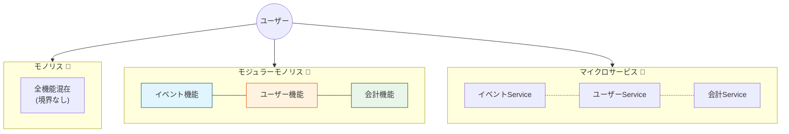

# 第01章：ようこそモジュラーモノリスへ🌱🧩

この章は「設計をガチで学んだことがない人」が、**“分けるって何？”** をふんわり理解して、次章以降をスイスイ進めるための “入口” だよ〜☺️✨

---

## 1. まずは超ざっくり3兄弟を知ろう👪🧠

### 🧱 モノリス（ぜんぶ一体型）

* アプリが **1つのかたまり** で動く
* はじめやすい・動かしやすい（でも育つとゴチャりやすい）

### 🧩 モジュラーモノリス（1つで動くけど、中身はキレイに区切る）

* **デプロイ（配布・動かす単位）は1つ**
* でも内部は **モジュール（機能の箱）** に分かれてて、境界をルールで守る✨
* “単一デプロイ＋モジュール境界” という発想が中心だよ📦🧩 ([Thoughtworks][1])

### ☁️ マイクロサービス（小さいサービスがたくさん）

* 機能ごとに **別々にデプロイ** できる（強い！）
* その代わり **運用・監視・通信・障害対応** が一気に難しくなることも…😵‍💫 ([martinfowler.com][2])

> * マイクロサービス：**屋台がいっぱいのフェス**🎪（自由だけど運営が大変）

---

## 2. 「分ける」って何がうれしいの？未来の自分が助かる話🕰️💖

“分ける” の目的は、かっこよさじゃなくて **人生をラクにするため** だよ😌✨

### ✅ うれしいことリスト（超リアル編）

* 🔧 変更するとき、影響範囲が小さくなる（事故りにくい）
* 🧠 コードを読むとき、「どこ見ればいいか」迷子になりにくい
* 🧪 テストがしやすくなる（中心のロジックだけ素早くチェック）
* 🤝 チームでも「ここは誰の担当？」が分かれやすい（未来の自分＝他人👤）

Thoughtworks も、モジュラーモノリスは **インフラが軽くなりやすくコスト効率が良い**（=はじめに向く）という文脈で語ってるよ💸✨ ([Thoughtworks][1])

---

## 3. なんで最初からマイクロサービスにしないの？🤔🧯

ここ、超だいじポイント！📌
Martin Fowler は新規開発では “まずモノリスから始める” という考え方（Monolith First）を述べていて、いきなりマイクロサービスに飛ぶのはリスクが増えやすい…という話があるよ🧭 ([martinfowler.com][3])

さらにマイクロサービスは「強い境界」が得られる反面、**分散システムのコスト**（運用・観測・通信・失敗の種類が増える）も背負うことになる、という “トレードオフ” が整理されてるよ⚖️ ([martinfowler.com][2])

だからこの教材では、まず **モジュラーモノリスで“分ける力”を身につける** → 必要なら将来 “一部だけサービス化” に進める、って順番にするよ🚀🧩

---

## 4. 30章後にできるようになること🎯✨（ゴールの絵）

30章終わったら、こんな状態を目指すよ💪💕

* 🧩 1つのアプリを「モジュール」に切って考えられる
* 🚪 モジュールの入口（公開API）を作って、勝手に中を触れないようにできる
* 🛡️ ルール（設定/CI）で “境界違反” を自動で止められる
* 🔄 モジュール間連携を、事故りにくい形（同期・読み書き分離など）で組める
* 🧪 テストしやすい中心ロジックを作れる
* 🧭 将来、必要なところだけマイクロサービス化する判断ができる

> つまり：**「今は1つで楽に運用しつつ、中身は将来割れる形に育てる」** ができるようになるよ🌱🧩🚀

---

## 5. この章の重要キーワード📌✨（やさしめ）

* 🧩 **モジュール**：機能のまとまり（箱）
* 🚪 **公開API**：箱の入口（ここからだけ触ってOK）
* 🔒 **境界**：箱の壁（ルールで守る）
* 🧠 **関心の分離**：混ぜない工夫（次の章でもっと！🍱）

---

## 6. ミニ演習（5〜10分）🧩📝✨

### 演習A：あなたの脳内アプリを “箱” にしてみる📦🧠

まだ題材アプリは決めないけど、練習だけするよ〜！

1. 身近なアプリを1つ思い浮かべてね（例：イベント管理📅）
2. そのアプリの機能を **5〜8個** 書く
3. それを “箱っぽく” グルーピングしてみる（2〜4箱くらい）

例（イベント管理アプリの箱）🎒📅

* 🧑‍🎓 会員（ユーザー）
* 📅 イベント
* 📨 お知らせ
* ✅ 参加申し込み

> ここでは正解とかないよ🙆‍♀️
> 「箱に分けて考えるクセ」をつけるのが目的✨

### 演習B：事故ポイントを想像する💥🧯

次の質問に1行で答えてみてね👇

* 「全部ごちゃ混ぜコード」だと、どんな事故が起きそう？😵‍💫

例：

* “イベント更新” を直したら “会計” が壊れた💣（影響範囲が読めない）

---

## 7. AI拡張に投げると捗るプロンプト例🤖📝💡

そのままコピペでOKだよ〜！（短くて強い💪）

* 🤖 **概念を超やさしく説明して**

  * 「モジュラーモノリスを、設計初心者向けに“お弁当箱”の比喩で説明して。モノリス/マイクロサービスとの差も一緒に。」

* 🧩 **箱（モジュール）候補を出して**

  * 「学内イベント管理アプリの機能一覧がこれ。モジュール境界の候補を3案出して。各案のメリット/デメリットも。」

* ⚠️ **分け方の失敗例を教えて**

  * 「モジュラーモノリスで“分けたつもり”が失敗するパターンを5つ。初心者がやりがちなもの中心で。」

---

## 8. 2026年1月時点の “最新ざっくり” メモ🪟🧾✨

（教材の後半で設定やCIに触れるときに効いてくるよ〜）

* Node.js は **v24（Krypton）がActive LTS**、v25がCurrent、という整理になってるよ📌 ([Node.js][4])
* TypeScript は **5.9 系のリリース情報が公式に出ている**よ🧠✨ ([TypeScript][5])

---

## 9. まとめ🎀✨

* モジュラーモノリスは **「1つで動かしやすい」＋「中はキレイに分ける」**🧩
* 目的は “オシャレ” じゃなくて **未来の自分を救うこと**🕰️💖
* まずは **箱に分けて考えるクセ** をつければOK🙆‍♀️✨
* 次章で題材アプリを決めて、ここから一気に楽しくなるよ🎒📱🎉

---

## 次章予告👀➡️🎒📱

次は「題材アプリを決めよう」だよ！
**“境界が作れそうな題材”** の選び方と、AIで要件を10行にギュッとするやつやるよ〜🤖📝✨

[1]: https://www.thoughtworks.com/en-de/insights/blog/microservices/modular-monolith-better-way-build-software?utm_source=chatgpt.com "When (‌modular) monolith is the better way to build software"
[2]: https://martinfowler.com/articles/microservice-trade-offs.html?utm_source=chatgpt.com "Microservice Trade-Offs"
[3]: https://martinfowler.com/bliki/MonolithFirst.html?utm_source=chatgpt.com "Monolith First"
[4]: https://nodejs.org/en/about/previous-releases?utm_source=chatgpt.com "Node.js Releases"
[5]: https://www.typescriptlang.org/docs/handbook/release-notes/typescript-5-9.html?utm_source=chatgpt.com "Documentation - TypeScript 5.9"
