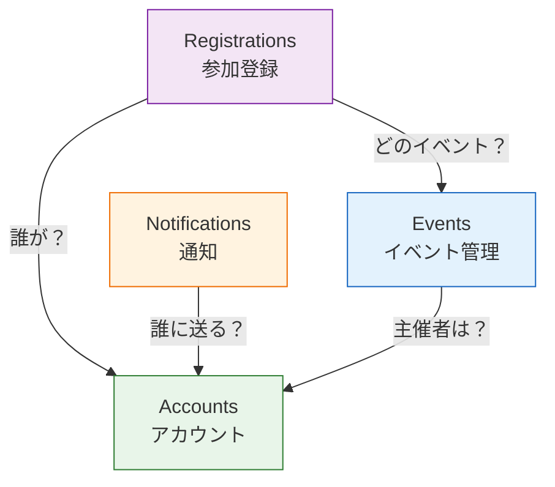

# 第02章：題材アプリを決めよう🎒📱

## この章のゴール🎯✨

この章が終わると、あなたの題材アプリについて👇が“ちゃんと決まってる”状態になります😊

* 題材（アプリのテーマ）✅
* ユーザーと目的（誰が何のために使う？）✅
* 要件10行（ざっくり仕様）✅
* モジュール境界の候補（3〜5個くらい）✅

---

## まずは結論：題材は「境界が生まれやすいもの」を選ぶのが勝ち🏆🧩

モジュラーモノリスで気持ちよく学ぶには、題材がめちゃ大事！😳✨
おすすめは、次の3条件がそろうもの👇


### 条件A：「登場人物」が2種類以上いる👩‍🎓👨‍🏫

例：参加者／主催者／管理者…みたいに役割が分かれると境界が出やすい！

### 条件B：「データの持ち主」が分けられる🗄️👑

例：イベント情報はイベント担当、出欠は参加管理…みたいに“担当（所有権）”が決められると強い💪

### 条件C：「やること」が3つ以上の塊に分かれる🧱🧱🧱

例：作成・公開／参加・キャンセル／お知らせ…みたいに、機能の“かたまり”があると最高✨

---

## 題材の候補例（境界が作れそうなやつ）🌟


ここでは、境界が自然に生まれる題材を3つ出すよ〜😊💕


### ① 学内イベント管理📅🎤（いちばんおすすめ！）

**よくある機能**

* イベント作成・公開📝
* 参加登録・キャンセル✅❌
* お知らせ通知📣
* 参加者一覧（主催者だけ見える）👀

**境界（モジュール）候補🧩**

* `events`：イベントの基本情報（作る・公開する）
* `registrations`：参加登録（出欠、キャンセル）
* `notifications`：通知（参加確定メール、リマインドなど）
* `accounts`：ユーザー、権限（主催者/参加者）

➡️ **“イベント”と“参加”が別物**なので、境界の練習にピッタリ🙆‍♀️✨



---


### ② サークル会計💰🧾

**よくある機能**

* 収入・支出の記録✍️
* 月次集計📊
* 精算（立替の返金）💸
* 承認フロー（会計→代表）✅

**境界候補🧩**

* `ledger`：台帳（収支の記録）
* `settlements`：精算（立替・返金）
* `approvals`：承認（ワークフロー）
* `accounts`：メンバー、権限

➡️ ルール（不正防止・承認）が入りやすいので、設計の話につなげやすい😊

---


### ③ フリマ（学内限定）🛍️🎒

**よくある機能**

* 出品📦
* 購入・取引🤝
* チャット/連絡💬
* 評価⭐

**境界候補🧩**

* `listings`：出品
* `transactions`：取引（購入・キャンセル）
* `messaging`：メッセージ
* `reputation`：評価

➡️ ちょい難しめだけど、モジュール分割の練習には最高✨（やることが多いのでMVPを小さく！）

---

## 題材を決めるための「選び方」🧠🔍（失敗しにくい手順）

迷ったら、この順番で決めるとスムーズだよ〜😊✨


### Step1：候補を3つ書く📝

「これなら作れそう！」を3つだけ。10個出すより、まず3つがちょうどいい😌

### Step2：「境界チェック」を当てはめる✅

各候補に対して、YESが多いものを採用🎯

* 役割が2つ以上ある？（参加者/主催者 etc）
* データの持ち主を分けられる？（イベント担当/参加担当 etc）
* 機能の塊が3つ以上ある？
* 1人でMVPまで作れそう？（ここ大事！）😇

### Step3：MVP（最初の完成形）を先に小さく決める🧸✨

「全部やる」は禁止〜！🙅‍♀️💦
最初はこんな感じでOK👇

* イベント作成＋一覧表示＋参加登録 まで
* 通知や検索、画像アップロードは後回し

---


## 要件を「10行」にする（AIで要約）🤖📝✨

ここがこの章のメインイベント！🎉
要件を長文で書くと迷子になるので、**10行に圧縮**します✂️

### 1) まず“素材”を箇条書きでOK🍱

例（学内イベント管理の場合）👇

* 主催者がイベントを作る
* 参加者が参加する
* キャンセルもできる
* 主催者だけ参加者一覧が見たい
* 日時・場所・定員がある
* …など

### 2) AIに「10行要件」にしてもらう🤖✨

プロンプト例👇（コピペOK）

```text
次の箇条書きを、要件10行に要約して。
条件：
- ユーザー役割（参加者/主催者）を必ず含める
- 例外や禁止事項も1〜2行で入れる（例：定員超過は不可）
- 技術の話はしない（UI/DB/フレームワーク禁止）
箇条書き：
（ここに貼る）
```

### 3) 最後に「非ゴール」を3つ書く🧯

やらないことを書くと、設計がブレないよ〜😊
例👇

* 決済はやらない
* SNSログインはやらない
* リアルタイムチャットはやらない

---

## “境界が作れそう”を、もう一段だけ具体化🧩✨

次に、「モジュール候補」を雑に置きます。ここでは正解不要！🙆‍♀️


### やり方：名詞に線を引く✏️

要件10行の中の名詞を丸すると、だいたい境界候補になるよ👀✨
例：イベント／参加／通知／ユーザー／権限…

### 目標：3〜5モジュールに仮置き🧱

仮でいいので👇みたいに置く！

* `events`（イベントの情報）
* `registrations`（参加の情報）
* `accounts`（ユーザー・権限）
* `notifications`（通知）

---

## この章の成果物（これができてたら完璧💯）🎁

次の3点を、プロジェクトの `docs/` に置けたら勝ち〜！🎉

* `docs/requirements-10lines.md`：要件10行＋非ゴール
* `docs/personas.md`：ユーザー役割（2つ以上）
* `docs/modules-draft.md`：モジュール候補（3〜5個）

---

## 章末ミニ課題🧩💪

### 課題1：題材を1つに決める🎒

候補3つ→チェック→1つに決定！✅

### 課題2：要件10行＋非ゴール3つ📝

AIで要約してから、最後は自分の言葉で微修正してね😊

### 課題3：モジュール候補を3〜5個🧩

「イベント」「参加」みたいな**名詞ベース**でOK！

---

## AIの使い方（この章向け）🤖💡

最近は、AIが“複数ファイルをまたいだ作業”も手伝える流れが強いよ〜✨
GitHub Copilot にはタスクを渡して自律的に編集提案まで進める **agent mode** があるし、ドキュメント作成や整形にも相性いいです🛠️✨ ([GitHub Docs][1])
OpenAI Codex も VS Code 拡張で、読み取り・編集・実行まで含めて手伝える設計になってるよ🤝✨ ([OpenAI Developers][2])

**この章でのおすすめ依頼先**👇

* 要件10行に要約して
* 非ゴールを提案して
* モジュール候補を3〜5に分けて
* 用語集（イベント/参加/主催者…）を作って

---

## ちなみに：いまの“最新”メモ（後で困らない用）🧷✨

* Node.js は **v24 が Active LTS（Krypton）**、v25 が Current という扱いだよ〜📌 ([Node.js][3])
* TypeScript は 5.9 系が最新ラインで、npm の latest は **5.9.3** になってるよ📌 ([typescriptlang.org][4])

---

次の第3章では、いよいよ動く環境を整えて「Hello TS」まで行くよ〜🪟⚙️✨
この章の成果物（docs 3点）ができた前提で進めると、めちゃスムーズです😊💕

[1]: https://docs.github.com/en/copilot/get-started/features?utm_source=chatgpt.com "GitHub Copilot features"
[2]: https://developers.openai.com/codex/ide/?utm_source=chatgpt.com "Codex IDE extension"
[3]: https://nodejs.org/en/about/previous-releases?utm_source=chatgpt.com "Node.js Releases"
[4]: https://www.typescriptlang.org/download/?utm_source=chatgpt.com "How to set up TypeScript"
