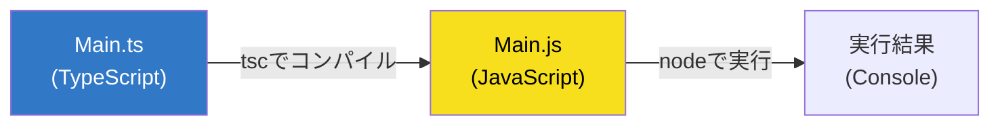

# 第03章：Windowsでの開発準備（Node/TypeScript）🪟⚙️

## ねらい🎯

この章のゴールはこれだけっ✨
**TypeScriptを書いて → コンパイルして → Node.jsで動かす**（Hello TS ✅）までを、迷子にならずに通すことだよ〜☺️🧭

---

## 3-0. まず「登場人物」をざっくり把握しよ🧑‍🤝‍🧑✨

### Node.js 🟩

* **JavaScriptをPC上で動かすエンジン**だよ（ブラウザ外で動く！）🧠💨
* 2026年1月時点だと、**v24 が Active LTS（推奨の安定版）**になってるよ✅ ([Node.js][1])

### npm 📦

* Node.jsに付いてくる「パッケージ管理」だよ
* `npm i xxx` で必要な道具（ライブラリ）を取ってくる🛒✨

### TypeScript 🟦

* **JavaScriptに“型”を足した言語**だよ🧩
* ただし！Node.jsは **TypeScriptをそのまま実行できない**から、いったん **JavaScriptに変換（コンパイル）**するよ🔁✨

---

## 3-1. Node.js を入れる（いちばん安全ルート）🧷🟢

### ✅ 基本方針：LTS を入れる

* 「安定してて壊れにくい」やつが LTS ✨
* いまの推奨ラインは **Node.js 24（Active LTS）**だよ🫶 ([Node.js][1])

### インストール後の動作確認✅

PowerShell か Windows Terminal を開いて、これ👇

```powershell
node -v
npm -v
```

* `v24.x.x` みたいなのが出たらOK🙆‍♀️🎉
* もし `node` が見つからない系なら、**いったんターミナルを閉じて開き直す**と治ること多いよ（PATHの反映）🔁✨

---

## 3-2. TypeScript を入れる（プロジェクトにだけ入れるのが正解）🧰🟦

TypeScriptは「PC全体」に入れなくてもOK🙆‍♀️
**プロジェクトごとに入れる**のが今どきで安全だよ🛡️

### ① 作業フォルダを作る📁✨

```powershell
mkdir mm-demo
cd mm-demo
```

### ② npm プロジェクトにする📝

```powershell
npm init -y
```

ここで `package.json` ができるよ📦✨（この子がプロジェクトの“名簿”！）

### ③ TypeScript を開発用として追加🧩

2026年1月時点の `typescript` の最新は **5.9.3** だよ（npm上の Latest）([npmjs.com][2])

```powershell
npm i -D typescript
```

Nodeの型も入れておくと超快適💡（`process` とかで怒られない）

```powershell
npm i -D @types/node
```

---

## 3-3. 「TypeScriptが動く流れ」を体で覚えよ🔁🧠✨


イメージはこれ👇

✅ **.ts（あなたが書く）**
⬇️ `tsc`（TypeScriptコンパイラ）
✅ **.js（変換される）**
⬇️ `node`（実行）
✅ **実行結果が出る🎉**



---

## 3-4. Hello TS を動かす（最短で成功する手順）🚀✅

### ① フォルダ構成を作る📦

```powershell
mkdir src
```

### ② TypeScript設定ファイル（tsconfig）を作る⚙️

TypeScript 5.9 では `tsc --init` も整理されてて、最初の導入がやりやすいよ🧼✨ ([Microsoft for Developers][3])

```powershell
npx tsc --init
```

作られた `tsconfig.json` を開いて、最低限これだけ整えよう👇（初心者にやさしい安定セット🫶）

* `rootDir`：入力（ts）置き場 → `src`
* `outDir`：出力（js）置き場 → `dist`

`tsconfig.json` の中をこうしてね👇

```json
{
  "compilerOptions": {
    "rootDir": "src",
    "outDir": "dist",
    "target": "ES2022",
    "module": "CommonJS",
    "strict": true
  }
}
```

> 💡ここではいったん **CommonJS** にしておくよ！
> ESM（`type: module`）は“今っぽい”けど、最初は設定でつまずきやすいから、まず成功体験を取りにいこ〜☺️🎀
> （後の章で、モジュール境界を作る流れの中で自然に整えていけるよ🧩）

### ③ `src/index.ts` を作る📝✨

`src/index.ts` にこれ👇

```ts
const appName: string = "Hello TS";
console.log(`✅ ${appName} が動いたよ〜！`);
```

### ④ コンパイル（ts → js）する🔧

```powershell
npx tsc
```

`dist/index.js` ができてたら成功🎉✨

### ⑤ 実行する（Nodeで動かす）▶️

```powershell
node dist/index.js
```

`✅ Hello TS が動いたよ〜！` が出たらクリアだよ〜🥳💕

---

## 3-5. npm scripts を作って「毎回ラクする」🪄✨

毎回 `npx tsc` とか打つの面倒だよね？🥺
`package.json` にコマンドを登録しちゃお！

`package.json` の `"scripts"` をこう👇

```json
{
  "scripts": {
    "build": "tsc",
    "start": "node dist/index.js"
  }
}
```

以後はこれでOK🎉

```powershell
npm run build
npm start
```

---

## 3-6. よくあるつまずき集（ここだけ見れば大丈夫）🩹😵‍💫

### ❓ `node` が見つからない

* ターミナルを閉じて開き直す🔁
* それでもダメなら、Nodeが入ってない or PATHが通ってない可能性（再インストールが一番早いことも）🧯

### ❓ `npx tsc` が動かない

* `npm i -D typescript` をそのフォルダでやった？👀
* `node_modules` が壊れてそうなら、いったん消して入れ直しもアリ👇

```powershell
rmdir /s /q node_modules
del package-lock.json
npm i
```

### ❓ TypeScriptのバージョン確認したい

```powershell
npx tsc -v
```

---

## 章末ミニ課題🧩✅（所要10〜15分）

1. `mm-hello` フォルダを新しく作って、同じ手順で Hello TS を完成させよう📁✨
2. `index.ts` をちょい改造して、関数を1個作ってみてね💡

例👇

```ts
function add(a: number, b: number): number {
  return a + b;
}

console.log(add(10, 7));
```

---

## AI用プロンプト例🤖📝（丸投げOKだけど“確認”はあなたがえらい✨）

* 「WindowsでTypeScriptの最小構成プロジェクト作りたい。`npm init` から `tsconfig`、`build/start` scriptsまで手順を短くまとめて」
* 「いまの `tsconfig.json` を初心者向けの安全設定にしたい。`rootDir=src`、`outDir=dist`、`strict=true` で、理由も1行ずつ添えて」
* 「`npx tsc` で出たエラー文を貼るから、原因と直し方を“1つずつ”教えて（やることチェックリスト形式で）」✅

---

## ここまでできたら🎉

次の章からは「開発が気持ちよくなるセットアップ」へ進めるよ〜🧰✨
（整形・Lint・保存時フォーマットで、ストレス激減するやつ😌💖）

[1]: https://nodejs.org/en/about/previous-releases?utm_source=chatgpt.com "Node.js Releases"
[2]: https://www.npmjs.com/package/typescript?utm_source=chatgpt.com "typescript"
[3]: https://devblogs.microsoft.com/typescript/announcing-typescript-5-9/?utm_source=chatgpt.com "Announcing TypeScript 5.9"
