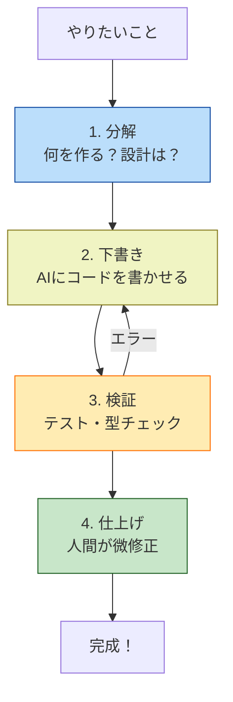

# 第05章：AI拡張の使い方の“型”🤖💡
（Copilot / Codex系を、**毎回ブレずに**使いこなすための「型」を作る章だよ〜🧩✨）

---

## 1) この章でできるようになること🎯✨

* AIに「いい感じにやって」で事故らずに、**頼み方のテンプレ**で進められる📝🤖
* **任せてOK／ダメ**の線引きができる⚖️🙅‍♀️
* コード生成だけじゃなく、**設計相談・レビュー・テスト観点出し**にAIを使える👀🧪
* “モジュラーモノリス的に”やばい依存（境界破り）を、AIで早めに気づける🧱🚫

---

## 2) まずはAI拡張の「3つのモード」を分けて覚える🧠✨

VS CodeでのAI支援は、ざっくりこの3つに分けると迷子にならないよ〜🧭💕

### A. インライン補完✍️✨（短距離走）

* 1〜数行の補完、定型コード、リネームの補助に強い💨

### B. チャット💬🤖（相談と説明）

* 「このコード何してる？」「ここ直したい」みたいな会話向き
* Copilot も VS Code上で自然言語から提案・説明してくれるよ〜🧠📎 ([Visual Studio Code][1])

### C. エージェント（agent mode）🧑‍🔧🤖（中距離〜長距離）

* **“タスク”を渡すと、必要ファイルを探して編集し、コマンド提案や試行錯誤まで回してくれる**タイプ💪
* Copilotのagent modeは「自律的に編集して、必要ならコマンドや修正ループも回す」って説明されてるよ🌀🔧 ([GitHub Docs][2])

> ちなみに「GitHub上でPR作ってくれる別の“coding agent”」もあるけど、それはIDEのagent modeとは別物だよ〜（混ざりやすいので注意）🧩💡 ([GitHub Docs][3])

---

## 3) いちばん大事な考え方🍱✨


### AIは「作業者」じゃなくて「分解係＆下書き係」にする🤖📝

超ありがちな事故はこれ👇😵‍💫

* AIが“それっぽい”実装 → 仕様とズレる → あとで地獄🔥

だから順番はこう固定！👇✨

1. **分解**（何を作る？どこを触る？）
2. **下書き**（案を出す）
3. **検証**（テスト/ビルド/型/動作）
4. **仕上げ**（読みやすく・境界を守る）

この「順番」こそが、AI活用の最強の型だよ〜🧠🧩



---

## 4) AIに任せてOK／ダメの線引き⚖️🚦

### ✅ 任せてOK（成功率が上がるやつ）✨

* ルーティンな実装（DTO、バリデーション、変換、エラーハンドリングの雛形）🧱
* 既存コードの整理（関数分割、命名改善、重複除去）🧹
* テスト観点の列挙、テスト雛形生成🧪
* ドキュメントのたたき台（README、手順、コメント）📝

### ⚠️ 半分だけ任せる（人間の判断が要る）👀

* 仕様が曖昧な業務ロジック（「どうあるべき？」が絡む）🌀
* 境界（モジュール分割、公開API）🧱
  → **案出しはAI、決めるのは人間**が安定✨

### ❌ 任せない（事故りやすい）🙅‍♀️💥

* 秘密情報（APIキー等）を含む貼り付け🔑🚫
* セキュリティ重要部分を「よくわからんけど任せた」🔒😱
* ライセンスが怪しい“長いコピペ”📄⚠️
  → Copilotは「公開コードに一致する提案」を**許可/ブロック**設定できるよ（安全寄りならブロック推奨）🛡️ ([GitHub Docs][4])

---

## 5) これをコピペで使う！「依頼テンプレ（黄金の型）」🧾✨

AIへの頼み方は、毎回これに当てはめるだけで品質が上がるよ〜📈💕

```text
【目的】何をしたい？（1文）
【背景】いまの状況（コードの場所/制約/困りごと）
【やってほしいこと】タスクを箇条書き（3〜7個）
【やっちゃダメ】禁止事項（例：内部import禁止、外部API呼ばない、など）
【出力形式】差分パッチ / ファイル一覧 / 手順 / テスト案 など
【検証】どう確認する？（npm test、型チェック、lint、簡単な動作確認）
```

ポイントは「やっちゃダメ」を最初に置くこと！🙅‍♀️✨
モジュラーモノリスだと特に **“内部import禁止”** とかが効くよ🧱🔒

---

## 6) agent mode を使う“ちょうどいい場面”🌀🧑‍🔧

agent modeは「作業を回してくれる」のが強み💪
GitHub Docsでも、**どのファイルを変えるか決めて編集し、必要ならコマンド提案や修正ループ**まで行くって説明されてるよ〜🧠🔧 ([GitHub Docs][2])

### ✅ 例えばこんなタスクで最強✨

* 小さめの機能追加（ファイルが複数に散る）📁
* エラー修正（ログ→原因追跡→修正→再実行）🧯
* リファクタ（分割、命名、重複除去、ついでにテスト）🧹🧪

### 🚫 逆に向かない

* 仕様が固まってない機能（まず会話で詰める）💬
* 「境界そのもの」をガッツリ変える（段階的にやる）🧱

---

## 7) Codex系も“型”は同じ🤝🤖

Codexは「コードを読んで、編集して、実行もできる」系のコーディングエージェントとして案内されてるよ🧠⚙️ ([OpenAI Developers][5])
なので、さっきの依頼テンプレをそのまま使えばOK🙆‍♀️✨
（要は **“分解→下書き→検証→仕上げ”** を崩さないのが勝ち！🏆）

---

## 8) ミニ演習：題材アプリで「AI活用の型」を1回まわす🧩🔁

ここからは、あなたの題材アプリで“1機能”だけやってみよ〜🎒✨
例：**「イベントを1件作成する」**（Create Event）📅➕

### Step1：AIに“分解”させる🧠

```text
【目的】「イベント作成」機能を追加したい
【背景】モジュール分割前提。イベントは Event モジュールが責任を持つ想定。
【やってほしいこと】
- ユースケース（入力→検証→保存→結果）を箇条書きで分解
- 必要なDTO案（入力/出力）を提案
- テスト観点を10個出す
【やっちゃダメ】
- 他モジュールの内部ファイルを直接importする案は出さない
【出力形式】箇条書き
【検証】型チェックとユニットテストで確認したい
```

### Step2：AIに“下書き”を作らせる✍️

* ここで初めてコード生成に入るよ〜💡
* ただし「一気に全部」じゃなく、**ユースケース1本だけ**に絞ると成功率UP📈✨

### Step3：AIに“検証手順”を書かせる🧪

* 「どうやって確認する？」をAIに言わせる
* その通りに実行して、通らなかったらログを渡して修正ループ🌀

### Step4：仕上げ（境界チェック）🧱👀

* importが暴れてない？（内部に突っ込んでない？）
* 依存の向きが変になってない？
* 名前がドメインっぽい？（雑な命名になってない？）

---

## 9) 章末ミニ課題✅🎓

### 課題A（必須）💪

あなたの題材アプリで、次の3つをAIに出させて、1セットで保存してね📝✨

* ユースケース分解（箇条書き）
* DTO案（入力/出力）
* テスト観点10個

### 課題B（できたら最高）🌟

Copilotの「Agent Skills」みたいな仕組みを使うと、**繰り返し使う手順やルールを“フォルダ化”してAIに毎回読ませられる**よ📁🤖
（指示・スクリプト・リソースを入れて、関連タスク時に自動ロードされる、って案内されてる） ([The GitHub Blog][6])

---

## 10) 便利プロンプト集（この章の宝箱）📦💎🤖

### 設計相談（モジュール境界）🧱

```text
この機能を“モジュラーモノリス”前提で分解して、
「責務の持ち主モジュール」と「公開API（入口）の形」を提案して。
境界を跨ぐデータはDTOにして、内部importは禁止。
最後に「依存が危ない点」を3つ指摘して。
```

### コードレビュー（境界・保守性）👀

```text
次の差分をレビューして。
- モジュール境界を破ってないか
- 依存の向きが自然か
- 命名がドメインに寄っているか
- 将来の変更に弱いポイント
を指摘して、直すなら“最小差分”で提案して。
```

### テスト観点出し（網羅）🧪

```text
このユースケースのテスト観点を、
正常系/異常系/境界値/並行実行っぽいケース
に分けて20個出して。優先度も付けて。
```

---

次の第6章（関心の分離）では、この章の「AIの型」を使って、**“混ざったコードを分ける練習”**をしていくよ〜🍱✨
必要なら、第6章もこのテンションでそのまま作るね😆🧩💕

[1]: https://code.visualstudio.com/docs/copilot/overview "GitHub Copilot in VS Code"
[2]: https://docs.github.com/en/copilot/get-started/features "GitHub Copilot features - GitHub Docs"
[3]: https://docs.github.com/en/copilot/concepts/agents/coding-agent/about-coding-agent "About GitHub Copilot coding agent - GitHub Docs"
[4]: https://docs.github.com/copilot/how-tos/manage-your-account/managing-copilot-policies-as-an-individual-subscriber "Managing GitHub Copilot policies as an individual subscriber - GitHub Docs"
[5]: https://developers.openai.com/codex/ide/ "Codex IDE extension"
[6]: https://github.blog/changelog/2025-12-18-github-copilot-now-supports-agent-skills/ "GitHub Copilot now supports Agent Skills - GitHub Changelog"
