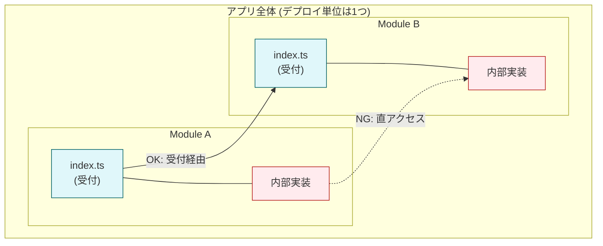

# 第07章：モジュラーモノリスの基本思想🎯🧱

## この章のゴール🎯✨

読み終わったら、こんな状態になってたら勝ちです✌️💕

* 「モジュラーモノリスって、結局なに？」を1分で説明できる🗣️
* 「ただのフォルダ分け」と「本物のモジュール分け」の違いがわかる🧩
* 境界（モジュールの壁）は“気合い”じゃなくて“ルール”で守る理由が腹落ちする🛡️
* ありがちな事故パターンを先に回避できる🚧💥

---

## 1) まず超イメージ：モジュラーモノリスって何？🧠🧩

モジュラーモノリスは **「デプロイ（配布）単位は1つ」だけど、内部は“ちゃんと別々の部屋（モジュール）”に分かれてる** アーキテクチャです🏠✨

* 外から見ると：アプリは1個（単体で動く）📦
* 中を見ると：機能ごとの部屋が分かれてて、勝手に出入りできない🚪🔒
* 連携するときは：決められた“受付”からだけやりとりする📮

この「受付を通す」のが超大事ポイントです💡
（Simon Brown の “Modular Monoliths” のスライドでも、**関連機能のまとまり＝コンポーネントは「明確なインターフェース」でアクセスされる**、という考え方が強調されています📚） ([static.simonbrown.je][1])

---

## 2) “モノリス”なのに、なぜわざわざ分けるの？🤔🧩

モノリスの一番の強みは、運用がラクなことです😌💓

* デプロイが1回で済む🚀
* ネットワーク越しの地獄（タイムアウト、分散トランザクション等）が少ない🌪️
* ローカル開発がやりやすい🧑‍💻✨

でも弱点はこれ👇

* 何でもどこからでも呼べる状態になると、成長した瞬間にカオス化😵‍💫🌀

Martin Fowler も「モノリスで“十分にモジュール化された状態”を保つのは、規律（discipline）がめちゃ必要」みたいな文脈で語っています📌 ([martinfowler.com][2])

だからモジュラーモノリスは、
**「運用はモノリス級にラク」＋「内部はマイクロサービス級に境界を意識」**
の“いいとこ取り”を狙います🍰✨

---

## 3) 基本思想その①：デプロイは1つ、でも“設計は分割”🎯


ここがコアです🧠🔥

* ✅ デプロイ単位は1つ（アプリは1個）
* ✅ でもコードは「モジュール」単位で分割
* ✅ モジュールは「責務（変更理由）」で切る✂️
* ✅ モジュール間は「公開API（受付）」でやりとりする📮

“1つの巨大な塊”じゃなくて、**“仕切りのある1つの建物”**って感じです🏢🧱



---

## 4) 基本思想その②：境界は“気合い禁止”🙅‍♀️ → ルールで守る📜👮‍♀️

人間は疲れるし忘れます😇（そして締切前は特に…！）
だから境界は **ツールで強制** するのが基本です🛡️✨

たとえば ESLint には「この import は禁止！」を機械的に決められるルールがあります👇

* `no-restricted-imports`：特定のimportを禁止できる（境界破りを止めるのに使える） ([eslint.org][3])
* TypeScript向けには `@typescript-eslint/no-restricted-imports` があって、型import構文も扱えるよ、という位置づけです🧷 ([typescript-eslint.io][4])
* さらに “境界そのもの” を守る系として `eslint-plugin-boundaries` みたいな定番プラグインもあります🧱（npm上でも継続更新されています） ([npmjs.com][5])

💡この章では「思想」が主役なので、設定の細かい話は次章以降でガッツリやります📚✨
ここでは「**境界はルールで守る**」だけ覚えてOKです🫶

---

## 5) 基本思想その③：「フォルダ分け」＝「モジュール」じゃない⚠️

ここ、初心者が一番ハマります😵‍💫💦

### 🧨 “ただのフォルダ分け” の特徴

* `modules/`っぽい名前はある
* でも内部ファイルを平気で直importしてる
* どのモジュールがどれに依存していいか誰も説明できない
* 結果：全部が全部に依存してスパゲッティ🍝

### 🧩 “本物のモジュール” の特徴

* ✅ 外に出していい入口（公開API）が決まってる🚪
* ✅ 内部実装は隠す🙈
* ✅ 依存の方向が決まってる➡️
* ✅ 破ったら自動で怒られる👮‍♀️（lint/CI）

---

## 6) 例：題材アプリをモジュールで見てみる🎒📅

例として「学内イベント管理」を想像してみます👩‍🎓✨

* `events`：イベント作成、参加登録、定員管理🎟️
* `users`：ユーザー、権限、プロフィール👤
* `payments`：参加費、返金、支払い状況💳

ポイントは「**境界をまたぐときは受付を通す**」です📮
たとえば `events` が `users` の情報を使いたいなら、`users` の公開APIを呼ぶ感じです☎️

---

## 7) “受付（公開API）”ってどんな感じ？🚪✨（ミニ例）

モジュール内部のファイルを直importしちゃうと、境界が崩れます😱
なので「公開する面」を1個に寄せるのが王道です🧩

```ts
// ✅ こういうイメージ：usersモジュールの公開API（受付）
/* modules/users/index.ts */
export { getUserSummary } from "./public/getUserSummary";
export type { UserSummary } from "./public/types";
```

呼ぶ側（eventsなど）はこれだけを見る👀✨

```ts
// ✅ events側：usersの“受付”だけ使う
import { getUserSummary, type UserSummary } from "../users";
```

逆にこれは事故りやすい💥

```ts
// ❌ usersの内部に直で入り込む（境界破壊）
import { UserEntity } from "../users/internal/domain/UserEntity";
```

ここで「禁止ルール」が効いてくるわけです👮‍♀️🛡️（後の章で実装するよ！）

---

## 8) よくある失敗パターン（先に潰そっ）💣👀

### ❶ Shared/Utils 地獄🕳️

「便利だから」と共通フォルダに何でも突っ込む → だんだん“全員が依存する神棚”になる🙏😇
➡️ 結果：変更すると全部が壊れる💥

### ❷ 境界をまたぐ“直import”🚧

「ちょっとだけ…」が積み重なって、気付けば無法地帯🌀
➡️ 受付を通す仕組みが必要

### ❸ 循環依存（A↔B）🔁😱

AがBを呼ぶ、BがAを呼ぶ…みたいに絡まると、理解もテストも辛くなります🥲

### ❹ “モジュールの責務”があいまい🍱

「ここってevents？users？」みたいな宙ぶらりんが増える
➡️ “変更理由”で切る✂️（8章でやるやつ！）

---

## 9) 章末ミニ課題🧩✅（10〜15分）

やることはシンプルです☺️💕

### ✅ ミニ課題A：境界宣言を書いてみる📝

自分の題材アプリで、モジュール候補を3つ書く👇

* モジュール名
* そのモジュールが“責任を持つもの”（2〜3行）
* 逆に“持たないもの”（1〜2行）

例：

* `events`：イベント作成・定員管理は持つ／プロフィール編集は持たない、みたいに✍️

### ✅ ミニ課題B：境界破りポイント探し👀🚧

「eventsがusersの内部実装に入り込むと、どんな事故が起きる？」を3つ書く📝
（例：usersの内部変更でeventsが壊れる、テストが困る、責務が混ざる…）

---

## 10) AIに手伝ってもらうプロンプト例🤖📝

コピペして使ってOKです💕

### 🧠 境界のブレスト

「私は学内イベント管理アプリを作っています。機能を3〜5個のモジュールに分けたいです。各モジュールの責務（変更理由）と、モジュール間のやりとり（公開API案）を提案してください。Shared/Utils地獄を避ける注意点も添えてください。」

### 🚧 失敗パターンの先読み

「モジュラーモノリス初心者がやりがちな失敗（直import、循環依存、責務の混在、共通化の罠）を、この題材で具体例つきで列挙して、予防ルール案も出してください。」

### 📮 公開API（受付）案づくり

「モジュールごとに `index.ts` を公開APIにしたいです。events/users/payments の公開関数と公開型（DTO）の案を、境界を守れる形で提案してください。」

---

## まとめ🌟（ここだけ覚えて！）

* モジュラーモノリスは **デプロイ1つ**、でも中身は **モジュールで厳密に**🧩
* 境界は **気合いじゃなくてルールで守る**👮‍♀️📜（ESLint系の仕組みが使える） ([eslint.org][3])
* 「フォルダ分け」だけだと失敗しやすい⚠️
* 受付（公開API）を通す文化が大事🚪✨

次の第8章では、いよいよ「モジュール粒度どう決める？」を、迷わない基準でやっていきますよ〜🧩📏💕

[1]: https://static.simonbrown.je/modular-monoliths.pdf?utm_source=chatgpt.com "Modular monoliths"
[2]: https://martinfowler.com/bliki/MonolithFirst.html?utm_source=chatgpt.com "Monolith First"
[3]: https://eslint.org/docs/latest/rules/no-restricted-imports?utm_source=chatgpt.com "no-restricted-imports - ESLint - Pluggable JavaScript Linter"
[4]: https://typescript-eslint.io/rules/no-restricted-imports/?utm_source=chatgpt.com "no-restricted-imports"
[5]: https://www.npmjs.com/package/eslint-plugin-boundaries?utm_source=chatgpt.com "eslint-plugin-boundaries"
