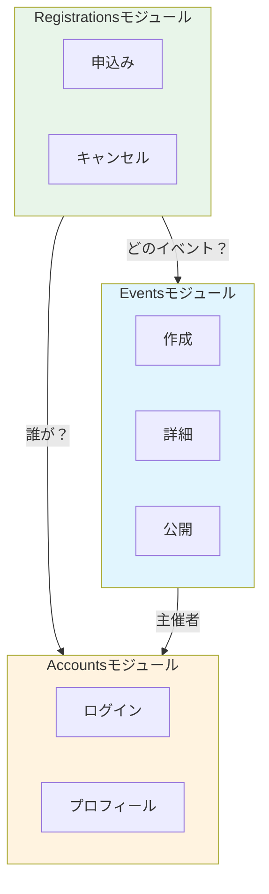

# 第08章：モジュールって何？（粒度の決め方）🧩📏

## この章のゴール🎯

この章を終えると、こんなことができるようになります👇✨

* 「モジュール＝何？」を、自分の言葉で説明できる🗣️
* 小さすぎ／大きすぎの“事故”を避けて、ちょうどいい粒度で切れる✂️
* 題材アプリを **モジュール候補 → 役割 → 入口（公開API）** まで落とし込める🚪

---

## 1) そもそも「モジュール」って何？🧩


イメージはこれ👇

* **ひとまとまりの機能**（目的がハッキリしてる）
* **境界がある**（中に勝手に入れない）
* **入口がある**（外から触るのは“入口だけ”）

「アプリの中にある“部品（コンポーネント）”で、**決まった入口（インターフェース）** から使うもの」って捉えるとスッキリします😊
この考え方は “コンポーネント＝関連機能のまとまり＋明確なインターフェース” として説明されます。([static.simonbrown.je][1])

---

## 2) 粒度がズレると起きる「あるある事故」😵‍💫💥


### 小さすぎる（ナノモジュール）🐜

* モジュールが増えすぎて、探すだけで迷子🧭
* ちょっとした処理がモジュールまたぎになって、呼び出し地獄📞📞📞
* 入口（公開API）より「内部を直importしたい誘惑」が勝ちやすい🍫

**サイン**：
「“変更”のたびに3〜5モジュール触ってる…」→ 小さく切りすぎかも⚠️

### 大きすぎる（ゴッドモジュール）👑

* なんでも入ってて責任がぼやける🌫️
* 変更のたびに影響範囲が広い（爆風でかい）💣
* 1つのモジュールに人が集まり渋滞🚗🚗🚗

**サイン**：
「そのモジュールを触るPRがいつも怖い」→ 大きすぎかも😱

---

## 3) 粒度を決める最強の基準：「変更理由」で切る✂️📝

迷ったら、これがいちばん効きます💪✨

### ✅ ルール：**“一緒に変わるもの”を一緒に置く**


モジュールは「ビジネス上のまとまり」に寄せると、**凝集が上がって（まとまる）／結合が下がって（絡みにくい）**、探しやすくなります。
“機能ごとに縦に切る（package by feature / vertical slicing）”の利点として、凝集↑・結合↓・関連コードが見つけやすい、が挙げられています。([static.simonbrown.je][1])

---

## 4) もう1つの強い基準：「言葉の意味が変わる場所」📚🧱


同じ単語でも、場所によって意味が変わることあるよね？👀
例：

* 「ユーザー」＝学生（参加者）
* 「ユーザー」＝運営（主催者）

こういう “言葉の意味が変わる境界” は **Bounded Context** 的に切りどころになりやすいです🗺️
境界を明確にすることで、近いけど別のモデルを扱い、必要なら変換してつなぐ…という考え方が説明されています。([martinfowler.com][2])

---

## 5) 「ちょうどいいモジュール」の特徴チェック✅✨


良いモジュールはだいたいこの性質に寄っていきます👇

* **高い凝集**（中がまとまってる）
* **低い結合**（外と絡みすぎない）
* **ビジネス能力にフォーカス**（何のための塊か言える）
* **データを抱え込む**（勝手に他人が触れない）

この方向性（高凝集・低結合・ビジネス能力・データのカプセル化等）は、モジュラーモノリスの性質として整理されています。([static.simonbrown.je][1])

さらに、境界が強いと「変更の爆風（blast radius）」が小さくなって、機能を独立に作りやすい…という話もあります💥➡️🧯([martinfowler.com][3])

---

## 6) “変更履歴”で境界の正解に近づく🕵️‍♀️📜（めっちゃ実践的！）


設計って、机上だけだと外しがち😇
そこで使えるのが **Change Coupling（変更が一緒に起きる関係）** です✨

* 「よく一緒に変更されるファイル群」は、同じ境界にいる可能性が高い
* 逆に「関係ないのに一緒に変わってる」なら境界が怪しい👻

Change coupling は「進化の中で頻繁に一緒に変わる成果物の関係」として研究でも説明されています。([inf.usi.ch][4])
また、変更履歴から change coupling や hotspot（よく荒れる場所）を見つけて設計のズレを発見できる、という実務向け説明もあります。([ANGULARarchitects][5])

### かんたん実行（例）🧪

「どの機能が一緒に変わってるか」だけでも見えると強いよ👇

```bash
git log --name-only --pretty=format: -- src/modules | sort | uniq -c | sort -nr | head
```

これで“よく出てくるファイル”が見えて、次は
「同じコミットで一緒に出てくる組」→ 境界候補、みたいに当たりを付けられます🎯

---

## 7) 例：学内イベント管理アプリ📅🏫（粒度の決め方デモ）

最初から完璧に切らなくてOK！
まずは **大きめ→必要なら割る** がラク😊

### スタート案（ちょい粗め）🧩

* **Accounts**（学生・運営・ログイン）👤
* **Events**（イベント作成・詳細・公開）📅
* **Registrations**（参加申し込み・キャンセル・定員）📝
* **Notifications**（メール・アプリ通知）🔔



### 「小さすぎ」になりがちな例🐜

* `CreateEventModule`
* `UpdateEventModule`
* `PublishEventModule`
  …みたいに **ユースケースごとにモジュール化** すると、たいてい増えすぎます😵‍💫
  （ユースケースは“モジュールの中”に入れるのが自然なことが多いよ）

### 「大きすぎ」になりがちな例👑

* `Core` に全部突っ込む
  → 境界が消えていく🌫️

---

## 8) 今日作るやつ：モジュール候補の「カード」🪪✨（超おすすめ）


このテンプレを埋めるだけで、一気に設計っぽくなるよ😊💕

### 🧩 Module Card テンプレ

* **名前**：
* **このモジュールの目的（1行）**：
* **責任（やること）TOP3**：
* **やらないこと（境界）TOP3**：
* **公開API（入口）候補**（例：`createEvent`, `registerToEvent`）：
* **持ち物（データ所有）**（例：Event, Capacity, Registration）：
* **依存していい相手**（例：NotificationsはOK、PaymentsはNG…など）：
* **境界が怪しくなった時のサイン**（例：他モジュールのデータを直更新したくなる）：

> このカードが **スラスラ書ける＝粒度がちょうどいい** ことが多いよ✍️✨

---

## 9) 章末ミニ課題🧩✅

題材アプリでやってみよう〜！💪💕

1. 要件（10行）を眺めて、**変更理由**を10個書く📝
2. それを **3〜6グループ** にまとめて、モジュール名を付ける🏷️
3. 各モジュールの Module Card を1枚ずつ作る🪪✨
4. 最後にチェック👇

   * どの変更理由が、どのモジュールに入った？（漏れ・重複ある？）
   * 変更の爆風が小さくなりそう？💥➡️🧯

---

## 10) AIに頼るポイント🤖💡（プロンプト例つき）

### ① 境界候補をブレスト🤝

```text
要件（貼り付け）から、モジュール候補を3〜6個提案して。
各モジュールに「目的」「責任TOP3」「やらないことTOP3」を付けて。
切り方の根拠は「変更理由」で説明して。
```

### ② “小さすぎ/大きすぎ”の診断👩‍⚕️


```text
このモジュール分割案が「小さすぎ」「大きすぎ」になってないか診断して。
ありがちな事故と改善案（統合する/分割する）を具体例で出して。
```

### ③ 用語の意味が変わる境界探し📚

```text
要件の中で「同じ単語が別の意味で使われていそうな箇所」を列挙して。
それぞれ、境界（コンテキスト）で分けると何が嬉しいかも教えて。
```

### ④ 変更履歴から“怪しい境界”を当てる🕵️‍♀️

```text
（コミットログ要約や、変更ファイルの組み合わせ一覧を貼る）
一緒に変わりすぎているモジュールの組み合わせを指摘して。
境界を見直すなら「統合」か「責務の移動」か、候補を3案出して。
```

---

## まとめ🎀✨

* モジュールは「まとまり＋境界＋入口」🧩🚪
* 粒度は迷ったら **変更理由** で切る✂️📝
* 仕上げに **変更履歴（change coupling）** で答え合わせ🕵️‍♀️📜
* Module Card を書ける分割は、だいたい強い💪✨

次の章（境界づけられたコンテキスト）で、今日の「言葉の境界」をもっと気持ちよく整理していくよ〜🧱🗺️💕

[1]: https://static.simonbrown.je/modular-monoliths.pdf "modular-monoliths"
[2]: https://www.martinfowler.com/bliki/BoundedContext.html?utm_source=chatgpt.com "Bounded Context"
[3]: https://martinfowler.com/articles/linking-modular-arch.html?utm_source=chatgpt.com "Linking Modular Architecture to Development Teams"
[4]: https://www.inf.usi.ch/lanza/Downloads/DAmb2009e.pdf?utm_source=chatgpt.com "On the Relationship Between Change Coupling and ..."
[5]: https://www.angulararchitects.io/blog/your-architecture-as-a-crime-scene-forensic-analysis-for-your-angular-solutions/?utm_source=chatgpt.com "Your Architecture as a Crime Scene! Forensic Analysis for ..."
