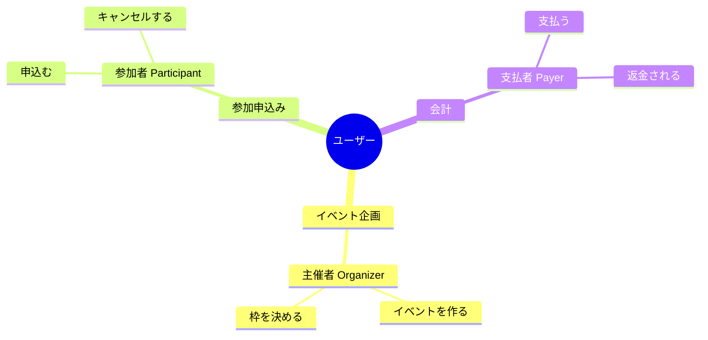

# 第09章：境界づけられたコンテキスト超入門🧱🗺️

（＝ “同じ言葉でも意味が違う” を、事故らないように分ける話だよ〜！🫶）

---

## この章でできるようになること🎯💗

章末には、あなたの題材アプリ（学内イベント管理📅とかサークル会計💰とか）について…

* **「同じ言葉なのに意味がズレるポイント」**を見つけられる👀✨
* **“意味が固定される範囲”＝境界**を決められる🧱
* **コンテキスト（文脈）ごとの用語集📖**を作れる
* 次の章（フォルダ構成📁）にそのまま繋げられる🚀

---

## まず、なんで必要なの？🤔💥

### 「同じ単語」が、場面で別モノになるから…！

例：あなたのアプリに「ユーザー」が出てくるとして…

* 申込みの画面だと「参加者」👩‍🎓
* 管理画面だと「運営メンバー」🧑‍💻
* 会計だと「支払いをした人」💳

……って、**同じ“ユーザー”でも欲しい情報もルールも違う**よね😵‍💫
ここを1つのモデルで無理にまとめると、名前も処理もごちゃごちゃして、後で地獄になります🔥

DDD（ドメイン駆動設計）では、**モデルと言葉（ユビキタス言語）が矛盾しない範囲**を作って、その中では意味を統一しようね、って考えるんだ🧠✨ ([martinfowler.com][1])

---

## 境界づけられたコンテキスト（Bounded Context）って何？🧱


ひとことで言うと…

> **「この範囲では、この言葉はこの意味！」が保証されるエリア**🗺️✨

* “モデル”は **一貫してないと**使いにくい（矛盾が増える）
* だから、システム全体で **1個の巨大モデル**を目指さない
* **複数のモデル**を、それぞれの境界の中で育てる🌱

この考え方が “Bounded Context” だよ〜！ ([martinfowler.com][1])

---

## モジュラーモノリスとの関係🧩✨

モジュラーモノリスは「デプロイは1つ、内部は分割」だよね。
この“分割”の候補として、**Bounded Context がめちゃ強いヒント**になるよ🧭

実務でも「境界は固定じゃなくて、学びながら見直してOK」って扱われる（むしろ自然）🌿 ([Microsoft Learn][2])
あと、DDDの“戦略”として「大きい領域をBounded Contextのネットワークで整理する」のが重要、って定番の捉え方だよ📚 ([martinfowler.com][3])

---

## 重要キーワード📌✨

* **ユビキタス言語（Ubiquitous Language）**：チームで共有する “同じ意味の言葉” 🗣️ ([martinfowler.com][1])
* **モデル（Model）**：その文脈での概念の切り方（名前・ルール・構造）🧠 ([martinfowler.com][1])
* **Bounded Context**：モデルと言葉の意味が一貫する境界🧱 ([DevIQ][4])
* **Context Map（軽く触る）**：コンテキスト同士の関係を描く地図🗺️ ([Archi Lab][5])
* **（豆知識）戦術パターンは“1つのBCの中で”使う**：集約とかEntityとかは、まずBCが決まってから✨ ([Microsoft Learn][6])

---

## 例でつかむ！「イベント」という地雷ワード💣🎇

学内イベント管理アプリでありがちな「イベント」って…

* ① **学内イベント（文化祭の出し物）**📅
* ② **分析イベント（ボタン押下ログ）**📈
* ③ **ドメインイベント（“申込み完了した” みたいな出来事）**📣

ぜんぶ “event” だけど、意味が全然違う😇
ここを混ぜると、命名もDBもAPIも、ぜーんぶ濁っていくよ…🥲

✅ コツ：**「誰がそれを使う？」「何のため？」**で切り分ける🧠

---

## 境界を見つけるコツ3つ🧭✨（初心者向けの実戦版）

### ① “変更理由”で分ける✂️

「それ、何が変わったら直す？」

* 申込みルールが変わる
* 会計処理が変わる
* 通知の出し方が変わる
  → **変わる理由が違うなら、境界候補！**🧱

### ② “会話する相手”で分ける🗣️

* 学生（参加者）
* 運営（管理者）
* 会計担当
  → それぞれの関心が違うなら、言葉の意味もズレやすい💥

### ③ “ルールの濃さ”で分ける💎

ルールが濃い場所（例：キャンセル規約、返金、締切）を中心に、まとまりを作ると安定するよ✨

---

## ミニ演習：題材アプリの「用語のズレ」を洗い出す📖🧩

ここから手を動かすよ〜！✊💕

### Step 1：用語を抜き出す（名詞・動詞）📝

題材の要件10行（第2章で作ったやつ）から、まずこれ👇を抜き出す

* 名詞：ユーザー、イベント、参加、申込み、支払い、締切、チケット、キャンセル…
* 動詞：申込む、承認する、支払う、返金する、通知する…

### Step 2：「同じ言葉なのに意味違う」をマーキング🖍️

特に怪しいのはこれ👇

* ユーザー / 会員 / 学生 / 管理者
* イベント
* ステータス（申込みの？支払いの？イベント公開の？）
* チケット（入場？領収？QR？）

### Step 3：仮コンテキストを3つに分けてみる🧱

最初は“3つ”くらいがちょうどいい😊（細かくしすぎない！）

例（学内イベント管理なら）

* **イベント企画コンテキスト**📅：イベントを作る・公開する・枠を決める
* **参加申込みコンテキスト**📝：申込み・抽選・キャンセル・締切
* **会計コンテキスト**💳：支払い・返金・領収



### Step 4：用語を「どの文脈の言葉か」割り当てる📌

ここが本題！✨
「ユーザー」を例にすると…

* 参加申込み：**参加者（Participant）**
* イベント企画：**主催者（Organizer）**
* 会計：**支払者（Payer）**

✅ こうして “同じUser” をやめると、未来のあなたが救われる🫶

---

## 成果物テンプレ（この章のゴール）🗂️✨

### ① コンテキストカード（1つにつき1枚）🪪

* 名前：参加申込みコンテキスト
* 目的：申込み〜締切〜キャンセルのルールを守る
* 主な用語：Participant / Application / Deadline / CancelPolicy
* “この中でのEvent”の意味：募集対象の企画（＝申込みを受ける単位）
* 境界の外に出すときの形：申込み結果DTO（ここは次章以降でOK）

### ② 用語集（コンテキストごと）📖

* 用語：Application
* 意味：参加申込み1件（参加者＋イベント＋状態＋申込日時）
* 似てるけど別：Entry（抽選枠の応募単位）※使わないなら禁止ワードにしてもOK🙆‍♀️

---

## TypeScriptで“ズレ”を可視化する小ネタ🧠✨

「同じUserIdでも意味が違う」なら、型名で分けちゃうのが超効くよ👍
（まだフォルダ分割前でも、概念整理に使える！）

```ts
type ParticipantId = string; // 参加者としてのID
type OrganizerId = string;   // 主催者としてのID
type PayerId = string;       // 支払者としてのID

// これだけで「うっかり混ぜる」が減る✨
```

---

## AI活用プロンプト例🤖📝✨

### 1) 用語抽出（要件10行→名詞・動詞）

```text
以下の要件から、名詞と動詞をそれぞれ箇条書きにしてください。
さらに「意味が文脈で変わりそうな単語」を★付きで出してください。

要件:
（ここに10行を貼る）
```

### 2) 仮コンテキスト案の提案（3〜5個）

```text
次の名詞・動詞リストを、意味のまとまりで3〜5個の「文脈」に分けてください。
各文脈に名前をつけ、境界（この文脈が責任を持つ範囲）を1〜2文で説明してください。
最後に「混ぜると事故りそうな用語」を指摘してください。

名詞: ...
動詞: ...
```

### 3) 用語集の叩き台を作る（コンテキスト別）

```text
「参加申込みコンテキスト」の用語集を作ってください。
用語は10〜15個。各用語に「意味」「含む情報」「似てるけど別（あれば）」を付けてください。
```

### 4) レビュー（境界がブレてないか）

```text
このコンテキスト分割案で、用語の意味が衝突している箇所を指摘してください。
また「境界を越えるときに翻訳が必要そうなデータ」を列挙してください。

（コンテキストカードと用語集を貼る）
```

---

## よくある落とし穴⚠️😵‍💫（先に潰す！）

* **“技術レイヤー”で切っちゃう**（Controller/Service/DB…みたいなやつ）
  → それは第17章の話。第9章は **意味（ドメイン）**で切るよ🧱
* **なんでもUserに押し込む**
  → Participant / Organizer / Payer みたいに“役割語”に逃がすとスッキリ✨
* **最初から細かくしすぎる**
  → まず3つくらい→育てながら割る🌱（境界は見直してOK） ([Microsoft Learn][2])
* **境界を越えて“内部用語”をそのまま持ち出す**
  → 後の章で「公開API」「DTO」で整える流れになるよ🚪✨

---

## 章末ミニ課題🧩✅🎀

あなたの題材アプリで、これを作ってね👇

1. 仮コンテキストを **3つ**決める🧱
2. 各コンテキストの **コンテキストカード**を1枚ずつ🪪
3. 各コンテキストの **用語集**を10語ずつ📖
4. 「意味が衝突しそうな単語」を **5つ**リスト化💣

できたら次の章で、そのまま **フォルダ構成📁**に落とし込めるよ〜！🚀✨

---

## ちょい確認クイズ🎓💞

Q1. “イベント”という単語が危険なのはなぜ？
Q2. Bounded Context の中で揃えるべきものは？
Q3. 最初にコンテキストを何個くらいにするのが初心者向け？
Q4. “User”を1語で済ませない工夫を1つ言ってみて！
Q5. 境界は一度決めたら固定？それとも見直してOK？

（答え）
A1. 文脈で意味が変わりやすいから
A2. モデルと言葉（ユビキタス言語）の意味の一貫性 ([martinfowler.com][1])
A3. まず3つくらい
A4. Participant/Organizer/Payerみたいに役割で分ける
A5. 見直してOK（学びながら境界を再評価する） ([Microsoft Learn][2])

---

次は第10章で、この章の成果物（コンテキストカード＆用語集）を使って、**迷子にならないフォルダ構成📁🧭**を作っていこうね〜！🥳💗

[1]: https://www.martinfowler.com/bliki/BoundedContext.html?utm_source=chatgpt.com "Bounded Context"
[2]: https://learn.microsoft.com/en-us/azure/architecture/microservices/model/domain-analysis?utm_source=chatgpt.com "Using domain analysis to model microservices"
[3]: https://martinfowler.com/bliki/DomainDrivenDesign.html?utm_source=chatgpt.com "Domain Driven Design"
[4]: https://deviq.com/domain-driven-design/bounded-context?utm_source=chatgpt.com "Bounded Context"
[5]: https://www.archi-lab.io/infopages/ddd/ddd-crew-bounded-context.html?utm_source=chatgpt.com "Determing Bounded Contexts using DDD Crew Methods"
[6]: https://learn.microsoft.com/en-us/azure/architecture/microservices/model/tactical-ddd?utm_source=chatgpt.com "Using tactical DDD to design microservices"
