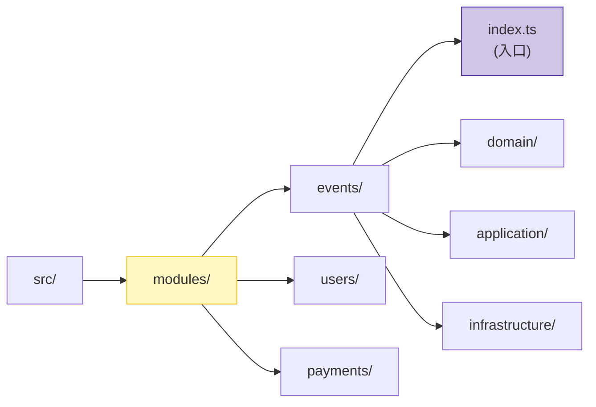

# 第10章：フォルダ構成で迷子を防ぐ📁🧭

（モジュラーモノリスの“地図”づくりだよ〜🗺️💕）

---

## 0. この章のゴール🎯💡

* 「どこに何があるか」が一瞬で分かる構成にする👀✨
* 「機能（モジュール）単位」で置き場所を固定して、迷子ゼロにする🧩🚫
* 次章（公開API🚪✨）にスムーズにつなげる💨

---

## 1. 迷子が起きる典型パターン😵‍💫📦


こうなると、未来の自分が泣きます😭

* `src/` の直下にファイルが増殖して、検索しないと見つからない🔍
* 似た名前のファイルが散らばる（`user.ts` が3つある…みたいな）🫠
* ある機能を直すのに、関係ありそうな場所を何往復もする🏃‍♀️💦

**対策はシンプル！**
「機能ごとに住所を決めて、そこに全部まとめる」📮✨

---

## 2. フォルダ設計の“3つの約束”🤝💖


### 約束①：モジュール（機能）を最上位の主役にする🧩👑

「イベント管理」「会計」「ユーザー」みたいに、**機能で分ける**よ✂️✨
（技術別 `controllers/ services/` で分けると、機能が散って迷子になりやすい😵‍💫）

### 約束②：モジュールには“入口”を必ず作る🚪✨

各モジュールに `index.ts` を置いて、**外から触っていいものをそこに集約**する予定だよ（次章で超やる！）🛡️✨

### 約束③：深い階層にしすぎない📏🙂

フォルダが深すぎると、**移動コスト**が地味にしんどい💦
まずは「浅く・分かりやすく」からスタートでOK🙆‍♀️✨

---

## 3. おすすめの全体構成（まずはこれでOK）📁✨


「modules/ を中心」に据える形だよ🧩🧭

```text
└─ tsconfig.json
```



### ✅ ここがポイント

* **機能はぜんぶ `src/modules/` の下**に入る（迷子防止の最強ルール）🧩✨
* `shared/` は便利だけど、増やしすぎると後で地獄になるので“最小限”⚠️（第29章で罠を回避するよ🕳️😇）

---

## 4. 1モジュールの基本構造（テンプレ）🧱✨


中はあとでレイヤーを入れやすい形にしておくと、成長がラク🌱💕

```text
src/modules/events/
├─ index.ts                      # 公開API（次章で本格化🚪✨）
├─ README.md                     # このモジュールの説明📝
├─ contracts/                    # 外に出す型・DTO（境界の言葉📦）
├─ application/                  # ユースケース（手順の組み立て🎬）
├─ domain/                       # ルールの中心（宝石箱💎）
├─ infrastructure/               # DB/外部I/O（後で差し替え🔌）
└─ presentation/                 # API/画面側（入口に近い層🎨）
```

### 💡 “今”は空フォルダでもOK

第17章でレイヤーをちゃんと学んでから中身を育てればいいよ😊✨
「箱だけ先に用意」作戦、めっちゃ強い📦💪

---

## 5. 命名ルール（テンプレ化しよう）🧾✨


ここを決めると、**探す時間が激減**するよ⏱️💕

### フォルダ名（モジュール名）

* 小文字＋ハイフン or 小文字のみ（例：`event` / `events`）
* “機能の名詞”で統一（例：`users`, `events`, `payments`）🧠✨

### ファイル名（おすすめ）

* **用途が分かる接尾辞**を付けるのが超おすすめ📌

  * `*.usecase.ts`（ユースケース）
  * `*.service.ts`（複数手順のサービス）
  * `*.repository.ts`（永続化の抽象）
  * `*.dto.ts`（境界の入出力）

例：

```text
create-event.usecase.ts
event.dto.ts
event.repository.ts
```

---

## 6. “入口ファイル”を先に薄く置いておく🚪✨


次章でガッツリやるけど、今の段階でも「入口がある」だけで迷子が減るよ😊

例：`src/modules/events/index.ts`（中身は仮でOK）

```ts
// events モジュールの入口（仮）
// 次章で「外に出していいもの」だけをここに集めるよ🚪✨
export {};
```

---

## 7. ちょい発展：importを気持ちよくする話（注意つき⚠️）


### A) まずは安全：相対パスでOK🙂

モジュール構成が固まるまでは、これが一番事故りにくい✨

### B) `tsconfig.json` の `paths` は便利だけど…⚠️

`paths` は TypeScript の解決ルールとして用意されてるけど、**実行時（ランタイム）に別対応が必要**になりやすいよ〜😵‍💫
（`tsc` が import パスを自動で書き換えてくれるわけじゃない問題が出がち）

* `paths` 自体の説明：([typescriptlang.org][1])
* 実行時に補助が必要になりがちな話（例：tsconfig-paths 等）：([npm][2])

➡️ なのでこの教材では、まず **「入口 `index.ts` を経由する」** でスッキリさせるのが優先だよ🚪✨

---

## 8. AIに手伝ってもらうプロンプト例🤖📝✨


### フォルダを一気に作りたい

* 「`src/modules/` 配下に `events/users/payments` を作って、各モジュールに `index.ts` と `contracts/application/domain/infrastructure/presentation` を作る PowerShell コマンドを出して」

### READMEのひな形がほしい

* 「`events` モジュールの README.md を、目的・公開API・用語・依存関係・禁止事項 の見出しで作って」

### 命名規則を文章化したい

* 「このプロジェクトの命名規則を、フォルダ名/ファイル名/型名/関数名 の4カテゴリで短くまとめて」

---

## 9. 章末ミニ課題🧩✅

### 課題A：地図を作ろう🗺️✨

1. `src/modules/` を作る
2. モジュールを3つ作る（例：events/users/payments）
3. 各モジュールにテンプレ構造を作る（箱だけでOK📦）

### 課題B：迷子防止ルールを1枚にする📝

`docs/folder-rules.md` を作って、次を書いてね💖

* モジュール追加時の手順（どこに何を作る？）
* `shared/` に入れていいもの／ダメなもの（仮でOK）

---

## 10. まとめ🎀✨

* **`modules/` を中心にするだけで、迷子が激減**するよ📁🧭
* **各モジュールに“入口”を置く準備**ができた🚪✨
* 次章はついに、**公開API（入口）をちゃんと作って境界を守る**よ〜！🛡️💕

---

### おまけ：ちょい最新メモ（参考）📌✨

* TypeScript は 5.9.3 が最新リリースとして案内されてるよ([GitHub][3])
* Node.js は v24 が Active LTS として案内されてるよ([Node.js][4])

次、**第11章（公開APIの入口づくり🚪✨）**いく？💨😊

[1]: https://www.typescriptlang.org/tsconfig/paths.html?utm_source=chatgpt.com "TSConfig Option: paths"
[2]: https://www.npmjs.com/package/tsconfig-paths?utm_source=chatgpt.com "tsconfig-paths"
[3]: https://github.com/microsoft/typescript/releases "Releases · microsoft/TypeScript · GitHub"
[4]: https://nodejs.org/en/about/previous-releases?utm_source=chatgpt.com "Node.js Releases"
