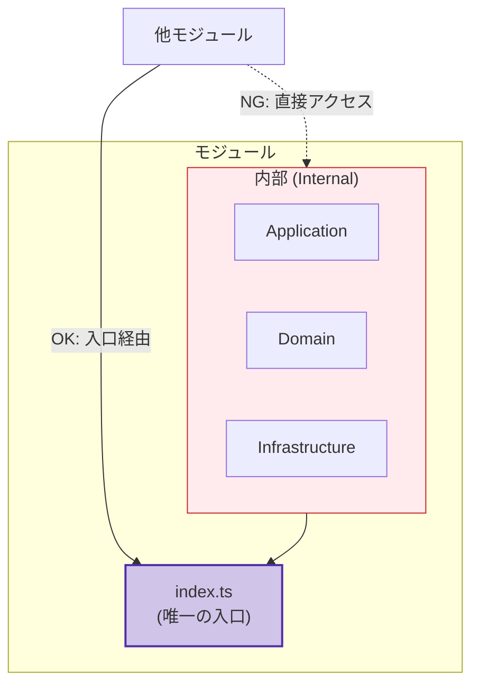

# 第11章：モジュールの公開API（入口）を作る🚪✨

モジュールって「お店」みたいなものだよ〜🏪💡
お客さん（＝他モジュール）が入っていいのは**入口だけ**！
裏口（＝内部ファイル）からズカズカ入られると、店内ぐちゃぐちゃになってメンテ地獄😇🔥

この章は、その「入口」を **ちゃんと作って・育てて・守る**お話だよ〜🚪🛡️✨

---

## 1) この章のゴール🎯✨

* 他モジュールが触っていい機能を**入口にまとめられる**📦
* 「外に出すもの／出さないもの」を**判断できる**👀✅
* `index.ts` を使って、モジュールの“顔”を作れる😊✨
* 後の章（import制限・CI取り締まり）に繋がる土台ができる🧱🚀

---

## 2) 重要キーワード📌✨

* 公開API（Public API）📣
* 入口（Entry Point）🚪
* `index.ts`（バレル / facade 的に使う）🧺
* カプセル化（隠す）🙈🔒
* 依存（依存される側の責任）⚖️

---

## 3) 公開APIってなに？🧩💡

公開APIは、ひとことで言うと

> **「他モジュールとの約束（契約）」**📜🤝

ここがブレるとどうなるかというと…

* 内部構造をちょっと変えただけで、別モジュールが全部壊れる😱💥
* 「あれ？このクラス外から直接触っていいの？」が毎日発生する😵‍💫
* “便利だから直import”が広がって、将来の分割・整理が不可能になる🧟‍♀️🕳️

だから **入口を一箇所に固定**して、そこだけを育てるのが超大事だよ🌱✨

---

## 4) 外に出していいもの／ダメなもの🙆‍♀️🙅‍♀️

### ✅ 外に出していいもの（基本）🟢

他モジュールが「これ欲しい！」ってなるのは大体この3つ👇

1. **ユースケース関数（やりたいこと）**🎬

   * 例：`createEvent`, `cancelEvent`, `listEvents`
2. **境界用の型（DTO/公開用タイプ）**🧾

   * 例：`EventSummary`, `CreateEventInput`
3. **公開イベント（通知するなら）**📣

   * 例：`EventCreated`（ドメインイベント的なやつ）

### ❌ 外に出しにくいもの（事故りやすい）🔴

* DBのテーブル直結っぽい型🗄️😇
* ORMのモデルそのまま🧬
* `infrastructure/` の実装（HTTP/DB/外部API）🌐
* `domain` の中核クラスを“生”で晒す（変更が伝播しやすい）💥
* “便利なutils” をなんでも export（共有地獄の入口）🕳️⚠️

---

## 5) `index.ts` の役割：入口の一本化🚪✨




モジュールの入口はだいたいこう👇

* `modules/<moduleName>/index.ts` ← **ここが唯一の入口**🚪✨
* 外からは「この入口」だけ触る
* 中の構造はいつでも変えてOK（入口の契約さえ守れば）🔧✨

TypeScriptは、`module` 設定が**型チェックや解決の挙動にも影響する**から、「入口を固定する設計」と相性がいいよ🧠✅ ([TypeScript][1])

---

## 6) 例：イベント管理モジュールで作ってみよ〜📅✨

### フォルダ構成イメージ📁🧭

```text
src/
  modules/
    events/
      index.ts          ← 公開API（入口）🚪✨
      application/
        createEvent.ts
        cancelEvent.ts
        listEvents.ts
      domain/
        Event.ts
        EventId.ts
      infrastructure/
        EventRepositoryPrisma.ts
      contracts/
        types.ts         ← 公開用の型（DTO）🧾
```

### `contracts/types.ts`（公開用の型）🧾✨

```ts
// src/modules/events/contracts/types.ts
export type CreateEventInput = {
  title: string;
  startsAt: string; // 例: ISO文字列
};

export type EventSummary = {
  id: string;
  title: string;
  startsAt: string;
};
```

### `application/createEvent.ts`（内部のユースケース）🎬

```ts
// src/modules/events/application/createEvent.ts
import type { CreateEventInput, EventSummary } from "../contracts/types";

export async function createEvent(input: CreateEventInput): Promise<EventSummary> {
  // ここで domain を作ったり、repository呼んだりする（中身は自由✨）
  return {
    id: crypto.randomUUID(),
    title: input.title,
    startsAt: input.startsAt,
  };
}
```

### `index.ts`（入口を作る🚪✨）

```ts
// src/modules/events/index.ts
export { createEvent } from "./application/createEvent";
export { cancelEvent } from "./application/cancelEvent";
export { listEvents } from "./application/listEvents";

export type { CreateEventInput, EventSummary } from "./contracts/types";
```

### 他モジュールからの利用（入口だけ！）✅

```ts
import { createEvent, type CreateEventInput } from "../events";

const input: CreateEventInput = {
  title: "ゼミ発表リハ",
  startsAt: new Date().toISOString(),
};

await createEvent(input);
```

ポイントはこれ👇✨

* 他モジュールは **`events/index.ts` しか見ない**👀🚪
* `application/` や `domain/` のファイル名が変わっても、入口さえ守れば平気😊✅

---

## 7) 入口を“もっと強く”したい場合💪🚪✨（ちょい発展）

「他モジュールが内部パスを import できちゃう」のって、言い換えると
**ルール違反が技術的に可能**ってことだよね😇

そこで強い味方👇

### ✅ `package.json` の `exports`（サブパス封鎖）🛡️

Node.jsでは `exports` を定義すると、**許可されてないサブパス import を封じられる**よ🔒✨ ([Node.js][2])
（つまり「入口以外は入れません！」が本当にできる）

さらに、TypeScript側の公開型の出し分けには `typesVersions` などの仕組みもあるよ📦🧠 ([TypeScript][3])
※このへんは「モジュール境界をツールで縛る章」でじっくりやると最高〜👮‍♀️✨

---

## 8) よくある失敗あるある😵‍💫⚠️（回避策つき）

### ❶ index.ts が“なんでも屋”になって肥大化🐘

* ✅ 対策：公開は「必要最小限」
* ✅ 対策：`contracts/`（公開型）を分けて整理🧾✨

### ❷ domain をそのまま export して依存がベタ付き🫠

* ✅ 対策：外に出す型は DTO に寄せる（公開用に整形）🧼✨

### ❸ 「便利だから内部を直import」文化が生える🌱😈

* ✅ 対策：入口だけで目的が達成できるようにAPIを育てる🌱🚪
* ✅ 対策：後の章で eslint/tsconfig/CI で締め上げる👮‍♀️🧪

---

## 9) ミニ課題🧩✍️（15〜30分）

### 課題A：入口を作る🚪✨

1. 何か1モジュール選ぶ（例：`users` / `events` / `payments`）🎯
2. 他モジュールが欲しそうな機能を **3つ**書き出す📝
3. `contracts/types.ts` を作って DTO を定義🧾
4. `index.ts` に **必要最小限だけ** export する✅

### 課題B：入口だけで困らないかチェック👀

* “他モジュールが欲しい情報”が入口から取れる？
* 入口が薄すぎて、結局内部を触りたくなってない？😇

---

## 10) AI用プロンプト例🤖📝（コピペOK）

### 公開APIの候補出し

```text
次のモジュールの責務は「（ここにモジュールの説明）」です。
他モジュールが利用する公開API（関数/型）を、最小限で設計してください。
- 公開する関数名（3〜7個）
- 各関数の入出力DTO案
- 公開しない方が良いもの
理由も短く添えてください。
```

### index.ts 自動生成

```text
以下のフォルダ構成を前提に、公開APIの入口となる index.ts を作ってください。
公開するのは application のユースケース関数と contracts の型だけにしてください。
（構成を貼る）
```

### “漏れてるexport”の監査

```text
このモジュールの公開APIが肥大化してないかレビューしてください。
- 外に出すべきでない export の指摘
- 代替（DTO化、関数の薄いラッパー化など）
- 公開APIの整理案
```

---

## 11) 章末チェックリスト✅✅✅

* [ ] 他モジュールが触るのは `modules/x/index.ts` だけになってる？🚪
* [ ] 公開する型は DTO（境界用）に寄ってる？🧾
* [ ] DB/外部I/Oの実装を export してない？🗄️🌐
* [ ] index.ts が“必要最小限”で読める量？📘
* [ ] 入口の変更が「他モジュールの破壊」に直結しない設計？🛡️

---

## ちょい最新メモ（2026/1時点）🗓️✨

TypeScriptは公式ダウンロード案内で **5.9 が “currently” 最新**として案内されてるよ📌 ([TypeScript][4])
そして 5.9 では `--module node20` などモジュール周りのアップデートも進んでるから、入口設計（どこを公開するか）を丁寧にやる価値がどんどん上がってる感じ🧠🚀 ([Microsoft for Developers][5])

---

次の第12章は「内部を隠す（カプセル化の作法）🙈🔒」だよ〜！
ここで作った入口を、“裏口侵入”から守る仕組みを作っていくよ👮‍♀️✨

[1]: https://www.typescriptlang.org/docs/handbook/modules/reference.html?utm_source=chatgpt.com "Documentation - Modules - Reference"
[2]: https://nodejs.org/download//release/v15.1.0/docs/api/packages.html?utm_source=chatgpt.com "Modules: Packages | Node.js v15.1.0 Documentation"
[3]: https://www.typescriptlang.org/docs/handbook/declaration-files/publishing.html?utm_source=chatgpt.com "Documentation - Publishing"
[4]: https://www.typescriptlang.org/download/?utm_source=chatgpt.com "How to set up TypeScript"
[5]: https://devblogs.microsoft.com/typescript/announcing-typescript-5-9/?utm_source=chatgpt.com "Announcing TypeScript 5.9"
