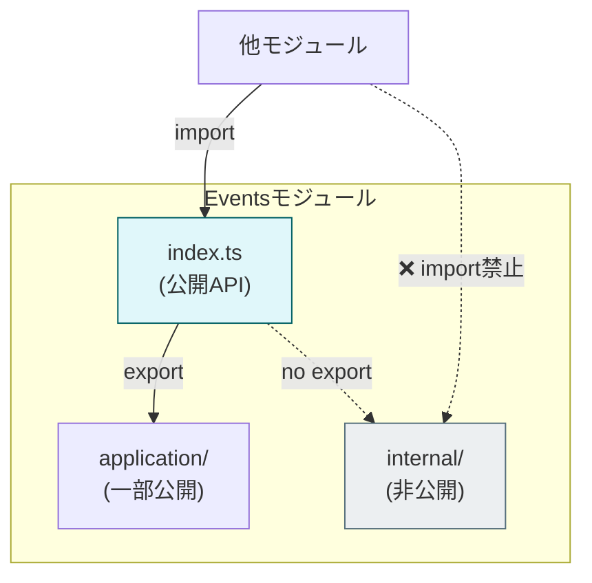

# 第12章：内部を隠す（カプセル化の作法）🙈🔒

## この章のねらい🎯

モジュールの「中身」を外からベタベタ触れないようにして、**将来の変更をラクにする**のがゴールだよ〜✨
（中身を入れ替えても、外側が壊れにくくなる👍）

---

## 重要キーワード📌

* **カプセル化**：中身を隠して、触っていい入口だけ用意する🧳🔐
* **公開API**：外に見せる「正式な入口」🚪✨
* **内部実装**：変わりやすい中身（外から触らせない）🧠🛠️
* **deep import**：内部ファイルを直指定でimportするやつ（事故りやすい）💥😵

---

## まず結論：モジュールは「入口だけ」覚えればOKにする🚪🧩

理想はこう👇

* 外の人（他モジュール）は **入口（公開API）だけ**使う
* 中身（内部実装）は **好きに引っ越し・改名・分割**できる🏃‍♀️📦

---

## 1) 形から入ろう：フォルダで「入口」と「中身」を分ける📁✨




例（Eventsモジュール）👇

```text
src/
  modules/
    events/
      index.ts                ← 公開API（ここだけ触ってOK）
      internal/
        calcFee.ts            ← 内部実装（触らせない）
        repositories/
          eventRepo.ts
      application/
        registerEvent.ts
      domain/
        Event.ts
```

ポイントは2つだけ😊

1. **公開APIは index.ts に集約**する
2. **internal/ は “触るなゾーン”**にする🙅‍♀️🟥

---

## 2) 「何を公開する？」の判断基準🧠⚖️

### ✅ 公開していいもの（だいたいコレ）

* 他モジュールから使わせたい **ユースケース関数**（例：イベント登録する、一覧を取る）🎬
* 境界を越えるための **DTO**（外に渡す用のデータ形）📦
* 例外や結果型など、外側が扱う必要があるもの（必要最小限）🧯

### ❌ 公開しないもの（中身にしまおう）

* DBアクセスの詳細、HTTP呼び出しの詳細、SQLの都合🗄️🌐
* 計算ロジックの補助関数、変換関数、privateな型🧪
* 「今はこう実装してるだけ」なもの（将来変えたい）🔧

---

## 3) “便利だから直import” がヤバい理由😱💥

たとえば他モジュールが、こんなimportをし始めると…👇

```ts
// ❌ eventsのinternalを直で触ってる（deep import）
import { calcFee } from "../events/internal/calcFee";
```

何が起きる？🌀

* internalのファイル名を変えただけで他モジュールが死ぬ☠️
* internalの場所を整理しただけで大炎上🔥
* 「どれが使っていいやつ？」が分からなくなる😵‍💫
* 結果、**怖くてリファクタできないコード**になる🧱

---

## 4) 公開API（index.ts）をちゃんと作る🚪✨

「外に見せるのはこれだけだよ〜」って宣言する場所が index.ts 💡

```ts
// src/modules/events/index.ts ✅（公開API）
export { registerEvent } from "./application/registerEvent";
export type { EventDto } from "./application/eventDto";
```

そして internal 側は…👇

```ts
// src/modules/events/internal/calcFee.ts ❌（外に見せない）
export function calcFee(...) { ... }
```

---

## 5) ミニ演習：外からinternalに触ろうとして “失敗” させる🚫🧩

### 目標🎯

**internal/ をimportしたらエラー**になる状態を作る！

ここで手っ取り早いのが ESLint で禁止ルールを作る方法だよ👮‍♀️✨
（ESLintの no-restricted-imports は、patterns + group/message で柔軟に禁止できるよ📜） ([eslint.org][1])
TypeScriptなら typescript-eslint の拡張ルールを使うと、type-only import も含めて正しく見張れるよ🧠🔍 ([typescript-eslint.io][2])

---

### 5-1) ルール設定（例：internal直import禁止）👮‍♀️

```js
// eslint.config.mjs（Flat Config例）
import tseslint from "typescript-eslint";

export default tseslint.config(
  // まずおすすめセット（入れてる前提でOK）
  ...tseslint.configs.recommended,

  {
    rules: {
      // baseルールはOFF（TS側の拡張ルールを使う）
      "no-restricted-imports": "off",
      "@typescript-eslint/no-restricted-imports": [
        "error",
        {
          patterns: [
            {
              group: ["**/modules/**/internal/**"],
              message:
                "internal/ は外からimport禁止だよ🙅‍♀️ 公開API（各モジュールのindex.ts）経由で呼んでね🚪✨",
            },
          ],
        },
      ],
    },
  }
);
```

* ESLint側の options（patterns / group / message）はこの形式だよ🧩 ([eslint.org][1])
* typescript-eslint は baseルールを無効にして拡張ルールを使うのが推奨だよ✅ ([typescript-eslint.io][2])

---

### 5-2) わざと違反してみる😈➡️🚫

```ts
// src/modules/accounting/something.ts
import { calcFee } from "../events/internal/calcFee"; // ❌ここで怒られる
```

👉 怒られたら成功🎉
次に、正しい形に直すよ👇

---

### 5-3) 正しい直し方：必要なら「公開APIに昇格」させる👑✨

「calcFee を他モジュールにも使わせたい」なら、internalに置きっぱなしじゃなくて、**公開APIとして設計**し直すのが筋だよ〜😊

* events/application/ に “外に見せてもいい形” の関数を作る
* index.ts から export する

```ts
// src/modules/events/application/calcEventFee.ts ✅（外向けに整形）
export function calcEventFee(...) { ... } // internalより責務を明確に
```

```ts
// src/modules/events/index.ts ✅（公開APIに追加）
export { calcEventFee } from "./application/calcEventFee";
```

そして呼ぶ側は👇

```ts
// ✅ 入口だけ使う
import { calcEventFee } from "../events";
```

---

## 6) ちょい上級：パッケージの “exports” で deep import を物理的に止める🧱🔒（興味ある人だけ）

もし将来「モジュール=workspace package」みたいに分けるなら、package.json の exports が超強い味方になるよ💪
exports を定義すると、**exports に書いてないサブパスはimportできなくなる**（ERR_PACKAGE_PATH_NOT_EXPORTED）って挙動になるのがポイント✨ ([Node.js][3])
ただし「絶対に破れない壁」ではなく、絶対パスで読めちゃう等の抜け道はあるよ（でも実用上かなり効く）🧯 ([Node.js][3])

さらに TypeScript 側も、moduleResolution を node16/nodenext/bundler にすると package.json の exports/imports を理解してくれるよ📦🧠 ([TypeScript][4])

---

## AIに手伝わせるプロンプト例🤖📝

* 「このモジュールの公開API候補を3つ提案して。内部に置くもの/公開するものの理由も添えて」🧠✨
* 「internal直importの箇所を探して、公開API経由に直すパッチ案を出して」🔧✅
* 「このindex.tsのexportが多すぎる気がする。公開APIを絞る方針を提案して」✂️🚪

---

## 章末チェックリスト✅✅✅

* [ ] 各モジュールに index.ts（公開API）がある🚪
* [ ] internal/ に “変えたい中身” が隔離されてる🙈
* [ ] internal/ を他モジュールからimportしたら怒られる👮‍♀️ ([eslint.org][1])
* [ ] 他モジュールが使うのは「入口だけ」になってる🧩✨

---

次の章（第13章）で、「どこがどこを参照していいか」みたいな **依存ルールの文章化📜**に入っていくよ〜！🧠➡️📜

[1]: https://eslint.org/docs/latest/rules/no-restricted-imports "no-restricted-imports - ESLint - Pluggable JavaScript Linter"
[2]: https://typescript-eslint.io/rules/no-restricted-imports/ "no-restricted-imports | typescript-eslint"
[3]: https://nodejs.org/api/packages.html?utm_source=chatgpt.com "Modules: Packages | Node.js v25.3.0 Documentation"
[4]: https://www.typescriptlang.org/tsconfig/moduleResolution.html "TypeScript: TSConfig Option: moduleResolution"
