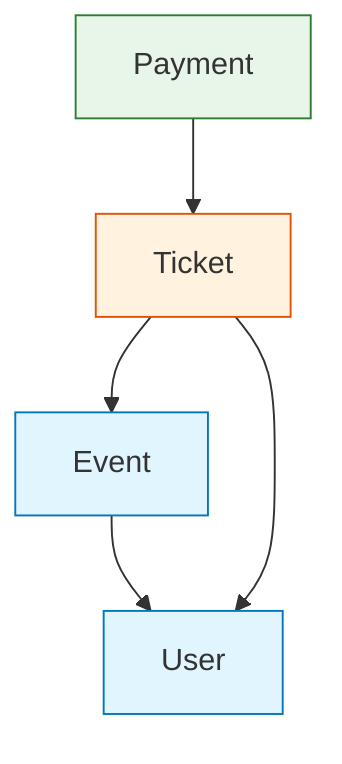

# 第13章：依存関係ルール（Dependency Rule）を決める➡️📜

## この章のゴール🎯

* 「どこがどこを参照してOK？」を**迷わない形**で決める🧭
* “あとから増えた人（未来の自分）”でも守れるように、**文章＋例＋禁止例**までセットで残す📝
* 後の章（14〜16章）で、**TypeScript/ESLint/CIで自動取り締まり👮‍♀️**に繋げる土台を作る！

---

# 1) 依存関係ってなに？🔗


ざっくり言うと、

* AがBを`import`して使う
* AがBの型や関数名を知ってる
* AがBの事情（ファイル構成・DB都合・内部ルール）に引きずられる

こういう「AがBを知ってる・頼ってる」状態が**依存**だよ〜📎

---

# 2) なんでルールが必要？（ルールがないと起きる地獄😱）


ルールがないと、だいたいこうなるよ👇

* **どこからでもどこへでもimport**できちゃう（便利そうに見える罠）🕳️
* いつの間にか「内部ファイル直import」が増える🙈
* モジュール同士がぐるぐる参照し合って、**ちょい修正が大工事**になる🔁💥
* “分けた意味”が消えて、**ただの巨大フォルダ**になる📁➡️🏚️

だから先に、**「依存の向き」と「入口だけ触る」**を決めて守るのが超大事✨

---

# 3) “Dependency Rule”って本来なに？（超ざっくり）🧅➡️

有名な説明だと、クリーンアーキテクチャの**Dependency Rule**は
「依存は内側（より重要で安定したルール）へ向かう」って考え方だよ〜🧠✨
つまり **“中心（ドメイン）を、外側の都合（DB/HTTP/UI）から守る”**。 ([blog.cleancoder.com][1])

# この教材の第13章では、それを **モジュラーモノリス向けに**こう言い換えるよ👇


> ✅「モジュールの“中身”に依存しない」
> ✅「入口（公開API）だけに依存する」
> ✅「依存の向きを決めて、逆流を禁止する」

---

## 4) 依存関係ルールは “3枚セット” で決めると強い💪✨


### A. モジュール間のルール🧩↔️🧩

* どのモジュールが、どのモジュールを参照していい？
* 逆はダメ？（片道にする？）
* どうしても必要なら、別手段（イベント/ACLなど）に逃がす？（30章でやるやつ🎉）

### B. モジュール内（レイヤー）のルール🥞

ざっくりの例👇（薄くでOK）

* Presentation（UI/Controller）
* Application（ユースケース）
* Domain（業務ルール）
* Infrastructure（DB/外部通信）

依存の向きの定番はこう👇
**外側 → 内側**（Domainが外を知らない）🧅✨ ([blog.cleancoder.com][1])

### C. importの作法（ここが超効く！）🚪🛡️

* **公開API（`index.ts`）だけimportしてOK**
* **深いパス（内部ファイル）直importは禁止**
* **循環依存（A↔B）は禁止**😱
* “型だけ”ならOKにする？（後でESLintで調整できる）🧠

---

## 5) まずはコピペで使える！依存関係ルールのテンプレ📜✨

下のテンプレを、あなたの題材アプリのモジュール名に置き換えて使ってね🫶

### 依存関係ルール（例）

1. **モジュール間のimportは公開API経由のみ**

   * OK：`import { foo } from "@/modules/user"`
   * NG：`import { foo } from "@/modules/user/internal/foo"` 🙅‍♀️
2. **モジュール依存の向き**（依存マップに従う）
3. **循環依存は禁止**（A→B→A は絶対ダメ）🔁🚫
4. **Domainは外側を参照しない**（DB/HTTP/Frameworkを知らない）🧅
5. 例外が必要なら、**短いメモ（ADR的なやつ）を残す**📝

   * 「なぜ必要？」「いつ消す？」「代替案は？」の3点だけでOK✨

---

## 6) 例題でやってみよ！🎒📅（依存マップを作る）




題材アプリ例として、モジュールをこう分けたとするね👇

* `user`（ユーザー）👩‍🎓
* `event`（イベント）📅
* `ticket`（参加チケット）🎫
* `payment`（支払い）💳

### 依存の向き（おすすめ例）➡️

* `event` → `user`（主催者/参加者を参照したい）
* `ticket` → `event` と `user`（紐づけたい）
* `payment` → `ticket`（支払い対象）
* 逆向きは原則禁止🙅‍♀️（必要なら別方式へ）

### 依存マトリクス（表にすると一瞬で伝わる）🧾✨

| from \ to | user | event | ticket | payment |
| --------- | ---: | ----: | -----: | ------: |
| user      |    - |     ❌ |      ❌ |       ❌ |
| event     |    ✅ |     - |      ❌ |       ❌ |
| ticket    |    ✅ |     ✅ |      - |       ❌ |
| payment   |    ❌ |     ❌ |      ✅ |       - |

この表があるだけで、レビューが超ラクになるよ〜👀✨

---

## 7) “禁止例” を先に用意すると、未来の自分が助かる🛟✨

### 禁止例①：内部ファイル直import🙈


```ts
// ❌ ダメ：内部に手を突っ込んでる
import { createUserCore } from "@/modules/user/internal/createUserCore";
```

✅ 修正：公開APIに「必要な形」で出してあげる🚪

```ts
// ✅ OK：公開APIだけ触る
import { createUser } from "@/modules/user";
```

> コツ：公開APIは「便利全部盛り」じゃなくて、**“外から使っていい最小限”**にする🛡️

---

### 禁止例②：循環依存（A↔B）🔁💥


ありがちなパターン👇

* `event` が `user` をimport
* `user` が「次回イベント一覧」を作りたくて `event` をimport
  → **ぐるぐる完成😱**

✅ 直し方（初心者向けの優先順）🌱

1. **どっちが“持ち主”か決める**（所有権👑）
2. 片方は「IDだけ持つ」など、知りすぎを減らす🧠
3. どうしても必要なら「問い合わせ口（Query側）」を作る🧾
4. 最終手段：イベント連携（30章でやるやつ📣）

---

## 8) ルールを“文章だけ”で終わらせないコツ🧰✨

文章に加えて、最低でもこの2つを一緒に置くと強いよ👇

* ✅ **OK例とNG例（さっきのやつ）**
* ✅ **依存マトリクス（表）**

さらに次章以降で、ESLintの`no-restricted-imports`みたいなルールで
「このimportは禁止！」って機械に言わせられるよ👮‍♀️✨ ([eslint.org][2])

---

## 9) ミニ課題🧩✨（手を動かすやつ）


### 課題1：あなたの題材アプリを “4モジュール” に分けてみて🧩

* まずは雑でOK！
* 「変更理由（何が変わりやすい？）」で分けるのがコツ✂️

### 課題2：依存マトリクスを作る🧾

* ✅を付けられるのは「必要性を説明できるものだけ」🎤✨

### 課題3：禁止例を2つ書く🙅‍♀️

* 「内部import」
* 「循環依存」
  この2つはテンプレ化して毎回使えるよ👍

---

## 10) AIプロンプト集🤖📝（コピペOK）

### 依存マップ作成🗺️

* 「次の4モジュール（…）について、依存の向きを提案して。循環依存が起きない案を2パターン出して。理由も短く。」

### 禁止例づくり🙈

* 「このフォルダ構成で、やりがちな“内部import”のNG例を3つ作って。どれがなぜダメかも説明して。」

### ルール文章化📜

* 「依存マトリクス（表）を前提に、チーム向けの依存関係ルール文章を、短く読みやすく整えて。OK例/NG例も付けて。」

---

## まとめ🎉

* 依存関係ルールは、**モジュラーモノリスの背骨**だよ🦴✨
* 「公開APIだけ」「依存の向き」「循環禁止」この3つが最優先👑
* 次の章で、TypeScriptのimport習慣として定着させるよ〜（14章へ）🚀

（おまけ）Node.jsはLTS/Currentの運用が動いていて、セキュリティ更新も定期的に出るから、こういう“ルールで守る設計”が長期で効いてくるよ🛡️✨ ([Node.js][3])

[1]: https://blog.cleancoder.com/uncle-bob/2012/08/13/the-clean-architecture.html?utm_source=chatgpt.com "The Clean Architecture by Uncle Bob - Clean Coder Blog"
[2]: https://eslint.org/docs/latest/rules/no-restricted-imports?utm_source=chatgpt.com "no-restricted-imports - ESLint - Pluggable JavaScript Linter"
[3]: https://nodejs.org/en/about/previous-releases?utm_source=chatgpt.com "Node.js Releases"
