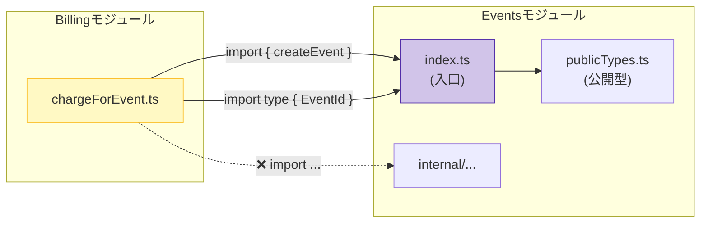

# 第14章：TypeScriptで境界を守る①（公開面だけ参照）🧠✅

この章はひとことで言うと…
**「モジュールの外からは“入口（公開API）”だけ使う！」を習慣にする回**です🚪✨

---

## 1) 今日のゴール🎯✨

* ✅ **他モジュールからは `modules/x/index.ts`（公開API）だけを import** できるようにする
* ✅ “内部ファイル直import” を見つけて **全部やめる**✂️
* ✅ 公開APIを「出しすぎない」コツがわかる⚖️

※最近の TypeScript は **5.9 が提供中**（2025-08 の公式アナウンス）なので、この前提で書いてます📌 ([Microsoft for Developers][1])

---

## 2) 「公開面」ってなに？🚪🧸


モジュールを **お店**だと思ってね🏪✨

* **公開面（公開API）**＝レジ前のカウンター（ここから注文する）🧾
* **内部**＝バックヤード（勝手に入ったらダメ🙅‍♀️）

つまり…

> **外部からは“入口ファイル”だけ触る**
> **内部フォルダは触らせない（触らない）**

これが境界を守る最初の一歩🧩

---

## 3) 内部ファイルを直importすると何が地獄？😱🧨


たとえばこう👇

* 🔥 内部の関数名を変えただけで、別モジュールが壊れる
* 🔥 “ちょっと便利だから”で内部を使い始めて、**依存がぐちゃぐちゃ**
* 🔥 移動・分割・リファクタが怖くなって、結果的に進化が止まる🧟‍♀️

モジュラーモノリスって「分けた意味」を守らないと、普通に崩壊するの🥺

---

## 4) ルールはこれだけ🧾✅


### ルールA：外から触っていいのは「公開API」だけ🚪

* `modules/events/index.ts` みたいな **入口ファイル**だけ使う
* `modules/events/domain/...` とかを **直接 import しない**

### ルールB：公開APIには「使っていいものだけ」置く🧠

* つい `export * from "./domain/..."` ってやりがちだけど…
  **それやると“内部が全部外に漏れる”**ので注意⚠️

---

## 5) ハンズオン：公開APIだけ参照に直す👩‍💻✨




題材：`events` モジュールと `billing` モジュールがあるとするね📦

### フォルダ構成イメージ📁🧩

```text
src/
  modules/
    events/
      index.ts               ← 公開API（入口）🚪
      application/
        createEvent.ts
      domain/
        Event.ts
      infra/
        eventRepoMemory.ts
    billing/
      index.ts
      application/
        chargeForEvent.ts
```

---

### ❌ ダメな例：内部を直importしちゃう😵‍💫

`billing/application/chargeForEvent.ts`

```ts
// ❌ eventsの内部フォルダを直import（境界破壊）
import { Event } from "../events/domain/Event";
```

これ、**eventsのドメイン設計を billing が知りすぎ**なんだよね🫠
events側が `Event` をリネーム/移動した瞬間、billingも巻き添えで死ぬ💥

---

### ✅ 正しい方向：events の入口（index.ts）に「使っていいもの」を出す🚪✨

`events/index.ts`

```ts
// ✅ 外へ出すのは「使っていいもの」だけ

export { createEvent } from "./application/createEvent";

// 型だけ外へ出すのはアリ（DTOとか）✨
export type { EventDTO, EventId } from "./publicTypes";
```

`events/publicTypes.ts`（公開用の型を分けるとキレイ💎）

```ts
export type EventId = string;

export type EventDTO = {
  id: EventId;
  title: string;
  date: string; // ISO文字列とかにしておくと扱いやすいよ📅
};
```

`events/application/createEvent.ts`

```ts
import type { EventDTO } from "../publicTypes";

export function createEvent(input: { title: string; date: string }): EventDTO {
  // ここで本来は domain のルールや repo を使う想定🧠
  return {
    id: crypto.randomUUID(),
    title: input.title,
    date: input.date,
  };
}
```

---

### ✅ billing 側は「入口だけ」使う🎉

`billing/application/chargeForEvent.ts`

```ts
import type { EventId } from "../events"; // ✅ 型だけ使うなら type import
import { createEvent } from "../events";  // ✅ 値（関数）を使うなら通常 import

export function chargeForEvent(eventId: EventId) {
  // billing は events の「内部構造」を知らないまま進められる💡
  // ここでは課金処理…のつもり☺️
  return { ok: true, eventId };
}
```

> ポイント：**billing は events の “publicTypes” や “createEvent” だけ知ってる**
> domain/infra/application の中身は知らない🙈✨

これが境界の第一防衛線🛡️

---

## 6) 公開APIに何を出す？出さない？⚖️🧠


おすすめはこの感覚👇

### ✅ 出してOKになりやすいもの

* ユースケース関数（`createEvent` みたいな）🎬
* 外部に渡すDTO（`EventDTO`）📦
* 外に公開してよい “入力/出力の型” 🧷

### ❌ なるべく隠したいもの

* Entity / ValueObject そのもの（内部ルールの塊💎）
* Repository実装（DBやI/O依存）🗄️
* 便利関数（最初はいいけど、すぐ依存が増殖する😇）

迷ったら合言葉👇
**「それ、外のモジュールが“知るべきこと”？」**🧐

---

## 7) ありがちミス集（超重要）⚠️😵‍💫

### ミス①：`export * from "./domain"` で全部漏れる🫠

便利なんだけど、境界の意味が消えるよ〜💥
「外に出すもの」を **手で選んで export** するのが基本✅

### ミス②：`index.ts` が巨大になる🐘

公開が増えすぎたサインかも👀

* 公開用の型は `publicTypes.ts` に分ける
* 公開用の “入口” を複数に増やす前に、まず設計を疑う🧠

### ミス③：型importが混ざってビルドが怪しくなる😇

最近のTSは **import/export を“見た目通り”に扱う方向**が強いよ〜📌
`verbatimModuleSyntax` を使うと、`import type` をちゃんと書く文化になって事故りにくい✨ ([TypeScript][2])
（このへんは次章以降の「設定で縛る」で一気に固めると強い💪）

---

## 8) ミニ課題🧩✨（VS Codeでできる！）


### 課題A：直import探し🔎

VS Code の検索（Ctrl+Shift+F）で、こんなパターンを探してみて👇

* `modules/` の後に `domain/` や `application/` や `infra/` を含む import

  * 例：`modules/events/domain/`
  * 見つけたら **入口 import に置き換え**✂️

### 課題B：入口を整備する🚪

各モジュールに `index.ts` を作って

* 外に出していい関数だけ export
* 公開用型は `publicTypes.ts` に寄せる

---

## 9) AIプロンプト例🤖📝（コピペでOK）

### ① 直import洗い出し

```text
リポジトリ内で「modules/<name>/domain|application|infra」を直接importしている箇所を洗い出して、
各ケースを「modules/<name>（index.ts）」経由にリファクタする差分案を出して。
公開APIに足りないexportがあれば、events/index.ts側の追加案も提案して。
```

### ② 公開API設計レビュー

```text
このモジュールの index.ts のexport一覧を見て、
「外に出しすぎ」「漏れてる内部概念」「DTOにした方がよい箇所」を指摘して。
モジュール境界を強くするための公開APIの形も提案して。
```

### ③ “外に出す/出さない”判断補助

```text
次の候補を public API に出すべきか判定して。
理由と、出す場合の名前（use caseとして）も提案して。
出さない場合は代替（DTO/Facade/UseCase化）案も出して。
```

---

## 10) まとめ🍀✅

* モジュール境界を守る最初の手段は **「入口だけ使う」**🚪
* `index.ts` は **モジュールの契約（Public Contract）**🧾
* “内部直import” をやめるだけで、**未来のリファクタ耐性が爆上がり**📈✨

---

## 次章予告👮‍♀️🧰

次はこのルールを **tsconfig / ESLint で強制**して、
“うっかり境界破り” を **エラーで止める**ようにするよ〜！🔥

[1]: https://devblogs.microsoft.com/typescript/announcing-typescript-5-9/?utm_source=chatgpt.com "Announcing TypeScript 5.9"
[2]: https://www.typescriptlang.org/tsconfig/verbatimModuleSyntax.html?utm_source=chatgpt.com "TSConfig Option: verbatimModuleSyntax"
