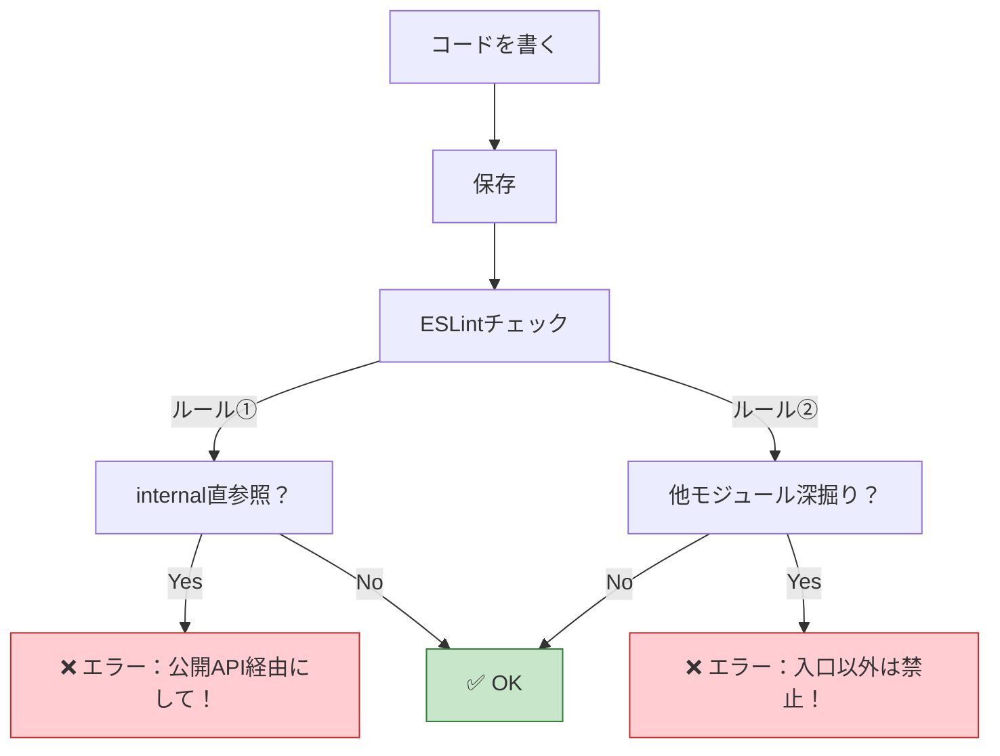

# 第15章：TypeScriptで境界を守る②（設定で縛る）🧰🔧

この章はひとことで言うと――
**「お願い🙏」じゃなくて「設定👮‍♀️」で、モジュール境界を強制する回**だよ〜！✨

---

## 15章のゴール🎯✨

次の状態を作ります👇

* ✅ **モジュールの“内部ファイル”へ直importするとエラー**になる
* ✅ **別モジュールへ“深掘りimport”するとエラー**になる（公開APIだけ通す）
* ✅ ルール違反が**自動で検知**されるから、レビューが楽になる👀💕

---

## まず全体像🗺️✨「TypeScriptだけ」では守りきれない

TypeScriptの型チェックは超強いけど、**「このフォルダからはここに import しちゃダメ！」**みたいな“建築ルール”は、**tsconfig単体だと限界**があるの🥺

だからこの章では、こういう役割分担にします👇

* 🧠 **tsconfig**：importの“推奨ルート”を作る（公開APIを使いやすくする）
* 👮‍♀️ **ESLint**：禁止ルールで“違反を止める”
* 🧱 **boundaries系プラグイン**：モジュール境界ルールをキレイに書けるようにする

（ESLintはFlat Configが標準で、extends も使える流れになってるよ〜） ([eslint.org][1])

---

## 前提のフォルダ設計（この章の例）📁🧩

こんな形を想定するね👇

* modules/

  * events/

    * index.ts（公開API🚪）
    * internal/（外から触らせない🙈）
  * accounts/

    * index.ts
    * internal/

**ルールの理想**✨

* 他モジュールからは「modules/events/index.ts 経由」だけOK
* 「modules/events/internal/**」へ触ったら即アウト🙅‍♀️

---

## Step 1：tsconfigで「公開APIへ誘導」する🧭✨

ここは「**正しい道を歩きやすくする**」設定だよ🚶‍♀️💨
（悪い道を完全に封鎖するのは後のESLintでやるよ！）

### 例：tsconfig.json（pathsで“入口”を用意）🧩

```json
{
  "compilerOptions": {
    "target": "ES2022",
    "module": "ESNext",
    "moduleResolution": "Bundler",

    "strict": true,
    "baseUrl": ".",
    "paths": {
      "@modules/events": ["modules/events/index.ts"],
      "@modules/accounts": ["modules/accounts/index.ts"]
    }
  },
  "include": ["src", "modules"]
}
```

これで他の場所から👇みたいに書きやすくなるよ✨

* ✅ OK：@modules/events（= 公開API）
* ❌ できればやめたい：../../modules/events/internal/xxx（深掘り）

> TypeScript自体の最新は5.9系が現行ラインだよ（2026-01時点） ([TypeScript][2])

---

## Step 2：ESLint（Flat Config）を土台として用意🧱✨

### ESLintの方針💡

* **TypeScriptのLintは typescript-eslint を使う**（Flat Config対応の公式ガイドあり） ([typescript-eslint.io][3])
* さらに「型情報が必要なルール」も使えるようにすると強い（projectServiceがラク✨） ([typescript-eslint.io][4])

### 例：eslint.config.mjs（最小セット）🧰

```js
import tseslint from "typescript-eslint";
import importPlugin from "eslint-plugin-import";
import boundaries from "eslint-plugin-boundaries";

export default tseslint.config(
  // まずは recommended（必要なら strictTypeChecked まで上げてもOK）
  ...tseslint.configs.recommended,

  {
    files: ["**/*.{ts,tsx}"],
    languageOptions: {
      parserOptions: {
        // 型情報Lintを使うならこれが便利（ESLint用tsconfigを別で作らなくて済みやすい）
        projectService: true,
        tsconfigRootDir: import.meta.dirname
      }
    },
    plugins: {
      import: importPlugin,
      boundaries
    }
  }
);
```

* typescript-eslint は “Flat Config前提の導入手順”が用意されてるよ ([typescript-eslint.io][3])
* 型情報Lintは `projectService` が推しの流れ（VS Codeと整合しやすい） ([typescript-eslint.io][4])

---

## Step 3：禁止ルール① no-restricted-imports で “内部” を封鎖🙈🔒




ESLint公式の `no-restricted-imports` は、**「このimport禁止！」**を素直に書けるルールだよ👮‍♀️✨ ([eslint.org][5])

### 例：internal直importを禁止する🚫

```js
// eslint.config.mjs の rules に追加するイメージ
rules: {
  "no-restricted-imports": ["error", {
    "patterns": [
      {
        "group": [
          "**/modules/*/internal/**"
        ],
        "message": "internal はモジュール外から触っちゃダメ！公開API（modules/*/index.ts）経由で使ってね🛡️"
      }
    ]
  }]
}
```

これで👇は即エラー！

* ❌ modules/events/internal/foo を import

---

## Step 4：禁止ルール② import/no-restricted-paths で “深掘り” を止める🕳️🚫

「他モジュールの中身を深掘りして import」も事故の元💥
`eslint-plugin-import` の `no-restricted-paths` は、**フォルダ間の輸入ルール**を作れるよ📦✨ ([GitHub][6])

### 例：別モジュールの“index以外”を禁止する（ざっくり版）🧯

```js
rules: {
  "import/no-restricted-paths": ["error", {
    "zones": [
      {
        "target": "./modules/events",
        "from": "./modules/accounts",
        "message": "accounts → events は公開API（events/index.ts）経由だけにしてね🚪✨"
      }
    ]
  }]
}
```

※ これだけだと“細かい例外”が難しいこともあるから、次の boundaries で仕上げるのが気持ちいいよ😌🧱

---

## Step 5：eslint-plugin-boundaries で「モジュール境界ルール」を美しく書く🧱✨

ここがこの章のメイン火力💥
`eslint-plugin-boundaries` は **「フォルダ構造＝アーキ境界」** をルールとして表現できるやつだよ！ ([npm][7])

### 例：公開APIだけ通す（entry pointを強制するノリ）🚪

考え方はこう👇

* modules/*/index.ts を **入口（entry）** にする
* modules/*/internal/** は **完全に私有**にする
* モジュール外からは **index.ts 以外へ import 禁止**

boundaries は設定が多彩なので、ここでは “教材用の王道パターン” を置くね👇

```js
rules: {
  // boundaries の基本：どのファイルがどの「要素」か定義する
  "boundaries/element-types": ["error", {
    "default": "disallow",
    "rules": [
      {
        "from": ["module"],
        "allow": ["module"]
      }
    ]
  }],

  // internal を private 扱いにして、外から触れないようにする（発想の例）
  // ※ 実プロジェクトでは readme の推奨設定に寄せて調整すると安定するよ🧩
}
```

> boundaries は “package by feature” や “モジュール境界” を機械的に守る用途でよく使われるよ ([Zenn][8])

※ boundariesの設定はプロジェクトのフォルダ規約とセットで完成するので、ここから先は **あなたの教材側のフォルダ規約（modules/* の中身）に合わせて微調整**していくのがベストだよ🧩💕

---

## ミニ演習🧩👩‍💻：違反したら“本当に怒られる”状態を作ろう👮‍♀️💥

### お題🎒

events と accounts の2モジュールがあるとして…

1. ✅ accounts から events を **公開API経由で使う**
2. ❌ accounts から events/internal を **直importしてみる**
3. ❌ accounts から events の “index以外” を **深掘りimportしてみる**

### ゴール🎯

* 2. と 3) が **Lintエラーで止まる**こと✅
* エラーメッセージが **人間に優しい文章**になってること💬💕

---

## よくあるハマりどころ😵‍💫🧯（先回り）

* 😵 ESLintが型情報Lintで遅い
  → 型情報が必要なルールを使う範囲だけに絞る（filesで分ける）
  → typed linting の公式ガイドに「無効化の例」もあるよ ([typescript-eslint.io][9])

* 😵 project の指定で tsconfig を複数管理したくない
  → `projectService: true` が “それ用tsconfig” を減らしやすい ([typescript-eslint.io][4])

---

## AIにお願いするプロンプト例🤖📝✨

### 1）境界ルール案を作らせる🧠

「modules配下は各モジュールが index.ts を公開APIとする。internal配下は外部import禁止。ESLint Flat Configで、no-restricted-imports と boundaries を使ってルール案を作って」

### 2）エラーメッセージ改善💬

「今のLintエラー文を、初心者が迷わない文章に直して。『どう直せば良いか』も1行で入れて」

### 3）違反例テストデータ生成😈

「このルールが効いているか確かめたい。意図的に違反する import 例を10個作って」

---

## まとめ🎉✨（この章で手に入れたもの）

* 🧭 tsconfig で「公開APIに寄せる道」を作った
* 👮‍♀️ ESLint で「internal直import」を止めた
* 🧱 boundaries系で「境界ルール」を“設定として”書ける土台を作った

次の第16章は、ここで作った仕組みを **CIで取り締まって、PRで壊れない流れ**にするよ🧪👮✨

[1]: https://eslint.org/blog/2025/03/flat-config-extends-define-config-global-ignores/?utm_source=chatgpt.com "Evolving flat config with extends"
[2]: https://www.typescriptlang.org/docs/handbook/release-notes/typescript-5-9.html?utm_source=chatgpt.com "Documentation - TypeScript 5.9"
[3]: https://typescript-eslint.io/getting-started/?utm_source=chatgpt.com "Getting Started"
[4]: https://typescript-eslint.io/getting-started/typed-linting/?utm_source=chatgpt.com "Linting with Type Information"
[5]: https://eslint.org/docs/latest/rules/no-restricted-imports?utm_source=chatgpt.com "no-restricted-imports - ESLint - Pluggable JavaScript Linter"
[6]: https://github.com/import-js/eslint-plugin-import/blob/main/docs/rules/no-restricted-paths.md?utm_source=chatgpt.com "eslint-plugin-import/docs/rules/no-restricted-paths.md at main"
[7]: https://www.npmjs.com/package/eslint-plugin-boundaries?utm_source=chatgpt.com "eslint-plugin-boundaries"
[8]: https://zenn.dev/kikagaku/articles/eslint-package-by-feature?utm_source=chatgpt.com "package by feature なファイルの依存関係をルールで守る ..."
[9]: https://typescript-eslint.io/troubleshooting/typed-linting/?utm_source=chatgpt.com "Typed Linting"
