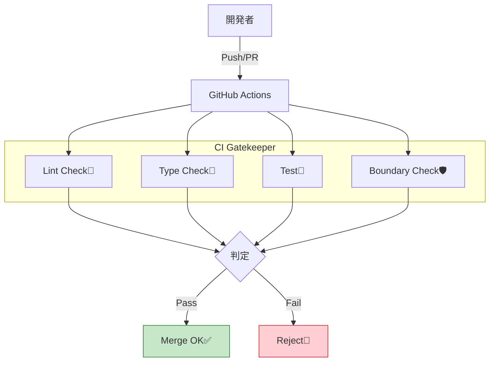

# 第16章：TypeScriptで境界を守る③（CIで取り締まる）🧪👮

ここまでで「境界ルール（importの禁止とか）」は作れたはず！
でもね…人間は忘れるし、忙しいと「つい…」が起きるの🥺💦

だからこの章は、**CI（自動チェック）を“門番”にして、PRで壊せない仕組み**を作るよ〜！🚪🛡️✨

---

# 0) 今日のゴール🎯✨




PRを出したら自動で👇が走って、**違反があれば赤く落ちる**状態にする！

* 境界チェック（例：内部ファイル直import禁止）🚫📦
* Lint（ESLint）🧹
* TypeCheck（tsc）🧠
* Test（あれば）🧪

そして最後に、**main（またはmaster）へマージする前に「全部パス必須」**にする👮‍♀️✅
（GitHubの保護ブランチ＆Required status checks を使うよ）([GitHub Docs][1])

---

# 1) まずは“CIで叩くコマンド”を用意しよう🧰🧡

CIは「ターミナルで叩けるコマンド」しか実行できないよ！
なので `package.json` に **CI用の入口**を作るのがコツ✨

```json
{
  "scripts": {
    "lint": "eslint .",
    "typecheck": "tsc -p tsconfig.json --noEmit",
    "test": "vitest run",
    "check": "npm run lint && npm run typecheck && npm run test"
  }
}
```

* `--noEmit` は「型チェックだけして、JSは出さない」って意味だよ🧠✨
* `test` は Jest / Vitest どっちでもOK！なければ一旦 `echo \"no tests\"` でも🙆‍♀️（あとで育てよう🌱）

ちなみに TypeScript は現時点で npm の latest が **5.9.3** だよ（最新として表示）([npm][2])
（境界チェックそのものは ESLint ルールでやることが多いよ：例 `eslint-plugin-boundaries` など）([GitHub][3])

---

# 2) GitHub ActionsでCIを回す🛠️🤖✨

`.github/workflows/ci.yml` を作って、PRのたびに走らせるよ〜！

ポイントはこれ👇

* `actions/setup-node` は **依存関係キャッシュ**もできる✨([GitHub][4])
* CIは基本 `npm ci` が安定（ロックファイル前提）🧊([GitHub][5])
* Nodeは **LTSを使う**のが事故りにくい（今は v24 が Active LTS）🧡([Node.js][6])

```yaml
name: CI

on:
  pull_request:
  push:
    branches: [main]

jobs:
  check:
    runs-on: ubuntu-latest

    steps:
      - name: Checkout
        uses: actions/checkout@v4

      - name: Setup Node
        uses: actions/setup-node@v6
        with:
          node-version: 24
          cache: npm

      - name: Install
        run: npm ci

      - name: Lint + TypeCheck + Test
        run: npm run check
```

* `actions/setup-node` は最近 **v6 系**が出てるよ([GitHub][7])
* `actions/checkout@v4` が基本だよ([GitHub][8])

## Windowsでも回したい人向け🪟💞（任意）

「ランナーをWindowsにする」or「両方で回す」もできるよ！

```yaml
strategy:
  matrix:
    os: [ubuntu-latest, windows-latest]
runs-on: ${{ matrix.os }}
```

（GitHubホステッドランナー自体の仕様も公式ドキュメントにまとまってるよ）([GitHub Docs][9])

---

# 3) “境界違反したらCIが落ちる”を確認しよう😈✅

ここ、めっちゃ大事！
**わざと違反して、CIがちゃんと赤くなるか**を試すよ🔥

例：

* 本当は `modules/user/index.ts` 経由で呼ぶべきなのに
* `modules/user/internal/xxx.ts` を直importしちゃう…とかね🙅‍♀️💥

CIが赤く落ちたら勝ち✌️✨（門番が働いてる！）

---

# 4) PRで壊させない：Required status checks を必須化👮‍♀️🚧

CIが動いたら、次は「通らないPRはマージ禁止」にするよ！

GitHub の **保護ブランチ**で
✅ *Require status checks to pass before merging*
をONにする感じ🛡️([GitHub Docs][1])

⚠️ ここでハマりがち：
**必須にしたいチェックは、過去7日以内にそのリポジトリで実行されてないと選べない**ことがあるの！
だから最初に一回CIを回すのが大事だよ〜！([GitHub Docs][10])

---

# 5) “速くする”小ワザ💨✨（地味に効く）

* `npm ci` を使う（再現性＆安定）([GitHub][5])
* `actions/setup-node` の `cache: npm` を使う（速くなりがち）([GitHub][4])
* ロックファイル（`package-lock.json`）はコミットしておく（超大事）([GitHub][4])

---

# 6) AIで“取り締まりテスト”を爆速にする🤖⚡

## ① わざと違反PRを作るプロンプト😈

* 「このルールに違反するimportを1箇所だけ仕込んで、CIが落ちるのを確認したい」
* 「どのファイルをどう直せば復旧するかも同時に出して」

## ② CIが落ちたログを貼って聞く🧑‍⚖️

* 「このCIログ、原因どこ？最短で直す差分案ちょうだい」
* 「境界違反か、設定ミスか、依存関係か切り分けして」

## ③ “落ち方”を改善する（メッセージを親切に）💬

ESLintのエラー文が分かりづらいとき、AIに

* 「初心者が読んでも分かるエラー文にする設定（message）案」
  を出させるのもアリ✨

---

# 章末ミニ課題🧩🎓✨

1. CIを入れて、PRで `npm run check` が自動実行されるようにする🧪
2. わざと境界違反を1箇所作って、CIが赤くなるのを確認する😈
3. 直して緑に戻す✅
4. main を保護して「CI通過がマージ条件」になるようにする👮‍♀️🛡️([GitHub Docs][1])

---

# おまけ：pnpm派へ（軽く）🥟✨

pnpmを使うなら Corepack を使う流れが多いけど、Corepackは実験扱い＆ **Node 25 から同梱されなくなる**注意があるよ⚠️（LTS運用だと安心）([Node.js][11])
pnpmのCIガイドもあるから、必要ならそこに寄せるのが安全だよ〜！([pnpm.io][12])

---

次の章は「薄いレイヤー（層）を入れて、モジュール内の整理をもっとラクにする」だよ〜🥞✨
いく？🚀💛

[1]: https://docs.github.com/repositories/configuring-branches-and-merges-in-your-repository/managing-protected-branches/about-protected-branches?utm_source=chatgpt.com "About protected branches"
[2]: https://www.npmjs.com/package/typescript?utm_source=chatgpt.com "typescript"
[3]: https://github.com/javierbrea/eslint-plugin-boundaries?utm_source=chatgpt.com "javierbrea/eslint-plugin-boundaries"
[4]: https://github.com/actions/setup-node?utm_source=chatgpt.com "actions/setup-node"
[5]: https://github.com/actions/setup-node/blob/main/docs/advanced-usage.md?utm_source=chatgpt.com "setup-node/docs/advanced-usage.md at main"
[6]: https://nodejs.org/en/about/previous-releases?utm_source=chatgpt.com "Node.js Releases"
[7]: https://github.com/actions/setup-node/releases?utm_source=chatgpt.com "Releases · actions/setup-node"
[8]: https://github.com/actions/checkout?utm_source=chatgpt.com "actions/checkout: Action for checking out a repo"
[9]: https://docs.github.com/en/actions/reference/runners/github-hosted-runners?utm_source=chatgpt.com "GitHub-hosted runners reference"
[10]: https://docs.github.com/en/pull-requests/collaborating-with-pull-requests/collaborating-on-repositories-with-code-quality-features/troubleshooting-required-status-checks?utm_source=chatgpt.com "Troubleshooting required status checks"
[11]: https://nodejs.org/dist/latest/docs/api/corepack.html?utm_source=chatgpt.com "Corepack | Node.js v25.3.0 Documentation"
[12]: https://pnpm.io/continuous-integration?utm_source=chatgpt.com "Continuous Integration"
