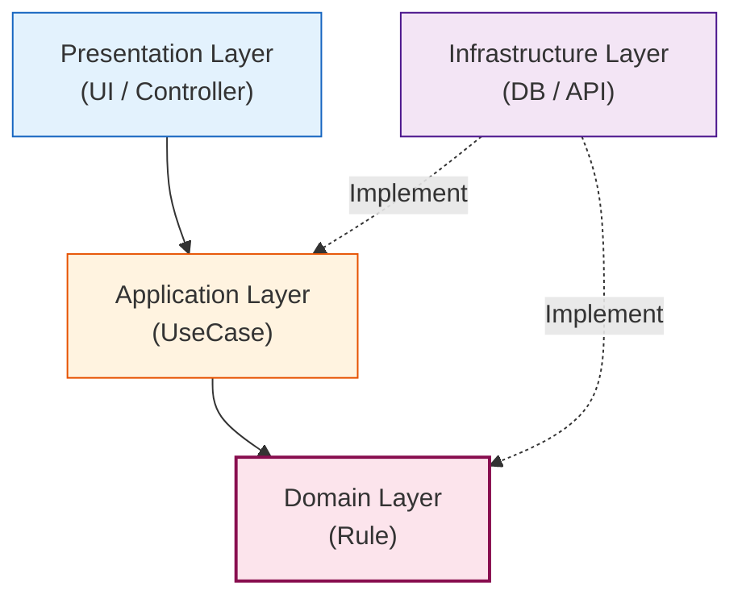

# 第17章：レイヤー（層）を薄く入れる🥞

〜「ぐちゃ混ぜ地獄😇」を防ぎつつ、やりすぎない設計〜

## この章のゴール🎯

* 1モジュールの中を、**うす〜く4つの層**に分ける感覚をつかむ🥞
* **層をまたぐルール**（どこがどこを呼んでいいか）を決められる📜
* 題材アプリの機能を、層に整理できる🗂️✨

---

## まず結論💡：「層」は“整理整頓のラベル”でOK🧺

レイヤーって聞くと「大げさ！むずかしそう！」ってなるけど、ここでは超シンプルに考えるよ☺️

* ✅ 目的：**コードの置き場所を迷わない**
* ✅ 目的：**依存（import）の流れをきれいにする**
* ❌ 目的：層のために層を増やす（儀式化）🙅‍♀️

モジュラーモノリスでは、まず **“モジュール境界”が主役**🧩
その中をさらに、**うすく層で整える**感じだよ〜🥞✨

---

## 4つの層（超ざっくり）🥞




この章ではこの4層でいくよ👇

1. **Presentation（表示・入口）**🚪🧑‍💻

* 例：HTTPのルーティング、Controller、入力のバリデーション（浅め）
* 「外から来たものを、アプリに渡す」係

2. **Application（ユースケース）**🎬

* 例：「イベントを作成する」「参加登録する」みたいな“手順”
* 「何をどういう順でやるか」を組み立てる係

3. **Domain（ルールの中心）**💎

* 例：業務ルール、不変条件、エンティティ/値オブジェクト（次章で詳しく）
* 「この世界のルールはこう！」の係
* **ここが一番大事**になりやすい✨

4. **Infrastructure（外部の実装）**🔌🗄️

* DBアクセス、外部API、メール送信、フレームワーク依存の部品
* 「現実世界とつなぐ」係

この「内側は外側を知らない」って原則がめちゃ大事だよ📌
（依存は内側に向かって流す）([Zenn][1])

---

## 超重要ルール📜：「依存の向き」を固定する➡️


いちばん大事なのはこれ👇

* Presentation → Application → Domain ✅
* Infrastructure →（Domain / Application が決めた“口（interface）”に合わせる）✅
* Domain は **他の層を知らない** ✅ ([Zenn][1])

イメージ：
外側ほど “道具っぽい” 🛠️（DB/HTTPなど）
内側ほど “ルールっぽい” 💎（業務の核心）

---

## “薄く入れる”ってどういうこと？🥞🫧


「層を作る」と言っても、各層を分厚くしないよ〜！

### ✅ 薄いレイヤーのコツ3つ✨


1. **Presentationは痩せさせる**🏃‍♀️💨

* 入口でやるのは「受け取る・軽く整える・渡す」だけ
* 業務判断（ルール）は置かない

2. **Applicationは“手順の台本”**📖

* ifだらけにしない
* “やることの順番”と“呼び出し”中心

3. **Domainにルールを寄せる**💎

* ただし次章で詳しくやるから、今は「置き場所」だけ覚えればOK🙆‍♀️

---

## 置き場所テンプレ🧩📁（1モジュール内）


例：`modules/events/`（学内イベント管理📅を想定）

* `modules/events/presentation/` 🚪
* `modules/events/application/` 🎬
* `modules/events/domain/` 💎
* `modules/events/infrastructure/` 🔌
* `modules/events/index.ts`（公開API）🚪✨

「モジュールの外」は **index.ts 経由だけ**ってルール、ここでも継続ね🛡️

---

## 具体例ミニ：イベント作成🎒📅

### ① Domain（ルール）💎

* “イベント名は空ダメ”
* “開催日は過去ダメ”
  みたいなルールはここに寄せる（今日は置き場所だけ）

```ts
// modules/events/domain/event.ts
export class Event {
  constructor(
    public readonly id: string,
    public readonly title: string,
    public readonly date: Date,
  ) {
    if (!title.trim()) throw new Error("イベント名は必須だよ📝");
    // ここでは簡略化（本格的な不変条件は第28章でがっつり！🛡️）
  }
}
```

### ② Application（手順）🎬

* 「作る」手順を組む
* DB保存は “Repository（口）” にお願いする（実装は知らない）

```ts
// modules/events/application/createEventUseCase.ts
import { Event } from "../domain/event";

export interface EventRepository {
  save(event: Event): Promise<void>;
}

export class CreateEventUseCase {
  constructor(private readonly repo: EventRepository) {}

  async execute(input: { id: string; title: string; date: Date }) {
    const event = new Event(input.id, input.title, input.date);
    await this.repo.save(event);
    return { ok: true };
  }
}
```

### ③ Infrastructure（外部実装）🔌

* ここがDBに合わせる
* Applicationが決めた `EventRepository` に合わせる

```ts
// modules/events/infrastructure/inMemoryEventRepository.ts
import { Event } from "../domain/event";
import { EventRepository } from "../application/createEventUseCase";

export class InMemoryEventRepository implements EventRepository {
  private store: Event[] = [];

  async save(event: Event): Promise<void> {
    this.store.push(event);
  }
}
```

### ④ Presentation（入口）🚪

* HTTP等はここ（今日は雰囲気だけ）
* 入力を受けてUseCaseを呼ぶ

```ts
// modules/events/presentation/createEventController.ts
import { CreateEventUseCase } from "../application/createEventUseCase";

export async function createEventController(
  useCase: CreateEventUseCase,
  reqBody: { id: string; title: string; date: string }
) {
  // 入力整形（軽く）
  const input = { ...reqBody, date: new Date(reqBody.date) };
  return await useCase.execute(input);
}
```

---

## やりがち事故あるある😵‍💫💥（先に潰す！）

### ❌ 事故1：Presentationに業務ルールを書いちゃう

* Controllerに「この条件なら作れない！」みたいな判断が増殖👾
  → ルールはDomainへ💎

### ❌ 事故2：ApplicationがDBの都合を知りすぎる

* `SQL文` とか `ORMの型` がUseCaseに侵入😇
  → Infrastructureへ🔌（Applicationは“口（interface）”だけ見る）

### ❌ 事故3：Domainが外部ライブラリに依存


* DomainがHTTP/DB/フレームワークに触ると、中心が汚れる🥲
  → Domainはピュアに保つ💎([Zenn][1])

---

## “層を跨ぐルール”テンプレ📜✅

この章の成果物として、最低これを決めよう〜！

* Presentationは **Applicationしか呼ばない**🚪→🎬
* Applicationは **Domainを呼ぶ**🎬→💎
* Infrastructureは **Application/Domainが決めたinterfaceを実装する**🔌
* Domainは **外側を知らない**💎✨ ([Zenn][1])

---

## ミニ演習🧩✍️：題材アプリを層に整理しよう

あなたの題材アプリで、機能を1つ選んでね（例：イベント作成📅 / 参加登録🙋‍♀️ / 会計記録💰）

### ステップ1：その機能の「やること」を5行で📌

例）

1. 入力を受け取る
2. ルールチェック
3. 作成する
4. 保存する
5. 結果を返す

### ステップ2：それぞれを層に割り当て🥞

* 1,5 → Presentation 🚪
* 3,4 → Application 🎬（手順）
* 2 → Domain 💎（ルール）
* 4の保存の実装 → Infrastructure 🔌

### ステップ3：フォルダを作って“箱”だけ用意📁✨

中身が空でもOK！まず箱！大事！🧺

---

## AIプロンプト例🤖📝（コピペOK）

### ✅ 層分け相談

「次の機能をPresentation/Application/Domain/Infrastructureに仕分けして、理由も一言ずつ付けて：
（ここに機能説明）」

### ✅ 依存ルールチェック

「このフォルダ構成で、層を跨いでNGなimportが起きそうな箇所を列挙して、修正案を出して：
（ツリー貼る）」

### ✅ “薄く保つ”リライト

「このControllerが太りすぎてるので、Presentationを痩せさせてUseCaseに寄せるリファクタ案を出して：
（コード貼る）」

---

## 最新事情メモ📌（TypeScriptまわり）

* 2026年1月時点の公式リリースノートとして **TypeScript 5.9** が参照できるよ🧾([TypeScript][2])
* さらに、TypeScriptは **6.0が“橋渡し”**、その先にネイティブ化（TypeScript 7系）を進めている、という公式の進捗が出てるよ🚀([Microsoft for Developers][3])

（なので「ルールを自動化して守る」方向性は、これからもずっと大事だよ〜👮‍♀️✨）

---

## 章末まとめ🎀

* モジュールの中を **うすい4層**で整理🥞
* **依存の向き**を固定するのが最重要➡️
* 層は“儀式”じゃなくて、迷子防止の整理術🧭✨

---

次の第18章では、この中の **Application層（ユースケース）**を「どう薄く保つか」だけに集中して、ちゃんと作れるようにするよ〜🎬💪💕

[1]: https://zenn.dev/collabostyle/articles/1089b482fd59fe?utm_source=chatgpt.com "クリーンアーキテクチャ入門 Part 1: 基礎概念と4つの層の全体像"
[2]: https://www.typescriptlang.org/docs/handbook/release-notes/typescript-5-9.html?utm_source=chatgpt.com "Documentation - TypeScript 5.9"
[3]: https://devblogs.microsoft.com/typescript/progress-on-typescript-7-december-2025/?utm_source=chatgpt.com "Progress on TypeScript 7 - December 2025"
