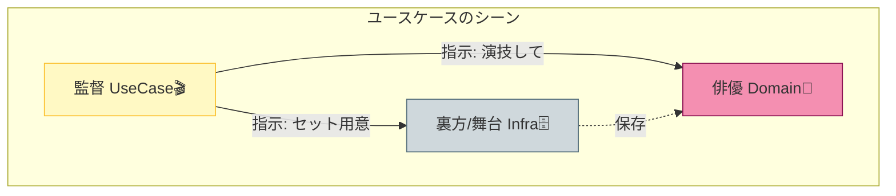

# 第18章：アプリケーション層（ユースケース）って何？🎬

ここから「設計っぽい！」感じが一気に出てくるよ〜！でも大丈夫☺️
ユースケースは、ざっくり言うと **“アプリが何をできるか” を1本ずつの手順にしたもの** だよ🎬✨

---

# 1) この章のゴール🎯💖

この章がおわると、こんな状態になれる！

* 「ユースケース＝何を置く層か」が説明できる🗣️✨
* “薄いユースケース” の書き方がわかる🥞
* 1つユースケースを **モジュール内に実装** できる🧩
* ほかの層（ドメイン・インフラ）と **混ぜないコツ** が身につく🧠🧼
* モジュールの公開API（入口）からユースケースを呼べる🚪➡️🎬

---

# 2) アプリケーション層ってどこ？🗺️🥞

前の章（レイヤー）で出てきた、ざっくり4層👇

* Presentation（UI / API）🪟
* **Application（ユースケース）🎬 ←ここ！**
* Domain（ルールの中心）💎
* Infrastructure（DB / HTTP / 外部）🗄️🌐

**Application層の役割は「手順の組み立て」**だよ🍳✨
たとえば、

* DBから必要なデータ取る📥
* ドメインのルールに沿って処理する💎
* 保存する📤
* 結果を返す🎁

…みたいな **“流れ”** を書く場所！

「ビジネスルールそのもの」は Domain に寄せるのが基本だよ💎🛡️（次章でやる！）

DDDの整理でも、Application Layer は「プレゼン層とドメイン層の間で、ユースケースをオーケストレーションする」と説明されがちだよ〜🎻✨ ([ABP][1])

---

# 3) ユースケースのイメージ：映画監督🎬👩‍💻




ユースケースは **監督** みたいな感じ！

* 監督（UseCase）🎬：誰を呼ぶ？どの順で？を決める
* 俳優（Domain）💎：演技＝ルールやふるまいの中心
* 裏方（Infrastructure）🗄️：撮影場所＝DBや外部サービス

監督が “演技” までやりだすと地獄😱
だから **ユースケースは薄く！** が合言葉だよ🥞✨

---

# 4) “薄いユースケース” ってどういうこと？🥞✨（4つのコツ）

## コツ①：ユースケースの責務は「手順」だけ🎬

* OK ✅：取得→実行→保存→返す
* NG ❌：複雑な計算ルールや不変条件をここにベタ書き（Domainへ！）

## コツ②：I/O（DB/HTTP）は “直で触らない” に寄せる🧤

この教材では後半で DIP/DI をやるけど、ここではまず
「ユースケースが DB の細部を知らない方がいい」感覚だけ持てればOK🙆‍♀️✨

## コツ③：入出力は DTO でスッキリ🎁

ユースケースの引数・戻り値は「境界用の型」にすると事故が減るよ🚧✨

## コツ④：ユースケース名は「動詞＋名詞」📝

例：

* `CreateEvent`（イベント作成）🗓️
* `RegisterParticipant`（参加登録）🙋‍♀️
* `RecordExpense`（支出記録）💰

---

# 5) モジュラーモノリスだと、ユースケースはどこに置く？📁🧩

おすすめの“定番形”👇（Eventsモジュール例）

* `modules/events/`

  * `index.ts`（公開API🚪）
  * `application/`（ユースケース🎬）
  * `domain/`（ルール💎）
  * `infrastructure/`（DB等🗄️）

ポイントはこれ👇💡
**他モジュールは `events/index.ts`（公開API）だけ触る**
→ Application層のユースケースは “モジュール内部の実装” として隠せる🙈🔒

---

# 6) ハンズオン：ユースケースを1本作ろう🧪🎬✨

題材：学内イベント管理📅
ユースケース：**イベントを作る（CreateEvent）**🗓️✨

> ここでは「ユースケースの形」を掴むのが目的なので、Domainは最小でOK！
> 次章（Domain）で一気に気持ちよくするよ〜💎✨

---

## 6-1) フォルダとファイルを作る📁✨

```text
src/
  modules/
    events/
      index.ts
      application/
        createEventUseCase.ts
        types.ts
      domain/
        event.ts
      infrastructure/
        eventRepositoryInMemory.ts
  app.ts
```

---

## 6-2) domain：最小の Event を用意💎

```ts
// src/modules/events/domain/event.ts
export type EventId = string;

export class Event {
  private constructor(
    public readonly id: EventId,
    public readonly title: string,
    public readonly date: Date
  ) {}

  static create(params: { id: EventId; title: string; date: Date }): Event {
    // ここは“最低限”だけ。次章で「不変条件」を本格化するよ💎✨
    if (params.title.trim().length === 0) {
      throw new Error("title is required");
    }
    return new Event(params.id, params.title.trim(), params.date);
  }
}
```

---

## 6-3) infrastructure：保存先（いまはメモリ）🗄️

```ts
// src/modules/events/infrastructure/eventRepositoryInMemory.ts
import { Event, EventId } from "../domain/event";

export interface EventRepository {
  save(event: Event): Promise<void>;
  findById(id: EventId): Promise<Event | null>;
}

export class EventRepositoryInMemory implements EventRepository {
  private store = new Map<EventId, Event>();

  async save(event: Event): Promise<void> {
    this.store.set(event.id, event);
  }

  async findById(id: EventId): Promise<Event | null> {
    return this.store.get(id) ?? null;
  }
}
```

---

## 6-4) application：DTO（入出力の型）🎁

```ts
// src/modules/events/application/types.ts
export type CreateEventInput = {
  title: string;
  dateISO: string; // 外側の世界は文字列が多いので、境界では文字列で受けるのが便利✨
};

export type CreateEventOutput =
  | { ok: true; eventId: string }
  | { ok: false; reason: "INVALID_INPUT" | "UNEXPECTED"; message: string };
```

---

## 6-5) application：ユースケース本体🎬✨（薄く書く！）

```ts
// src/modules/events/application/createEventUseCase.ts
import { Event } from "../domain/event";
import type { EventRepository } from "../infrastructure/eventRepositoryInMemory";
import type { CreateEventInput, CreateEventOutput } from "./types";

function newId(): string {
  // 本番ならUUID等にするけど、ここは教材なので簡易でOK🙆‍♀️
  return "evt_" + Math.random().toString(36).slice(2, 10);
}

export class CreateEventUseCase {
  constructor(private readonly repo: EventRepository) {}

  async execute(input: CreateEventInput): Promise<CreateEventOutput> {
    // ✅ Application層でやっていいのは「入力の整形・簡単なバリデーション」くらい
    const date = new Date(input.dateISO);
    if (!input.title || Number.isNaN(date.getTime())) {
      return { ok: false, reason: "INVALID_INPUT", message: "title/date is invalid" };
    }

    try {
      // ✅ ルールの中心（Domain）に任せる
      const event = Event.create({ id: newId(), title: input.title, date });

      // ✅ 永続化（いまはメモリだけど、将来DBに差し替えできる）
      await this.repo.save(event);

      // ✅ 返す（DTO）
      return { ok: true, eventId: event.id };
    } catch (e) {
      return {
        ok: false,
        reason: "UNEXPECTED",
        message: e instanceof Error ? e.message : "unknown error",
      };
    }
  }
}
```

薄い！🥞✨
“手順” しか書いてないよね？🎬💕

---

## 6-6) 公開API（入口）から呼べるようにする🚪✨

```ts
// src/modules/events/index.ts
import { CreateEventUseCase } from "./application/createEventUseCase";
import { EventRepositoryInMemory } from "./infrastructure/eventRepositoryInMemory";

export function createEventsModule() {
  const repo = new EventRepositoryInMemory();

  return {
    createEvent: (input: { title: string; dateISO: string }) =>
      new CreateEventUseCase(repo).execute(input),
  };
}
```

> 本格的には DI で “newの場所” を整理するけど（後半でやる🎁）
> いまは「公開API→ユースケース」の流れが見えればOKだよ〜🙆‍♀️✨

---

## 6-7) 呼び出して動作確認✅✨

```ts
// src/app.ts
import { createEventsModule } from "./modules/events";

async function main() {
  const events = createEventsModule();

  const res = await events.createEvent({
    title: "新歓ミーティング",
    dateISO: "2026-04-10",
  });

  console.log(res);
}

main();
```

---

# 7) ありがち事故パターン集😵‍💫⚠️（先に潰そ！）

* ユースケースに「業務ルール」を全部書いちゃう😱 → Domainへ💎
* DBのORMモデルをそのまま返す🗄️→ DTOで境界を切る🎁
* 1ユースケースが何でも屋になる🧟‍♀️ → 動詞＋名詞で1アクションに✂️
* “便利だから” で他モジュールの内部をimportする🙅‍♀️ → 公開APIだけ！🚪

---

# 8) 章末ミニ課題🧩✨（やると一気に身につく！）

## 課題A：ユースケースをもう1本増やす🎬➕

`RegisterParticipant`（参加登録）🙋‍♀️

* input: `eventId`, `name`
* output: `ok` / `error`
* 形は CreateEvent と同じでOK！

## 課題B：「薄いかチェック」🥞🔍

自分のユースケースを見て、下の質問に答えてみてね👇

* 取得→実行→保存→返す になってる？
* ルールっぽい計算や条件分岐が増えすぎてない？
* 返す型が “境界用” になってる？

---

# 9) AI拡張に投げると強いプロンプト例🤖📝✨

* 「このユースケースの責務が太いかチェックして。Domainへ移す候補も挙げて」🧠
* 「ユースケース名を動詞＋名詞で10個提案して。CRUDじゃない言い方も混ぜて」📝
* 「このユースケースの入力DTO/出力DTOを、境界が安全になる形で提案して」🎁
* 「このユースケースの“最小テストケース”をGiven/When/Thenで列挙して」🧪

---

# 10) 2026年の“今”の前提メモ🆕✨（超短く！）

* TypeScript は公式ダウンロード案内で **最新が 5.9** とされているよ🧷 ([TypeScript][2])
* Node.js は **v24 系が Active LTS**（本日時点）で、セキュリティリリースも継続中だよ🔒 ([Node.js][3])
* TypeScript は 6.0/7.0（ネイティブ化）に向けた進捗も公開されてるよ🚀 ([Microsoft for Developers][4])

---

## 次章予告💎✨

次は **Domain層（ルールの中心）**！
ここができると、「ユースケース薄い🥞」が一気に気持ちよくなるよ〜☺️💖

[1]: https://abp.io/docs/latest/framework/architecture/domain-driven-design?utm_source=chatgpt.com "Domain Driven Design"
[2]: https://www.typescriptlang.org/download/?utm_source=chatgpt.com "How to set up TypeScript"
[3]: https://nodejs.org/en/about/previous-releases?utm_source=chatgpt.com "Node.js Releases"
[4]: https://devblogs.microsoft.com/typescript/progress-on-typescript-7-december-2025/?utm_source=chatgpt.com "Progress on TypeScript 7 - December 2025"
