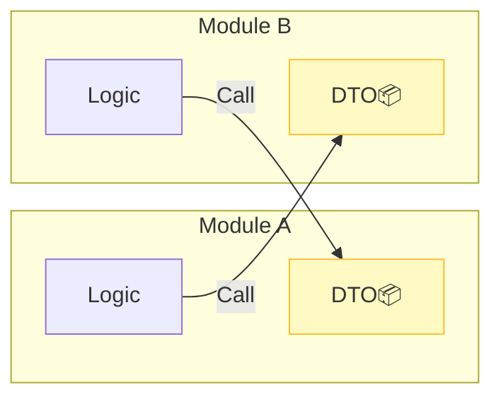

# 第20章：モジュール間連携①（同期呼び出し）📞

（＝**同じアプリ内で、別モジュールの“公開API”を関数として呼ぶ**やつ！）

---

## この章でできるようになること🎯💖

* 別モジュールを **公開API（入口）だけ** で呼べるようになる🚪✨
* モジュール境界をまたぐデータを **DTO** としてキレイに渡せる📦💕
* ありがちな事故（直import・循環依存・ドメイン漏れ）を避けられる🛡️😵‍💫

---

## まず超ざっくり図でイメージ🗺️✨

* ✅ OK：`events` → `students` の **公開API** を呼ぶ
* ❌ NG：`events` が `students/domain/*` を直接importする（境界崩壊）

```txt
modules/
  students/  ← 学生情報の持ち主👑
    domain/
    application/
    index.ts   ← 公開API🚪✨
  events/     ← イベントの持ち主👑
    domain/
    application/
    index.ts   ← 公開API🚪✨
```

---


## 同期呼び出しって何？📞🙂

ここで言う「同期」は、ネットワーク越しじゃなくて **同一プロセス内の関数呼び出し** のことだよ〜☺️
JS/TS的には `async/await` でもOK！（DBアクセスとかは非同期だからね）🌙✨

---


## 今日の主役：DTOってなに？📦💡

DTO（Data Transfer Object）は、**境界をまたぐための“持ち運び専用の箱”**🎁✨
ポイントはこれ👇

* ✅ **プリミティブ中心**（string/number/boolean/配列/プレーンobject）
* ✅ **必要最小限**（境界の外に余計な情報を出さない）
* ❌ ドメインオブジェクト（Entity/VO）をそのまま渡す（漏れやすい）😱

---

## ハンズオン🧪✨：「イベント参加登録」で別モジュールを呼ぶ🎫👩‍🎓

### 0) 題材ざっくり🍌（例）

* `students`：学生の名前・学籍番号など管理
* `events`：イベント作成・参加登録を管理
* 参加登録時に「学生が存在するか」「表示名を取る」ために `students` を呼ぶ📞

---


## 1) studentsモジュール：公開DTOと公開APIを作る🚪📦

### `modules/students/index.ts`（公開API）

```ts
// modules/students/index.ts

export type StudentSummaryDTO = Readonly<{
  studentId: string;
  displayName: string;
}>;

export type StudentsApi = Readonly<{
  getStudentSummary(studentId: string): Promise<StudentSummaryDTO | null>;
}>;

type Student = {
  id: string;
  displayName: string;
  // ここにメール・住所・履歴…など色々あるとしても、
  // 外に出すのは必要最小限にする✨
};

type StudentRepository = Readonly<{
  findById(id: string): Promise<Student | null>;
}>;

export function createStudentsApi(repo: StudentRepository): StudentsApi {
  return {
    async getStudentSummary(studentId: string) {
      const s = await repo.findById(studentId);
      if (!s) return null;

      // ✅ ドメイン → DTO に変換してから返す（境界がきれい✨）
      return {
        studentId: s.id,
        displayName: s.displayName,
      };
    },
  };
}
```

✅ ここが超大事💖
**eventsは “studentsの中身” を知らない**。知るのは `StudentsApi` と `StudentSummaryDTO` だけ！🛡️✨

---


## 2) eventsモジュール：studentsの公開APIを注入して使う🎬📞

### `modules/events/index.ts`（公開API）

```ts
// modules/events/index.ts
import type { StudentsApi } from "../students/index.js";

export type RegisterResult =
  | { ok: true; registrationId: string }
  | { ok: false; reason: "STUDENT_NOT_FOUND" | "EVENT_NOT_FOUND" | "ALREADY_REGISTERED" };

type EventRepository = Readonly<{
  exists(eventId: string): Promise<boolean>;
  isAlreadyRegistered(eventId: string, studentId: string): Promise<boolean>;
  saveRegistration(eventId: string, studentId: string, displayName: string): Promise<string>;
}>;

export type EventsApi = Readonly<{
  registerToEvent(eventId: string, studentId: string): Promise<RegisterResult>;
}>;

export function createEventsApi(deps: {
  eventsRepo: EventRepository;
  studentsApi: StudentsApi; // ✅ 公開APIを依存として受け取る
}): EventsApi {
  const { eventsRepo, studentsApi } = deps;

  return {
    async registerToEvent(eventId, studentId) {
      const eventExists = await eventsRepo.exists(eventId);
      if (!eventExists) return { ok: false, reason: "EVENT_NOT_FOUND" };

      const already = await eventsRepo.isAlreadyRegistered(eventId, studentId);
      if (already) return { ok: false, reason: "ALREADY_REGISTERED" };

      const student = await studentsApi.getStudentSummary(studentId);
      if (!student) return { ok: false, reason: "STUDENT_NOT_FOUND" };

      // 参加登録には表示名も保存しておく（例）
      const registrationId = await eventsRepo.saveRegistration(
        eventId,
        student.studentId,
        student.displayName
      );

      return { ok: true, registrationId };
    },
  };
}
```

ここも気持ちいいポイント🌸

* `events` は `students` の **domain** を一切importしてない🙅‍♀️
* **依存は “API” だけ** → 境界が守れる🛡️✨

---

## 3) “組み立て役（composition root）”で配線する🔌✨




アプリ起動時にモジュール同士をつなぐ場所を1つ作るよ〜🙂

```ts
// app/bootstrap.ts
import { createStudentsApi } from "../modules/students/index.js";
import { createEventsApi } from "../modules/events/index.js";

// ここでは適当なrepo（DB実装など）を用意した想定
const studentRepo = /* ... */ null as any;
const eventsRepo = /* ... */ null as any;

export const studentsApi = createStudentsApi(studentRepo);

export const eventsApi = createEventsApi({
  eventsRepo,
  studentsApi, // ✅ ここで注入
});
```

この「組み立て役」があると…

* 循環依存になりにくい🔄😌
* テストで差し替えやすい🧪💚
* “どのモジュールがどれを使うか” が一目でわかる👀✨

---

## よくある事故💥😵‍💫（ぜんぶ回避しよ〜！）

### 事故1：studentsの内部を直importしちゃう🙅‍♀️

* ❌ `import { Student } from "../students/domain/Student"`
* ✅ `import type { StudentsApi } from "../students"` だけ！

### 事故2：DTOが太りすぎる🍔💦

* 「便利だから全部返しちゃえ」→ 境界が溶ける🫠
* DTOは **“このユースケースに必要な分だけ”** が正義✨


### 事故3：呼び出し回数が多すぎる（チャットty）📞📞📞

* 例：学生一覧100人に対して `getStudentSummary()` を100回…😱
* 対策：**まとめ取得API**（`getStudentSummaries(ids)`）を公開APIに追加するのもアリ👌✨


### 事故4：例外の投げっぱなし🎢

* モジュール跨ぎは **Result型（成功/失敗のUnion）** が扱いやすいよ🧾💕

---

## ちょい最新トピック：TSのモジュール解決まわり🧠✨

NodeのESMまわりが当たり前になってきてて、TypeScriptの `moduleResolution` は `node16` / `nodenext` が現代的だよ〜📦🌿 ([TypeScript][1])
あと `module` 設定は「出力しない設定でも」型解決や挙動に影響するから、適当にしないのが安心🫶 ([TypeScript][2])
Node側は v24 が Active LTS、v22 は Maintenance LTS みたいな整理になってる（2026年初頭時点）だよ🟢 ([Node.js][3])

---

## 境界をルールで守る小ネタ👮‍♀️✨（チラ見せ）

import境界の取り締まりは、Nxの `@nx/enforce-module-boundaries` とかで “プロジェクト間” を縛れるよ🔒 ([Nx][4])
また `eslint-plugin-boundaries` みたいに “フォルダ境界” を縛る系もあるよ〜🧱 ([NPM][5])

（がっつり設定は第15〜16章でやる感じでOK👌💕）

---

## AIに投げると強いプロンプト例🤖📝✨


* 「`students` の domain を漏らさずに、`events` が欲しい情報だけ返すDTO案を3つ出して」📦
* 「この公開APIが太りすぎてない？境界として適切？レビューして」👀
* 「呼び出し回数が増えそうな箇所を見つけて、まとめ取得API案を出して」📞➡️📞✨
* 「循環依存が起きるパターンをこの構成で想定して、回避策を提案して」🔄🛡️

---

## 章末ミニ課題🧩🎓✨

### 課題A（基本）🌱

`events` 側に「参加者一覧を表示する」機能を追加してみて👇

* `events` は参加者の `studentId` を持ってる
* 表示には `displayName` が必要
* `studentsApi.getStudentSummaries(ids: string[])` を新しく追加して、N+1を回避してみよう💪📦

### 課題B（ちょい応用）🌟

`students` が見つからない時の扱いを2パターン作って比較してみて👇

* ① `null` を返す
* ② `Result` 型で理由コード付きで返す（`{ ok:false, reason:"NOT_FOUND" }`）

「events側の読みやすさ」はどっちが勝つ？👀💕

---

## 最後にチェックリスト✅💖

* [ ] 別モジュール呼び出しは **公開APIだけ** になってる？🚪
* [ ] 境界をまたぐデータは **DTO** になってる？📦
* [ ] 呼び出し回数が増えすぎない設計になってる？📞💦
* [ ] 失敗時の扱い（Result/理由コード）が整理できてる？🧾✨
* [ ] 配線（組み立て役）が1箇所にまとまってる？🔌

---

次の第21章は、ここで作った「モジュール間の呼び出し」を **CQSで読み書き分離**して、事故率をさらに下げるよ〜🧾🔀💕

[1]: https://www.typescriptlang.org/tsconfig/moduleResolution.html?utm_source=chatgpt.com "TSConfig Option: moduleResolution"
[2]: https://www.typescriptlang.org/docs/handbook/modules/reference.html?utm_source=chatgpt.com "Documentation - Modules - Reference"
[3]: https://nodejs.org/en/about/previous-releases?utm_source=chatgpt.com "Node.js Releases"
[4]: https://nx.dev/docs/technologies/eslint/eslint-plugin/guides/enforce-module-boundaries?utm_source=chatgpt.com "Enforce Module Boundaries ESLint Rule"
[5]: https://www.npmjs.com/package/eslint-plugin-boundaries?utm_source=chatgpt.com "eslint-plugin-boundaries"
