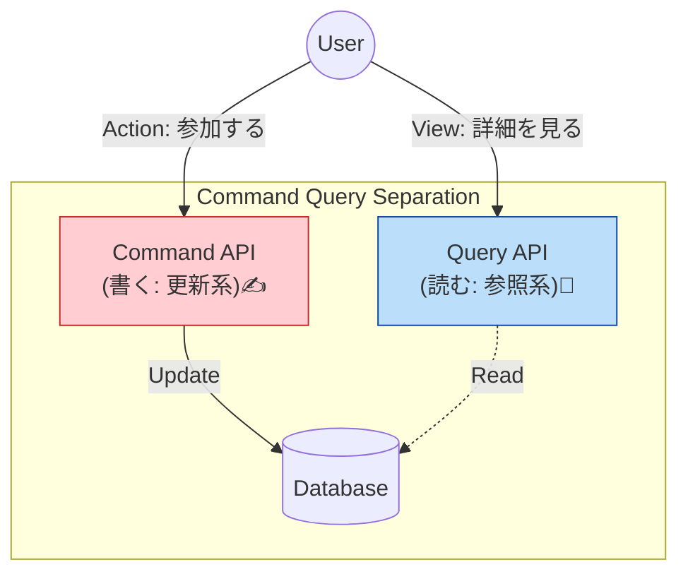

# 第21章：モジュール間連携②（CQSで読み書き分離）🧾🔀

## ねらい🎯

* 「読む（Query）」と「書く（Command）」をキレイに分けて、**モジュール間連携でも事故らない**ようにする🧯💥
* “後から大きくなっても壊れにくい”設計の土台を作る🏗️💎

---

## 今日の重要キーワード📌

* **CQS（Command–Query Separation）**：1つの操作は「読む」か「書く」どっちかにする考え方🧠✨ ([martinfowler.com][1])
* **Command**：状態を変える（更新・作成・削除）✍️🔥


* **Query**：状態を変えずに情報を返す（副作用なし）👀📚 ([martinfowler.com][1])
* **副作用（side effect）**：DB更新・イベント発行・メール送信・外部API呼び出しなど、世界が変わるやつ🌍⚡


* **CQRS**：CQSをさらに大きくした設計パターン（読むモデルと書くモデルを分ける）🧩📈 ([martinfowler.com][2])

---

## まずは超イメージ🍌✨（秒でわかる版）

* **Query（読む）**：「イベント詳細ちょうだい！」→ 情報だけ返す📖
* **Command（書く）**：「イベント参加して！」→ 状態が変わる✅

💣事故るのは、これを混ぜるとき！
「イベント詳細ちょうだい！」って呼んだだけなのに
**閲覧数が増える／最終アクセスが更新される／通知が飛ぶ**…みたいなやつ😵‍💫💥

---

## CQSって結局なに？🧠✨




CQSはざっくりこう👇

* **Query**：結果を返すけど、**観測できる状態を変えない**（副作用なし）
* **Command**：状態を変えるけど、**値を返さない（または最小限）** ([martinfowler.com][1])

さらに大きい話として、CQRSは「読むモデルと書くモデルを分ける」発想で、性能やスケールに効くこともあるけど、**多くのシステムでは複雑さが増えるから注意**って有名どころも言ってるよ⚖️😌 ([martinfowler.com][2])

この章では、いきなり難しいCQRSフル装備にせず、**モジュラーモノリスで効く“CQSの型”**を作るよ🧩💕

---

## なぜ「混ぜる」と事故るの？💥（あるある5連発）

1. **キャッシュが壊れる🧊💥**
   Queryのつもりでキャッシュしてたら、裏で更新してて整合が崩れる…😱

2. **リトライが地獄🔁😵‍💫**
   ネットワークや一時エラーで再実行された時、Queryが更新してたら二重更新💣

3. **テストがしんどい🧪😭**
   「読むだけ」のテストのつもりが、DBが変わって後片付けが必要になる

4. **責務がモヤる☁️🌀**
   「この関数呼ぶと何が起きるの？」が毎回不安になって開発スピードが落ちる

5. **モジュール境界が崩れる🧱🫠**
   “ちょっと便利”で混ぜ始めると、別モジュールからの依存が増えて破綻しやすい

---

## 章の結論：「モジュールの公開API」を Command / Query に分けよう🚪🧩

モジュールの外に見せる入口（公開API）を、こういう2種類に分けるのが勝ち✨

* `events.commands.*`：更新したい人が使う
* `events.queries.*`：読みたい人が使う

「モジュール間連携」は特にここが効くよ💪🔥
**AモジュールがBモジュールを呼ぶときも、CommandかQueryのどっちかで呼ぶ**（混ぜない！）🧼✨

---

## フォルダのおすすめ構成📁✨（分けるだけで強くなる）

```text
src/
  modules/
    events/
      index.ts                // 公開APIの入口🚪
      application/
        commands/
          joinEvent/
            JoinEventCommand.ts
            JoinEventHandler.ts
        queries/
          getEventDetail/
            GetEventDetailQuery.ts
            GetEventDetailHandler.ts
      domain/
        Event.ts
      infrastructure/
        EventRepositoryImpl.ts
```

ポイント🧠✨

* commands / queries を物理的に分けると、**混ぜにくくなる**👍


* `index.ts` で「外に出していいものだけ」出す（第11〜12章の流れと合体！）🛡️

---

## TypeScriptで“型”として分ける（ミニだけど効く）🧤✨

「これCommandです」「これQueryです」って型で表すと、レビューもAIも迷いにくいよ🤖👍

```ts
// application/shared/cqs.ts
export type Command<Result = void> = {
  readonly kind: "command";
  // payloadは各Commandで定義
  // Resultは基本voidか最小限（idなど）
};

export type Query<Result> = {
  readonly kind: "query";
  // ResultはDTOなど
};
```

---

## 実装例：混ざった関数を分離してみよう✂️✨

### 🚨ダメ例（混ざってる）


「参加する」なのに、イベント詳細（でかいデータ）を返してる＆内部でいろいろ読んでる…😵‍💫

```ts
async function joinEvent(userId: string, eventId: string) {
  const event = await eventRepo.findById(eventId);  // 読む
  if (!event) throw new Error("not found");

  event.addParticipant(userId);                     // 書く
  await eventRepo.save(event);                      // 書く

  return event;                                     // でかいもの返す（混ぜがち）
}
```

---

## ✅分離後：Command と Query に分ける✨

### 1) Command（更新だけ）

* 成功/失敗は返してOK（Result型）
* **“表示に必要なデータ”はQueryで取りに行く**（ここ超大事）🧠✨

```ts
// JoinEventCommand.ts
export class JoinEventCommand {
  readonly kind = "command" as const;
  constructor(
    public readonly userId: string,
    public readonly eventId: string
  ) {}
}

// JoinEventHandler.ts
export class JoinEventHandler {
  constructor(private readonly eventRepo: EventRepository) {}

  async execute(cmd: JoinEventCommand): Promise<{ ok: true } | { ok: false; reason: string }> {
    const event = await this.eventRepo.findById(cmd.eventId);
    if (!event) return { ok: false, reason: "EVENT_NOT_FOUND" };

    const result = event.addParticipant(cmd.userId);
    if (!result.ok) return { ok: false, reason: result.reason };

    await this.eventRepo.save(event);
    return { ok: true };
  }
}
```

### 2) Query（参照だけ）

* 返すのは **DTO（画面用の形）** がわかりやすい📦✨
* Query内では **saveしない**・**イベント発行しない**・**通知しない**🙅‍♀️

```ts
// GetEventDetailQuery.ts
export class GetEventDetailQuery {
  readonly kind = "query" as const;
  constructor(public readonly eventId: string) {}
}

export type EventDetailDTO = {
  id: string;
  title: string;
  startsAt: string;
  capacity: number;
  remaining: number;
};

// GetEventDetailHandler.ts
export class GetEventDetailHandler {
  constructor(private readonly eventReadRepo: EventReadRepository) {}

  async execute(q: GetEventDetailQuery): Promise<EventDetailDTO | null> {
    return await this.eventReadRepo.getDetail(q.eventId); // 読むだけ
  }
}
```

---

## モジュール間連携での使い方🧩🤝

たとえば `tickets` モジュールが `events` モジュールを使うとき：

* 参加させたい → **eventsのCommand** を呼ぶ✍️
* 表示したい → **eventsのQuery** を呼ぶ👀

**“参加させて、その結果の画面表示”** をしたいなら、こうする👇


1. Command実行（参加）✅
2. Query実行（最新詳細を取得）📖

これで「表示のためにCommandが肥大化する」を防げるよ💪✨

---

## 章末ミニ課題🧩✅（手を動かすやつ！）

### 課題1：分離リファクタ✂️

次の「混ざった関数」を、Command/Queryに分けてね👇

* `updateProfileAndReturnProfile()` みたいなやつを想定（更新＋取得）

ゴール🎯

* Command：更新だけ（戻りは `{ok: true}` とか最小）
* Query：表示用DTOを返すだけ

### 課題2：命名ルールを作る📝✨

あなたの題材アプリで、モジュールごとに

* Command 5個（create/update/delete/assign…）
* Query 5個（get/list/search…）
  を書き出してみてね👩‍🎓💕

---

## AIに頼るときのプロンプト例🤖📝✨

* 「この関数、CQS違反してる？“副作用”の観点で指摘して、Command/Queryに分けた案を出して」
* 「このユースケースを Command と Query に分けるなら、クラス名・入力・戻り値（最小）を提案して」
* 「QueryのDTOは画面要件から逆算したい。必要なフィールド候補を列挙して、過不足を質問して」
* 「Commandの失敗理由（ドメイン的にありえるもの）を列挙して、エラーコード案にして」

---

## できたかチェック✅✅✅（セルフ採点）

* Queryは **状態を変えない**（save/notify/publish してない）👀✅
* Commandは **表示用データを返そうとしてない**（必要ならQueryへ）✍️✅
* 公開APIが Command / Query に分かれていて、他モジュールが迷わない🚪✅
* 「リトライされたらどうなる？」を想像しても、Command側が破綻しない🔁✅

---

## おまけ：この章の“ちょうどいい落とし所”🌸

CQSは、**いまの規模でも効く**し、将来CQRSをやるとしても土台になるよ🧱✨
しかも「モジュール間連携」がキレイになって、境界が守りやすくなるのが最高👍💕

---

次の章（22章）は、この分離をした上で **依存の向き（AがBを知りすぎ問題）** を整えて、さらに“壊れにくい”にしていくよ〜🔄🧩✨

[1]: https://martinfowler.com/bliki/CommandQuerySeparation.html?utm_source=chatgpt.com "Command Query Separation"
[2]: https://martinfowler.com/bliki/CQRS.html?utm_source=chatgpt.com "CQRS"
