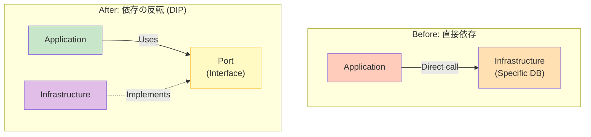

# 第22章：モジュール間連携③（依存の向きを整える）🔄

この章はズバリ、「AがBを知りすぎ問題」を減らして、変更に強いモジュール連携にする回だよ〜☺️✨
（呼び出しはしていい。でも“依存のしかた”を賢くする！って感じ🧠💡）

---

## 0. まず超大事：**呼び出しの矢印**と**依存の矢印**は別ものだよ📌

* **呼び出し（runtime）**：実行時にAがBを使う（関数コールとか）
* **依存（compile-time）**：コード上でAがBを`import`してる（型・クラス・定数を知ってる）

この章で整えるのは **「依存（import）の向き」** の方だよ〜🔧✨

---

## 1. “AがBを知りすぎ”ってどんな状態？😵‍💫

次が増えるほど「知りすぎ」で、将来つらくなる…！

* AがBの**内部フォルダ**を`import`してる🙅‍♀️
* AがBの**ドメイン型**をそのまま握ってる（Bの都合がAに漏れる）🫠
* AがBの**DB構造**や**具体実装**を前提にしてる🧨
* A↔Bで**循環依存**が起きてる（最悪のやつ）💥

---

## 2. 依存の向きを整える「3つの作戦」🧤✨

### 作戦A：まずは“正攻法”✅「公開APIだけに依存する」

第20章の復習っぽいけど最強！
Bの`index.ts`（公開API）**だけ**をAが使う。

* 👍 速い・分かりやすい
* 👀 ただし「Bの公開APIが育ちすぎて巨大」になると地獄へ…（次章の罠）🕳️

---

### 作戦B：この章の主役🌟「インターフェースで距離を取って、依存を“反転”する」🔁




ポイントはこれ👇
**Aが欲しい“形（契約）”をA側で定義する**
→ Bはその契約を満たす“実装者”になる

これ、DIP（Dependency Inversion Principle）って呼ばれる考え方だよ🔌⬆️
「上位も下位も“抽象（interface）”に依存しようね」ってやつ！ ([ウィキペディア][1])

---

### 作戦C：依存を“ほぼ消す”✨「イベント/通知でつなぐ」📣

これは最終章寄りの話だけど、超ざっくり言うと
「Bに直接お願いしないで、“起きた事実”だけ投げる」感じ。

ただし、設計と運用が少し上級になるから、この章では**入り口だけ**にするね☺️

---

## 3. 作戦Bの“型”を手で覚えよう🧩✍️（例つき）

### 例：`billing`が「ユーザーの状態更新」をしたい

でも `billing -> user` に**強い依存**を作りたくない！

そこで👇
`billing` が **欲しい機能だけ** `interface` で定義するよ✨

```ts
// modules/billing/ports/UserStatusPort.ts
export interface UserStatusPort {
  markAsPaid(userId: string): Promise<void>;
}
```

`billing`側は、もうこれしか知らない🙆‍♀️（userモジュールの内部事情ゼロ！）

---

### `billing`のユースケースは“抽象”だけを見る👀✨

```ts
// modules/billing/application/PayInvoice.ts
import type { UserStatusPort } from "../ports/UserStatusPort";

export class PayInvoice {
  constructor(private readonly userStatus: UserStatusPort) {}

  async execute(input: { userId: string; invoiceId: string }) {
    // …請求の支払い処理（省略）
    await this.userStatus.markAsPaid(input.userId);
  }
}
```

ここでの気持ち：
「ユーザー側の実装？知らん！でも“支払い済みにする”って機能だけ欲しい！」😤✨

---

### `user`モジュールは“実装”を提供する🧤

```ts
// modules/user/adapters/UserStatusAdapter.ts
import type { UserStatusPort } from "../../billing/ports/UserStatusPort";
import { Users } from "../index"; // userの公開APIだけ！

export class UserStatusAdapter implements UserStatusPort {
  async markAsPaid(userId: string): Promise<void> {
    await Users.markAsPaid(userId);
  }
}
```

> あれ？ `user` が `billing` の `ports` をimportしてるじゃん！
> そう！それが **依存の反転**だよ🔁✨
> **「抽象（interface）は“必要としてる側”が持つ」**ことが多いんだ〜 ([martinfowler.com][2])

---

### 最後に「組み立て役（Composition Root）」で接続する🔧🎀

```ts
// app/compositionRoot.ts
import { PayInvoice } from "../modules/billing/application/PayInvoice";
import { UserStatusAdapter } from "../modules/user/adapters/UserStatusAdapter";

export function createPayInvoice() {
  const userStatus = new UserStatusAdapter();
  return new PayInvoice(userStatus);
}
```

ここが“配線”の場所だよ⚡
ユースケースやドメインの中で`new`しまくると、依存がぐちゃぐちゃになるから注意ね🙅‍♀️💦

---

## 4. こうすると勝ちやすい🏆✨「依存の向き」整理ルール

### ✅ ルール1：モジュール間で渡すのは「DTO（境界用の形）」が基本

別モジュールのドメイン型をそのまま持つと、仕様変更が伝染するよ🦠💥

* 👍 `UserSummaryDTO`みたいな“境界用の型”にする
* 🙅‍♀️ `UserAggregate` をそのまま握る（やめて〜！）

---

### ✅ ルール2：interfaceは“増やしすぎない”

DIPは万能じゃなくて、やりすぎると逆に読みにくい🥺
「将来差し替える可能性が高いところ」「テストで置き換えたいところ」だけでOK！

> “とりあえず全部interface化”は、わりと事故るよ〜💦 ([martinfowler.com][2])

---

### ✅ ルール3：循環依存は即アウト💣

見つけたら、だいたいどっちか👇

* 抽象（port）を片方へ寄せて反転する🔁
* “共通に見える概念”を境界用DTOとして切り出す✂️

---

## 5. ミニ演習🧩✨（やってみよ〜！）

### お題：この“知りすぎ”を直してね😈

```ts
// modules/billing/application/Pay.ts
import { UserRepository } from "../../user/internal/UserRepository"; // 🙅‍♀️内部参照！

export async function pay(userId: string) {
  const repo = new UserRepository();
  await repo.markAsPaid(userId);
}
```

### ゴール🎯

* `billing`側に`UserStatusPort`を作る
* `user`側に`UserStatusAdapter`を作る
* `compositionRoot`で注入する

（さっきの例を“自分の手で再現”できたら勝ちだよ〜💮💕）

---

## 6. AIで依存図レビュー🤖👀（超使えるプロンプト例）

### 依存の洗い出し

* 「`modules/`配下のimportを見て、モジュール間依存グラフを作って。循環があれば指摘して」🗺️

### “知りすぎ”候補の検出

* 「`modules/a`が`modules/b`の何を知りすぎてる？公開API以外importしてたら列挙して」🔍

### 直し方の提案

* 「この依存をDIP（consumer側port）で反転するとしたら、port名とメソッド案、注入ポイントまで提案して」🔁

---

## 7. 章末チェックリスト✅💖

* [ ] 他モジュールの`internal/`をimportしてない🙅‍♀️
* [ ] モジュール間の型はDTO中心（ドメイン型の漏れが少ない）🧼
* [ ] 依存の反転が必要な箇所は`port(interface)`＋`adapter`になってる🔁
* [ ] “配線”はcomposition rootに集めてる🎀
* [ ] 循環依存がない💥

---

## 8. おまけ：境界をルールで守る話（超さらっと）👮‍♀️✨

ESLintで「ここからここはimport禁止！」みたいな境界チェックもできるよ〜🧱
たとえば `eslint-plugin-boundaries` みたいなやつ🧰 ([NPM][3])
（この章では概念中心、実装は“ルール/CI回”でガッツリやるイメージでOK！）

---

## 参考：2026初頭の“最新ツール事情”メモ🗞️✨（会話の安心材料）

* TypeScriptの安定最新版は **5.9.3** がnpmで最新として案内されてるよ ([NPM][4])
* その一方で、将来に向けて **TypeScript 6.0/7.0**（ネイティブ化含む）の計画・進捗も公式が出してる ([Microsoft for Developers][5])
* Node.jsは 2026-01 時点で **v24がActive LTS** など、リリース表が公式に載ってるよ ([Node.js][6])

---

次の章（第23章）で、この流れを「DIP（抽象に依存する）」として、もう一段“型”にしていくよ〜🔌⬆️💖

[1]: https://en.wikipedia.org/wiki/Dependency_inversion_principle?utm_source=chatgpt.com "Dependency inversion principle"
[2]: https://martinfowler.com/articles/dipInTheWild.html?utm_source=chatgpt.com "DIP in the Wild"
[3]: https://www.npmjs.com/package/eslint-plugin-boundaries?utm_source=chatgpt.com "eslint-plugin-boundaries"
[4]: https://www.npmjs.com/package/typescript?utm_source=chatgpt.com "typescript"
[5]: https://devblogs.microsoft.com/typescript/progress-on-typescript-7-december-2025/?utm_source=chatgpt.com "Progress on TypeScript 7 - December 2025"
[6]: https://nodejs.org/en/about/previous-releases?utm_source=chatgpt.com "Node.js Releases"
